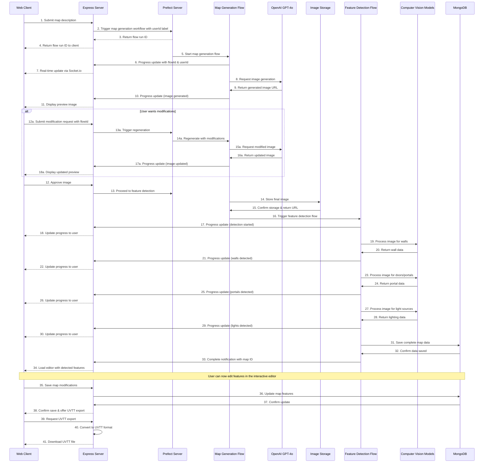

# AI-Powered Map Builder for Dungeon Lab

## Overview

This document outlines the architecture and workflow for implementing an AI-powered map builder feature in Dungeon Lab. The feature will allow users to describe dungeons in natural language, then generate complete map files in Universal VTT (UVTT) format, including walls, lighting, and other map features.

## User Experience Workflow

1. **Text Description Input**

   - User enters a natural language description of their desired map
   - Optional additional parameters: map size, style, theme, etc.

2. **AI Image Generation**

   - System processes the description to generate a top-down map image
   - Preview is shown to the user

3. **Iterative Refinement**

   - User provides feedback and modification instructions
   - System regenerates the map based on user feedback
   - Process repeats until user is satisfied

4. **Map Saving**

   - Map image is saved to the asset system
   - Basic map data is stored in the database

5. **Feature Detection**

   - AI analyzes the image to detect and generate:
     - Walls/obstacles
     - Doors/portals
     - Light sources
     - Environmental features

6. **Interactive Editor**

   - User can view and modify the auto-detected elements:
     - Add/remove/modify walls
     - Adjust lighting properties
     - Edit doors and portals
     - Fine-tune environmental settings

7. **UVTT Export**
   - System exports the complete map as a UVTT file
   - User can save locally or directly to their campaign

## Interactive Map Editor Implementation with Konva.js

The map editor is a critical component of the workflow, allowing users to view AI-detected features and manually refine them. We will implement this using Konva.js with Vue integration for several reasons:

1. **Vue Integration**: Native Vue bindings via vue-konva make integration seamless
2. **Feature-Rich**: Built-in support for layers, transformations, selections, and drawing
3. **Performance**: Optimized for interactive editing with many objects
4. **Serialization**: Easy serialization/deserialization of canvas state

### Editor Architecture

#### Component Structure

```
MapEditor/
├── MapEditorView.vue            # Main container component
├── components/
│   ├── EditorToolbar.vue        # Tool selection and controls
│   ├── EditorCanvas.vue         # Konva canvas implementation
│   ├── EditorLayerPanel.vue     # Layer management UI
│   ├── EditorPropertiesPanel.vue # Selected object properties
│   └── tools/
│       ├── WallTool.vue         # Wall drawing tool
│       ├── PortalTool.vue       # Door/portal placement tool
│       ├── LightTool.vue        # Light source placement
│       └── SelectionTool.vue    # Object selection and manipulation
└── composables/
    ├── useEditorState.ts        # Editor state management
    ├── useEditorHistory.ts      # Undo/redo functionality
    ├── useGridSystem.ts         # Grid and snapping logic
    └── useUVTTConverter.ts      # UVTT format conversion
```

#### Konva Setup with Vue

````typescript
// EditorCanvas.vue
<template>
  <div class="editor-canvas-container">
    <v-stage
      ref="stage"
      :config="stageConfig"
      @mousedown="handleMouseDown"
      @mousemove="handleMouseMove"
      @mouseup="handleMouseUp"
      @wheel="handleZoom"
    >
      <!-- Background layer with map image -->
      <v-layer ref="bgLayer">
        <v-image :config="backgroundImageConfig" />
        <v-rect :config="gridConfig" />
      </v-layer>

      <!-- Wall layer -->
      <v-layer ref="wallLayer">
        <v-line
          v-for="wall in walls"
          :key="wall.id"
          :config="getWallConfig(wall)"
          @transformend="handleWallTransform"
          @dragend="handleWallDrag"
        />
      </v-layer>

      <!-- Portal layer -->
      <v-layer ref="portalLayer">
        <v-group
          v-for="portal in portals"
          :key="portal.id"
          :config="getPortalGroupConfig(portal)"
        >
          <v-rect :config="getPortalRectConfig(portal)" />
          <v-line :config="getPortalLineConfig(portal)" />
        </v-group>
      </v-layer>

      <!-- Light layer -->
      <v-layer ref="lightLayer">
        <v-circle
          v-for="light in lights"
          :key="light.id"
          :config="getLightConfig(light)"
        />
      </v-layer>

      <!-- Selection layer -->
      <v-layer ref="selectionLayer">
        <v-transformer
          v-if="selectedShapeId"
          ref="transformer"
          :config="transformerConfig"
        />
      </v-layer>
    </v-stage>
  </div>
</template>

<script setup lang="ts">
import { ref, computed, onMounted, watch } from 'vue';
import { useEditorState } from '../composables/useEditorState';
import { useGridSystem } from '../composables/useGridSystem';
import { useUVTTConverter } from '../composables/useUVTTConverter';

// Editor state and tools
const {
  currentTool,
  walls,
  portals,
  lights,
  selectedShapeId,
  selectShape,
  addWall,
  addPortal,
  addLight,
  updateWall,
  updatePortal,
  updateLight,
  removeShape
} = useEditorState();

// Grid system for snapping
const {
  gridSize,
  snapToGrid,
  toggleGrid,
  gridConfig
} = useGridSystem();

// Canvas and stage references
const stage = ref(null);
const bgLayer = ref(null);
const wallLayer = ref(null);
const portalLayer = ref(null);
const lightLayer = ref(null);
const selectionLayer = ref(null);
const transformer = ref(null);

// Stage configuration
const stageConfig = computed(() => ({
  width: window.innerWidth,
  height: window.innerHeight,
  draggable: currentTool.value === 'pan'
}));

// Configure objects based on their data
const getWallConfig = (wall) => ({
  points: wall.points,
  stroke: '#ff3333',
  strokeWidth: 3,
  lineCap: 'round',
  lineJoin: 'round',
  draggable: currentTool.value === 'select',
  id: wall.id,
  objectType: 'wall'
});

const getPortalGroupConfig = (portal) => ({
  x: portal.position.x,
  y: portal.position.y,
  draggable: currentTool.value === 'select',
  rotation: portal.rotation,
  id: portal.id,
  objectType: 'portal'
});

const getLightConfig = (light) => ({
  x: light.position.x,
  y: light.position.y,
  radius: 10,
  fill: light.color || '#ffdd00',
  stroke: '#000000',
  strokeWidth: 1,
  draggable: currentTool.value === 'select',
  id: light.id,
  objectType: 'light',
  // Visual indicator of light range
  shadowBlur: light.range / 2,
  shadowColor: light.color || '#ffdd00',
  shadowOpacity: 0.5
});

// Transformer config for selection tool
const transformerConfig = computed(() => ({
  boundBoxFunc: (oldBox, newBox) => {
    // Implement constraints if needed
    return newBox;
  },
  rotateEnabled: true,
  resizeEnabled: true
}));

// Event handlers
const handleMouseDown = (e) => {
  if (currentTool.value === 'select') {
    // Handle selection logic
    const clickedOn = e.target;
    if (clickedOn === e.target.getStage()) {
      // Clicked on empty space
      selectShape(null);
      return;
    }
    selectShape(clickedOn.id());
  } else if (currentTool.value === 'wall') {
    // Handle wall drawing
    const pos = stage.value.getStage().getPointerPosition();
    const snappedPos = snapToGrid({
      x: pos.x,
      y: pos.y
    });

    // Start or continue wall drawing
    // ...
  }
  // Other tool handlers
};

// ... other event handlers and methods

// Watch for selection changes to update transformer
watch(selectedShapeId, (newVal) => {
  if (!newVal) {
    transformer.value.nodes([]);
    return;
  }

  // Find the selected node across all layers
  const layers = [wallLayer.value, portalLayer.value, lightLayer.value];
  for (const layer of layers) {
    const node = layer.getNode().findOne(`#${newVal}`);
    if (node) {
      transformer.value.nodes([node]);
      break;
    }
  }
});

// Load map data
const loadMapData = async (mapId) => {
  // Load map data from the API
  // Set up background image and objects
};

onMounted(() => {
  // Initialize editor with map data or empty canvas
  // Set up window resize handlers
  // Set up keyboard shortcuts
});
</script>

### Core Features Implementation

#### 1. Map Loading

Two primary import methods need to be supported:

1. **Image Import**:
   ```typescript
   const loadMapImage = async (imageUrl, mapSize) => {
     // Create image object
     const image = new Image();
     image.src = imageUrl;

     await new Promise((resolve) => {
       image.onload = resolve;
     });

     // Set background image
     backgroundImageConfig.value = {
       image: image,
       width: image.width,
       height: image.height,
       x: 0,
       y: 0
     };

     // Set up grid overlay based on provided map size
     setupGrid(mapSize, image.width, image.height);
   };
````

2. **UVTT Import**:

   ```typescript
   const importUVTT = async (uvttData) => {
     // First load the image
     await loadMapImage(uvttData.image, uvttData.resolution.map_size);

     // Then create all objects from the UVTT data
     createWallsFromUVTT(uvttData.line_of_sight);
     createPortalsFromUVTT(uvttData.portals);
     createLightsFromUVTT(uvttData.lights);
   };

   const createWallsFromUVTT = (lineOfSight) => {
     // Convert wall data from UVTT format to Konva objects
     // Group connected points into wall segments
     const walls = processWallPoints(lineOfSight);

     // Add walls to the state
     walls.forEach((wall) => addWall(wall));
   };
   ```

#### 2. Drawing Tools

The editor needs specialized tools for different object types:

1. **Wall Tool**:

   ```typescript
   // State for active drawing
   const drawingWall = ref(false);
   const currentWallPoints = ref([]);

   const startWallDrawing = (point) => {
     drawingWall.value = true;
     currentWallPoints.value = [point.x, point.y];
   };

   const continueWallDrawing = (point) => {
     if (!drawingWall.value) return;

     // Add new point or update last point based on drawing mode
     if (isMultiPointMode.value) {
       currentWallPoints.value.push(point.x, point.y);
     } else {
       // Update the end point (for preview)
       if (currentWallPoints.value.length >= 4) {
         currentWallPoints.value.splice(currentWallPoints.value.length - 2, 2, point.x, point.y);
       } else {
         currentWallPoints.value.push(point.x, point.y);
       }
     }
   };

   const finishWallDrawing = () => {
     if (!drawingWall.value) return;

     // Create a new wall and add it to state
     const wallId = `wall-${Date.now()}`;
     addWall({
       id: wallId,
       points: [...currentWallPoints.value],
       objectType: 'wall'
     });

     // Reset drawing state
     if (isMultiPointMode.value) {
       // Keep the last point to continue drawing
       currentWallPoints.value = currentWallPoints.value.slice(-2);
     } else {
       drawingWall.value = false;
       currentWallPoints.value = [];
     }
   };
   ```

2. **Portal Tool**:

   ```typescript
   const placeDoor = (position, size = 40) => {
     const portalId = `portal-${Date.now()}`;
     addPortal({
       id: portalId,
       position: snapToGrid(position),
       bounds: calculatePortalBounds(position, size),
       rotation: 0,
       closed: true,
       freestanding: false,
       objectType: 'portal'
     });
   };
   ```

3. **Light Tool**:
   ```typescript
   const placeLight = (position) => {
     const lightId = `light-${Date.now()}`;
     addLight({
       id: lightId,
       position: snapToGrid(position),
       range: 120,
       intensity: 0.8,
       color: '#ffdd00',
       shadows: true,
       objectType: 'light'
     });
   };
   ```

#### 3. Grid System and Snapping

Implementation of grid visualization and coordinate snapping:

```typescript
// useGridSystem.ts
export function useGridSystem() {
  const gridVisible = ref(true);
  const gridSize = ref(50); // pixels per grid unit
  const gridColor = ref('rgba(0, 0, 0, 0.2)');

  // Calculate grid dimensions
  const gridDimensions = computed(() => ({
    width: window.innerWidth,
    height: window.innerHeight,
    offsetX: 0,
    offsetY: 0
  }));

  // Configure grid visualization
  const gridConfig = computed(() => ({
    x: 0,
    y: 0,
    width: gridDimensions.value.width,
    height: gridDimensions.value.height,
    stroke: gridColor.value,
    strokeWidth: 1,
    visible: gridVisible.value,
    // Custom shader for drawing grid lines
    fillPatternImage: createGridPattern(gridSize.value, gridColor.value)
  }));

  // Snap a position to the grid
  const snapToGrid = (position) => {
    return {
      x: Math.round(position.x / gridSize.value) * gridSize.value,
      y: Math.round(position.y / gridSize.value) * gridSize.value
    };
  };

  // Toggle grid visibility
  const toggleGrid = () => {
    gridVisible.value = !gridVisible.value;
  };

  // Create grid pattern (helper function)
  const createGridPattern = (size, color) => {
    // Create canvas with grid pattern
    // ...
  };

  return {
    gridVisible,
    gridSize,
    gridColor,
    gridConfig,
    snapToGrid,
    toggleGrid
  };
}
```

#### 4. UVTT Conversion

Converting between editor objects and UVTT format:

```typescript
// useUVTTConverter.ts
export function useUVTTConverter() {
  // Convert editor state to UVTT format
  const editorStateToUVTT = (editorState, mapMetadata) => {
    // Process walls
    const line_of_sight = editorState.walls.flatMap((wall) => {
      // Convert from canvas pixels to grid units
      return convertPointsToGridUnits(wall.points, mapMetadata.pixels_per_grid);
    });

    // Process portals
    const portals = editorState.portals.map((portal) => ({
      position: {
        x: portal.position.x / mapMetadata.pixels_per_grid,
        y: portal.position.y / mapMetadata.pixels_per_grid
      },
      bounds: portal.bounds.map((p) => ({
        x: p.x / mapMetadata.pixels_per_grid,
        y: p.y / mapMetadata.pixels_per_grid
      })),
      rotation: portal.rotation,
      closed: portal.closed,
      freestanding: portal.freestanding
    }));

    // Process lights
    const lights = editorState.lights.map((light) => ({
      position: {
        x: light.position.x / mapMetadata.pixels_per_grid,
        y: light.position.y / mapMetadata.pixels_per_grid
      },
      range: light.range / mapMetadata.pixels_per_grid,
      intensity: light.intensity,
      color: light.color,
      shadows: light.shadows
    }));

    // Construct full UVTT object
    return {
      format: mapMetadata.format || 1.0,
      resolution: {
        map_origin: mapMetadata.map_origin || { x: 0, y: 0 },
        map_size: mapMetadata.map_size,
        pixels_per_grid: mapMetadata.pixels_per_grid
      },
      line_of_sight,
      portals,
      lights,
      environment: mapMetadata.environment || {
        baked_lighting: false,
        ambient_light: '#ffffff'
      },
      image: mapMetadata.image
    };
  };

  // Helper to convert points from pixels to grid units
  const convertPointsToGridUnits = (points, pixelsPerGrid) => {
    const result = [];
    for (let i = 0; i < points.length; i += 2) {
      result.push({
        x: points[i] / pixelsPerGrid,
        y: points[i + 1] / pixelsPerGrid
      });
    }
    return result;
  };

  return {
    editorStateToUVTT
  };
}
```

#### 5. User Interface Components

Key UI components to implement:

1. **EditorToolbar**:

   - Tool selection (Wall, Portal, Light, Selection, Pan, Zoom)
   - Grid controls (toggle, size adjustment)
   - Undo/Redo buttons
   - Save and Export options

2. **EditorPropertiesPanel**:

   - Dynamic property editor based on selected object type
   - For walls: color, thickness, connection type
   - For portals: size, state (open/closed), rotation
   - For lights: color, range, intensity, shadows

3. **Layer Management**:
   - Toggle visibility of different layers
   - Lock/unlock layers
   - Reorder layers

### Saving and Exporting

The final step is to implement saving and exporting functionality:

```typescript
// Save to database
const saveMap = async () => {
  try {
    const mapData = editorStateToUVTT(editorState, mapMetadata);

    const response = await fetch(`/api/maps/${mapId}`, {
      method: 'PUT',
      headers: {
        'Content-Type': 'application/json'
      },
      body: JSON.stringify(mapData)
    });

    if (!response.ok) {
      throw new Error('Failed to save map');
    }

    return await response.json();
  } catch (error) {
    console.error('Error saving map:', error);
    throw error;
  }
};

// Export as UVTT file
const exportUVTT = () => {
  const mapData = editorStateToUVTT(editorState, mapMetadata);

  // Convert to JSON string
  const jsonString = JSON.stringify(mapData, null, 2);

  // Create download link
  const blob = new Blob([jsonString], { type: 'application/json' });
  const url = URL.createObjectURL(blob);

  // Create and trigger download
  const a = document.createElement('a');
  a.href = url;
  a.download = `${mapMetadata.name || 'dungeon-lab-map'}.uvtt`;
  document.body.appendChild(a);
  a.click();

  // Cleanup
  document.body.removeChild(a);
  URL.revokeObjectURL(url);
};
```

### Implementation Timeline and Dependencies

1. **Phase 1: Basic Editor Setup (1-2 weeks)**

   - Core component structure
   - Canvas integration with Konva.js
   - Basic state management
   - Map loading from image

2. **Phase 2: Drawing Tools (1-2 weeks)**

   - Wall drawing tool
   - Portal placement tool
   - Light placement tool
   - Selection and transformation

3. **Phase 3: Grid and Snapping (1 week)**

   - Grid visualization
   - Coordinate snapping
   - Configurable grid settings

4. **Phase 4: UVTT Integration (1 week)**

   - UVTT data structure integration
   - Import from UVTT files
   - Export to UVTT format

5. **Phase 5: UI Refinement (1-2 weeks)**
   - Property editing panels
   - Tool selection UI
   - Layer management
   - Undo/redo functionality

**Dependencies:**

- Vue.js 3
- Konva.js (^9.0.0)
- vue-konva (^3.0.0)
- File system access for import/export
- API endpoints for map data persistence

### Testing Plan

1. **Unit Tests**

   - Test grid calculations and snapping
   - Test UVTT conversion accuracy
   - Test state management

2. **Component Tests**

   - Test rendering of Konva components
   - Test tool behavior and interactions

3. **Integration Tests**

   - Test full workflow from import to export
   - Test saving to and loading from database

4. **User Testing**
   - Test with various map sizes and complexities
   - Test with different input devices (mouse, touchscreen)
   - Gather feedback on usability and feature requests

This implementation provides a complete solution for manually editing map features using Konva.js, with a focus on user experience, performance, and integration with the UVTT format. The component architecture allows for easy extension and maintenance as requirements evolve.

## Sequential Implementation Plan

### Step 1: User Creates Map Description

**Technical Implementation:**

1. **Frontend Interface**: Build a Vue.js component with a rich text editor that allows users to describe their map in detail.
2. **Context Enhancement**: Implement a system that guides users to include specific details helpful for map generation:
   - Overall dimensions (e.g., 30x30 squares)
   - Theme/setting (e.g., dungeon, tavern, forest)
   - Key features (rooms, corridors, special areas)
   - Environmental elements (water, lava, etc.)
3. **Optional Parameters**: Allow users to specify technical parameters:
   - Art style preferences
   - Grid size
   - Lighting atmosphere

**Model Recommendation:**

- No AI model needed for this step, but we should implement smart form validation and suggestion features to help users provide comprehensive descriptions.

**Implementation Complexity:** Low to Medium  
**Dependencies:** Vue.js frontend components

### Step 2: Generate Map

**Technical Implementation:**

1. **Prompt Engineering**: Create a specialized prompt template that formats the user's description for optimal image generation results:

   ```
   Generate a top-down fantasy RPG map with clear walls and features with the following description:
   [USER DESCRIPTION]
   Important: Make walls, doors, and features clearly visible with distinct colors and clean lines.
   Use a resolution of [RESOLUTION] pixels.
   Art style: [STYLE]
   ```

2. **API Integration**: Set up a service to communicate with OpenAI's GPT-4o API for image generation:

   ```javascript
   // Sample code for GPT-4o integration
   async function generateMapImage(description, resolution, style) {
     const response = await openai.images.generate({
       model: 'gpt-4o',
       prompt: buildOptimizedPrompt(description, resolution, style),
       n: 1,
       size: resolution,
       response_format: 'url'
     });
     return response.data[0].url;
   }
   ```

3. **Image Storage**: Create a system to save the generated image to your storage system (e.g., S3, MinIO) and associate it with the user's map record.

**Model Recommendation:**

- **Primary Model**: OpenAI's GPT-4o or GPT-4.1 with image generation capabilities
- **Alternative**: If cost is a concern, GPT-4o Mini offers a more affordable option with slightly reduced quality

**Implementation Complexity:** Medium  
**Dependencies:** OpenAI API key, Image storage system

### Step 3-4: User Modifications & Iteration

**Technical Implementation:**

1. **Modification Interface**: Create a component that allows users to:

   - View their generated map
   - Input text instructions for modifications
   - Maintain a history of versions

2. **Differential Prompting**: Develop a system that generates targeted prompts based on modification requests:

   ```javascript
   function buildModificationPrompt(originalDescription, modificationRequest) {
     return `
       Make the following changes to the existing map:
       Original Map Description: ${originalDescription}
       
       Changes Requested: ${modificationRequest}
       
       Important: Maintain the same overall layout but apply the requested changes.
       Make walls, doors, and features clearly visible with distinct colors and clean lines.
     `;
   }
   ```

3. **Version Management**: Implement a system to track different versions of the map:
   - Store each iteration in your database
   - Provide a version history viewer
   - Allow users to revert to previous versions

**Model Recommendation:**

- **Same as Step 2**: OpenAI's GPT-4o or alternatives
- Ensure the API implementation includes the current image as reference when possible

**Implementation Complexity:** Medium-High  
**Dependencies:** OpenAI API, Version control system for maps

### Step 5: Map Saving

**Technical Implementation:**

1. **Database Schema**: Implement the Mongoose schema as designed earlier, with the following key components:

   ```javascript
   const mapSchema = new mongoose.Schema({
     format: { type: Number, default: 1.0 },
     resolution: {
       map_origin: {
         x: { type: Number, default: 0 },
         y: { type: Number, default: 0 }
       },
       map_size: {
         x: { type: Number, required: true },
         y: { type: Number, required: true }
       },
       pixels_per_grid: { type: Number, required: true }
     },
     // Other UVTT properties
     image: { type: String, required: true } // Link to asset storage
   });
   ```

2. **Asset Management**: Store the image in your asset management system with appropriate metadata:

   - User ID
   - Campaign association (if applicable)
   - Creation and modification timestamps
   - Permissions/sharing settings

3. **Save Process**: Implement a service that handles the save operation:

   ```javascript
   async function saveMap(userId, mapData, imageUrl) {
     // Create initial map record with image link but no feature data yet
     const map = new Map({
       ...mapData,
       image: imageUrl,
       // Initial empty arrays for features until detection is complete
       line_of_sight: [],
       lights: [],
       portals: []
     });

     return await map.save();
   }
   ```

**Implementation Complexity:** Medium  
**Dependencies:** MongoDB, Asset storage system

### Step 6: Feature Detection Pipeline

**Technical Implementation:**

1. **Feature Detection Workflow**: Implement a Python-based Prefect workflow to detect various map features:

   ```python
   # Example Python Prefect workflow structure
   from prefect import flow, task
   import cv2
   import numpy as np
   from ultralytics import YOLO
   import requests

   @task
   def load_image(image_url):
       """Load image from URL or file path"""
       # Handle both remote and local images
       if image_url.startswith('http'):
           response = requests.get(image_url)
           nparr = np.frombuffer(response.content, np.uint8)
           img = cv2.imdecode(nparr, cv2.IMREAD_COLOR)
       else:
           img = cv2.imread(image_url)
       return img

   @task
   def detect_walls(img, wall_detector):
       """Detect walls using YOLO model"""
       wall_results = wall_detector(img)
       wall_polygons = process_wall_detections(wall_results)
       return wall_polygons

   @task
   def detect_doors(img, door_detector):
       """Detect doors and portals using YOLO model"""
       door_results = door_detector(img)
       portal_data = process_door_detections(door_results)
       return portal_data

   @task
   def detect_lights(img):
       """Detect light sources based on brightness analysis"""
       light_sources = detect_light_sources(img)
       return light_sources

   @task
   def send_progress_update(flow_id, user_id, step, progress, api_base_url):
       """Send progress update via REST API"""
       try:
           requests.post(
               f"{api_base_url}/api/workflows/progress",
               json={
                   "flow_id": flow_id,
                   "user_id": user_id,
                   "step": step,
                   "progress": progress
               }
           )
       except Exception as e:
           print(f"Failed to send progress update: {e}")

   @flow
   def detect_map_features(image_url, flow_data):
       """Complete map feature detection workflow"""
       # Load models
       wall_detector = YOLO("models/walls-yolov8.pt")
       door_detector = YOLO("models/doors-yolov8.pt")

       # Send initial progress update
       send_progress_update(
           flow_data["flow_id"], flow_data["user_id"], "feature_detection", 10,
           flow_data["api_base_url"]
       )

       # Load image
       img = load_image(image_url)

       # Run detection tasks
       send_progress_update(
           flow_data["flow_id"], flow_data["user_id"], "feature_detection", 30,
           flow_data["api_base_url"]
       )
       wall_polygons = detect_walls(img, wall_detector)

       send_progress_update(
           flow_data["flow_id"], flow_data["user_id"], "feature_detection", 60,
           flow_data["api_base_url"]
       )
       portal_data = detect_doors(img, door_detector)

       send_progress_update(
           flow_data["flow_id"], flow_data["user_id"], "feature_detection", 80,
           flow_data["api_base_url"]
       )
       light_sources = detect_lights(img)

       # Send completion update
       send_progress_update(
           flow_data["flow_id"], flow_data["user_id"], "feature_detection", 100,
           flow_data["api_base_url"]
       )

       # Return UVTT compatible format
       return {
           "line_of_sight": wall_polygons,
           "portals": portal_data,
           "lights": light_sources
       }
   ```

2. **Pipeline Components**:

   a. **Wall Detection**:

   - Train a YOLOv8 or YOLOv11 model on a dataset of top-down maps with annotated walls
   - Post-process detections to create continuous wall segments
   - Convert pixel coordinates to grid coordinates

   b. **Portal/Door Detection**:

   - Use a specialized object detection model for doors and entrances
   - Determine door states (open/closed) based on visual cues
   - Calculate rotation and position data

   c. **Light Source Detection**:

   - Implement brightness analysis to identify potential light sources
   - Use color information to determine light types and colors
   - Calculate appropriate intensities and ranges

3. **UVTT Conversion**:
   - Transform all detected features into the UVTT format
   - Apply grid-based coordinate system
   - Validate data structure

**Model Recommendations**:

- **Wall/Structure Detection**: YOLOv8/v11 fine-tuned on map images
- **Segmentation**: Segment Anything 2 (SAM 2) for precise boundary detection
- **Layout Analysis**: Specialized CNN or Transformer model for structural understanding

**Implementation Complexity**: High  
**Dependencies**: Python ML ecosystem (PyTorch, OpenCV), Prefect workflow management, GPU resources for inference

### Step 7-8: Visual Editor and Final Map Saving

**Technical Implementation:**

1. **Visual Map Editor**:

   - Implement a Vue.js canvas-based editor using libraries like Fabric.js or Konva.js
   - Create specialized tools for each feature type:

   ```javascript
   // Example editor initialization with Fabric.js
   const initializeMapEditor = (mapData, imageUrl) => {
     const canvas = new fabric.Canvas('map-editor');

     // Add background image
     fabric.Image.fromURL(imageUrl, (img) => {
       canvas.setBackgroundImage(img, canvas.renderAll.bind(canvas));

       // Add wall polygons
       mapData.line_of_sight.forEach((wallPoints) => {
         const polygon = new fabric.Polygon(
           wallPoints.map((p) => ({ x: p.x * gridSize, y: p.y * gridSize })),
           {
             fill: 'transparent',
             stroke: '#ff0000',
             strokeWidth: 2,
             selectable: true
           }
         );
         canvas.add(polygon);
       });

       // Add doors/portals
       mapData.portals.forEach((portal) => {
         addPortalToCanvas(canvas, portal);
       });

       // Add light sources
       mapData.lights.forEach((light) => {
         addLightToCanvas(canvas, light);
       });
     });

     return canvas;
   };
   ```

2. **Editor Tools**:
   a. **Wall Editor**:

   - Draw new wall segments
   - Modify existing walls
   - Delete wall segments
   - Snap-to-grid functionality

   b. **Light Editor**:

   - Add new light sources
   - Adjust light properties (color, intensity, range)
   - Visual preview of lighting effects

   c. **Portal Editor**:

   - Place doors and portals
   - Configure portal properties (open/closed, rotation)
   - Link portals to other maps (optional)

3. **Real-time UVTT Conversion**:

   - Implement a service that converts editor state to UVTT format:

   ```javascript
   function canvasToUVTT(canvas, mapData) {
     // Extract wall polygons
     const walls = canvas
       .getObjects('polygon')
       .filter((obj) => obj.wallType === 'wall')
       .map(convertPolygonToUVTTFormat);

     // Extract portals
     const portals = canvas
       .getObjects('group')
       .filter((obj) => obj.objectType === 'portal')
       .map(convertPortalToUVTTFormat);

     // Extract lights
     const lights = canvas
       .getObjects('circle')
       .filter((obj) => obj.objectType === 'light')
       .map(convertLightToUVTTFormat);

     return {
       ...mapData,
       line_of_sight: walls,
       portals: portals,
       lights: lights
     };
   }
   ```

4. **Final Save Process**:

   - Update the existing map record with the editor-modified features

   ```javascript
   async function saveMapWithFeatures(mapId, updatedFeatures) {
     return await Map.findByIdAndUpdate(
       mapId,
       {
         line_of_sight: updatedFeatures.line_of_sight,
         portals: updatedFeatures.portals,
         lights: updatedFeatures.lights
         // Add any other modified fields
       },
       { new: true }
     );
   }
   ```

5. **Export Functionality**:
   - Implement UVTT file export with proper formatting
   - Generate appropriate file names based on map titles
   - Support direct download to user's device

**Implementation Complexity**: High  
**Dependencies**: Canvas manipulation library, UVTT conversion utilities

## Integration Flow



To wire all these components together:

1. **Frontend-Backend Communication**:

   - Use RESTful API endpoints for map CRUD operations
   - Implement WebSocket for real-time status updates to clients

2. **Workflow Orchestration with Prefect**:

   - Express server triggers Prefect workflows for long-running operations
   - Pass userId as a label on the Prefect job for easy identification
   - REST callbacks from Prefect to Express provide progress updates with flowId and userId
   - Socket.io relays progress to web clients in real-time

3. **Complete Data Flow**:

   ```
   User Input → Express → Prefect Map Generation Flow (with userId label) → Image Storage →
   Prefect Feature Detection Flow → MongoDB →
   Map Editor → MongoDB (Updated Features) →
   UVTT Export
   ```

4. **Express API Implementation**:

   ```javascript
   // API route to start map generation
   router.post('/api/maps/generate', async (req, res) => {
     try {
       const { description, parameters } = req.body;
       const userId = req.session.user.id;

       // Flow data to pass to Prefect
       const flowData = {
         api_base_url: process.env.EXPRESS_API_URL,
         user_id: userId,
         flow: 'map_generation'
       };

       // Start Prefect flow
       const prefect = new PrefectClient();
       const flow = await prefect.createFlowRun({
         flow_name: 'map_generation',
         parameters: {
           description,
           parameters,
           flow_data: flowData
         },
         labels: {
           userId: userId.toString() // Add userId as a label for easy lookup
         }
       });

       // Return flow ID to client for tracking
       res.json({
         success: true,
         flowId: flow.id
       });
     } catch (error) {
       console.error('Error starting map generation:', error);
       res.status(500).json({ success: false, error: 'Failed to start map generation' });
     }
   });

   // Progress update endpoint (called by Prefect)
   router.post('/api/workflows/progress', (req, res) => {
     try {
       const { flow, flow_run, status, progress, message, user_id } = req.body;

       // Get the socket server instance
       const socketServer = getSocketServer();

       // Construct event name based on workflow type
       const eventName = `workflow:progress:${flow}`;

       // Create the payload with workflow information
       const payload = {
         progress,
         status,
         userId: user_id,
         flow,
         flowRun: flow_run,
         message
       };

       if (user_id) {
         socketServer.socketIo.to(`user:${user_id}`).emit(eventName, payload);
         logger.info(`Sent targeted workflow update to user: ${user_id}`);
       }

       return res.json({ success: true });
     } catch (error) {
       logger.error('Error handling workflow update:', error);
       return res.status(500).json({ success: false, error: 'Internal server error' });
     }
   });
   ```

5. **Error Handling & Resiliency**:
   - Implement auto-retries for failed workflow steps in Prefect
   - Store intermediate results in MongoDB at each successful step
   - Provide manual editing tools as fallback for detection failures
   - Implement resume capability for workflows that encounter errors

## Implementation Status

The implementation of this AI-powered map builder is being tracked in the [map-builder-tasks.md](./map-builder-tasks.md) document. Current status:

1. **Completed:**

   - UVTT format integration (schema and import)
   - Foundation setup (Prefect, callbacks, Socket.io updates)
   - UI for map description input and progress tracking
   - Initial map preview UI (generation only)
   - Map generation Prefect flow implementation
   - OpenAI image generation integration
   - Progress tracking with Socket.io

2. **In Progress:**

   - Map regeneration capability
   - Feature detection pipeline
   - Interactive editor implementation

3. **Current Limitations:**

   - The UI can generate maps but does not yet support editing the result or regeneration
   - Generated maps are stored in MinIO but feature detection is not yet implemented
   - The interactive editor tools are still pending implementation

4. **Next Steps:**
   - Implement map regeneration capability
   - Build feature detection pipeline
   - Create the interactive editor for refining detected features

## Mongoose Schema for Maps

```javascript
const mongoose = require('mongoose');

const mapSchema = new mongoose.Schema({
  format: { type: Number, default: 1.0 },
  resolution: {
    map_origin: {
      x: { type: Number, default: 0 },
      y: { type: Number, default: 0 }
    },
    map_size: {
      x: { type: Number, required: true },
      y: { type: Number, required: true }
    },
    pixels_per_grid: { type: Number, required: true }
  },
  line_of_sight: [{ x: Number, y: Number }],
  objects_line_of_sight: [{ x: Number, y: Number }],
  portals: [
    {
      position: {
        x: Number,
        y: Number
      },
      bounds: [{ x: Number, y: Number }],
      rotation: Number,
      closed: Boolean,
      freestanding: Boolean
    }
  ],
  environment: {
    baked_lighting: Boolean,
    ambient_light: String
  },
  lights: [
    {
      position: {
        x: Number,
        y: Number
      },
      range: Number,
      intensity: Number,
      color: String,
      shadows: Boolean
    }
  ],
  image: { type: String, required: true } // Link to the asset instead of base64
});

module.exports = mongoose.model('Map', mapSchema);
```

## Conclusion

This sequential approach to building an AI-powered map creator provides a clear roadmap for implementation, from initial user description to final UVTT export. By leveraging Prefect for workflow orchestration, OpenAI's GPT-4o for image generation, and specialized computer vision models like YOLOv8/v11 and SAM 2 for feature detection, we can create a powerful yet user-friendly system for map creation.

The implementation prioritizes user control throughout the process, with AI doing the heavy lifting of initial generation and feature detection while always giving users the final say through iterative refinement and direct editing. This balance of automation and user control will make map creation both efficient and creatively satisfying.
