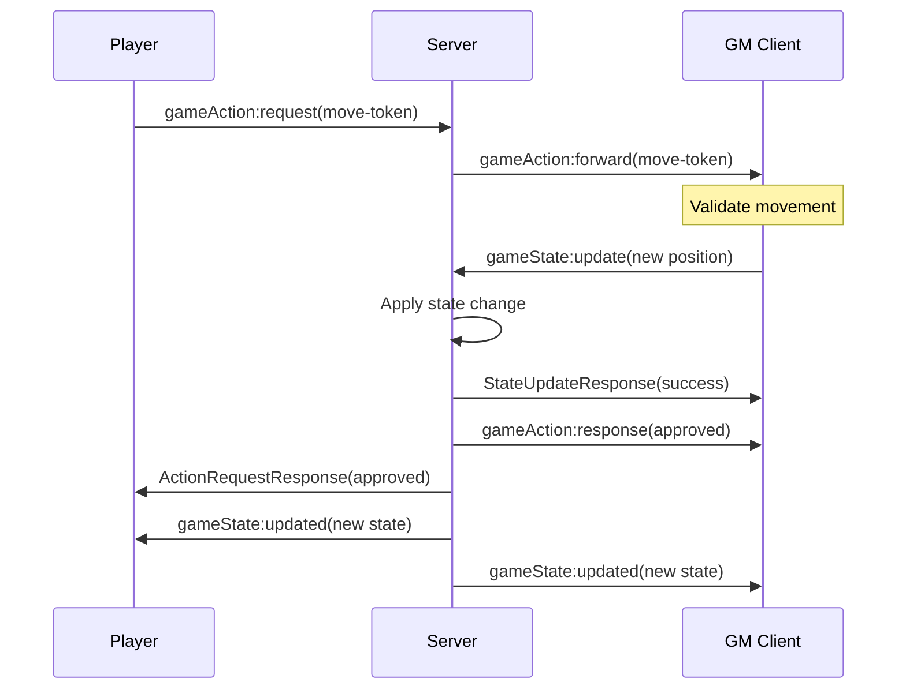
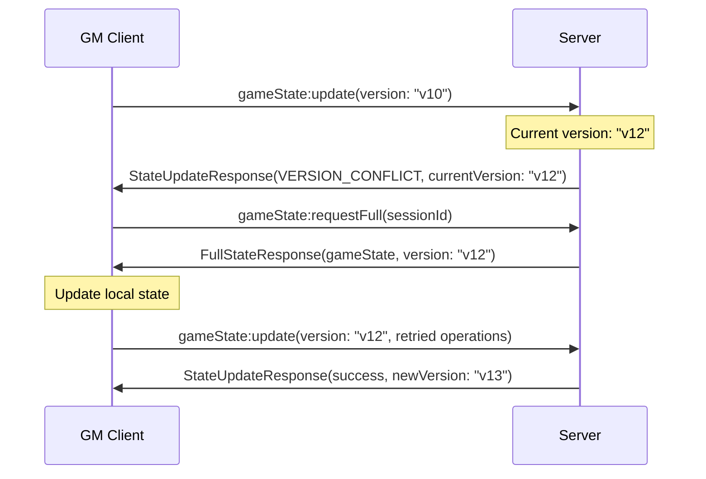

# Socket Event Reference

## Overview

Dungeon Lab uses Socket.IO for real-time communication between clients and server. This document catalogs all events in the game session state and action systems.

## Event Categories

- **Game State Events** (`gameState:*`) - GM-authoritative state management
- **Game Action Events** (`gameAction:*`) - Player action requests and responses  
- **Game Session Events** (`gameSession:*`) - Session lifecycle management
- **Chat Events** (`chat:*`) - Real-time messaging  
- **Dice Roll Events** (`roll:*`) - Dice rolling system
- **Workflow Events** (`workflow:*`) - Map generation and utilities

---

## Game State Events

### `gameState:update` ⬆️ Client → Server

**Purpose**: GM sends state changes to server
**Authority**: GM only
**Schema**: `StateUpdate`

```typescript
interface StateUpdate {
  id: string;              // Unique update ID
  sessionId: string;       // Target session
  version: string;         // Current state version
  operations: StateOperation[];
  timestamp: number;
  source: 'gm' | 'system';
}

interface StateOperation {
  path: string;            // "characters.0.hitPoints"
  operation: 'set' | 'unset' | 'inc' | 'push' | 'pull';
  value?: unknown;
  previous?: unknown;      // Set by server for rollbacks
}
```

**Example**:
```typescript
socket.emit('gameState:update', {
  id: 'update_123',
  sessionId: 'session_456', 
  version: '42',
  operations: [{
    path: "characters.0.pluginData.hitPoints",
    operation: "set",
    value: 25
  }],
  timestamp: Date.now(),
  source: 'gm'
}, (response: StateUpdateResponse) => {
  if (response.success) {
    console.log('State updated to version:', response.newVersion);
  } else {
    console.error('Update failed:', response.error);
  }
});
```

**Response**: `StateUpdateResponse`
```typescript
interface StateUpdateResponse {
  success: boolean;
  newVersion?: string;     // New state version if successful
  newHash?: string;        // New integrity hash
  error?: {
    code: 'VERSION_CONFLICT' | 'VALIDATION_ERROR' | 'TRANSACTION_FAILED' | 
          'SESSION_NOT_FOUND' | 'PERMISSION_DENIED';
    message: string;
    currentVersion?: string;
    currentHash?: string;
  };
}
```

### `gameState:updated` ⬇️ Server → All Clients

**Purpose**: Broadcast state changes to all session participants
**Recipients**: All users in session room
**Schema**: `StateUpdateBroadcast`

```typescript
interface StateUpdateBroadcast {
  sessionId: string;
  newState: ServerGameState;  // Complete updated state
  newVersion: string;         // New version number
  newHash: string;           // Integrity hash
  updateId: string;          // Original update ID
  source: 'gm' | 'system';
  timestamp: number;
}
```

**Example**:
```typescript
socket.on('gameState:updated', (broadcast: StateUpdateBroadcast) => {
  gameStateStore.applyServerUpdate(broadcast);
  console.log(`State updated to version ${broadcast.newVersion}`);
});
```

### `gameState:requestFull` ⬆️ Client → Server

**Purpose**: Request complete state refresh (error recovery)
**Authority**: Session participants
**Schema**: Simple sessionId parameter

```typescript
socket.emit('gameState:requestFull', 'session_456', (response) => {
  if (response.success) {
    gameStateStore.replaceFullState(response.gameState, response.version, response.hash);
  }
});
```

**Response**: 
```typescript
interface FullStateResponse {
  success: boolean;
  gameState?: ServerGameState;
  version?: string;
  hash?: string;
  error?: { code: string; message: string; };
}
```

### `gameState:syncEncounter` ⬆️ Client → Server  

**Purpose**: Synchronize encounter-specific data
**Authority**: GM only  
**Usage**: Specialized sync for encounter workflows

```typescript
socket.emit('gameState:syncEncounter', {
  sessionId: 'session_456',
  encounter: encounterData
}, (response) => {
  console.log('Encounter synced:', response.success);
});
```

---

## Game Action Events  

### `gameAction:request` ⬆️ Player → Server

**Purpose**: Player requests action that requires GM approval
**Authority**: Session participants  
**Schema**: `GameActionRequest` with callback

```typescript
interface GameActionRequest {
  id: string;
  playerId: string;
  sessionId: string;
  timestamp: number;
  action: 'move-token' | 'add-document';
  parameters: Record<string, unknown>;
  description?: string;
}
```

**Example**:
```typescript
socket.emit('gameAction:request', {
  id: 'req_789',
  playerId: 'user_123',
  sessionId: 'session_456', 
  timestamp: Date.now(),
  action: 'move-token',
  parameters: {
    tokenId: 'token_abc',
    newPosition: { x: 150, y: 200 }
  },
  description: 'Move goblin warrior'
}, (response: ActionRequestResponse) => {
  if (response.approved) {
    console.log('Action approved by GM');
  } else {
    console.log('Action denied:', response.error?.message);
  }
});
```

**Response**: `ActionRequestResponse`
```typescript
interface ActionRequestResponse {
  success: boolean;
  approved?: boolean;
  requestId: string;
  error?: {
    code: string;
    message: string;
  };
}
```

### `gameAction:forward` ⬇️ Server → GM Client

**Purpose**: Server forwards player action to GM for approval
**Recipients**: GM client only
**Schema**: Same `GameActionRequest` (no callback)

```typescript
// GM client handler
socket.on('gameAction:forward', (request: GameActionRequest) => {
  gmActionHandler.processRequest(request);
});
```

### `gameAction:response` ⬆️ GM → Server

**Purpose**: GM sends approval/denial back to server  
**Authority**: GM only
**Schema**: `ActionRequestResponse`

```typescript
socket.emit('gameAction:response', {
  success: true,
  approved: true,  
  requestId: 'req_789'
});

// Or deny with reason
socket.emit('gameAction:response', {
  success: false,
  requestId: 'req_789',
  error: {
    code: 'COLLISION_DETECTED',
    message: 'Token movement blocked by wall'
  }
});
```

---

## Game Session Events

### `gameSession:join` ⬆️ Client → Server

**Purpose**: Join active game session
**Authority**: Session participants + GM
**Auto-sync**: Triggers immediate state sync

```typescript
socket.emit('gameSession:join', 'session_456', (response) => {
  if (response.success) {
    console.log('Joined session:', response.session.name);
    // Automatic gameState:updated will follow
  }
});
```

### `gameSession:leave` ⬆️ Client → Server  

**Purpose**: Leave current game session
**Authority**: Session participants

```typescript
socket.emit('gameSession:leave', 'session_456', (response) => {
  console.log('Left session:', response.success);
});
```

### `gameSession:end` ⬆️ Client → Server

**Purpose**: End/stop active session
**Authority**: GM only

```typescript
socket.emit('gameSession:end', 'session_456', (response) => {
  console.log('Session ended:', response.success);
});
```

### `gameSession:joined` ⬇️ Server → All Clients

**Purpose**: Notify all participants that user joined session
**Recipients**: All users in session room

```typescript
socket.on('gameSession:joined', (data) => {
  console.log(`${data.userName} joined the session`);
});
```

### `gameSession:left` ⬇️ Server → All Clients

**Purpose**: Notify all participants that user left session  
**Recipients**: All users in session room

### `gameSession:ended` ⬇️ Server → All Clients

**Purpose**: Notify all participants that session ended
**Recipients**: All users in session room

---

## Chat Events

### `chat` ⬆️ Client → Server

**Purpose**: Send chat message to session
**Authority**: Session participants

```typescript
socket.emit('chat', {
  sessionId: 'session_456',
  message: 'Hello everyone!',
  type: 'message',
  timestamp: Date.now()
});
```

### Chat broadcasts ⬇️ Server → All Clients

- `chat:message` - Regular chat message
- `chat:roll` - Dice roll result  
- `chat:system` - System notifications
- `chatbot:response` - GM assistant responses

---

## Dice Roll Events

### `roll` ⬆️ Client → Server

**Purpose**: Execute dice roll
**Authority**: Session participants

```typescript
socket.emit('roll', {
  expression: '1d20+5',
  label: 'Attack Roll',
  sessionId: 'session_456'
});
```

### `roll:result` ⬇️ Server → All Clients

**Purpose**: Broadcast dice roll results
**Recipients**: All users in session room

---

## Workflow Events  

### Map Generation Workflows
- `workflow:mapGenerate` - Start AI map generation
- `workflow:mapEdit` - Request map modifications  
- `workflow:mapDetectFeatures` - Analyze map features

### Workflow Progress  
- `workflow:progress` - Progress updates for long-running operations

---

## Error Handling

### Common Error Codes

| Code | Description | Recovery |
|------|-------------|----------|
| `VERSION_CONFLICT` | State version mismatch | Request full state refresh |
| `PERMISSION_DENIED` | User lacks required permissions | Check GM status |
| `SESSION_NOT_FOUND` | Invalid session ID | Verify session exists |
| `VALIDATION_ERROR` | Invalid operation parameters | Fix operation data |  
| `TRANSACTION_FAILED` | Database operation failed | Retry after delay |
| `COLLISION_DETECTED` | Token movement blocked | Choose different position |
| `TOKEN_NOT_FOUND` | Invalid token reference | Verify token exists |

### Error Response Pattern

All events follow consistent error response structure:

```typescript
interface ErrorResponse {
  success: false;
  error: {
    code: string;
    message: string;
    details?: Record<string, unknown>;
  };
}
```

### Timeout Handling

- **Player Action Requests**: 30 second timeout for GM response
- **State Updates**: 10 second timeout for server acknowledgment
- **Session Operations**: 5 second timeout for join/leave operations

---

## Event Flow Examples

### Complete Token Movement Flow



### State Conflict Resolution



---

*This reference covers all socket events in the game session architecture. For implementation details, see the [State Management Guide](./state-management-guide.md).*