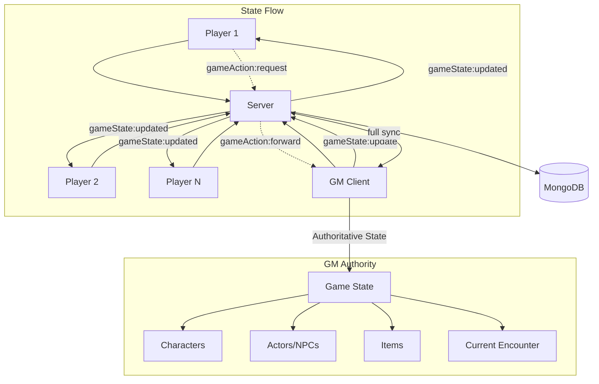
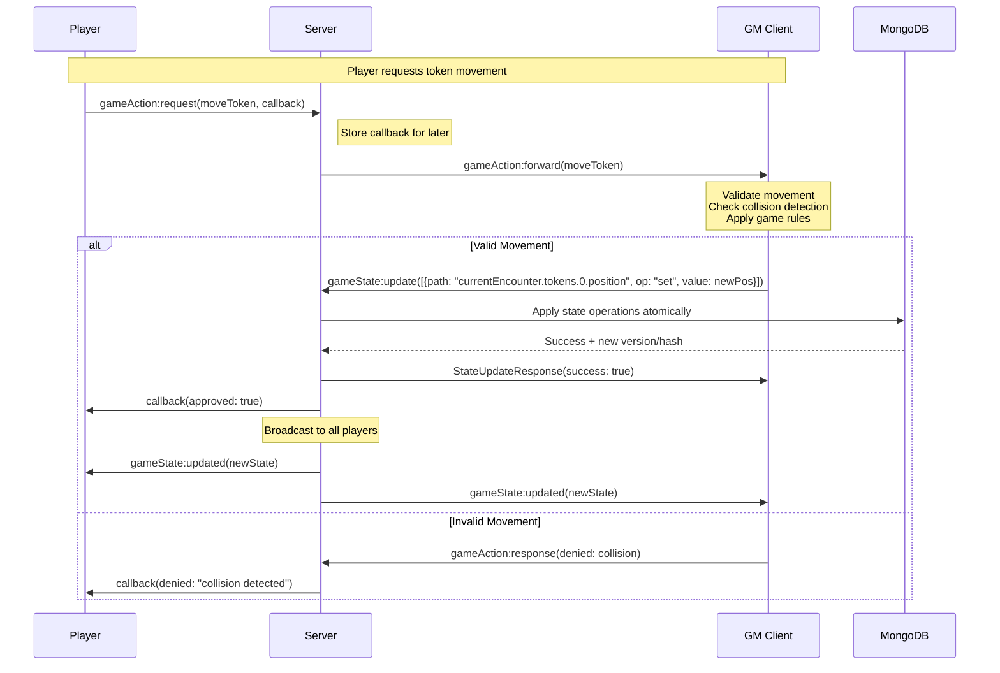
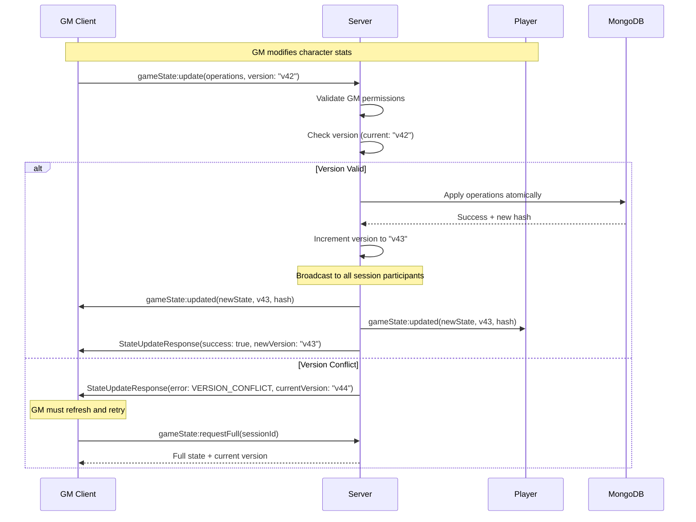

# Game Session State Architecture

## Overview

Dungeon Lab uses a **GM-authoritative state management system** where the Game Master (GM) client serves as the single source of truth for all game session data. This architecture ensures consistent game state across all connected players while maintaining the GM's ultimate control over game events.

## Core Principles

### 1. GM Authority
- **Single Source of Truth**: GM client holds authoritative game state
- **Exclusive Write Access**: Only GM can modify game state
- **Player Requests**: Players request actions, GM approves/denies
- **Trust-Based**: Server trusts GM client, validates structure only

### 2. Sequential Processing  
- **Ordered Updates**: GM sends one state update at a time
- **Version Control**: Optimistic concurrency with incrementing versions
- **Atomic Operations**: Multiple changes applied as single transaction
- **Queue Management**: Updates processed in strict sequence

### 3. State Integrity
- **Hash Verification**: SHA-256 checksums prevent state corruption  
- **Version Tracking**: Prevents conflicting concurrent updates
- **Rollback Capability**: Previous values stored for recovery
- **Repair Mechanisms**: Auto-sync and manual refresh on errors

## System Architecture



## Event Flow Architecture

### Player Action Request Flow



### State Synchronization Flow



## State Update Operations

The system supports five atomic operations based on MongoDB update patterns:

### Operation Types

```typescript
// Set field value
{
  path: "characters.0.pluginData.hitPoints", 
  operation: "set", 
  value: 45
}

// Remove field entirely  
{
  path: "characters.0.temporaryHP", 
  operation: "unset"
}

// Increment number
{
  path: "characters.0.experience", 
  operation: "inc", 
  value: 100  
}

// Add to array
{
  path: "currentEncounter.tokens", 
  operation: "push", 
  value: newTokenObject
}

// Remove from array
{
  path: "characters.0.conditions", 
  operation: "pull", 
  value: "poisoned"
}
```

### Batch Operations Example

```typescript
// GM heals character and adds experience in single atomic update
const operations = [
  {
    path: "characters.0.pluginData.hitPoints", 
    operation: "set", 
    value: characterMaxHP
  },
  {
    path: "characters.0.experience", 
    operation: "inc", 
    value: 150
  },
  {
    path: "characters.0.conditions", 
    operation: "pull", 
    value: "unconscious"
  }
];

await gameStateStore.updateGameState(operations);
```

## State Synchronization Mechanisms

### 1. Real-Time Updates
- **Event**: `gameState:updated` 
- **Trigger**: Every successful GM state update
- **Recipients**: All session participants
- **Payload**: Complete new state + version + hash

### 2. Full State Refresh
- **Event**: `gameState:requestFull`
- **Usage**: Error recovery, reconnection, version conflicts  
- **Authority**: Server queries GM's current state
- **Result**: Complete state synchronization

### 3. Session Join Sync
- **Event**: `gameSession:join`
- **Trigger**: Player joins active session
- **Process**: Server sends current state immediately
- **Prevents**: Stale state on reconnection

## Error Handling & State Repair

### Version Conflicts
```typescript
// When GM's state version is outdated
{
  success: false,
  error: {
    code: 'VERSION_CONFLICT',
    message: 'State version mismatch', 
    currentVersion: '47' // Server's current version
  }
}
```
**Recovery**: GM requests full state refresh, retries operation

### State Corruption Detection
```typescript
// Hash mismatch indicates corruption
if (generateStateHash(gameState) !== expectedHash) {
  logger.error('State integrity violation detected');
  // Trigger full state resync
}
```

### Network Disconnection Recovery
- **Player Reconnect**: Automatic state sync via `gameSession:join`
- **GM Reconnect**: Full state comparison and sync
- **Orphaned Updates**: Cleanup via session heartbeat mechanism

## Performance Characteristics

### Throughput
- **Sequential Processing**: ~10-50 updates/second per session
- **Batching**: Multiple operations in single update
- **Optimizations**: Hash-based change detection

### Latency  
- **Local GM**: ~5-15ms for state updates
- **Player Sync**: ~20-50ms for broadcast propagation
- **Network**: Additional latency based on connection quality

### Memory
- **Full State**: ~1-10MB per active session
- **Version History**: Not stored (stateless)
- **Hash Verification**: Minimal overhead (~32 bytes)

## Security Model

### Authentication
- **Session-based**: GM must be authenticated session owner  
- **Participant Validation**: Players must be session participants
- **Admin Override**: System admins bypass GM checks

### Authorization  
- **State Updates**: GM-only (except system operations)
- **State Reads**: All session participants  
- **Action Requests**: All session participants

### Data Integrity
- **Input Validation**: Zod schema validation on all operations
- **Operation Safety**: Path validation prevents prototype pollution
- **State Bounds**: MongoDB schema enforces data structure

## Future Improvements

### Consistency Enhancements
- **Conflict-free Replicated Data Types (CRDTs)** for automatic conflict resolution
- **Operation-based state synchronization** instead of full state broadcasts  
- **Client-side optimistic updates** with server reconciliation

### Performance Optimizations  
- **Delta compression** for state update broadcasts
- **State partitioning** for large sessions (encounter vs character data)
- **WebSocket connection pooling** for high-concurrency sessions

### Reliability Improvements
- **Persistent operation log** for audit trails and replay capability
- **Automatic state snapshots** for faster recovery after crashes
- **Circuit breaker patterns** for graceful degradation under load

---

*This architecture ensures reliable, consistent multiplayer TTRPG sessions while maintaining the GM's traditional authority over game events and state changes.*