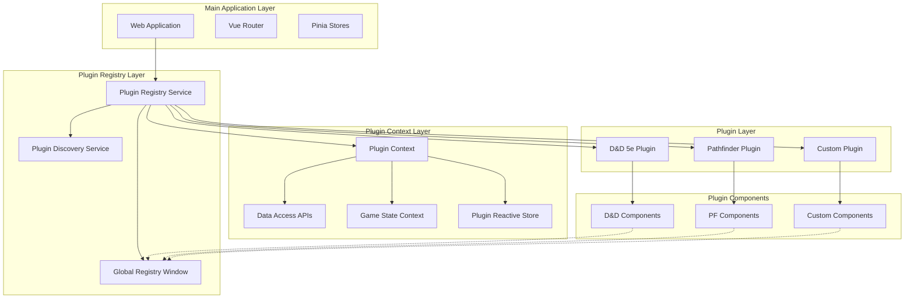
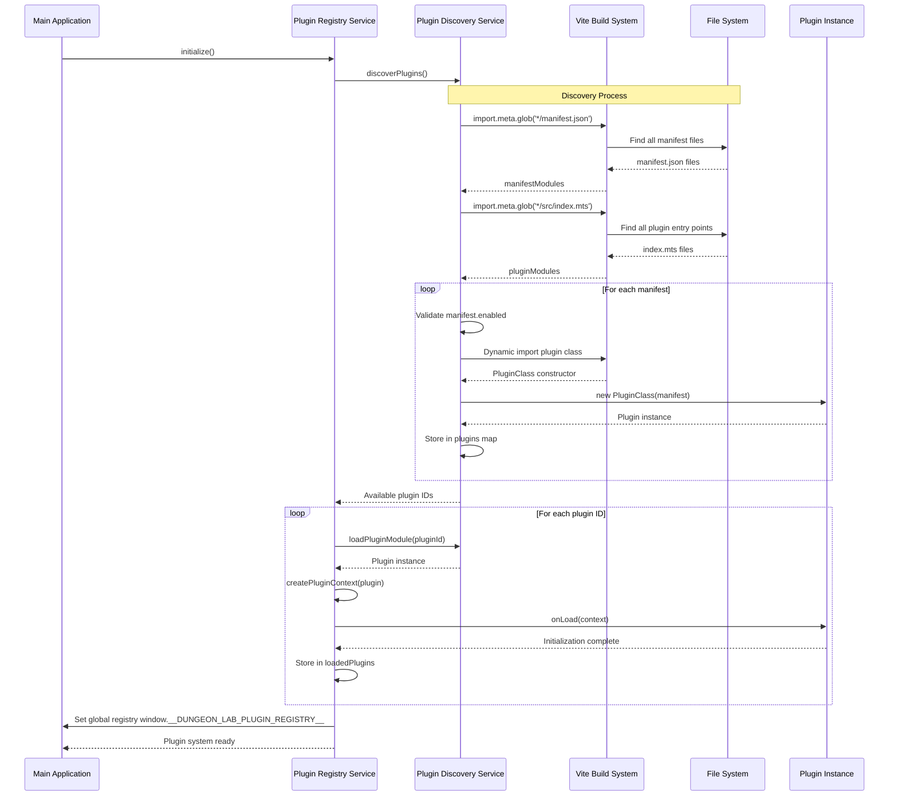
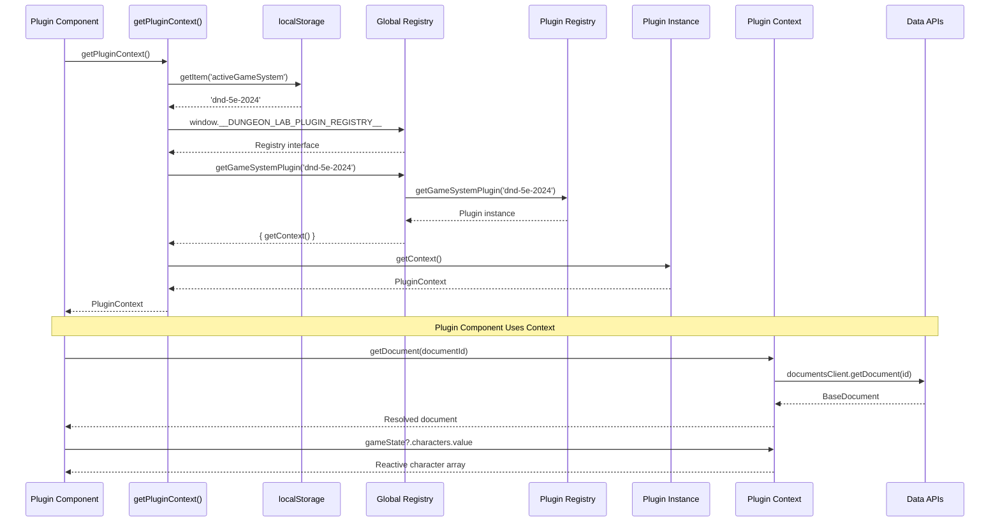
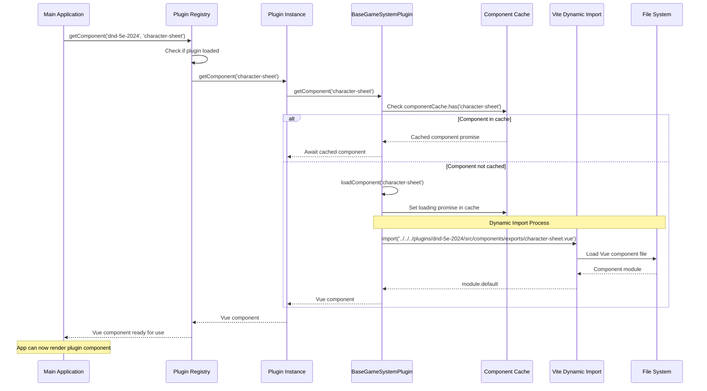
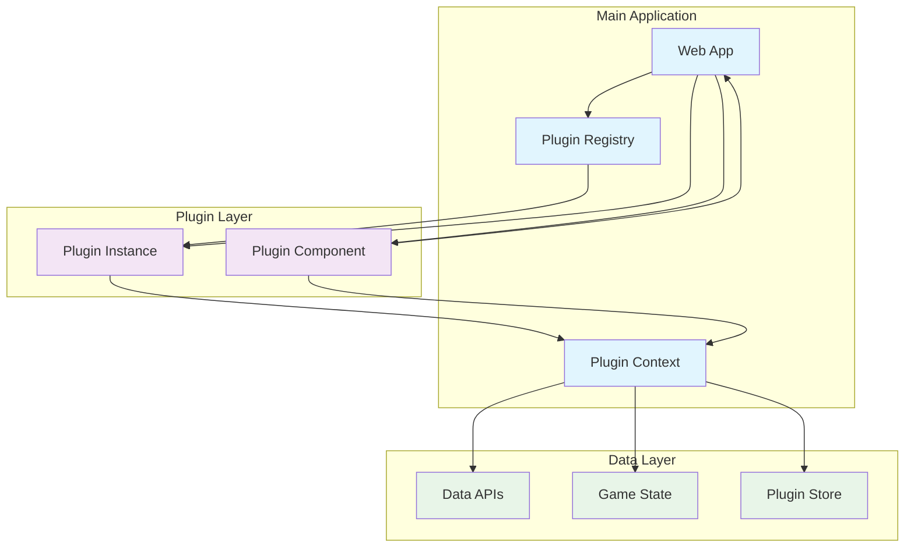
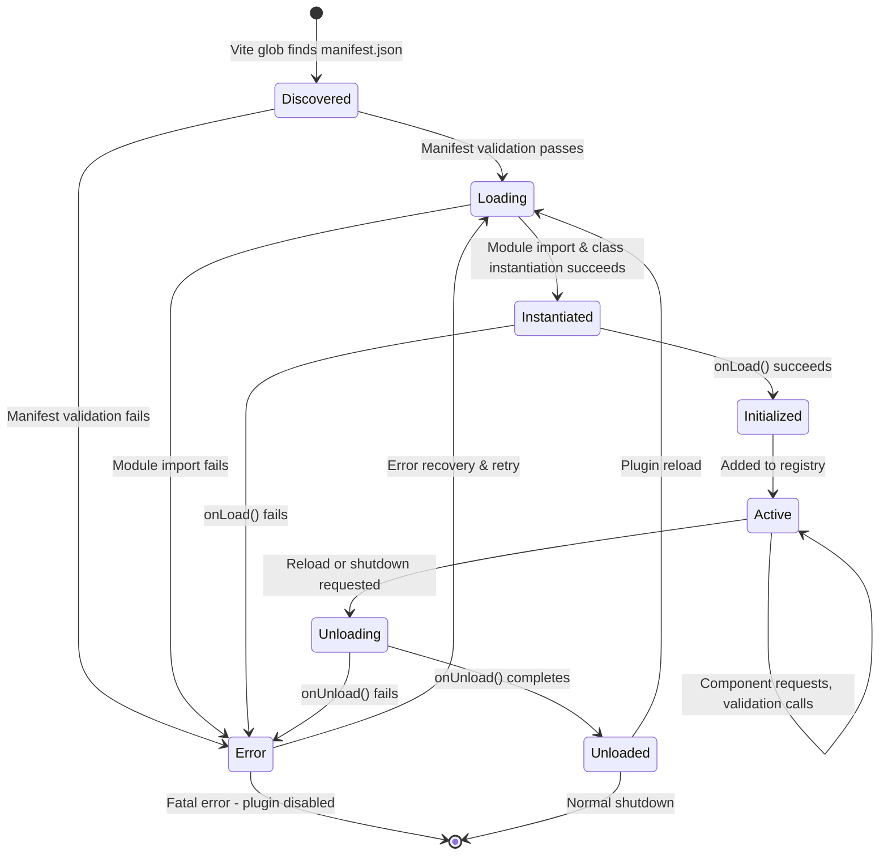

# Plugin Architecture

## Overview

Dungeon Lab's plugin system enables modular support for different tabletop role-playing game systems. Each plugin provides game-specific logic, Vue components, data validation, and UI features while maintaining complete isolation from the main application and other plugins.

The architecture is designed around these core principles:

- **Complete Isolation**: Plugins cannot directly depend on main app packages or other plugins
- **Interface-Based Communication**: All interaction happens through well-defined interfaces
- **Manifest-Driven Configuration**: Plugin capabilities are declared in manifest.json files
- **Convention-Based Component Loading**: Components are auto-discovered using file naming conventions
- **Read-Only Data Access**: Plugins receive data through contexts, never modify app state directly
- **Dynamic Loading**: Plugins are loaded at runtime using Vite's dynamic import system

## System Architecture



## Plugin Discovery & Registration

### Discovery Process

The plugin system uses Vite's static analysis capabilities to discover plugins at build time while enabling dynamic loading at runtime.

**File: `packages/web/src/services/plugin-discovery.service.mts`**

```typescript
// 1. Discover manifests using Vite glob pattern
const manifestModules = import.meta.glob(
  '@/../../plugins/*/manifest.json',
  { eager: true, import: 'default' }
);

// 2. Discover plugin entry points
const pluginModules = import.meta.glob(
  '@/../../plugins/*/src/index.mts',
  { import: 'default' }
);

// 3. Match manifests with their plugin modules
// 4. Create plugin instances with manifest injection
const instance = new PluginClass(manifest);
```

### Plugin Discovery & Registration Flow



### Registration Flow

**File: `packages/web/src/services/plugin-registry.mts`**

```typescript
export class PluginRegistryService {
  // 1. Initialize discovery service
  await pluginDiscoveryService.discoverPlugins();
  
  // 2. Load each discovered plugin
  for (const pluginId of pluginIds) {
    const plugin = await pluginDiscoveryService.loadPluginModule(pluginId);
    
    // 3. Initialize plugin with context
    const context = this.createPluginContext(plugin);
    await plugin.onLoad(context);
    
    // 4. Store loaded plugin
    this.loadedPlugins.set(pluginId, plugin);
  }
}
```

### Global Registry Setup

**File: `packages/web/src/main.mts`**

```typescript
// Make plugin registry globally accessible
window.__DUNGEON_LAB_PLUGIN_REGISTRY__ = {
  getGameSystemPlugin: (id: string) => {
    const plugin = pluginRegistry.getGameSystemPlugin(id);
    return plugin ? { getContext: () => plugin.getContext() } : null;
  }
};
```

## Plugin Context System

The Plugin Context provides plugins with controlled access to application data and services. It consists of three main parts:

### 1. Data Access APIs

**File: `packages/web/src/services/plugin-implementations/plugin-context-impl.mts`**

```typescript
export class PluginContextImpl implements PluginContext {
  // Document and compendium access
  async getDocument(id: string): Promise<BaseDocument>
  async searchDocuments(query: DocumentSearchQuery): Promise<BaseDocument[]>
  async getCompendiumEntry(id: string): Promise<ICompendiumEntry>
  async searchCompendiumEntries(query: CompendiumSearchQuery): Promise<ICompendiumEntry[]>
}
```

These methods provide read-only access to:
- **Documents**: Characters, items, actors created by users
- **Compendium**: Static game data like spells, classes, species

### 2. Game State Context (Optional)

**File: `packages/web/src/services/plugin-game-state.service.mts`**

Only available during active game sessions, provides reactive access to:

```typescript
export interface GameStateContext {
  // Reactive computed refs
  readonly characters: ComputedRef<ICharacter[]>;
  readonly actors: ComputedRef<IActor[]>;
  readonly items: ComputedRef<IItem[]>;
  readonly currentEncounter: ComputedRef<IEncounter | null>;
  
  // Synchronous helpers
  getCharacterById(id: string): ICharacter | null;
  getItemsByCarrier(carrierId: string): IItem[];
  getTokensByDocument(documentId: string): IToken[];
}
```

### 3. Plugin Store

Reactive store for plugin-specific UI state (tabs, preferences, etc.):

```typescript
export interface PluginStore {
  get<T>(key: string): T | undefined;
  set<T>(key: string, value: T): void;
  subscribe<T>(key: string, callback: (value: T) => void): () => void;
}
```

### Plugin Context Access Flow



## Component System

### Convention-Based Loading

Plugins provide Vue components through a standardized directory structure and naming convention:

```
packages/plugins/{plugin-id}/src/components/
├── exports/           # Public API components (loaded by main app)
│   ├── character-sheet.vue
│   ├── character-creator.vue
│   └── character-card-info.vue
└── internal/          # Private plugin components
    ├── character-creator/
    │   └── steps/
    └── common/
```

**File: `packages/shared-ui/src/base/base-plugin.mts`**

```typescript
export abstract class BaseGameSystemPlugin {
  async getComponent(type: string): Promise<Component | null> {
    // Auto-load from exports directory
    const componentPath = `../../../plugins/${this.manifest.id}/src/components/exports/${type}.vue`;
    const module = await import(/* @vite-ignore */ componentPath);
    return module.default;
  }
}
```

### Component Access from Main App

**File: `packages/web/src/services/plugin-registry.mts`**

```typescript
// App requests component from plugin
async getComponent(gameSystemId: string, componentType: string): Promise<Component | null> {
  const plugin = this.loadedPlugins.get(gameSystemId);
  return await plugin.getComponent(componentType);
}
```

**Usage Example:**
```typescript
// CharacterListView requests character-card-info component
const component = await pluginRegistry.getComponent('dnd-5e-2024', 'character-card-info');
```

### Component Loading & Resolution Flow



### Plugin Component Context Access

Plugin components access the app context using a global utility:

**File: `packages/shared-ui/src/utils/plugin-context.mjs`**

```typescript
export function getPluginContext(): PluginContext | undefined {
  // 1. Get active game system from localStorage
  const activeGameSystem = localStorage.getItem('activeGameSystem');
  
  // 2. Access global plugin registry
  const pluginRegistry = window.__DUNGEON_LAB_PLUGIN_REGISTRY__;
  
  // 3. Get plugin and its context
  const plugin = pluginRegistry.getGameSystemPlugin(activeGameSystem);
  return plugin?.getContext();
}
```

**Component Usage:**
```vue
<script setup lang="ts">
import { getPluginContext } from '@dungeon-lab/shared-ui/utils/plugin-context.mjs';

onMounted(async () => {
  const context = getPluginContext();
  if (context) {
    // Access app data
    const document = await context.getDocument(documentId);
    
    // Access game state (if in session)
    const characters = context.gameState?.characters.value;
  }
});
</script>
```

## Base Classes & Interfaces

### Core Plugin Interface

**File: `packages/shared-ui/src/types/plugin.mts`**

```typescript
export interface GameSystemPlugin {
  readonly manifest: PluginManifest;
  
  // Component provision
  getComponent(type: string): Promise<Component | null>;
  
  // Data validation
  validate(type: string, data: unknown): ValidationResult;
  
  // Game mechanics
  getTokenGridSize(document: unknown): number;
  
  // Lifecycle
  onLoad(context?: PluginContext): Promise<void>;
  onUnload(): Promise<void>;
}
```

### Base Plugin Implementation

**File: `packages/shared-ui/src/base/base-plugin.mts`**

```typescript
export abstract class BaseGameSystemPlugin implements GameSystemPlugin {
  readonly manifest: PluginManifest;
  protected context?: PluginContext;
  private componentCache = new Map<string, Promise<Component | null>>();
  
  constructor(manifest: PluginManifest) {
    this.manifest = manifest;
  }
  
  // Automatic component loading with caching
  async getComponent(type: string): Promise<Component | null> {
    if (this.componentCache.has(type)) {
      return await this.componentCache.get(type)!;
    }
    
    const importPromise = this.loadComponent(type);
    this.componentCache.set(type, importPromise);
    return await importPromise;
  }
  
  // Abstract methods for concrete plugins
  abstract validate(type: string, data: unknown): ValidationResult;
  abstract onUnload(): Promise<void>;
}
```

## Communication Patterns



**Communication Flow Types:**

- **App → Plugin**: Component requests, data validation, lifecycle events, game mechanics
- **Plugin → App**: Data access through context, reactive game state, UI state management  
- **Component Level**: Props from app, events to app, context access for data

### App → Plugin Communication

1. **Component Requests**: App requests components by type
2. **Data Validation**: App asks plugin to validate game data
3. **Lifecycle Events**: App calls onLoad/onUnload
4. **Game Mechanics**: App queries token sizes, turn management

```typescript
// Examples
const component = await plugin.getComponent('character-sheet');
const validation = plugin.validate('character', characterData);
const tokenSize = plugin.getTokenGridSize(creature);
```

### Plugin → App Communication

1. **Data Access**: Plugin requests documents/compendium data
2. **Game State Access**: Plugin accesses reactive game state
3. **UI State**: Plugin manages its own reactive store

```typescript
// Examples
const character = await context.getDocument(characterId);
const spells = await context.searchCompendiumEntries({ documentType: 'spell' });
const characters = context.gameState?.characters.value;
context.store.set('activeTab', 'abilities');
```

### Component Communication

Plugin components communicate with the main app through:

1. **Props**: App passes data to plugin components
2. **Events**: Plugin components emit events to parent
3. **Context Access**: Components access app data via getPluginContext()

```vue
<!-- Plugin component receives character data -->
<template>
  <CharacterSheet 
    :character="character" 
    @save="handleSave"
    @close="handleClose" 
  />
</template>
```

## Manifest System

Each plugin declares its capabilities in a `manifest.json` file:

**File: `packages/plugins/dnd-5e-2024/manifest.json`**

```json
{
  "id": "dnd-5e-2024",
  "name": "D&D 5th Edition (2024)",
  "version": "2.0.0",
  "enabled": true,
  "gameSystem": "dnd-5e-2024",
  "characterTypes": ["character", "npc"],
  "itemTypes": ["weapon", "armor", "consumable", "tool"],
  "components": {
    "character-sheet": {
      "name": "D&D 5e Character Sheet",
      "description": "Interactive character sheet for D&D 5e characters",
      "category": "character"
    }
  },
  "entryPoint": "./src/index.mts"
}
```

**Validation Schema: `packages/shared/src/schemas/plugin-manifest.schema.mts`**

```typescript
export const pluginManifestSchema = z.object({
  id: z.string().regex(/^[a-z0-9-]+$/),
  name: z.string().min(1),
  version: z.string().regex(/^\d+\.\d+\.\d+/),
  gameSystem: z.string().min(1),
  characterTypes: z.array(z.string()).default([]),
  itemTypes: z.array(z.string()).default([]),
  components: z.record(z.string(), z.object({
    name: z.string(),
    description: z.string().optional(),
    category: z.string().optional(),
  })).optional(),
  enabled: z.boolean().default(true),
  entryPoint: z.string().default('./dist/index.mjs'),
});
```

## Implementation Example: D&D 5e Plugin

### Plugin Class

**File: `packages/plugins/dnd-5e-2024/src/index.mts`**

```typescript
export class DnD5e2024Plugin extends BaseGameSystemPlugin {
  validate(type: string, data: unknown): ValidationResult {
    switch (type) {
      case 'character':
        return this.validateCharacterData(data);
      default:
        return { success: false, errors: [`Unknown validation type: ${type}`] };
    }
  }
  
  getTokenGridSize(document: unknown): number {
    // D&D creature size mapping
    const size = this.extractSize(document);
    switch (size) {
      case 'tiny': return 0.5;
      case 'small':
      case 'medium': return 1;
      case 'large': return 2;
      case 'huge': return 3;
      case 'gargantuan': return 4;
      default: return 1;
    }
  }
  
  async onLoad(context?: PluginContext): Promise<void> {
    await super.onLoad(context);
    console.log(`D&D 5e 2024 Plugin v${this.manifest.version} loaded`);
  }
}

export default DnD5e2024Plugin;
```

### Plugin Component

**File: `packages/plugins/dnd-5e-2024/src/components/exports/character-card-info.vue`**

```vue
<template>
  <div class="mt-1">
    <p v-if="speciesAndClass" class="text-sm text-gray-600 text-center">
      {{ speciesAndClass }}
    </p>
    
    <div v-if="levelOrHitPoints" class="flex justify-between items-center mt-1">
      <span v-if="resolvedData.level" class="text-sm text-gray-600">
        Level {{ resolvedData.level }}
      </span>
      <span v-if="hitPoints" class="text-sm text-gray-900 ml-auto">
        {{ hitPoints.current }}/{{ hitPoints.maximum }} HP
      </span>
    </div>
  </div>
</template>

<script setup lang="ts">
import { getPluginContext } from '@dungeon-lab/shared-ui/utils/plugin-context.mjs';

onMounted(async () => {
  const context = getPluginContext();
  if (!context) return;
  
  // Resolve D&D-specific data references
  const data = props.character.pluginData as DndCharacterData;
  
  if (data.species && typeof data.species === 'string') {
    const speciesDoc = await context.getDocument(data.species);
    resolvedData.value.speciesName = speciesDoc.name;
  }
  
  if (data.characterClass && typeof data.characterClass === 'string') {
    const classDoc = await context.getDocument(data.characterClass);
    resolvedData.value.className = classDoc.name;
  }
});
</script>
```

### App Integration

**File: `packages/web/src/views/CharacterListView.vue`**

```vue
<template>
  <div v-for="character in characters" :key="character.id">
    <h3>{{ character.name }}</h3>
    
    <!-- Dynamic plugin component loading -->
    <Suspense>
      <template #default>
        <CharacterCardInfo 
          v-if="character.pluginId"
          :character="character"
          :get-component="getCharacterCardInfoComponent"
        />
      </template>
      <template #fallback>
        <p>Loading character details...</p>
      </template>
    </Suspense>
  </div>
</template>

<script setup lang="ts">
import { pluginRegistry } from '@/services/plugin-registry.mts';

const getCharacterCardInfoComponent = async (character: ICharacter) => {
  if (!character.pluginId) return null;
  
  return await pluginRegistry.getComponent(
    character.pluginId, 
    'character-card-info'
  );
};
</script>
```

## Lifecycle Management

### Plugin Lifecycle State Machine



### Plugin Loading Sequence

1. **Discovery**: Vite glob imports find all `manifest.json` files
2. **Manifest Validation**: Each manifest is validated against schema
3. **Module Loading**: Plugin entry points are dynamically imported  
4. **Instance Creation**: Plugin classes are instantiated with manifest
5. **Context Creation**: Plugin contexts are created with API access
6. **Initialization**: Plugin `onLoad()` method is called with context
7. **Registration**: Plugin is stored in registry for component requests

### Plugin Cleanup

```typescript
async reloadPlugin(pluginId: string): Promise<void> {
  const existingPlugin = this.loadedPlugins.get(pluginId);
  if (existingPlugin) {
    // Call plugin cleanup
    await existingPlugin.onUnload();
    
    // Remove from registry
    this.loadedPlugins.delete(pluginId);
  }
  
  // Reload fresh instance
  await this.loadPlugin(pluginId);
}
```

## Key Design Decisions

### 1. Convention Over Configuration

Components are auto-discovered using file naming patterns instead of explicit registration. This reduces boilerplate and ensures consistency.

### 2. Manifest-Driven Architecture

All plugin metadata is declared in `manifest.json` rather than code, enabling static analysis and validation.

### 3. Interface Isolation

Plugins interact only through well-defined interfaces, preventing tight coupling and enabling plugin replacement.

### 4. Read-Only Data Access

Plugins can request data but cannot directly modify app state, maintaining clear boundaries and preventing conflicts.

### 5. Global Context Access

Plugin components access context through a global utility rather than prop drilling, simplifying component development.

### 6. Component Caching

Plugin components are cached after first load to avoid repeated dynamic imports and improve performance.

This architecture enables Dungeon Lab to support multiple game systems while maintaining clean separation of concerns and enabling independent plugin development.