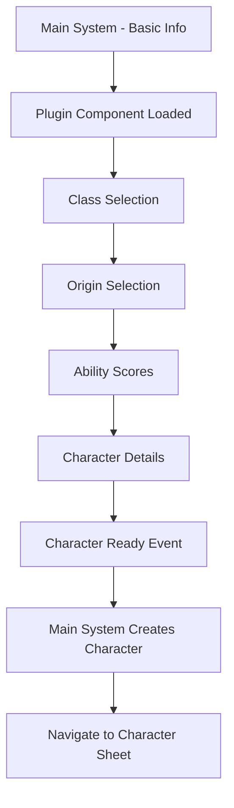

# Character Creator Plugin Integration

## Overview & Goals

This document outlines the strategy and implementation plan for transforming the existing 2-step character creation process into a comprehensive 4-step wizard by integrating a D&D 5e plugin component with the main system architecture.

### Primary Objectives

1. **Transform Character Creation Flow**: Evolve from basic info + placeholder to a complete 4-step wizard (Class → Origin → Abilities → Details)
2. **Maintain Plugin Architecture**: Leverage the existing component registry system for loose coupling
3. **Preserve Game Agnostic Design**: Keep the main system generic while allowing plugins to provide game-specific functionality
4. **Replicate Old Plugin Functionality**: Match the user experience and feature set of the handlebars-based character creation

## Architecture Design

### System Responsibilities

#### Main System (`packages/web/src/views/CharacterCreateView.vue`)
- **Step 1**: Basic character info (name, description, avatar, token)
- **Plugin Discovery**: Dynamically load active plugin's character creator component
- **Data Orchestration**: Combine basic info with plugin data for final character creation
- **Navigation**: Handle transitions between basic info and plugin-specific steps

#### Plugin System (`packages/plugins/dnd-5e-2024/src/components/character-creator/`)
- **Steps 2-5**: D&D-specific character creation (Class, Origin, Abilities, Details)
- **Data Fetching**: Retrieve compendium data (classes, backgrounds, species) using `CompendiumsClient`
- **Validation**: Ensure each step meets D&D 5e requirements before progression
- **State Management**: Maintain character creation state with persistence

### Component Registry Integration

```typescript
// Plugin registration
registry.register(
  'dnd-5e-2024-character-creator',
  DnD5eCharacterCreator,
  {
    pluginId: 'dnd-5e-2024',
    name: 'D&D 5e Character Creator',
    category: 'character-creator',
    props: {
      basicInfo: { type: 'object', required: true },
      readonly: { type: 'boolean', default: false }
    },
    events: {
      'character-ready': 'Emitted when character data is complete',
      'back-to-basics': 'Emitted to return to basic info step'
    }
  }
);
```

### Data Flow Pattern



## Technical Implementation

### File Structure

```
packages/plugins/dnd-5e-2024/src/
├── components/
│   └── character-creator/
│       ├── DnD5eCharacterCreator.vue          # Main wrapper component
│       ├── steps/
│       │   ├── ClassSelectionStep.vue         # Step 1: Class selection
│       │   ├── OriginSelectionStep.vue        # Step 2: Species + Background
│       │   ├── AbilityScoresStep.vue          # Step 3: Ability score generation
│       │   └── CharacterDetailsStep.vue       # Step 4: Final details
│       ├── composables/
│       │   └── useCharacterCreation.mts       # State management composable
│       └── types/
│           └── character-creation.mts         # TypeScript interfaces
├── character-creator-styles.css               # Component-specific styles
└── index.mts                                  # Plugin registration (updated)
```

### Component Architecture

#### Main Wrapper Component (`DnD5eCharacterCreator.vue`)

```vue
<template>
  <div class="dnd5e-character-creator">
    <!-- Step indicator -->
    <div class="step-indicator">
      <div v-for="(step, index) in steps" :key="step.id" 
           :class="getStepClass(index)">
        {{ step.name }}
      </div>
    </div>

    <!-- Dynamic step rendering -->
    <component 
      :is="currentStepComponent" 
      v-model="characterData"
      @next="handleNext"
      @back="handleBack"
      @validate="handleValidation"
    />

    <!-- Navigation controls -->
    <div class="navigation-controls">
      <button @click="handleBack" :disabled="isFirstStep">Back</button>
      <button @click="handleNext" :disabled="!canProceed">
        {{ isLastStep ? 'Create Character' : 'Next' }}
      </button>
    </div>
  </div>
</template>
```

#### State Management Composable (`useCharacterCreation.mts`)

```typescript
export interface CharacterCreationState {
  currentStep: number;
  characterData: {
    class: ClassSelection | null;
    origin: OriginSelection | null;
    abilities: AbilityScores | null;
    details: CharacterDetails | null;
  };
  validationErrors: Record<string, string[]>;
  isValid: boolean;
}

export function useCharacterCreation() {
  const state = reactive<CharacterCreationState>({
    currentStep: 0,
    characterData: {
      class: null,
      origin: null,
      abilities: null,
      details: null
    },
    validationErrors: {},
    isValid: false
  });

  // State persistence
  const saveState = () => {
    sessionStorage.setItem('dnd5e-character-creation', JSON.stringify(state));
  };

  const loadState = () => {
    const saved = sessionStorage.getItem('dnd5e-character-creation');
    if (saved) {
      Object.assign(state, JSON.parse(saved));
    }
  };

  return {
    state: readonly(state),
    saveState,
    loadState,
    // ... other methods
  };
}
```

## API Integration

### Compendium Data Fetching

The plugin will use the existing `CompendiumsClient` from `@dungeon-lab/client` to fetch D&D data:

```typescript
import { CompendiumsClient } from '@dungeon-lab/client';

class CompendiumDataService {
  private client = new CompendiumsClient();
  
  async getClasses(compendiumId: string) {
    const response = await this.client.getCompendiumEntries(compendiumId, {
      documentType: 'class'
    });
    return response.entries;
  }

  async getBackgrounds(compendiumId: string) {
    const response = await this.client.getCompendiumEntries(compendiumId, {
      documentType: 'background'
    });
    return response.entries;
  }

  async getSpecies(compendiumId: string) {
    const response = await this.client.getCompendiumEntries(compendiumId, {
      documentType: 'species'
    });
    return response.entries;
  }
}
```

### Data Caching Strategy

- **Component-level caching**: Store fetched compendium data in reactive refs
- **Error handling**: Graceful degradation when compendium data is unavailable
- **Loading states**: Show spinners during data fetching operations

## User Experience Flow

### Step Progression

1. **Class Selection**
   - Dropdown selection of available classes
   - Display class features, hit die, proficiencies
   - Skill proficiency selection (based on class options)
   - Equipment package selection

2. **Origin Selection**
   - Species selection with traits and abilities
   - Background selection with features and proficiencies
   - Language selection
   - Equipment choices from background

3. **Ability Scores**
   - Method selection (Standard Array, Rolling, Point Buy)
   - Score assignment to abilities
   - Modifier calculation and display
   - Saving throw proficiency indication

4. **Character Details**
   - Alignment selection
   - Physical characteristics (age, height, weight, appearance)
   - Personality traits, ideals, bonds, flaws
   - Backstory and additional features

### Validation & Error Handling

- **Step-level validation**: Each step validates its data before allowing progression
- **Visual feedback**: Invalid fields highlighted with error messages
- **Error summary**: Display validation errors at the top of each step
- **Data persistence**: Maintain form state during navigation and page refreshes

## Development Phases

### Phase 1: Core Infrastructure
1. **Component Registration**: Update plugin to register character creator component
2. **Main System Integration**: Modify `CharacterCreateView.vue` for dynamic component loading
3. **Basic Component Structure**: Create wrapper component with step navigation
4. **State Management**: Implement `useCharacterCreation` composable

### Phase 2: Step Components
5. **Class Selection**: Implement class dropdown, proficiencies, equipment
6. **Origin Selection**: Species and background selection with features
7. **Ability Scores**: Standard array, rolling, and score assignment
8. **Character Details**: Alignment, traits, and biographical information

### Phase 3: Data Integration & Polish
9. **Compendium Integration**: Fetch real D&D data using `CompendiumsClient`
10. **Validation Implementation**: Zod schemas and error handling
11. **Character Transformation**: Convert plugin data to character document format
12. **UI Polish**: Responsive design, accessibility, and visual refinements

## Testing Strategy

### End-to-End Testing (Playwright)
- **Complete Flow**: Basic info → Class → Origin → Abilities → Details → Character creation
- **Navigation**: Forward and backward step navigation
- **Validation**: Error handling and required field validation
- **Data Persistence**: Page refresh scenarios
- **Integration**: Character list updates and character sheet navigation

### Component Testing
- **Step Components**: Individual step functionality and validation
- **State Management**: Composable state transitions and persistence
- **API Integration**: Compendium data fetching and error handling

## Success Criteria

- [ ] Complete 4-step character creation wizard
- [ ] Dynamic plugin component loading
- [ ] Data fetching from compendium using existing client
- [ ] Form validation and error handling
- [ ] State persistence across navigation
- [ ] Responsive design and accessibility
- [ ] Integration with existing character management
- [ ] Comprehensive test coverage

## Future Enhancements

- **Advanced Point Buy**: Full point buy calculator with racial bonuses
- **Equipment Customization**: Detailed equipment selection and management
- **Spell Selection**: Spellcaster-specific spell selection interface
- **Character Import**: Import characters from external sources
- **Character Templates**: Save and reuse character creation templates

---

This document serves as the blueprint for implementing the D&D 5e character creator plugin component while maintaining the architectural principles and design patterns established in the Dungeon Lab VTT system.