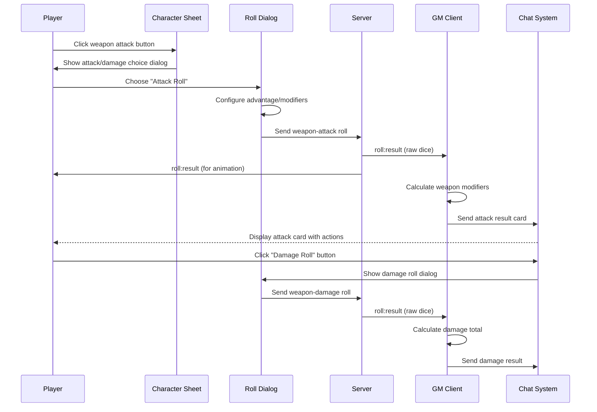

# Manual Weapon Attacks Implementation Plan

**Status:** Ready for Implementation  
**Author:** AI Assistant  
**Date:** 2025-01-20  
**Estimated Duration:** 5 days  
**Priority:** High

## Executive Summary

This plan implements manual weapon attacks in Dungeon Lab's D&D 5e plugin. Players will click weapons in their inventory to trigger a workflow that creates chat cards with attack/damage options, leveraging the existing GM-authoritative roll processing system. This provides immediate value while establishing patterns for future automation.

## Architecture Overview

### Current System Analysis

The existing roll system provides a solid foundation:
- **Roll Infrastructure**: Client → Server (dice only) → GM client (modifier calculation) → Chat
- **GM Authority**: GM client calculates final results and sends to chat
- **Plugin System**: D&D plugin handles game-specific roll calculations
- **Chat Cards**: Rich displays with action buttons for follow-up actions

### Weapon Attack Flow



### Integration Points

1. **Character Sheet Equipment**: Add weapon action buttons
2. **Roll Type Registry**: Register `weapon-attack` and `weapon-damage` types  
3. **Roll Handlers**: Create weapon-specific calculation logic
4. **Chat Cards**: Create weapon action cards with attack/damage buttons
5. **Roll Dialogs**: Extend existing advantage/disadvantage system

## Technical Implementation

### 1. Weapon Roll Types Registration

**File**: `packages/plugins/dnd-5e-2024/src/index.mts`

```typescript
// Add to plugin initialization
import { DndWeaponAttackHandler, DndWeaponDamageHandler } from './services/dnd-weapon-handlers.mjs';

// In plugin setup
rollHandlerService.registerHandler('weapon-attack', new DndWeaponAttackHandler(), pluginContext);
rollHandlerService.registerHandler('weapon-damage', new DndWeaponDamageHandler(), pluginContext);
```

### 2. Weapon Roll Handlers

**File**: `packages/plugins/dnd-5e-2024/src/services/dnd-weapon-handlers.mts` (NEW)

```typescript
import type { RollTypeHandler, RollHandlerContext } from '@dungeon-lab/shared-ui/types/plugin.mjs';
import type { RollServerResult } from '@dungeon-lab/shared/schemas/roll.schema.mjs';
import type { Character } from '../types/character.mjs';
import type { Item } from '../types/item.mjs';

/**
 * Handler for weapon attack rolls
 * Calculates attack bonus and determines hit/miss messaging
 */
export class DndWeaponAttackHandler implements RollTypeHandler {
  async handleRoll(result: RollServerResult, context: RollHandlerContext): Promise<void> {
    if (!context.isGM) {
      // Player client: just provide UI feedback
      console.log('[DndWeaponAttackHandler] Player client - UI feedback only');
      return;
    }

    // GM client: calculate final attack result
    const weapon = result.metadata.weapon as Item;
    const character = result.metadata.character as Character;
    const total = this.calculateAttackTotal(result, weapon, character);
    
    // Create attack result message with action buttons
    const attackMessage = this.createAttackResultMessage(result, weapon, total);
    
    if (context.sendChatMessage) {
      context.sendChatMessage(attackMessage, {
        type: 'roll',
        rollData: {
          ...result,
          total,
          actions: [
            {
              id: 'damage-roll',
              type: 'weapon-damage',
              label: 'Roll Damage',
              data: {
                weapon: weapon,
                character: character,
                attackTotal: total,
                critical: this.isCriticalHit(result)
              }
            }
          ]
        },
        recipient: result.recipients
      });
    }
  }

  private calculateAttackTotal(result: RollServerResult, weapon: Item, character: Character): number {
    let total = 0;
    
    // Handle advantage/disadvantage d20 rolls
    for (const diceGroup of result.results) {
      if (diceGroup.sides === 20 && diceGroup.results.length === 2) {
        const advantageMode = result.arguments.pluginArgs?.advantageMode;
        if (advantageMode === 'advantage') {
          total += Math.max(...diceGroup.results);
        } else if (advantageMode === 'disadvantage') {
          total += Math.min(...diceGroup.results);
        } else {
          total += diceGroup.results[0];
        }
      } else {
        total += diceGroup.results.reduce((sum, res) => sum + res, 0);
      }
    }

    // Add weapon attack bonus (ability + proficiency + enhancement)
    const attackBonus = this.calculateWeaponAttackBonus(weapon, character);
    total += attackBonus;

    // Add custom modifier from roll dialog
    total += result.arguments.customModifier;

    return total;
  }

  private calculateWeaponAttackBonus(weapon: Item, character: Character): number {
    let bonus = 0;
    
    // Get weapon ability (Str for melee, Dex for ranged, or Dex for finesse)
    const ability = this.getWeaponAttackAbility(weapon);
    const abilityMod = this.getAbilityModifier(character, ability);
    bonus += abilityMod;
    
    // Add proficiency if proficient
    if (this.isProficientWithWeapon(weapon, character)) {
      bonus += this.getProficiencyBonus(character);
    }
    
    // Add magical enhancement
    const enhancement = weapon.pluginData?.enhancement || 0;
    bonus += enhancement;
    
    return bonus;
  }

  private isCriticalHit(result: RollServerResult): boolean {
    return result.results.some(group => 
      group.sides === 20 && group.results.includes(20)
    );
  }

  private createAttackResultMessage(result: RollServerResult, weapon: Item, total: number): string {
    const characterName = result.metadata.characterName;
    const weaponName = weapon.name;
    const isCrit = this.isCriticalHit(result);
    
    let message = `${characterName} attacks with ${weaponName}: **${total}**`;
    
    if (isCrit) {
      message += ' 🎯 **CRITICAL HIT!**';
    }
    
    return message;
  }

  // Helper methods for D&D calculations
  private getWeaponAttackAbility(weapon: Item): string {
    const properties = weapon.pluginData?.properties || [];
    const weaponType = weapon.pluginData?.weaponType;
    
    // Finesse weapons can use Dex or Str
    if (properties.includes('finesse')) {
      return 'dexterity'; // Default to Dex for finesse
    }
    
    // Ranged weapons use Dex
    if (weaponType === 'ranged') {
      return 'dexterity';
    }
    
    // Melee weapons use Str
    return 'strength';
  }

  private getAbilityModifier(character: Character, ability: string): number {
    const abilityScore = character.pluginData?.abilities?.[ability]?.value || 10;
    return Math.floor((abilityScore - 10) / 2);
  }

  private isProficientWithWeapon(weapon: Item, character: Character): boolean {
    const weaponProficiencies = character.pluginData?.proficiencies?.weapons || [];
    const weaponType = weapon.pluginData?.category || weapon.pluginData?.weaponType;
    
    return weaponProficiencies.includes(weapon.name) || 
           weaponProficiencies.includes(weaponType);
  }

  private getProficiencyBonus(character: Character): number {
    const level = character.pluginData?.progression?.level || character.pluginData?.level || 1;
    return Math.ceil(level / 4) + 1; // D&D 5e proficiency progression
  }
}

/**
 * Handler for weapon damage rolls
 * Calculates damage total with ability modifier and enhancement
 */
export class DndWeaponDamageHandler implements RollTypeHandler {
  async handleRoll(result: RollServerResult, context: RollHandlerContext): Promise<void> {
    if (!context.isGM) {
      console.log('[DndWeaponDamageHandler] Player client - UI feedback only');
      return;
    }

    const weapon = result.metadata.weapon as Item;
    const character = result.metadata.character as Character;
    const isCritical = result.metadata.critical as boolean;
    
    const total = this.calculateDamageTotal(result, weapon, character);
    const damageType = this.getWeaponDamageType(weapon);
    
    const damageMessage = this.createDamageResultMessage(result, weapon, total, damageType, isCritical);
    
    if (context.sendChatMessage) {
      context.sendChatMessage(damageMessage, {
        type: 'roll',
        rollData: {
          ...result,
          total,
          damageType
        },
        recipient: result.recipients
      });
    }
  }

  private calculateDamageTotal(result: RollServerResult, weapon: Item, character: Character): number {
    let total = 0;
    
    // Sum all dice results (dice are already doubled for critical hits)
    for (const diceGroup of result.results) {
      total += diceGroup.results.reduce((sum, res) => sum + res, 0);
    }
    
    // Add ability modifier (only once, even for critical hits)
    const ability = this.getWeaponDamageAbility(weapon);
    const abilityMod = this.getAbilityModifier(character, ability);
    total += abilityMod;
    
    // Add magical enhancement
    const enhancement = weapon.pluginData?.enhancement || 0;
    total += enhancement;
    
    // Add custom modifier
    total += result.arguments.customModifier;
    
    return total;
  }

  private getWeaponDamageType(weapon: Item): string {
    return weapon.pluginData?.damageType || 'bludgeoning';
  }

  private createDamageResultMessage(
    result: RollServerResult, 
    weapon: Item, 
    total: number, 
    damageType: string,
    isCritical: boolean
  ): string {
    const characterName = result.metadata.characterName;
    const weaponName = weapon.name;
    
    let message = `${weaponName} damage: **${total}** ${damageType}`;
    
    if (isCritical) {
      message += ' ⚡ *Critical damage*';
    }
    
    return message;
  }

  private getWeaponDamageAbility(weapon: Item): string {
    // Same logic as attack ability for damage
    const properties = weapon.pluginData?.properties || [];
    const weaponType = weapon.pluginData?.weaponType;
    
    if (properties.includes('finesse')) {
      return 'dexterity';
    }
    
    if (weaponType === 'ranged') {
      return 'dexterity';
    }
    
    return 'strength';
  }

  private getAbilityModifier(character: Character, ability: string): number {
    const abilityScore = character.pluginData?.abilities?.[ability]?.value || 10;
    return Math.floor((abilityScore - 10) / 2);
  }
}
```

### 3. Character Sheet Integration

**File**: `packages/plugins/dnd-5e-2024/src/components/exports/character-sheet.vue`

**Add weapon action buttons to equipment items:**

```vue
<!-- Modify the equipment-item template around line 247 -->
<div class="equipment-item">
  <div class="item-main">
    <!-- Existing item display code -->
  </div>
  
  <!-- Add weapon actions -->
  <div v-if="isWeapon(item)" class="weapon-actions">
    <button 
      @click="initiateWeaponAttack(item)"
      class="weapon-action-btn attack-btn"
      title="Attack with this weapon"
    >
      ⚔️ Attack
    </button>
  </div>
  
  <div class="item-properties">
    <!-- Existing property display code -->
  </div>
</div>
```

**Add script methods:**

```typescript
// Add to script section

/**
 * Check if an item is a weapon
 */
function isWeapon(item: any): boolean {
  return item.pluginData?.itemType === 'weapon' || 
         item.pluginData?.category === 'weapon';
}

/**
 * Initiate weapon attack workflow
 */
function initiateWeaponAttack(weapon: any): void {
  // Show attack/damage choice dialog
  showWeaponActionDialog.value = true;
  currentWeapon.value = weapon;
}

// Add reactive refs
const showWeaponActionDialog = ref(false);
const currentWeapon = ref<any>(null);

/**
 * Handle weapon action choice (attack or damage)
 */
function handleWeaponAction(action: 'attack' | 'damage'): void {
  if (!currentWeapon.value) return;
  
  const rollType = action === 'attack' ? 'weapon-attack' : 'weapon-damage';
  const rollData = {
    weapon: currentWeapon.value,
    character: character.value,
    type: rollType
  };
  
  // Use existing roll emission system
  emit('roll', rollType, rollData);
  
  showWeaponActionDialog.value = false;
  currentWeapon.value = null;
}
```

### 4. Weapon Action Choice Dialog

**File**: `packages/plugins/dnd-5e-2024/src/components/internal/dialogs/WeaponActionDialog.vue` (NEW)

```vue
<template>
  <div v-if="modelValue" class="weapon-action-overlay">
    <div class="weapon-action-dialog">
      <div class="dialog-header">
        <h3>{{ weapon?.name }} Actions</h3>
        <button @click="$emit('update:modelValue', false)" class="close-btn">✕</button>
      </div>
      
      <div class="weapon-info">
        <div class="weapon-stats">
          <div class="stat">
            <span class="label">Damage:</span>
            <span class="value">{{ getWeaponDamage(weapon) }}</span>
          </div>
          <div class="stat">
            <span class="label">Properties:</span>
            <span class="value">{{ getWeaponProperties(weapon) }}</span>
          </div>
        </div>
      </div>
      
      <div class="action-buttons">
        <button 
          @click="$emit('action', 'attack')"
          class="action-btn attack-btn"
        >
          ⚔️ Attack Roll
          <div class="btn-subtitle">Roll to hit target</div>
        </button>
        
        <button 
          @click="$emit('action', 'damage')"
          class="action-btn damage-btn"
        >
          💥 Damage Roll  
          <div class="btn-subtitle">Roll weapon damage</div>
        </button>
      </div>
    </div>
  </div>
</template>

<script setup lang="ts">
interface Props {
  modelValue: boolean;
  weapon: any;
}

defineProps<Props>();
defineEmits<{
  'update:modelValue': [value: boolean];
  'action': [action: 'attack' | 'damage'];
}>();

function getWeaponDamage(weapon: any): string {
  return weapon?.pluginData?.damage || '1d4';
}

function getWeaponProperties(weapon: any): string {
  const properties = weapon?.pluginData?.properties || [];
  return properties.join(', ') || 'None';
}
</script>

<style scoped>
.weapon-action-overlay {
  position: fixed;
  top: 0;
  left: 0;
  right: 0;
  bottom: 0;
  background: rgba(0, 0, 0, 0.5);
  display: flex;
  align-items: center;
  justify-content: center;
  z-index: 1000;
}

.weapon-action-dialog {
  background: white;
  border-radius: 8px;
  padding: 24px;
  min-width: 300px;
  max-width: 400px;
  box-shadow: 0 8px 32px rgba(0, 0, 0, 0.2);
}

.dialog-header {
  display: flex;
  justify-content: space-between;
  align-items: center;
  margin-bottom: 16px;
}

.weapon-info {
  margin-bottom: 20px;
  padding: 12px;
  background: #f5f5f5;
  border-radius: 6px;
}

.weapon-stats {
  display: flex;
  flex-direction: column;
  gap: 8px;
}

.stat {
  display: flex;
  justify-content: space-between;
}

.action-buttons {
  display: flex;
  flex-direction: column;
  gap: 12px;
}

.action-btn {
  padding: 16px;
  border: none;
  border-radius: 6px;
  font-size: 16px;
  font-weight: bold;
  cursor: pointer;
  transition: all 0.2s;
  text-align: left;
}

.attack-btn {
  background: linear-gradient(135deg, #dc2626, #b91c1c);
  color: white;
}

.damage-btn {
  background: linear-gradient(135deg, #d97706, #b45309);
  color: white;
}

.action-btn:hover {
  transform: translateY(-2px);
  box-shadow: 0 4px 12px rgba(0, 0, 0, 0.2);
}

.btn-subtitle {
  font-size: 12px;
  font-weight: normal;
  opacity: 0.9;
  margin-top: 4px;
}
</style>
```

### 5. Roll Dialog Extensions

**File**: `packages/plugins/dnd-5e-2024/src/components/internal/dialogs/AdvantageRollDialog.vue`

**Extend for weapon-specific arguments:**

```vue
<!-- Add weapon-specific modifiers section -->
<div v-if="isWeaponRoll" class="weapon-modifiers">
  <h4>Weapon Modifiers</h4>
  
  <div class="modifier-display">
    <div class="modifier-item">
      <span class="modifier-label">Attack Bonus:</span>
      <span class="modifier-value">{{ weaponAttackBonus }}</span>
    </div>
    
    <div v-if="weaponEnhancement" class="modifier-item">
      <span class="modifier-label">Magic Weapon:</span>
      <span class="modifier-value">+{{ weaponEnhancement }}</span>
    </div>
  </div>
  
  <!-- Critical hit option for damage rolls -->
  <div v-if="rollType === 'weapon-damage'" class="critical-option">
    <label>
      <input type="checkbox" v-model="isCriticalDamage" />
      Critical Hit (double damage dice)
    </label>
  </div>
</div>
```

```typescript
// Add computed properties
const isWeaponRoll = computed(() => {
  return rollType.value === 'weapon-attack' || rollType.value === 'weapon-damage';
});

const weaponAttackBonus = computed(() => {
  if (!rollData.value.weapon) return 0;
  // Calculate attack bonus display
  return calculateWeaponAttackBonus(rollData.value.weapon, rollData.value.character);
});

const weaponEnhancement = computed(() => {
  return rollData.value.weapon?.pluginData?.enhancement || 0;
});

const isCriticalDamage = ref(false);
```

### 6. Weapon Chat Card Actions

**File**: `packages/plugins/dnd-5e-2024/src/components/internal/common/WeaponAttackCard.vue` (NEW)

```vue
<template>
  <div class="weapon-attack-card">
    <div class="attack-header">
      <div class="weapon-info">
        <h4>{{ rollData.metadata.weapon?.name }} Attack</h4>
        <div class="character-name">{{ rollData.metadata.characterName }}</div>
      </div>
      <div class="attack-result">
        <span class="attack-total">{{ rollData.total }}</span>
        <div v-if="isCriticalHit" class="critical-indicator">🎯 CRITICAL!</div>
      </div>
    </div>
    
    <div class="roll-details">
      <!-- D20 roll display -->
      <div class="dice-results">
        <div v-for="diceGroup in rollData.results" :key="diceGroup.sides">
          <span class="dice-formula">{{ diceGroup.quantity }}d{{ diceGroup.sides }}:</span>
          <div class="dice-values">
            <span 
              v-for="(result, index) in diceGroup.results" 
              :key="index"
              :class="getDieClass(result, diceGroup.sides)"
              class="die-result"
            >
              {{ result }}
            </span>
          </div>
        </div>
      </div>
      
      <!-- Modifiers breakdown -->
      <div class="modifiers-breakdown">
        <div v-for="modifier in rollData.modifiers" :key="modifier.source" class="modifier">
          {{ modifier.source }}: {{ formatModifier(modifier.value) }}
        </div>
      </div>
    </div>
    
    <!-- Action buttons -->
    <div class="action-buttons">
      <button 
        @click="rollDamage"
        class="damage-btn"
        :class="{ 'critical': isCriticalHit }"
      >
        💥 Roll Damage
        <span v-if="isCriticalHit" class="critical-text">(Critical!)</span>
      </button>
    </div>
  </div>
</template>

<script setup lang="ts">
import { computed } from 'vue';
import type { RollServerResult } from '@dungeon-lab/shared/schemas/roll.schema.mjs';

interface Props {
  rollData: RollServerResult & { total: number };
}

const props = defineProps<Props>();
const emit = defineEmits<{
  'roll-damage': [weapon: any, character: any, critical: boolean];
}>();

const isCriticalHit = computed(() => {
  return props.rollData.results.some(group => 
    group.sides === 20 && group.results.includes(20)
  );
});

function rollDamage() {
  emit('roll-damage', 
    props.rollData.metadata.weapon,
    props.rollData.metadata.character,
    isCriticalHit.value
  );
}

function getDieClass(result: number, sides: number): string {
  if (sides === 20) {
    if (result === 20) return 'critical-success';
    if (result === 1) return 'critical-failure';
    if (result >= 18) return 'high-roll';
  }
  return 'normal-roll';
}

function formatModifier(value: number): string {
  return value >= 0 ? `+${value}` : `${value}`;
}
</script>

<style scoped>
.weapon-attack-card {
  background: linear-gradient(135deg, #fef3c7, #fde68a);
  border: 2px solid #d97706;
  border-radius: 8px;
  padding: 16px;
  margin: 8px 0;
}

.attack-header {
  display: flex;
  justify-content: space-between;
  align-items: center;
  margin-bottom: 12px;
}

.attack-result {
  text-align: right;
}

.attack-total {
  font-size: 24px;
  font-weight: bold;
  color: #92400e;
}

.critical-indicator {
  color: #dc2626;
  font-weight: bold;
  font-size: 14px;
}

.dice-results {
  display: flex;
  flex-wrap: wrap;
  gap: 8px;
  margin-bottom: 8px;
}

.die-result {
  display: inline-flex;
  align-items: center;
  justify-content: center;
  width: 32px;
  height: 32px;
  border-radius: 4px;
  font-weight: bold;
  border: 2px solid;
}

.critical-success {
  background: #10b981;
  color: white;
  border-color: #059669;
}

.critical-failure {
  background: #ef4444;
  color: white;
  border-color: #dc2626;
}

.high-roll {
  background: #3b82f6;
  color: white;
  border-color: #2563eb;
}

.normal-roll {
  background: #f3f4f6;
  color: #374151;
  border-color: #d1d5db;
}

.damage-btn {
  background: linear-gradient(135deg, #dc2626, #b91c1c);
  color: white;
  border: none;
  padding: 12px 20px;
  border-radius: 6px;
  font-weight: bold;
  cursor: pointer;
  transition: all 0.2s;
}

.damage-btn.critical {
  background: linear-gradient(135deg, #facc15, #eab308);
  color: #92400e;
  box-shadow: 0 0 12px rgba(250, 204, 21, 0.5);
}

.critical-text {
  font-size: 12px;
  font-weight: normal;
}
</style>
```

## Implementation Timeline

### Day 1: Roll Type Infrastructure
- **Morning**: Create `DndWeaponAttackHandler` and `DndWeaponDamageHandler` classes
- **Afternoon**: Register weapon roll types in plugin initialization
- **Testing**: Verify handlers receive roll results properly

### Day 2: Weapon Calculations
- **Morning**: Implement attack bonus calculation (ability + prof + enhancement)
- **Afternoon**: Implement damage calculation with critical hit handling
- **Testing**: Unit tests for calculation accuracy

### Day 3: Character Sheet Integration  
- **Morning**: Add weapon action buttons to equipment items
- **Afternoon**: Create `WeaponActionDialog` component
- **Testing**: Verify weapon clicks trigger roll workflow

### Day 4: Chat Cards and Actions
- **Morning**: Create `WeaponAttackCard` component with action buttons
- **Afternoon**: Implement damage roll follow-up from attack cards
- **Testing**: End-to-end weapon attack → damage workflow

### Day 5: Polish and Edge Cases
- **Morning**: Handle critical hits, weapon properties, finesse weapons
- **Afternoon**: Error handling, edge cases, UI polish
- **Testing**: Comprehensive manual testing with various weapons and scenarios

## Data Requirements

### Weapon Data Structure
Weapons must have the following structure in `pluginData`:

```typescript
interface WeaponData {
  itemType: 'weapon';
  weaponType: 'melee' | 'ranged';
  damage: string; // e.g., "1d8", "2d6"
  damageType: string; // e.g., "slashing", "piercing"
  properties: string[]; // e.g., ["finesse", "light", "thrown"]
  category: string; // e.g., "simple", "martial"
  enhancement?: number; // magical +1, +2, etc.
}
```

### Character Data Requirements
Characters need weapon proficiencies and abilities:

```typescript
interface CharacterData {
  abilities: {
    strength: { value: number };
    dexterity: { value: number };
    // ... other abilities
  };
  proficiencies: {
    weapons: string[]; // weapon names or categories
  };
  progression: {
    level: number;
  };
}
```

## Testing Strategy

### Unit Tests
- **Weapon attack bonus calculation**
  - Strength-based melee weapons
  - Dexterity-based ranged weapons  
  - Finesse weapon ability selection
  - Proficiency bonus application
  - Magical enhancement bonuses

- **Damage calculation**
  - Normal damage totals
  - Critical hit damage doubling
  - Ability modifier application
  - Enhancement bonus application

### Integration Tests
- **Roll flow**: Weapon click → roll dialog → server → GM calculation → chat
- **Action buttons**: Attack card → damage roll → result display
- **Critical hits**: Nat 20 detection → critical damage calculation

### Manual Testing Scenarios
1. **Basic weapon attack**: Longsword attack with Strength-based fighter
2. **Finesse weapon**: Rapier attack with Dexterity-based rogue
3. **Ranged weapon**: Longbow attack with archer
4. **Critical hit**: Natural 20 → critical damage roll
5. **Magic weapon**: +1 weapon bonuses applied correctly
6. **Non-proficient weapon**: Attack without proficiency bonus

## Edge Cases and Considerations

### Weapon Properties
- **Finesse**: Allow choice between Str and Dex (default to higher)
- **Versatile**: Handle one-handed vs. two-handed damage
- **Thrown**: Ranged attacks with melee weapons
- **Light**: Dual-wielding considerations (future)

### Character Variations
- **Multi-class**: Multiple proficiency sources
- **Fighting Styles**: Archery, Great Weapon Fighting (future)
- **Class Features**: Rage damage, Sneak Attack (future)

### Error Handling
- **Missing weapon data**: Graceful fallback to basic attack
- **Invalid character state**: Default ability modifiers
- **Network issues**: Roll result timeout handling

## Future Automation Preparation

This manual implementation establishes patterns for future automation:

### Data Collection
- **Target selection**: Prepare for AC comparison
- **Range validation**: Track weapon range vs. target distance
- **Damage application**: Structure for automatic HP reduction

### State Management
- **Combat tracking**: Initiative order, turn management
- **Condition effects**: Advantage/disadvantage from conditions
- **Spell effects**: Temporary bonuses and penalties

### Integration Points
- **Monster/NPC data**: AC values for hit determination
- **Map system**: Range and positioning validation
- **Combat encounters**: Turn-based action resolution

## Risk Mitigation

### Technical Risks
- **Complex calculations**: Extensive unit testing of D&D math
- **Roll system changes**: Use existing patterns, minimal core changes
- **Performance**: Weapon calculations are lightweight

### User Experience Risks
- **Learning curve**: Match familiar tabletop/VTT patterns
- **Mobile usability**: Touch-friendly action buttons
- **Visual clarity**: Clear indication of hit/miss results

### Integration Risks
- **Plugin conflicts**: Use established plugin interfaces
- **Data consistency**: Validate weapon/character data structures
- **Backward compatibility**: Graceful handling of missing data

This implementation provides immediate value while establishing patterns that will enable smooth progression to automated combat in future releases.