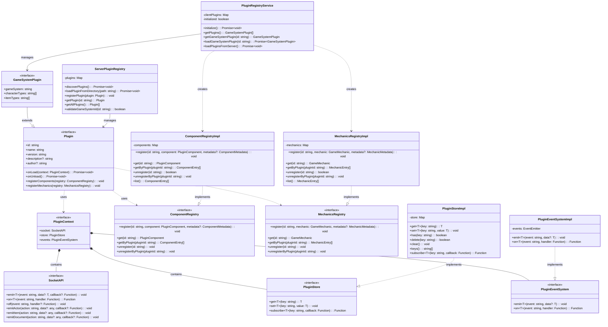
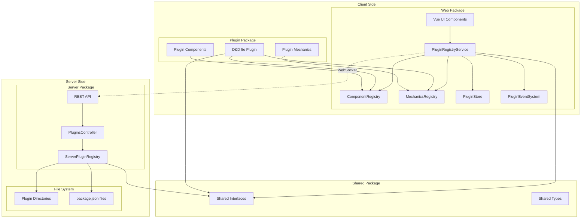
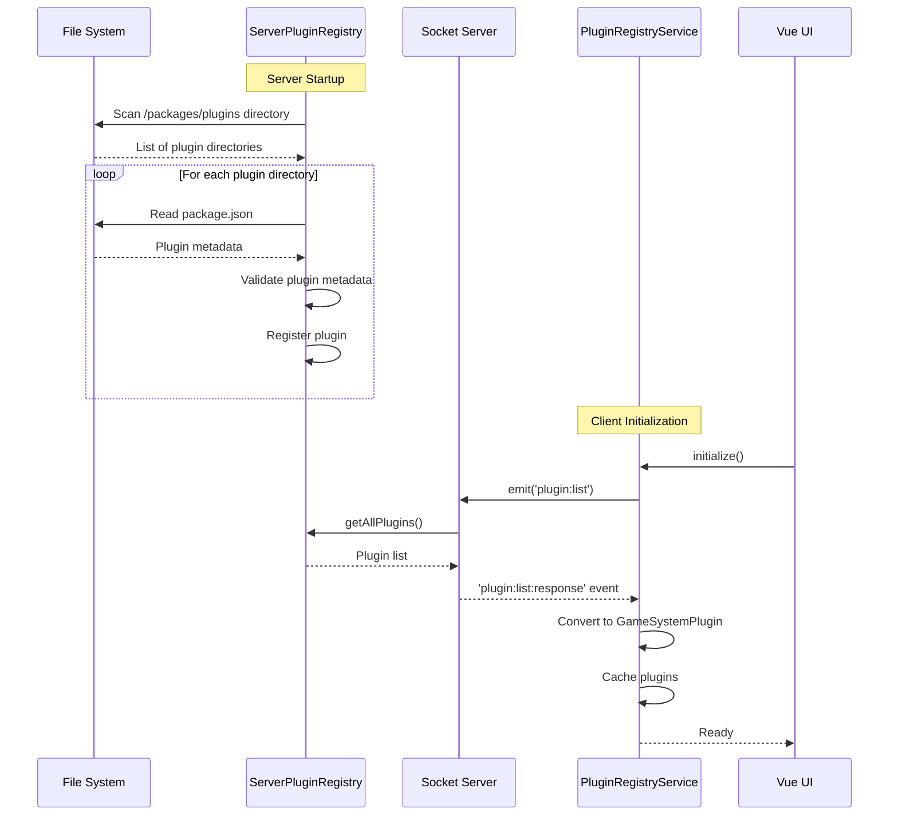
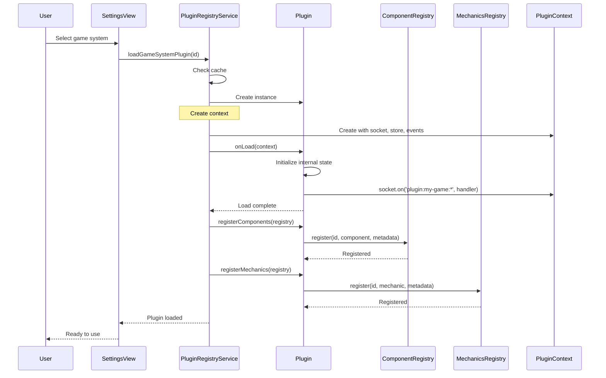
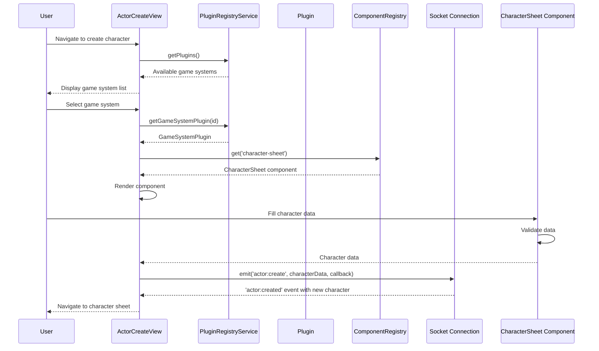
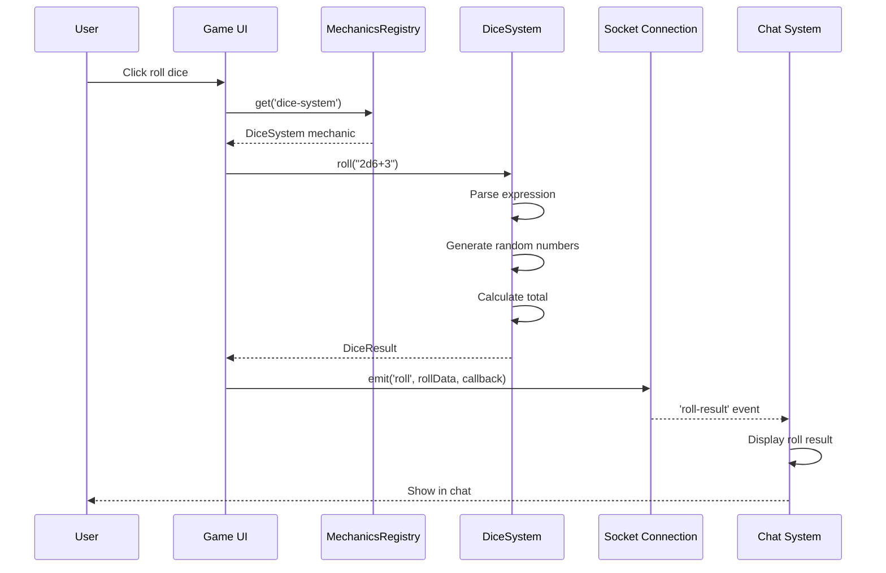
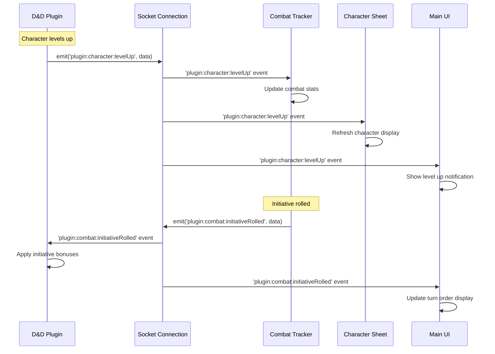

# Dungeon Lab Plugin Architecture

## Overview

The Dungeon Lab plugin architecture provides a flexible and extensible system for implementing different Table Top Role Playing Game (TTRPG) systems. The architecture separates core VTT functionality from game-specific rules and components, allowing multiple game systems to coexist within the same platform.

## Architecture Overview

The plugin system consists of several key components:

1. **Plugin Interfaces** - Core contracts that all plugins must implement
2. **Registry Services** - Manage plugin discovery, loading, and component registration
3. **Context Providers** - Supply plugins with access to APIs and services
4. **Component System** - Vue 3 component registration and management
5. **Mechanics System** - Game rule implementations (dice, combat, etc.)
6. **Event System** - Inter-plugin and plugin-to-app communication

## Main Classes and Components

### Core Interfaces (Shared Package)

- **Plugin**: Base interface for all plugins
  - Properties: id, name, version, description, author
  - Methods: onLoad(), onUnload(), registerComponents(), registerMechanics()

- **GameSystemPlugin**: Extends Plugin for game-specific implementations
  - Additional properties: gameSystem, characterTypes, itemTypes

- **PluginContext**: Provides plugins with application access
  - socket: Socket.io event system for all communication
  - store: Key-value storage for plugin state
  - events: Plugin-specific event emission and subscription

- **ComponentRegistry**: Manages Vue 3 components
  - register(), get(), getByPlugin(), unregister()

- **MechanicsRegistry**: Manages game mechanics
  - register(), get(), getByPlugin(), unregister()

### Client-Side Classes

- **PluginRegistryService**: Main client-side registry
  - Fetches plugins from server
  - Manages plugin lifecycle
  - Provides plugin access to app

- **ComponentRegistryImpl**: Concrete component registry
- **MechanicsRegistryImpl**: Concrete mechanics registry
- **PluginStoreImpl**: Plugin state management
- **PluginEventSystemImpl**: Event bus implementation

### Server-Side Classes

- **ServerPluginRegistry**: Auto-discovers plugins
  - Scans filesystem for plugins
  - Validates plugin metadata
  - Provides plugin list via API

## Class Diagram



## Component Diagram



## Sequence Diagrams

### Plugin Discovery and Registration



### Plugin Loading and Initialization



### Character Creation Flow



### Dice Rolling Through Mechanics



### Plugin Event Communication



## Implementation Examples

### Creating a Plugin

```typescript
// packages/plugins/my-game/src/index.mts
import type { GameSystemPlugin, PluginContext } from '@dungeon-lab/shared/types/plugin.mjs';

export default {
  id: 'my-game-system',
  name: 'My Game System',
  version: '1.0.0',
  gameSystem: 'my-game',
  characterTypes: ['pc', 'npc'],
  itemTypes: ['weapon', 'armor', 'item'],
  
  async onLoad(context: PluginContext) {
    // Initialize plugin
    context.store.set('initialized', true);
    
    // Listen for plugin-specific socket events
    context.socket.on('plugin:my-game:character:update', (data) => {
      console.log('Character updated:', data);
    });
    
    // Listen for general game events
    context.events.on('game:started', () => {
      console.log('Game started!');
    });
  },
  
  async onUnload() {
    // Cleanup
  },
  
  registerComponents(registry) {
    registry.register('my-character-sheet', MyCharacterSheet, {
      pluginId: this.id,
      name: 'My Character Sheet',
      category: 'character-sheet'
    });
  },
  
  registerMechanics(registry) {
    registry.register('my-dice-system', new MyDiceSystem(), {
      pluginId: this.id,
      name: 'My Dice System',
      category: 'dice'
    });
  }
} as GameSystemPlugin;
```

### Plugin Package Structure

```
packages/plugins/my-game/
├── package.json          # Plugin metadata
├── src/
│   ├── index.mts        # Plugin entry point
│   ├── web/             # Client-side code
│   │   ├── components/  # Vue components
│   │   └── mechanics/   # Client mechanics
│   ├── server/          # Server-side code
│   └── shared/          # Shared types/utils
└── dist/                # Built output
```

### Package.json Metadata

```json
{
  "name": "@dungeon-lab/plugin-my-game",
  "version": "1.0.0",
  "dungeonLab": {
    "pluginId": "my-game-system",
    "displayName": "My Game System",
    "gameSystem": "my-game"
  }
}
```

## Plugin Context Usage

The PluginContext provides plugins with controlled access to the application:

1. **Socket Communication**: Real-time bidirectional communication via Socket.io events
2. **State Management**: Plugin-specific reactive store
3. **Event System**: Communication with other plugins and the main app

### Socket API Usage Examples

```typescript
// Create an actor
context.socket.emitActor('create', characterData, (response) => {
  if (response.success) {
    console.log('Character created:', response.data);
  }
});

// Listen for actor updates
context.socket.on('actor:updated', (actor) => {
  if (actor.gameSystem === 'my-game') {
    // Update plugin state for this game system
    context.store.set(`character:${actor.id}`, actor);
  }
});

// Update an item
context.socket.emitItem('update', { id: itemId, ...itemData });

// Listen for document changes
context.socket.on('document:changed', (document) => {
  // React to document changes
});

// Plugin-specific events
context.socket.emit('plugin:my-game:custom-action', data);
context.socket.on('plugin:my-game:response', (response) => {
  // Handle plugin-specific response
});
```

A proper implementation includes:

1. Create a PluginContextProvider service with socket integration
2. Provide isolated socket event namespaces per plugin
3. Implement plugin-specific stores with reactive updates
4. Handle event routing and permission management

## Future Enhancements

1. **Hot Module Replacement**: Development-time plugin reloading via socket events
2. **Plugin Dependencies**: Allow plugins to depend on others with event-based dependency injection
3. **Permission System**: Control what socket events plugins can emit/listen to
4. **Plugin Marketplace**: Central repository for community plugins with socket-based distribution
5. **Version Management**: Handle plugin version compatibility through event schema versioning
6. **Event Sandboxing**: Isolate plugin socket events for security and performance
7. **Event Middleware**: Plugin-specific event processing and validation
8. **Real-time Plugin Collaboration**: Multi-user plugin interactions via shared socket rooms