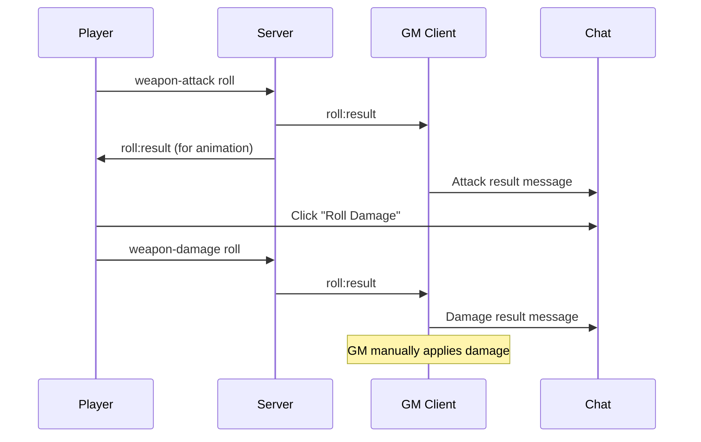
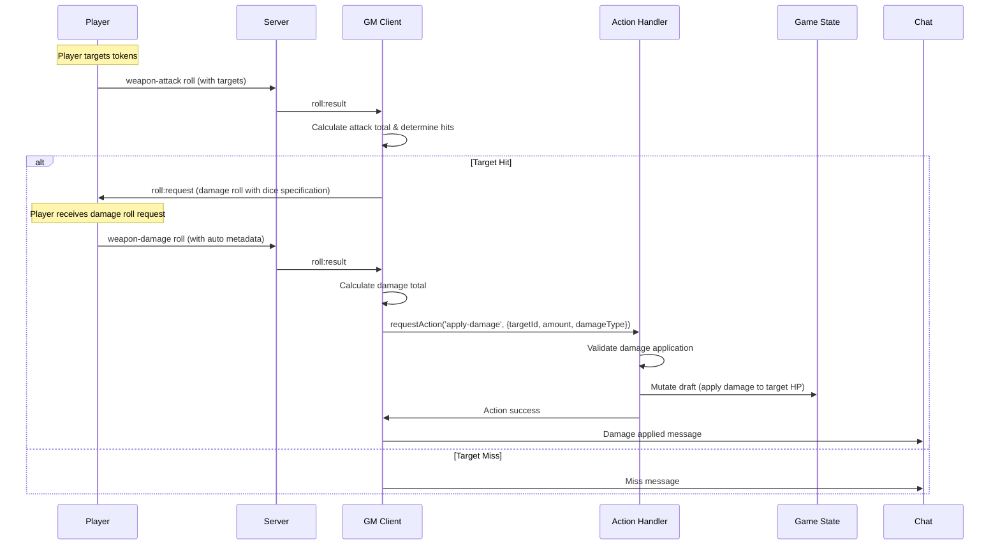

# Automatic Attack System Architecture

**Status:** Proposal  
**Author:** AI Assistant  
**Date:** 2025-01-21  
**Priority:** High  
**Related Issues:** Campaign Settings Implementation

## Executive Summary

This proposal outlines an automatic attack system for Dungeon Lab that enhances the existing manual weapon attack workflow with optional automation. When enabled via a local checkbox in character sheets, the system will:

- Automatically determine hit/miss based on attack rolls vs target AC  
- Request damage rolls from players via socket events for successful hits
- Apply damage directly to targeted tokens using action handlers
- Maintain player agency while reducing GM workload

The system uses a **hybrid architecture** combining socket events for player communication and action handlers for game state mutations. The system is designed to be **backwards compatible** - all existing manual workflows remain unchanged when automatic attacks are disabled.

## Current System Analysis

### Manual Attack Workflow (Existing)



### Key Components

1. **Roll System**: Server handles all dice rolling, clients receive results
2. **Weapon Handlers**: `DndWeaponAttackHandler` and `DndWeaponDamageHandler` process results
3. **Socket Events**: GM requests damage rolls from players via `roll:request` events
4. **Action Handlers**: State changes applied through `apply-damage` action handler
5. **Chat Integration**: Results displayed as rich chat cards with action buttons
6. **GM Authority**: GM client calculates modifiers and coordinates the workflow

## Proposed Architecture

### Hybrid Communication Model

The automatic attack system uses a **hybrid approach** that separates player interaction from game state management:

- **Socket Events (`roll:request`)**: Used for GM-to-player communication requesting dice rolls
- **Action Handlers (`apply-damage`)**: Used for game state mutations with validation and atomic updates

This separation maintains clear architectural boundaries:
- Roll handlers cannot directly modify game state
- Action handlers provide validation and rollback capabilities  
- Socket events enable real-time player interaction
- Game state changes remain atomic and consistent

### Automatic Attack Workflow (New)



### System Architecture

```mermaid
graph TB
    CS[Character Sheet] --> TT[Token Targeting]
    TT --> AR[Attack Roll]
    AR --> WRH[Weapon Roll Handler]
    
    WRH --> CS_Check{Local Checkbox}
    CS_Check -->|Auto Enabled| Auto[Auto Mode]
    CS_Check -->|Auto Disabled| Manual[Manual Mode]
    
    Auto --> AC[AC Comparison]
    AC --> Hit{Hit?}
    Hit -->|Yes| RR[roll:request to Player]
    Hit -->|No| Miss[Miss Message]
    
    RR --> DR[Player Damage Roll]
    DR --> RA[requestAction('apply-damage')]
    RA --> GAH[GM Action Handler]
    GAH --> ADH[Apply-Damage Handler]
    ADH --> Validate[Validate Request]
    Validate --> Draft[Mutate Draft State]
    Draft --> Patches[Generate Patches]
    Patches --> GS[Game State Update]
    
    Manual --> Chat[Chat Result Only]
    GS --> Chat
    Miss --> Chat
```

## Implementation Details

### 1. RollHandlerContext Interface Enhancement

The key to this architecture is extending the `RollHandlerContext` to include game state access, action request capabilities, and socket communication for damage roll requests, following the pattern established in the GM Action Handler service.

**File**: `packages/shared-ui/src/types/plugin.mts`

```typescript
export interface RollHandlerContext {
  /** Whether this client has GM permissions and should send authoritative results */
  isGM: boolean;
  /** The user ID of the current client */
  userId: string;
  /** Read-only access to current game state (following GM Action Handler pattern) */
  gameState?: ServerGameStateWithVirtuals;
  /** Function to send chat messages (only available if isGM is true) */
  sendChatMessage?: (message: string, metadata?: {
    type?: 'text' | 'roll';
    rollData?: unknown;
    recipient?: 'public' | 'gm' | 'private';
  }) => void;
  /** Function to request game actions (available when plugin context is available) */
  requestAction?: (
    actionType: string,
    parameters: Record<string, unknown>,
    options?: { description?: string }
  ) => Promise<ActionRequestResult>;
  /** Function to send roll requests to specific players */
  requestRoll?: (
    playerId: string,
    rollRequest: RollRequest
  ) => void;
}
```

### 2. Roll Handler Service Context Creation

**File**: `packages/web/src/services/roll-handler.service.mts`

```typescript
// Enhanced context creation following GM Action Handler pattern for game state access
private async handleRollResult(result: RollServerResult): Promise<void> {
  try {
    // ... existing code ...
    
    // Get current game state from store (following GM Action Handler pattern)
    const gameStateStore = useGameStateStore();
    const currentGameState = gameStateStore.gameState;
    
    const context: RollHandlerContext = {
      isGM,
      userId: authStore.user?.id || '',
      // Provide read-only game state access for GM clients
      gameState: isGM ? currentGameState as ServerGameStateWithVirtuals : undefined,
      // Include sendChatMessage function for GM clients
      sendChatMessage: isGM && handlerRegistration ? 
        (message: string, metadata?: { type?: 'text' | 'roll'; rollData?: unknown; recipient?: 'public' | 'gm' | 'private'; }) => {
          handlerRegistration.pluginContext.sendChatMessage(message, metadata);
        } : undefined,
      // Include requestAction function when plugin context is available
      requestAction: handlerRegistration ? 
        (actionType: string, parameters: Record<string, unknown>, options?: { description?: string }) => {
          return handlerRegistration.pluginContext.requestAction(actionType, parameters, options);
        } : undefined,
      // Include requestRoll function for sending damage roll requests
      requestRoll: handlerRegistration ? 
        (playerId: string, rollRequest: RollRequest) => {
          handlerRegistration.pluginContext.sendRollRequest(playerId, rollRequest);
        } : undefined
    };
    
    // ... rest of method ...
  } catch (error) {
    console.error('[RollHandlerService] Error processing roll result:', error);
  }
}
```

### 3. Apply-Damage Action Handler

The core of the automatic damage system is a new action handler that follows the standard draft mutation pattern.

**File**: `packages/plugins/dnd-5e-2024/src/handlers/actions/apply-damage.handler.mts`

```typescript
export interface ApplyDamageParameters {
  /** ID of the target document (character/actor) or token */
  targetId: string;
  /** Type of target: 'document' or 'token' */
  targetType: 'document' | 'token';
  /** Amount of damage to apply (positive) or healing (negative) */
  amount: number;
  /** Type of damage for resistance/immunity checks */
  damageType?: string;
  /** Source of damage for logging */
  source?: string;
}

export function validateApplyDamage(
  request: GameActionRequest, 
  gameState: ServerGameStateWithVirtuals
): ActionValidationResult {
  const params = request.parameters as unknown as ApplyDamageParameters;
  
  // Find target document via game state
  const targetDocument = getTargetDocument(params.targetId, params.targetType, gameState);
  if (!targetDocument) {
    return {
      valid: false,
      error: { code: 'TARGET_NOT_FOUND', message: 'Target not found' }
    };
  }
  
  // Validate target is damageable (character or actor with HP)
  if (!['character', 'actor'].includes(targetDocument.documentType)) {
    return {
      valid: false,
      error: { code: 'INVALID_TARGET_TYPE', message: 'Cannot apply damage to this target type' }
    };
  }
  
  return { valid: true };
}

export function executeApplyDamage(
  request: GameActionRequest,
  draft: ServerGameStateWithVirtuals
): void {
  const params = request.parameters as unknown as ApplyDamageParameters;
  
  // Find target in draft state
  const targetDocument = getTargetDocument(params.targetId, params.targetType, draft);
  if (!targetDocument) {
    throw new Error(`Target not found during execution: ${params.targetId}`);
  }
  
  // Calculate effective damage (after resistances/immunities)
  const effectiveDamage = calculateEffectiveDamage(params.amount, params.damageType, targetDocument);
  
  // Initialize HP state if needed
  if (!targetDocument.state?.hitPoints) {
    const maxHP = targetDocument.pluginData?.hitPoints?.max || 10;
    targetDocument.state = {
      ...targetDocument.state,
      hitPoints: { current: maxHP, temporary: 0, max: maxHP }
    };
  }
  
  const hp = targetDocument.state.hitPoints;
  
  if (effectiveDamage > 0) {
    // Apply damage: temporary HP first, then current HP
    let remainingDamage = effectiveDamage;
    
    if (hp.temporary > 0) {
      const tempDamage = Math.min(hp.temporary, remainingDamage);
      hp.temporary -= tempDamage;
      remainingDamage -= tempDamage;
    }
    
    if (remainingDamage > 0) {
      hp.current = Math.max(0, hp.current - remainingDamage);
    }
    
    // Handle death/unconsciousness
    if (hp.current === 0) {
      if (!targetDocument.state.conditions) {
        targetDocument.state.conditions = [];
      }
      if (!targetDocument.state.conditions.includes('unconscious')) {
        targetDocument.state.conditions.push('unconscious');
      }
    }
  } else if (effectiveDamage < 0) {
    // Apply healing
    const healing = Math.abs(effectiveDamage);
    hp.current = Math.min(hp.max, hp.current + healing);
    
    // Remove unconscious condition if healed above 0
    if (hp.current > 0 && targetDocument.state.conditions) {
      const unconsciousIndex = targetDocument.state.conditions.indexOf('unconscious');
      if (unconsciousIndex !== -1) {
        targetDocument.state.conditions.splice(unconsciousIndex, 1);
      }
    }
  }
}

export const applyDamageHandler: Omit<ActionHandler, 'pluginId'> = {
  priority: 100,
  validate: validateApplyDamage,
  execute: executeApplyDamage,
  approvalMessage: (request) => {
    const params = request.parameters as unknown as ApplyDamageParameters;
    const action = params.amount > 0 ? 'damage' : 'healing';
    return `wants to apply ${Math.abs(params.amount)} ${action} to target`;
  }
};
```

### 4. Enhanced Weapon Attack Handler

**File**: `packages/plugins/dnd-5e-2024/src/services/dnd-weapon-handlers.mts`

```typescript
export class DndWeaponAttackHandler implements RollTypeHandler {
  async handleRoll(result: RollServerResult, context: RollHandlerContext): Promise<void> {
    if (!context.isGM) return;

    // Get fresh documents from game state using IDs from initial roll metadata
    const weaponId = result.metadata.weaponId as string;
    const characterId = result.metadata.characterId as string;
    
    const weaponDocument = context.gameState?.documents?.[weaponId];
    const characterDocument = context.gameState?.documents?.[characterId];
    
    if (!weaponDocument || !characterDocument) {
      console.warn('[WeaponAttackHandler] Could not find weapon or character document', { weaponId, characterId });
      return;
    }
    
    const total = this.calculateAttackTotal(result, weaponDocument, characterDocument);
    const isCriticalHit = this.isCriticalHit(result);
    
    // Check for automatic attack mode
    const autoMode = result.metadata.autoMode as boolean;
    const targetTokenIds = result.metadata.targetTokenIds as string[] || [];
    
    let attackMessage = this.createAttackResultMessage(result, weaponDocument, total);
    
    // Handle automatic attack mode with targets
    if (autoMode && targetTokenIds.length > 0) {
      // Process each target (for now, handle first target - multi-target support later)
      const targetId = targetTokenIds[0];
      const targetAC = await this.getTargetACFromGameState(targetId, context); // GM client gets AC from game state
      
      if (targetAC !== null) {
        const isHit = total >= targetAC || isCriticalHit; // Critical hits always hit
        attackMessage += isHit ? ' **→ HIT!**' : ' **→ MISS**';
        
        // If hit, request damage roll from player
        if (isHit && context.requestRoll) {
          try {
            const diceExpression = weaponDocument.pluginData?.damage?.dice || '1d8';
            const playerId = result.userId; // Player ID is available in RollServerResult
            
            context.requestRoll(playerId, {
              requestId: `damage-${Date.now()}`,
              message: `Roll damage for ${weaponDocument.name} hit`,
              rollType: 'weapon-damage',
              diceExpression,
              metadata: {
                weaponId,        // Pass document IDs, not full objects
                characterId,     // Pass document IDs, not full objects
                targetId,
                isCriticalHit,
                autoMode: true
              }
            });
            
            attackMessage += ' → *Damage roll requested*';
          } catch (error) {
            console.error('Failed to request damage roll:', error);
            attackMessage += ' *(Failed to request damage roll)*';
          }
        }
      } else {
        attackMessage += ' *(Could not determine target AC)*';
      }
    }
    
    // Send chat message with result
    context.sendChatMessage?.(attackMessage, {
      type: 'roll',
      rollData: { ...result, total, isCriticalHit, autoMode, targetTokenIds }
    });
  }
  
  /**
   * Get target AC from game state (GM client only)
   */
  private async getTargetACFromGameState(targetId: string, context: RollHandlerContext): Promise<number | null> {
    if (!context.gameState) {
      console.warn('[WeaponAttackHandler] No game state available for AC lookup');
      return null;
    }
    
    try {
      // Look up target document in game state
      const targetDocument = this.findTargetDocument(targetId, context.gameState);
      if (!targetDocument) {
        console.warn('[WeaponAttackHandler] Target document not found:', targetId);
        return null;
      }
      
      // Extract AC from target's plugin data or state
      const targetAC = targetDocument.pluginData?.armorClass || 
                      targetDocument.state?.armorClass || 
                      10; // Default AC
      
      console.log('[WeaponAttackHandler] Found target AC:', { targetId, ac: targetAC });
      return targetAC;
      
    } catch (error) {
      console.error('[WeaponAttackHandler] Error getting target AC:', error);
      return null;
    }
  }
  
  /**
   * Find target document in game state by token or document ID
   */
  private findTargetDocument(targetId: string, gameState: ServerGameStateWithVirtuals): any {
    // First check if targetId is a token ID
    const token = gameState.tokens?.[targetId];
    if (token) {
      // Token found, get associated document
      const documentId = token.documentId;
      return gameState.documents?.[documentId];
    }
    
    // Otherwise check if targetId is a document ID directly
    return gameState.documents?.[targetId];
  }
}
```

### 10. Enhanced Weapon Damage Handler

```typescript
export class DndWeaponDamageHandler implements RollTypeHandler {
  async handleRoll(result: RollServerResult, context: RollHandlerContext): Promise<void> {
    if (!context.isGM) return;

    // Get fresh documents from game state using IDs from damage roll metadata
    const weaponId = result.metadata.weaponId as string;
    const characterId = result.metadata.characterId as string;
    
    const weaponDocument = context.gameState?.documents?.[weaponId];
    const characterDocument = context.gameState?.documents?.[characterId];
    
    if (!weaponDocument || !characterDocument) {
      console.warn('[WeaponDamageHandler] Could not find weapon or character document', { weaponId, characterId });
      return;
    }
    
    const isCritical = result.metadata.isCriticalHit as boolean || false;
    const total = this.calculateDamageTotal(result, weaponDocument, characterDocument);
    const damageType = this.getWeaponDamageType(weaponDocument);
    
    // Check for automatic damage application
    const autoMode = result.metadata.autoMode as boolean;
    const targetId = result.metadata.targetId as string;
    
    let damageMessage = this.createDamageResultMessage(result, weaponDocument, total, damageType, isCritical);
    
    // Handle automatic damage application
    if (autoMode && targetId && context.requestAction) {
      try {
        console.log('Applying damage automatically:', { targetId, damage: total, damageType });
        
        // Determine targetType based on how we received the targetId
        const targetType = this.determineTargetType(targetId, context);
        
        await context.requestAction('apply-damage', {
          targetId,
          targetType,
          amount: total,
          damageType,
          source: `${weaponDocument.name || 'Weapon'} attack`
        }, {
          description: `Apply ${total} ${damageType} damage from ${weaponDocument.name || 'weapon'}`
        });
        
        damageMessage += ` **→ Applied to target!**`;
        console.log('Damage applied automatically');
        
      } catch (error) {
        console.error('Failed to apply damage:', error);
        damageMessage += ' *(Failed to apply damage)*';
      }
    }
    
    // Send chat message with result
    context.sendChatMessage?.(damageMessage, {
      type: 'roll',
      rollData: {
        ...result,
        total,
        damageType,
        isCritical,
        weaponName: weaponDocument.name,
        autoMode,
        targetId
      }
    });
  }
  
  /**
   * Determine target type (token vs document) based on game state
   */
  private determineTargetType(targetId: string, context: RollHandlerContext): 'token' | 'document' {
    if (!context.gameState) {
      return 'token'; // Default to token when no game state
    }
    
    // Check if targetId exists as a token
    if (context.gameState.tokens?.[targetId]) {
      return 'token';
    }
    
    // Check if targetId exists as a document
    if (context.gameState.documents?.[targetId]) {
      return 'document';
    }
    
    // Default to token if uncertain
    return 'token';
  }
  
  /**
   * Calculate total damage with critical hit dice doubling
   */
  private calculateDamageTotal(
    result: RollServerResult, 
    weaponDocument: unknown, 
    characterDocument: unknown
  ): number {
    const isCritical = result.metadata.isCriticalHit as boolean || false;
    
    if (isCritical) {
      // For critical hits, double all damage dice (not modifiers)
      let totalDice = 0;
      let totalModifiers = 0;
      
      result.results.forEach(diceGroup => {
        const diceValue = diceGroup.results.reduce((sum, roll) => sum + roll, 0);
        // Double the dice rolled (not fixed modifiers)
        totalDice += diceValue * 2;
      });
      
      // Add any flat modifiers from the original arguments (not doubled)
      if (result.arguments.customModifier) {
        totalModifiers += result.arguments.customModifier;
      }
      
      return totalDice + totalModifiers;
    } else {
      // Normal damage calculation
      return result.results.reduce((sum, diceGroup) => 
        sum + diceGroup.results.reduce((groupSum, roll) => groupSum + roll, 0), 0
      ) + (result.arguments.customModifier || 0);
    }
  }
  
  /**
   * Create formatted damage result message for chat
   */
  private createDamageResultMessage(
    result: RollServerResult, 
    weaponDocument: any, 
    total: number, 
    damageType: string, 
    isCritical: boolean
  ): string {
    const diceBreakdown = result.results.map(diceGroup => 
      `${diceGroup.quantity}d${diceGroup.sides}: ${diceGroup.results.join(', ')}`
    ).join(' + ');
    
    const modifier = result.arguments.customModifier || 0;
    const modifierText = modifier !== 0 ? ` ${modifier >= 0 ? '+' : ''}${modifier}` : '';
    const criticalText = isCritical ? ' **CRITICAL HIT!**' : '';
    
    return `**${weaponDocument.name} Damage**${criticalText}: ${diceBreakdown}${modifierText} = **${total}** ${damageType}`;
  }
  
  /**
   * Get damage type from weapon document
   */
  private getWeaponDamageType(weaponDocument: any): string {
    return weaponDocument.damageType || 'slashing';
  }
}
```

### 11. Plugin Registration

The apply-damage action handler must be registered with the plugin system.

**File**: `packages/plugins/dnd-5e-2024/src/index.mts`

```typescript
// Import the new handler
import { applyDamageHandler } from './handlers/actions/apply-damage.handler.mjs';

// Register in onLoad method
context.registerActionHandler('apply-damage', applyDamageHandler);
```

### 7. Roll Request Interface

The `RollRequest` schema and interface are defined in the shared package for access by both client and server components.

**File**: `packages/shared/src/schemas/roll.schema.mts`

```typescript
// Roll Request (GM → Player) - Damage roll request from GM to specific player
export const rollRequestSchema = z.object({
  /** Unique identifier for this roll request */
  requestId: z.string(),
  /** Message to display to the player */
  message: z.string(),
  /** Type of roll being requested */
  rollType: z.string(),
  /** Dice expression to roll (e.g., "2d6+3", "1d20") */
  diceExpression: z.string(),
  /** Additional metadata to include with the roll */
  metadata: z.record(z.unknown()).optional(),
  /** Target player ID who should make this roll */
  playerId: z.string().optional()
});

export type RollRequest = z.infer<typeof rollRequestSchema>;
```

### 8. Target Selection with Provide/Inject Pattern

Target selection data flows from EncounterView to character sheets using Vue's provide/inject pattern, maintaining strict plugin boundaries.

#### EncounterView Provides Target Context

**File**: `packages/web/src/components/encounter/EncounterView.vue`

```typescript
// Target selection state (already exists)
const targetTokenIds = ref(new Set<string>());

// Provide target context to all child components (including plugin character sheets)
const encounterTargetTokenIds = computed(() => Array.from(targetTokenIds.value));
provide('encounterTargetTokenIds', encounterTargetTokenIds);

// Existing token targeting logic
function handleTokenTarget(tokenId: string): void {
  if (targetTokenIds.value.has(tokenId)) {
    targetTokenIds.value.delete(tokenId);
  } else {
    targetTokenIds.value.add(tokenId);
  }
}
```

#### Character Sheet Injects Target Context

**File**: `packages/plugins/dnd-5e-2024/src/components/exports/character-sheet.vue`

```typescript
// Inject target token IDs from encounter context (with fallback)
const encounterTargetTokenIds = inject('encounterTargetTokenIds', () => [], true);

// Local auto-calculate state (not global campaign setting)
const autoCalculateAttacks = ref(false);

// Enhanced weapon attack function
async function initiateWeaponAttack(weapon: any): Promise<void> {
  // Use local checkbox state instead of campaign settings
  const autoMode = autoCalculateAttacks.value;
  
  // Get target token IDs from encounter context (always an array)
  const targetTokenIds = encounterTargetTokenIds.value || [];
  
  const rollData = {
    weaponId: weapon.id,      // Pass document IDs, not full objects
    characterId: character.value.id, // Pass document IDs, not full objects
    type: 'weapon-attack',
    autoMode: autoMode,
    targetTokenIds: targetTokenIds // Send array of all selected targets
  };
  
  emit('roll', 'weapon-attack', rollData);
}
```

```vue
<template>
  <!-- Auto-calculate checkbox in character sheet -->
  <div class="auto-calculate-section">
    <label class="flex items-center gap-2">
      <input 
        v-model="autoCalculateAttacks" 
        type="checkbox" 
        class="checkbox"
      />
      <span class="text-sm">Auto-calculate attacks</span>
    </label>
  </div>
  
  <!-- Rest of character sheet -->
</template>
```

### 5. Socket Event Handling

The system uses socket events for roll request communication between GM and players.

#### Server-Side Roll Request Handling

**File**: `packages/server/src/socket/encounter.socket.mts`

```typescript
// Handle roll request events from GM to players
socket.on('roll:request', (data: RollRequest & { playerId: string }) => {
  const { playerId, ...rollRequest } = data;
  
  // Forward roll request to specific player
  const targetSocket = getPlayerSocket(playerId);
  if (targetSocket) {
    targetSocket.emit('roll:request', rollRequest);
    console.log(`[Socket] Forwarded roll request to player ${playerId}`);
  } else {
    console.warn(`[Socket] Player ${playerId} not connected for roll request`);
    // Could send back error to GM
    socket.emit('roll:request:error', {
      requestId: rollRequest.requestId,
      error: 'Player not connected'
    });
  }
});
```

#### Client-Side Roll Request Handling

**File**: `packages/web/src/stores/socket.store.mts`

```typescript
// Listen for roll requests from GM
this.socket.on('roll:request', (rollRequest: RollRequest) => {
  console.log('[Socket] Received roll request:', rollRequest);
  
  // Add to chat as interactive message
  chatStore.addRollRequest(rollRequest);
  
  // Could also show notification
  notificationStore.showRollRequest(rollRequest);
});
```

### 12. Chat Integration for Roll Requests

#### Enhanced Chat Store

**File**: `packages/web/src/stores/chat.store.mts`

```typescript
export interface ChatMessage {
  // ... existing fields
  type?: 'text' | 'roll' | 'approval-request' | 'roll-request';
  rollRequestData?: RollRequest;
}

// Add roll request handling
function handleRollRequest(request: RollRequest): void {
  const message: ChatMessage = {
    id: generateId(),
    content: request.message,
    senderId: 'system',
    senderName: 'Game Master',
    timestamp: new Date().toISOString(),
    type: 'roll-request',
    rollRequestData: request,
    recipientId: request.playerId,
    recipientType: 'user'
  };
  
  messages.value.push(message);
}

// Socket listener setup
socketStore.socket?.on('roll:request', handleRollRequest);
```

#### Roll Request Chat Component

**File**: `packages/web/src/components/chat/RollRequestMessage.vue`

```vue
<template>
  <div class="roll-request-message">
    <div class="request-header">
      <span class="request-icon">🎲</span>
      <span class="request-text">{{ message.rollRequestData?.message }}</span>
    </div>
    
    <div class="request-actions">
      <button 
        @click="acceptRollRequest" 
        class="accept-btn"
        :disabled="processing"
      >
        {{ processing ? 'Rolling...' : 'Roll' }}
      </button>
      
      <button 
        @click="declineRollRequest" 
        class="decline-btn"
        :disabled="processing"
      >
        Decline
      </button>
    </div>
  </div>
</template>

<script setup lang="ts">
import { ref } from 'vue';
import { useSocketStore } from '../../stores/socket.store.mjs';
import type { ChatMessage } from '../../stores/chat.store.mts';

interface Props {
  message: ChatMessage;
}

const props = defineProps<Props>();
const socketStore = useSocketStore();
const processing = ref(false);

function acceptRollRequest(): void {
  const request = props.message.rollRequestData;
  if (!request) return;
  
  processing.value = true;
  
  // Send roll with response metadata
  socketStore.socket?.emit('roll', {
    diceExpression: request.diceExpression,
    rollType: request.rollType,
    metadata: {
      ...request.metadata,
      responseToRequestId: request.requestId
    }
  });
}

function declineRollRequest(): void {
  // Could send decline notification if needed
  processing.value = false;
}
</script>
```

## Data Flow Examples

### Example 1: Single Target Hit (Socket + Action-Based)

```
1. Player targets Goblin token in EncounterView, attacks with Longsword (+5 attack)
2. Character sheet injects targetTokenIds: ['goblin-token-id'] from encounter context
3. Roll metadata includes: { autoMode: true, targetTokenIds: ['goblin-token-id'], weaponId: 'longsword-doc-id', characterId: 'char-doc-id' }
4. GM weapon attack handler gets fresh weapon/character docs from game state, calculates AC: 15
5. Attack calculation: 1d20+5 = 18 → 18 ≥ 15 = HIT
6. Attack handler calls: context.requestRoll(playerId, { metadata: { weaponId, characterId, targetId, ... } })
7. Player receives damage roll request via socket, rolls 1d8+3 = 7 slashing
8. Damage handler gets fresh weapon/character docs, calls: context.requestAction('apply-damage', { targetId: 'goblin-token-id', amount: 7, damageType: 'slashing' })
9. Apply-damage action handler validates request and mutates draft state
10. GM Action Handler applies patches → Game state updated
11. Chat shows: "Applied 7 slashing damage to Goblin"
```

### Example 2: Critical Hit with Resistance (Socket + Action-Based)

```
1. Player targets Fire Elemental, attacks with Scimitar
2. Roll metadata: { autoMode: true, targetTokenIds: ['elemental-token-id'], weaponId: 'scimitar-doc-id', characterId: 'char-doc-id' }
3. GM handler gets fresh weapon/character docs from game state, gets target AC: 13
4. Natural 20 rolled → Critical hit (auto-hit regardless of AC)
5. Damage roll requested via socket with critical metadata and doubled dice (weaponId/characterId passed)
6. Player rolls 2d6+3 = 11 slashing (dice automatically doubled for crit)
7. Damage handler gets fresh weapon/character docs, calls: context.requestAction('apply-damage', { targetId: 'elemental-token-id', amount: 11, damageType: 'slashing' })
8. Apply-damage handler calculates: 11 ÷ 2 (resistance) = 5 effective damage
9. Draft mutation: elemental.state.hitPoints.current -= 5
10. Patches applied to game state atomically
11. Chat shows: "Applied 5 slashing damage to Fire Elemental (resisted)"
```

### Example 3: Fallback to Manual Mode

```
1. Player attacks without targeting or with auto-calculate disabled
2. Roll metadata: { autoMode: false, targetTokenIds: [], weaponId: 'longsword-doc-id', characterId: 'char-doc-id' }
3. Attack handler gets fresh docs from game state, sends normal chat message: "Longsword attack: 18"
4. No automatic damage request - preserves existing manual workflow
5. Player manually clicks damage button in chat
6. Standard manual damage roll (still uses fresh docs) and GM application
```

## Error Handling and Edge Cases

### Action Request Failures

```typescript
// In weapon attack handler
if (isHit && context.requestRoll) {
  try {
    const diceExpression = weaponDocument.pluginData?.damage?.dice || '1d8';
    const playerId = result.userId; // Player ID is available in RollServerResult
    
    context.requestRoll(playerId, {
      requestId: `damage-${Date.now()}`,
      message: `Roll damage for ${weaponDocument.name} hit`,
      rollType: 'weapon-damage',
      diceExpression,
      metadata: {
        weaponId,        // Pass document IDs for fresh lookups
        characterId,     // Pass document IDs for fresh lookups
        targetId,
        isCriticalHit,
        autoMode: true
      }
    });
  } catch (error) {
    console.error('Failed to request damage roll:', error);
    attackMessage += ' *(Failed to request damage roll)*';
    // Fall back to manual mode for this attack
  }
}
```

### Apply-Damage Validation Failures

The apply-damage action handler includes comprehensive validation:

```typescript
export function validateApplyDamage(
  request: GameActionRequest, 
  gameState: ServerGameStateWithVirtuals
): ActionValidationResult {
  const params = request.parameters as unknown as ApplyDamageParameters;
  
  // Target existence validation
  const targetDocument = getTargetDocument(params.targetId, params.targetType, gameState);
  if (!targetDocument) {
    return {
      valid: false,
      error: { code: 'TARGET_NOT_FOUND', message: 'Target not found' }
    };
  }
  
  // Target type validation
  if (!['character', 'actor'].includes(targetDocument.documentType)) {
    return {
      valid: false,
      error: { code: 'INVALID_TARGET_TYPE', message: 'Cannot apply damage to this target type' }
    };
  }
  
  // Damage amount validation
  if (typeof params.amount !== 'number' || isNaN(params.amount)) {
    return {
      valid: false,
      error: { code: 'INVALID_AMOUNT', message: 'Damage amount must be a valid number' }
    };
  }
  
  return { valid: true };
}
```

### Fallback to Manual Mode

```typescript
// In weapon damage handler
if (autoMode && targetId && context.requestAction) {
  try {
    await context.requestAction('apply-damage', {
      targetId,
      targetType: 'token',
      amount: total,
      damageType,
      source: `${weaponDocument.name} attack`
    });
    damageMessage += ` **→ Applied to target!**`;
  } catch (error) {
    console.error('Failed to apply damage:', error);
    damageMessage += ' *(Failed to apply damage - please apply manually)*';
    // System gracefully degrades to manual mode
  }
}
```

### GM Action Handler Integration

All action failures are handled by the GM Action Handler system:

```typescript
// If validation fails, GM Action Handler sends error response
this.socketStore.emit('gameAction:response', {
  success: false,
  requestId: request.id,
  error: {
    code: 'VALIDATION_FAILED',
    message: 'Action validation failed'
  }
});

// If execution fails, GM Action Handler rolls back and reports error
// No partial state updates occur due to Immer's atomic draft system
```

## Testing Strategy

### Unit Tests

**File**: `packages/plugins/dnd-5e-2024/tests/weapon-handlers.test.mts`

```typescript
describe('DndWeaponAttackHandler', () => {
  test('should call requestAction for hits in auto mode', async () => {
    const handler = new DndWeaponAttackHandler();
    const mockRequestAction = vi.fn().mockResolvedValue({ success: true });
    const mockContext = createMockContext({
      isGM: true,
      requestAction: mockRequestAction
    });
    
    const result = createMockRollResult({
      metadata: { autoMode: true, targetId: 'goblin', targetAC: 15 }
    });
    
    await handler.handleRoll(result, mockContext);
    
    expect(mockRequestAction).toHaveBeenCalledWith('request-damage-roll', expect.objectContaining({
      targetId: 'goblin',
      autoMode: true
    }));
  });
  
  test('should not call requestAction for misses', async () => {
    // Test that misses don't trigger damage requests
  });
  
  test('should fall back to manual mode when requestAction unavailable', async () => {
    // Test graceful degradation
  });
});

describe('Apply-Damage Action Handler', () => {
  test('should validate targets correctly', () => {
    const request = createMockActionRequest({
      parameters: { targetId: 'invalid-target', targetType: 'token', amount: 10 }
    });
    const gameState = createMockGameState({ documents: {} });
    
    const result = validateApplyDamage(request, gameState);
    
    expect(result.valid).toBe(false);
    expect(result.error?.code).toBe('TARGET_NOT_FOUND');
  });
  
  test('should mutate draft state correctly', () => {
    // Test HP reduction, condition application, etc.
  });
  
  test('should handle resistances and immunities', () => {
    // Test damage type calculations
  });
});
```

### Integration Tests

```typescript
describe('Automatic Attack Integration', () => {
  test('should complete full attack-damage-application flow', async () => {
    // 1. Send weapon attack with auto metadata
    // 2. Verify attack handler calls requestAction for damage roll
    // 3. Send damage roll with auto metadata
    // 4. Verify damage handler calls requestAction('apply-damage')
    // 5. Verify apply-damage action handler executes
    // 6. Verify game state updated with new HP values
  });
  
  test('should preserve manual flow when auto disabled', async () => {
    // 1. Send weapon attack without auto metadata
    // 2. Verify only chat message sent, no action requests
    // 3. Verify existing manual behavior unchanged
  });
  
  test('should handle action request failures gracefully', async () => {
    // 1. Mock requestAction to throw error
    // 2. Verify fallback to manual mode
    // 3. Verify error messages in chat
  });
});
```

### Manual Testing Scenarios

1. **Basic Automatic Attack**
   - Enable auto-calculate checkbox in character sheet
   - Target single token, make attack
   - Verify hit/miss determination
   - Verify damage request and application

2. **Multiple Targets**
   - Target multiple tokens with different ACs
   - Verify mixed hit/miss results
   - Verify damage applied only to hits

3. **Critical Hits**
   - Roll natural 20
   - Verify critical damage calculation
   - Verify damage application

4. **Damage Types and Resistances**
   - Attack resistant/vulnerable targets
   - Verify damage modification
   - Verify chat messages show calculations

5. **Manual Fallback**
   - Disable auto-calculate checkbox
   - Verify existing manual workflow unchanged
   - Re-enable and verify auto workflow returns

6. **Error Scenarios**
   - Invalid targets (dead tokens, missing AC)
   - Network failures during damage application
   - Verify graceful fallbacks and error messages

## Migration and Backward Compatibility

### Existing Behavior Preservation

- **Manual Mode Default**: `autoCalculateAttacks` defaults to `false`
- **Existing Handlers**: Current weapon attack/damage handlers work unchanged when no targets provided
- **Chat Cards**: Existing damage roll buttons continue to work
- **Player Experience**: No UI changes required for manual workflow

### Gradual Adoption

1. **Local Checkbox**: Players can enable per-character sheet
2. **Target Optional**: Works with or without token targeting
3. **Mixed Usage**: Players can use auto for some attacks, manual for others
4. **Player Choice**: Players can decline damage roll requests

### Data Migration

- No campaign data migration needed since auto-calculate is now a local character sheet setting
- No changes to existing character or weapon data required  
- Token data structure already supports HP and AC values
- User preferences for auto-calculate are stored locally per character sheet

## Future Extensibility

### Additional Automation Hooks

The architecture supports extending automation to other areas:

1. **Spell Attacks**: Same pattern with spell attack rolls and socket-based save requests
2. **Saving Throws**: `roll:request` for saves, action handlers for failure/success application
3. **Area Effects**: Multiple `roll:request` events for different targets with varying DCs
4. **Condition Effects**: Action handlers for automatic condition application

### Plugin Integration Points

```typescript
// Future: Plugin-specific attack modifiers
interface AttackModifier {
  name: string;
  modifier: number;
  condition?: (weapon: any, character: any) => boolean;
}

// Future: Custom damage calculations
interface DamageCalculator {
  calculateDamage(baseDamage: number, damageType: string, target: any): number;
}
```

### Configuration Extensions

```typescript
// Future campaign settings
interface CampaignSettings {
  autoCalculateAttacks: boolean;
  autoCalculateSpells: boolean;
  autoApplySavingThrows: boolean;
  autoApplyConditions: boolean;
  requirePlayerConfirmation: boolean;
}
```

## Performance Considerations

### Optimization Strategies

1. **Batch Updates**: Apply damage to multiple targets in single game state update
2. **Caching**: Cache AC values during encounter to avoid repeated lookups
3. **Async Processing**: Use promises for parallel target validation
4. **Memory Management**: Clean up roll request mappings after timeout

### Scalability

- **Large Encounters**: System scales to many targets (limited by UI, not logic)
- **Rapid Attacks**: Request deduplication prevents duplicate processing
- **Network Efficiency**: Metadata-based approach avoids stored state

## Risk Assessment

### Technical Risks

- **State Synchronization**: Game state updates could fail or conflict
- **Network Latency**: Roll requests could timeout or be lost
- **Complex Calculations**: Damage resistance logic could have edge cases

### Mitigation Strategies

- **Graceful Fallbacks**: Always fall back to manual mode on errors
- **Validation**: Extensive target and damage validation
- **Error Reporting**: Clear error messages for troubleshooting
- **Testing**: Comprehensive unit and integration test coverage

### User Experience Risks

- **Learning Curve**: Users need to understand targeting system
- **Performance**: Automatic calculations could feel slow
- **Confusion**: Mixed auto/manual modes could be confusing

### UX Mitigation

- **Clear Indicators**: Visual feedback for auto vs manual mode
- **Instant Feedback**: Show calculations and reasoning in chat
- **Consistent Patterns**: Same interaction model across all automation
- **Documentation**: Clear help text and examples

## Conclusion

This automatic attack system provides a significant quality-of-life improvement for Dungeon Lab while maintaining full backward compatibility. The **action-based architecture** leverages the existing GM Action Handler system with draft mutation, ensuring reliability and consistency with established patterns.

The system integrates seamlessly with existing infrastructure:
- **Roll handlers** use `context.requestRoll()` for player communication and `context.requestAction()` for state changes
- **Action handlers** follow the standard validate/execute pattern with draft mutation
- **Socket events** provide real-time roll requests to players
- **GM Action Handler** provides atomic updates via Immer's `produceWithPatches`
- **Character sheet checkboxes** control automation per-character without code changes

Key architectural benefits:
- **Hybrid communication** - socket events for player interaction, action handlers for state changes
- **No direct game state access** - roll handlers work through actions and socket events only
- **Atomic state updates** - Immer ensures consistency and rollback on errors
- **Real-time interaction** - players receive immediate roll requests
- **Graceful fallbacks** - system degrades to manual mode on any failure

**Implementation Steps:**
1. **RollHandlerContext enhancement** - Add `requestAction` and `requestRoll` following `sendChatMessage` pattern
2. **Socket event handling** - Add `roll:request` event routing for player communication
3. **Apply-damage action handler** - Standard draft mutation for HP updates
4. **Enhanced weapon handlers** - Add auto mode branching with socket events and action requests
5. **Chat integration** - Roll request UI components for player interaction
6. **Plugin registration** - Register apply-damage handler with existing system
7. **Testing** - Unit and integration tests focusing on socket events and action flows

**Success Metrics:**
- Zero disruption to existing manual workflows
- Seamless integration with established action handler patterns
- High reliability through existing GM Action Handler error handling
- Positive user feedback on automation quality and speed

This approach ensures the automatic attack system feels like a natural extension of Dungeon Lab's architecture rather than a bolt-on feature.