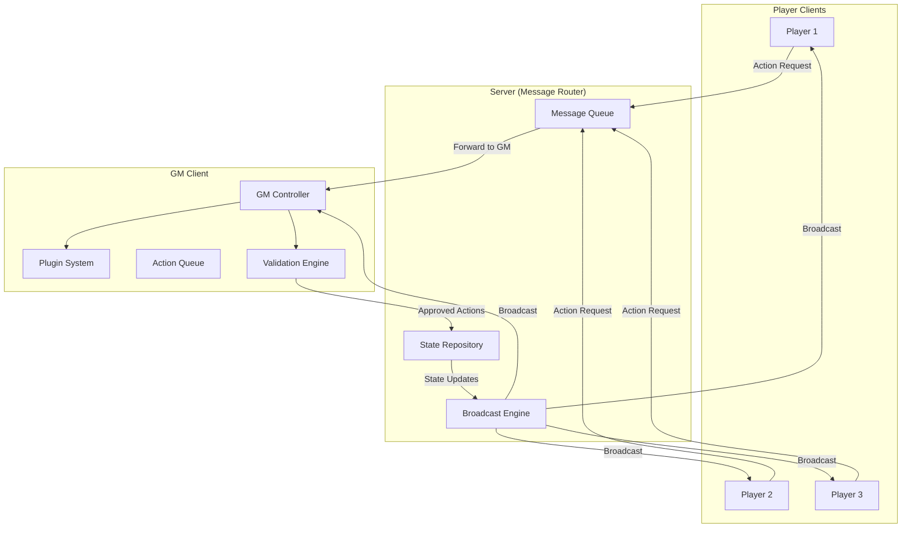
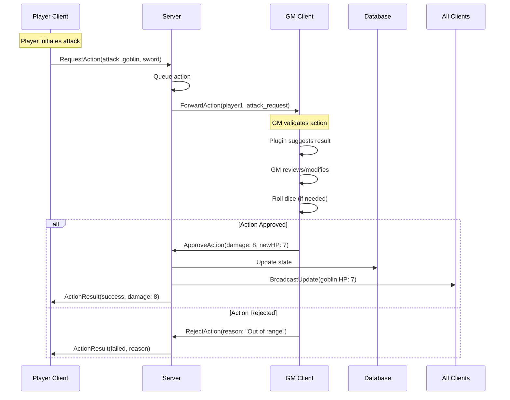
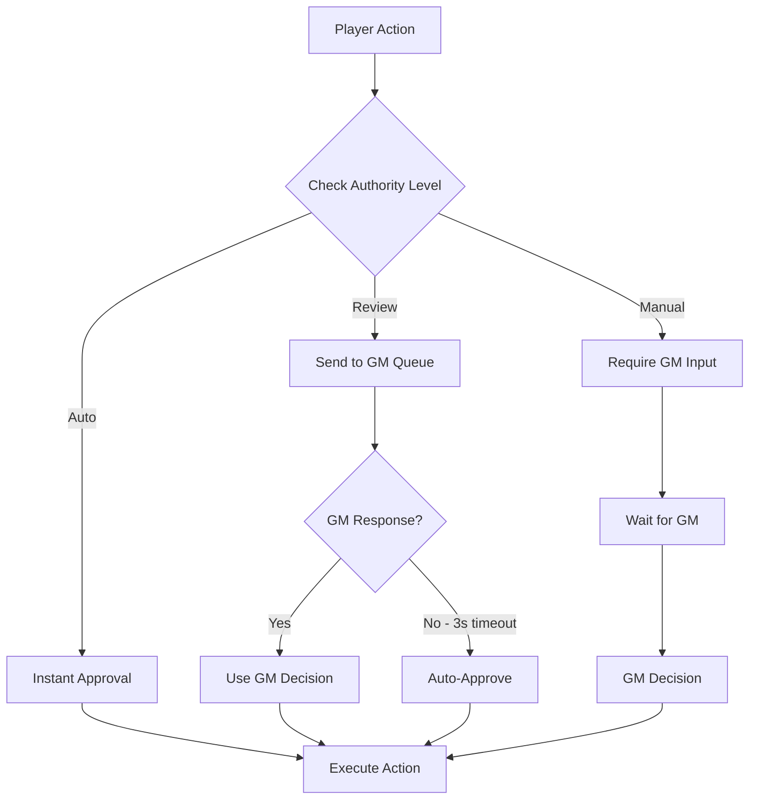
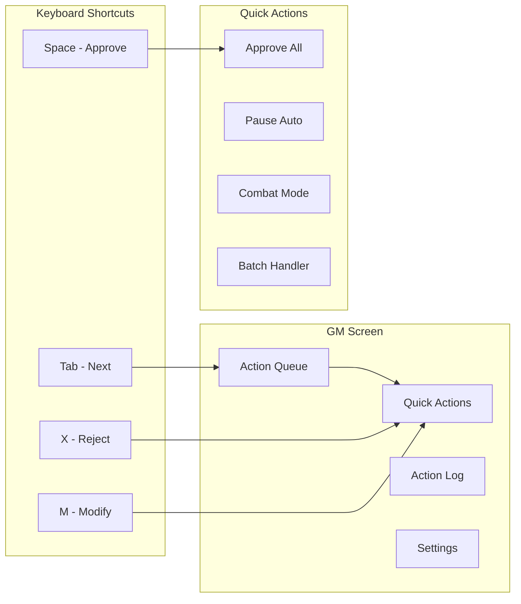

# GM-Authoritative State Management Architecture

## Executive Summary

### Problem Statement
Current state management proposals require either complex server-side game logic (server plugins) or sophisticated event synchronization (event sourcing), both of which increase system complexity and development overhead. These approaches also struggle to handle the inherent flexibility of tabletop RPGs where house rules, edge cases, and creative play are the norm rather than the exception.

### Solution: GM as the Authority
This proposal introduces a **GM-Authoritative State Management** system where the Game Master's client validates all game actions, maintaining the server as a simple message router. This approach mirrors the natural authority structure of tabletop RPGs while providing strong cheat prevention and ultimate rule flexibility.

### Key Benefits
1. **True Server Agnosticism**: Server has zero game knowledge
2. **Natural Authority Model**: Matches real tabletop gaming
3. **Ultimate Flexibility**: GM can override any rule or plugin suggestion
4. **Simplified Architecture**: No server plugins or complex synchronization
5. **Authentic Experience**: Preserves the GM's role as final arbiter

### Core Philosophy
> "The server is a table, not a referee. The GM is the referee."

## Core Architecture

### System Overview



### Authority Model

```typescript
interface AuthorityModel {
  // Server Authority (Infrastructure Only)
  server: {
    messageRouting: true;
    stateStorage: true;
    sessionManagement: true;
    authentication: true;
    
    // VTT Infrastructure (Universal Concepts)
    inventoryManagement: true;        // Structure and storage
    documentRelationships: true;      // Actor-Item references
    assetManagement: true;           // Images, tokens, maps
    
    // NO game logic
    combatRules: false;
    spellEffects: false;
    skillChecks: false;
    damageCalculation: false;
  };
  
  // GM Authority (Game Logic + Infrastructure Oversight)
  gameMaster: {
    // Game Logic (Exclusive)
    actionValidation: true;
    diceRolling: true;
    ruleInterpretation: true;
    conflictResolution: true;
    
    // Infrastructure Decisions (When Game-Affecting)
    itemAcquisition: true;           // When players gain/lose items
    characterCreation: true;         // Initial inventory setup
    equipmentEffects: true;          // What equipped items do
    
    // Override Authority
    overrideServer: true;            // Can override any server action
  };
  
  // Player Authority (Limited)
  player: {
    actionRequests: true;
    characterControl: true;          // Within GM approval
    uiPreferences: true;
    chatMessages: true;
    
    // Basic Inventory Operations (Server-Mediated)
    equipUnequipItems: true;         // Non-game-affecting organization
    viewInventory: true;             // Read-only access
  };
}
```

### VTT Infrastructure vs Game Logic Distinction

The GM-Authoritative system distinguishes between **VTT Infrastructure** (universal concepts) and **Game Logic** (system-specific rules):

#### VTT Infrastructure (Server Understands)
```typescript
interface VTTInfrastructure {
  // Universal across all TTRPG systems
  inventory: {
    structure: true;         // itemId, quantity, equipped, slot
    relationships: true;     // Actor owns Items
    organization: true;      // Equip/unequip, move items
    validation: true;        // Referential integrity, data consistency
  };
  
  documents: {
    relationships: true;     // Actor-Item, Campaign-Document references
    assetLinks: true;       // Images, tokens, portraits
    storage: true;          // Efficient queries and updates
  };
  
  sessions: {
    playerManagement: true;  // Who's in the session
    messageRouting: true;   // Getting actions to GM
    stateSync: true;       // Broadcasting approved changes
  };
}
```

#### Game Logic (GM Controls)
```typescript
interface GameLogic {
  // System-specific rules that vary between RPGs
  actions: {
    whatActionsExist: true;      // Attack, cast spell, skill check
    whenActionsSucceed: true;    // Hit/miss, save/fail
    whatEffectsOccur: true;     // Damage, conditions, buffs
  };
  
  items: {
    whatItemsDo: true;          // Sword deals 1d8 damage
    whenItemsWork: true;        // Spell scroll requires arcane caster
    howItemsInteract: true;     // Magic item attunement rules
  };
  
  characters: {
    whatStatsExist: true;       // STR/DEX/CON vs Body/Mind/Soul
    howStatsWork: true;         // 3d6 vs d20+modifier
    whatAbilitiesExist: true;   // Class features, racial traits
  };
}
```

#### Authority Boundaries in Practice
```typescript
// ✅ Server can do (VTT Infrastructure)
server.inventory.equipItem(actorId, itemId, 'mainHand');
server.inventory.moveItem(fromActorId, toActorId, itemId, quantity);
server.documents.validateReferences(actor.inventory);

// ❌ Server cannot do (Game Logic)  
server.combat.calculateDamage(weapon, target);
server.spells.checkIfCanCast(spell, caster);
server.skills.rollCheck(skill, difficulty);

// 🎯 GM decides then server applies (Game-Affecting Infrastructure)
// GM: "Player finds a magic sword"
gm.approveAction({
  type: 'acquireItem',
  result: server.inventory.addItem(actorId, swordId, 1)
});

// GM: "Sword is cursed, player can't unequip it"
gm.overrideServer({
  blockAction: 'unequipItem',
  itemId: cursedSwordId,
  reason: 'cursed item'
});
```

This distinction preserves GM authority over all game decisions while allowing the server to efficiently manage the underlying VTT infrastructure that's common to all tabletop systems.

### Message Flow Example: Combat Attack



## Progressive Authority Model

### Authority Levels

The system implements three levels of authority to balance gameplay flow with GM control:

```typescript
enum AuthorityLevel {
  AUTO_APPROVED = "auto",      // No GM intervention needed
  QUICK_REVIEW = "review",     // GM notification, auto-approve after timeout
  FULL_DISCRETION = "manual"   // Requires explicit GM approval
}

interface ActionAuthority {
  // Immediate approval - no latency (VTT Infrastructure)
  [AuthorityLevel.AUTO_APPROVED]: [
    "basic_movement",          // Moving within speed
    "view_character_sheet",    // Information access
    "equip_unequip_item",      // Inventory organization
    "view_inventory",          // Inventory access
    "end_turn",               // Turn management
    "organize_items"          // Non-game-affecting inventory changes
  ];
  
  // Quick review - 3 second default approval (Simple Game Actions)
  [AuthorityLevel.QUICK_REVIEW]: [
    "basic_attack",           // Standard weapon attacks
    "cantrip_cast",          // Level 0 spells
    "class_ability",         // Standard class features
    "consume_item",          // Use consumables
    "simple_skill_check",    // Non-contested rolls
    "opportunity_attack"     // Reaction attacks
  ];
  
  // Full GM discretion - no auto-approval (Complex Game Actions)
  [AuthorityLevel.FULL_DISCRETION]: [
    "acquire_item",          // Gaining new items
    "lose_item",            // Losing/destroying items
    "high_level_spell",     // Level 6+ spells
    "death_save",          // Life/death situations
    "wish_spell",          // Reality-altering effects
    "creative_action",     // "I want to try..."
    "pvp_action",         // Player vs player
    "story_critical"      // Major plot moments
  ];
}
```

### Authority Decision Flow



### Dynamic Authority Configuration

```typescript
interface GMAuthoritySettings {
  // Global settings
  defaultApprovalTimeout: number;  // Seconds before auto-approval
  combatAutoApproval: boolean;     // Auto-approve basic combat
  
  // Per-action overrides
  actionSettings: {
    [actionType: string]: {
      authorityLevel: AuthorityLevel;
      timeout?: number;
      conditions?: AuthorityCondition[];
    };
  };
  
  // Contextual rules
  contextualRules: [
    {
      condition: "player.level < 5",
      action: "high_level_spell",
      override: AuthorityLevel.AUTO_APPROVED  // Auto-reject
    },
    {
      condition: "combat.round > 10",
      action: "basic_attack", 
      override: AuthorityLevel.AUTO_APPROVED  // Speed up long combats
    }
  ];
  
  // Player trust levels
  playerTrust: {
    [playerId: string]: {
      trustLevel: "new" | "regular" | "trusted";
      autoApproveList: string[];  // Additional auto-approved actions
    };
  };
}
```

## Implementation Details

### Aggregate Architecture Integration

The GM-Authoritative system uses a two-layer aggregate pattern to maintain clear separation between runtime and persistence concerns:

```typescript
// GameSession - Runtime Aggregate (manages socket.io and active gameplay)
class GameSession {
  id: string;                    // Used as socket.io room ID
  campaignId: string;
  gmSocketId: string;
  playerSockets: Map<string, string>;
  private campaign: Campaign;    // References persistent aggregate
  
  // Runtime state (not persisted in database)
  private currentMapId?: string;
  private mapViewState?: MapViewState;
  private activeEncounter?: EncounterState;
  private pendingActions: ActionMessage[] = [];
  private playerPermissions: Map<string, SessionPermissions> = new Map();
  private sessionSettings: SessionSettings = {};
  
  broadcastToRoom(event: string, data: any) {
    io.to(this.id).emit(event, data);  // Uses session ID as room
  }
  
  async performInfrastructureAction(action: InfrastructureAction) {
    // Validate within session context
    const result = await this.campaign.performInfrastructureAction(action);
    this.broadcastToRoom('infrastructure:updated', result);
    return result;
  }
  
  // Map state management
  async setCurrentMap(mapId: string, gmId: string): Promise<void> {
    // Validate GM authority
    if (this.getPlayerRole(gmId) !== 'gm') {
      throw new Error('Only GM can change maps');
    }
    
    this.currentMapId = mapId;
    this.mapViewState = await this.initializeMapViewState(mapId);
    
    // Broadcast map change to all players
    this.broadcastToRoom('map:changed', {
      mapId,
      viewState: this.mapViewState,
      timestamp: Date.now()
    });
  }
  
  async updateMapViewState(viewState: MapViewState, playerId: string): Promise<void> {
    // Check if player can update map view (usually GM only)
    const permissions = this.playerPermissions.get(playerId);
    if (!permissions?.canMoveTokens && this.getPlayerRole(playerId) !== 'gm') {
      throw new Error('Insufficient permissions to update map view');
    }
    
    this.mapViewState = { ...this.mapViewState, ...viewState };
    
    // Broadcast view state change
    this.broadcastToRoom('map:view-updated', {
      viewState: this.mapViewState,
      updatedBy: playerId,
      timestamp: Date.now()
    });
  }
  
  async moveToken(tokenId: string, position: { x: number; y: number }, playerId: string): Promise<void> {
    // Validate token movement permissions
    const canMove = await this.canPlayerMoveToken(playerId, tokenId);
    if (!canMove) {
      throw new Error('Cannot move this token');
    }
    
    // Update token position (this would typically update the database)
    await TokenModel.findByIdAndUpdate(tokenId, { position });
    
    // Broadcast token movement to all players
    this.broadcastToRoom('token:moved', {
      tokenId,
      position,
      movedBy: playerId,
      timestamp: Date.now()
    });
  }
  
  // Encounter state management
  async startEncounter(encounterData: EncounterSetup, gmId: string): Promise<void> {
    if (this.getPlayerRole(gmId) !== 'gm') {
      throw new Error('Only GM can start encounters');
    }
    
    this.activeEncounter = {
      id: encounterData.encounterId,
      initiativeOrder: encounterData.initiativeOrder,
      currentTurn: 0,
      round: 1,
      phase: 'setup',
      participants: encounterData.participants,
      combatState: 'pending',
      turnTimeLimit: encounterData.turnTimeLimit
    };
    
    // Broadcast encounter start to all players
    this.broadcastToRoom('encounter:started', {
      encounter: await this.getEncounterStateForBroadcast(),
      timestamp: Date.now()
    });
  }
  
  async advanceTurn(gmId: string): Promise<void> {
    if (this.getPlayerRole(gmId) !== 'gm') {
      throw new Error('Only GM can advance turns');
    }
    
    if (!this.activeEncounter) {
      throw new Error('No active encounter');
    }
    
    // Advance to next turn
    this.activeEncounter.currentTurn = 
      (this.activeEncounter.currentTurn + 1) % this.activeEncounter.initiativeOrder.length;
    
    // If we've cycled through all players, advance round
    if (this.activeEncounter.currentTurn === 0) {
      this.activeEncounter.round++;
    }
    
    // Broadcast turn advancement
    this.broadcastToRoom('encounter:turn-advanced', {
      currentTurn: this.activeEncounter.currentTurn,
      round: this.activeEncounter.round,
      currentPlayer: this.activeEncounter.initiativeOrder[this.activeEncounter.currentTurn],
      timestamp: Date.now()
    });
  }
  
  async endEncounter(gmId: string): Promise<void> {
    if (this.getPlayerRole(gmId) !== 'gm') {
      throw new Error('Only GM can end encounters');
    }
    
    const encounterId = this.activeEncounter?.id;
    this.activeEncounter = undefined;
    
    // Broadcast encounter end
    this.broadcastToRoom('encounter:ended', {
      encounterId,
      timestamp: Date.now()
    });
  }
  
  // Session state management
  async updateSessionSettings(settings: Partial<SessionSettings>, gmId: string): Promise<void> {
    if (this.getPlayerRole(gmId) !== 'gm') {
      throw new Error('Only GM can update session settings');
    }
    
    this.sessionSettings = { ...this.sessionSettings, ...settings };
    
    // Broadcast settings update
    this.broadcastToRoom('session:settings-updated', {
      settings: this.sessionSettings,
      timestamp: Date.now()
    });
  }
  
  async updatePlayerPermissions(playerId: string, permissions: Partial<SessionPermissions>, gmId: string): Promise<void> {
    if (this.getPlayerRole(gmId) !== 'gm') {
      throw new Error('Only GM can update player permissions');
    }
    
    const currentPermissions = this.playerPermissions.get(playerId) || {};
    this.playerPermissions.set(playerId, { ...currentPermissions, ...permissions });
    
    // Broadcast permission update to specific player and GM
    this.broadcastToRoom('session:permissions-updated', {
      playerId,
      permissions: this.playerPermissions.get(playerId),
      timestamp: Date.now()
    });
  }
  
  // Comprehensive state reconstitution for session join
  async getCompleteSessionState(playerId: string): Promise<CompleteSessionState> {
    // Get persistent campaign data
    const campaignData = await this.campaign.getFullCampaignData();
    
    // Get player's character data with inventory
    const playerCharacters = await this.getPlayerCharacters(playerId);
    
    // Get current map state if active
    const mapState = this.currentMapId ? await this.getCurrentMapState(playerId) : null;
    
    // Get encounter state if active
    const encounterState = this.activeEncounter ? 
      await this.getEncounterStateForPlayer(playerId) : null;
    
    // Get session-specific runtime state
    const runtimeState = this.getRuntimeSessionState(playerId);
    
    return {
      // Persistent campaign data
      campaign: campaignData,
      characters: playerCharacters,
      
      // Runtime session state
      sessionId: this.id,
      currentMap: mapState,
      activeEncounter: encounterState,
      playerPermissions: this.playerPermissions.get(playerId),
      sessionSettings: this.sessionSettings,
      
      // GM action queue (filtered for player)
      pendingActions: this.getPendingActionsForPlayer(playerId),
      
      // Connected players
      connectedPlayers: Array.from(this.playerSockets.keys()),
      
      // State synchronization info
      stateVersion: this.getStateVersion(),
      lastUpdated: Date.now()
    };
  }
  
  private async getCurrentMapState(playerId: string): Promise<MapState> {
    const map = await MapModel.findById(this.currentMapId);
    const playerPermissions = this.playerPermissions.get(playerId);
    
    return {
      mapId: this.currentMapId!,
      mapData: map?.toObject(),
      viewState: this.mapViewState,
      tokens: await this.getVisibleTokens(playerId),
      revealedAreas: playerPermissions?.revealedAreas || [],
      fogOfWar: playerPermissions?.fogOfWarEnabled ?? true,
      playerPermissions: {
        canMoveTokens: playerPermissions?.canMoveTokens ?? false,
        canRevealAreas: playerPermissions?.canRevealAreas ?? false,
        viewRestrictedAreas: playerPermissions?.viewRestrictedAreas ?? false
      }
    };
  }
  
  private async getEncounterStateForPlayer(playerId: string): Promise<EncounterState | null> {
    if (!this.activeEncounter) return null;
    
    const playerCharacterIds = await this.getPlayerCharacterIds(playerId);
    
    return {
      encounterId: this.activeEncounter.id,
      initiativeOrder: this.activeEncounter.initiativeOrder,
      currentTurn: this.activeEncounter.currentTurn,
      round: this.activeEncounter.round,
      phase: this.activeEncounter.phase,
      
      // Player-specific encounter data
      playerCharacters: this.activeEncounter.participants
        .filter(p => playerCharacterIds.includes(p.characterId)),
      
      // Visible effects (based on player permissions)
      activeEffects: this.getVisibleEffects(playerId),
      
      // Combat state
      combatState: this.activeEncounter.combatState,
      
      // Turn management
      turnState: {
        isPlayerTurn: this.isPlayerTurn(playerId),
        canAct: this.canPlayerAct(playerId),
        actionsRemaining: this.getPlayerActionsRemaining(playerId),
        timeRemaining: this.activeEncounter.turnTimeLimit
      }
    };
  }
  
  private getRuntimeSessionState(playerId: string): RuntimeSessionState {
    return {
      playerRole: this.getPlayerRole(playerId),
      sessionPhase: this.getSessionPhase(),
      isPaused: this.sessionSettings.isPaused ?? false,
      allowPlayerActions: this.sessionSettings.allowPlayerActions ?? true,
      
      // Communication state
      voiceChatEnabled: this.sessionSettings.voiceChatEnabled ?? false,
      textChatEnabled: this.sessionSettings.textChatEnabled ?? true,
      
      // Game-specific runtime state
      pluginRuntimeData: this.getPluginRuntimeData(playerId)
    };
  }
  
  private getPendingActionsForPlayer(playerId: string): ActionMessage[] {
    // Return actions where player is involved or has visibility
    return this.pendingActions.filter(action => 
      action.playerId === playerId || 
      this.playerCanSeeAction(playerId, action)
    );
  }
}

// Type definitions for comprehensive session state
interface CompleteSessionState {
  // Persistent campaign data
  campaign: CampaignData;
  characters: PlayerCharacterData[];
  
  // Runtime session state
  sessionId: string;
  currentMap: MapState | null;
  activeEncounter: EncounterState | null;
  playerPermissions: SessionPermissions | undefined;
  sessionSettings: SessionSettings;
  
  // GM action queue (filtered for player)
  pendingActions: ActionMessage[];
  
  // Connected players
  connectedPlayers: string[];
  
  // State synchronization info
  stateVersion: string;
  lastUpdated: number;
}

interface MapState {
  mapId: string;
  mapData: any; // Map document data
  viewState?: MapViewState;
  tokens: TokenData[];
  revealedAreas: Area[];
  fogOfWar: boolean;
  playerPermissions: MapPermissions;
}

interface MapViewState {
  centerX: number;
  centerY: number;
  zoom: number;
  rotation: number;
}

interface EncounterState {
  encounterId: string;
  initiativeOrder: InitiativeEntry[];
  currentTurn: number;
  round: number;
  phase: 'setup' | 'combat' | 'resolution';
  
  // Player-specific encounter data
  playerCharacters: EncounterParticipant[];
  
  // Visible effects (based on player permissions)
  activeEffects: Effect[];
  
  // Combat state
  combatState: CombatState;
  
  // Turn management
  turnState: TurnState;
}

interface SessionPermissions {
  canMoveTokens: boolean;
  canRevealAreas: boolean;
  viewRestrictedAreas: boolean;
  revealedAreas: Area[];
  fogOfWarEnabled: boolean;
}

interface SessionSettings {
  isPaused?: boolean;
  allowPlayerActions?: boolean;
  voiceChatEnabled?: boolean;
  textChatEnabled?: boolean;
  turnTimeLimit?: number;
}

interface RuntimeSessionState {
  playerRole: 'gm' | 'player';
  sessionPhase: 'lobby' | 'active' | 'paused' | 'ended';
  isPaused: boolean;
  allowPlayerActions: boolean;
  
  // Communication state
  voiceChatEnabled: boolean;
  textChatEnabled: boolean;
  
  // Game-specific runtime state
  pluginRuntimeData: Record<string, unknown>;
}

### Comprehensive State Broadcasting Patterns

The GameSession aggregate provides different broadcasting patterns for different types of state changes to ensure all clients remain synchronized:

```typescript
// Broadcasting pattern definitions for different state types
class GameSessionBroadcaster {
  
  // 1. Immediate broadcast - for real-time actions
  broadcastImmediate(event: string, data: any, excludePlayer?: string) {
    const recipients = excludePlayer ? 
      this.playerSockets.keys().filter(id => id !== excludePlayer) :
      this.playerSockets.keys();
    
    recipients.forEach(playerId => {
      io.to(`user:${playerId}`).emit(event, data);
    });
  }
  
  // 2. Batched broadcast - for multiple related changes
  batchedBroadcast: Map<string, any[]> = new Map();
  
  addToBatch(batchId: string, event: string, data: any) {
    if (!this.batchedBroadcast.has(batchId)) {
      this.batchedBroadcast.set(batchId, []);
    }
    this.batchedBroadcast.get(batchId)!.push({ event, data });
  }
  
  flushBatch(batchId: string) {
    const batch = this.batchedBroadcast.get(batchId);
    if (batch) {
      this.broadcastToRoom('batch:state-changes', {
        batchId,
        changes: batch,
        timestamp: Date.now()
      });
      this.batchedBroadcast.delete(batchId);
    }
  }
  
  // 3. Player-specific broadcast - different data per player
  broadcastPlayerSpecific(baseEvent: string, dataGenerator: (playerId: string) => any) {
    for (const playerId of this.playerSockets.keys()) {
      const playerData = dataGenerator(playerId);
      io.to(`user:${playerId}`).emit(baseEvent, playerData);
    }
  }
  
  // 4. State synchronization broadcast - for out-of-sync clients
  async broadcastFullStateSync(targetPlayerId?: string) {
    const recipients = targetPlayerId ? [targetPlayerId] : Array.from(this.playerSockets.keys());
    
    for (const playerId of recipients) {
      const fullState = await this.getCompleteSessionState(playerId);
      io.to(`user:${playerId}`).emit('session:full-state-sync', {
        state: fullState,
        reason: 'sync_requested',
        timestamp: Date.now()
      });
    }
  }
  
  // 5. Permission-based broadcast - filtered by what players can see
  broadcastWithPermissions(event: string, data: any, permissionCheck: (playerId: string) => boolean) {
    for (const playerId of this.playerSockets.keys()) {
      if (permissionCheck(playerId)) {
        io.to(`user:${playerId}`).emit(event, data);
      }
    }
  }
}

// Specific broadcasting implementations for different state types
class StateChangePatterns extends GameSessionBroadcaster {
  
  // Character/Actor state changes
  async broadcastCharacterUpdate(characterId: string, changes: any, updatedBy: string) {
    // Get all players who can see this character
    const visibleToPlayers = await this.getPlayersWhoCanSeeCharacter(characterId);
    
    this.broadcastWithPermissions('character:updated', {
      characterId,
      changes,
      updatedBy,
      timestamp: Date.now()
    }, (playerId) => visibleToPlayers.includes(playerId));
  }
  
  // Inventory changes (uses universal inventory system)
  async broadcastInventoryChange(actorId: string, inventoryChange: InventoryChange, playerId: string) {
    // Inventory changes are visible to character owner and GM
    const characterOwner = await this.getCharacterOwner(actorId);
    
    this.broadcastWithPermissions('inventory:changed', {
      actorId,
      change: inventoryChange,
      changedBy: playerId,
      timestamp: Date.now()
    }, (recipientId) => 
      recipientId === characterOwner || this.getPlayerRole(recipientId) === 'gm'
    );
  }
  
  // Map state changes with fog of war considerations
  async broadcastMapUpdate(mapUpdate: MapUpdate, updatedBy: string) {
    // Different players see different parts of map updates based on fog of war
    this.broadcastPlayerSpecific('map:updated', (playerId) => {
      const playerPermissions = this.playerPermissions.get(playerId);
      return {
        ...mapUpdate,
        // Filter revealed areas based on player permissions
        revealedAreas: mapUpdate.revealedAreas?.filter(area => 
          playerPermissions?.revealedAreas.some(playerArea => 
            this.areasOverlap(area, playerArea)
          )
        ),
        // Hide tokens that aren't visible to this player
        tokens: mapUpdate.tokens?.filter(token => 
          this.canPlayerSeeToken(playerId, token)
        ),
        updatedBy,
        timestamp: Date.now()
      };
    });
  }
  
  // Encounter state changes with player-specific visibility
  async broadcastEncounterUpdate(encounterUpdate: EncounterUpdate, updatedBy: string) {
    this.broadcastPlayerSpecific('encounter:updated', (playerId) => {
      const playerCharacterIds = this.getPlayerCharacterIds(playerId);
      
      return {
        ...encounterUpdate,
        // Filter to only show participants visible to this player
        participants: encounterUpdate.participants?.filter(participant =>
          playerCharacterIds.includes(participant.characterId) ||
          this.canPlayerSeeParticipant(playerId, participant)
        ),
        // Filter effects based on visibility rules
        activeEffects: encounterUpdate.activeEffects?.filter(effect =>
          this.canPlayerSeeEffect(playerId, effect)
        ),
        updatedBy,
        timestamp: Date.now()
      };
    });
  }
  
  // GM action queue updates
  broadcastGMActionUpdate(action: ActionMessage, status: 'pending' | 'approved' | 'rejected') {
    // Broadcast to action originator and GM
    const recipients = [action.playerId];
    if (this.getPlayerRole(action.playerId) !== 'gm') {
      recipients.push(this.getGMId());
    }
    
    recipients.forEach(playerId => {
      io.to(`user:${playerId}`).emit('action:status-updated', {
        actionId: action.id,
        status,
        result: status === 'approved' ? action.result : undefined,
        timestamp: Date.now()
      });
    });
  }
  
  // Player connection state changes
  broadcastPlayerConnectionChange(playerId: string, status: 'joined' | 'left' | 'disconnected') {
    this.broadcastToRoom('player:connection-changed', {
      playerId,
      status,
      connectedPlayers: Array.from(this.playerSockets.keys()),
      timestamp: Date.now()
    });
  }
  
  // Session lifecycle events
  broadcastSessionStateChange(newPhase: 'lobby' | 'active' | 'paused' | 'ended', reason?: string) {
    this.broadcastToRoom('session:phase-changed', {
      phase: newPhase,
      reason,
      settings: this.sessionSettings,
      timestamp: Date.now()
    });
  }
  
  // Error and warning broadcasts
  broadcastError(error: string, targetPlayer?: string, severity: 'error' | 'warning' | 'info' = 'error') {
    const event = `session:${severity}`;
    const data = {
      message: error,
      timestamp: Date.now()
    };
    
    if (targetPlayer) {
      io.to(`user:${targetPlayer}`).emit(event, data);
    } else {
      this.broadcastToRoom(event, data);
    }
  }
}
```

### State Consistency Guarantees

The broadcasting system ensures state consistency through several mechanisms:

1. **Ordered Updates**: All state changes are timestamped and clients apply changes in timestamp order
2. **State Versioning**: Each broadcast includes a state version to detect out-of-sync clients  
3. **Automatic Resync**: Clients that detect version mismatch request full state synchronization
4. **Transactional Batches**: Related changes are batched together to prevent partial state updates
5. **Permission Filtering**: Each player receives only the state changes they're authorized to see

// Campaign - Persistence Aggregate (ensures data integrity)
class Campaign {
  id: string;
  gmId: string;
  name: string;
  pluginId: string;
  pluginData: Record<string, unknown>;  // Global plugin-specific state
  
  // Campaign-scoped invariants
  async performInfrastructureAction(action: InfrastructureAction) {
    await this.validateCampaignBoundaries(action);
    await this.enforceInventoryIntegrity(action);
    return await this.applyInfrastructureChange(action);
  }
  
  private async validateCampaignBoundaries(action: InfrastructureAction) {
    // Ensure all actors/items belong to this campaign
    if (action.actorId && !await this.ownsActor(action.actorId)) {
      throw new Error('Actor not in campaign');
    }
    if (action.itemId && !await this.ownsItem(action.itemId)) {
      throw new Error('Item not in campaign');
    }
  }
}
```

### Server Implementation (Minimal)

```typescript
// Server handles VTT infrastructure and routes game logic to GM
class GMAuthoritativeServer {
  private sessions = new Map<string, GameSession>();
  private campaigns = new Map<string, Campaign>();
  private messageQueues = new Map<string, ActionMessage[]>();
  private inventoryService = new UniversalInventoryService();
  
  async handlePlayerAction(
    playerId: string, 
    action: PlayerAction
  ): Promise<void> {
    const session = this.getPlayerSession(playerId);
    if (!session) throw new Error('Not in a session');
    
    // Check if this is VTT infrastructure or game logic
    if (this.isInfrastructureAction(action)) {
      // Handle infrastructure through aggregates
      await this.handleInfrastructureActionThroughAggregates(session, playerId, action);
      return;
    }
    
    // Create message for GM approval
    const message: ActionMessage = {
      id: generateId(),
      playerId,
      sessionId: session.id,
      action,
      timestamp: Date.now(),
      status: 'pending'
    };
    
    // Queue for GM
    this.queueForGM(session.gmId, message);
    
    // Notify GM client
    this.sendToClient(session.gmId, 'action:pending', message);
    
    // Track for player
    this.pendingActions.set(message.id, playerId);
  }
  
  private isInfrastructureAction(action: PlayerAction): boolean {
    // VTT infrastructure actions that server can handle directly
    const infrastructureActions = [
      // Inventory Management (Universal VTT Concepts)
      'equip_item', 'unequip_item', 'organize_inventory',
      'add_to_inventory', 'remove_from_inventory', 'update_inventory_quantity',
      'move_inventory_item', 'sort_inventory',
      
      // Information Access (No State Changes)
      'view_character_sheet', 'view_inventory', 'view_item_details',
      'view_map', 'view_compendium',
      
      // Basic Positioning (Spatial Infrastructure)
      'basic_movement', 'update_token_position', 'change_facing',
      
      // Asset Management (File System Operations)
      'upload_character_portrait', 'upload_token_image', 'update_map_asset',
      
      // UI State (Client-Side Only)
      'organize_ui', 'save_layout_preferences', 'update_display_settings'
    ];
    
    return infrastructureActions.includes(action.type);
  }
  
  private async handleInfrastructureActionThroughAggregates(
    session: GameSession,
    playerId: string, 
    action: PlayerAction
  ): Promise<void> {
    
    try {
      let result: any;
      
      switch (action.type) {
        // Inventory Management Actions (through Campaign aggregate)
        case 'equip_item':
        case 'unequip_item':
        case 'add_to_inventory':
        case 'remove_from_inventory':
        case 'update_inventory_quantity':
        case 'move_inventory_item':
        case 'organize_inventory':
          result = await session.performInfrastructureAction({
            type: action.type,
            ...action
          });
          break;
          
        // Basic Movement Actions
        case 'basic_movement':
          result = await this.movementService.moveToken(
            action.tokenId, action.newPosition
          );
          break;
          
        case 'update_token_position':
          result = await this.movementService.updatePosition(
            action.tokenId, action.x, action.y
          );
          break;
          
        // Information Access (No-op responses)
        case 'view_character_sheet':
        case 'view_inventory':
        case 'view_item_details':
          result = { success: true, message: 'View access granted' };
          break;
          
        default:
          throw new Error(`Unknown infrastructure action: ${action.type}`);
      }
      
      // Broadcasting handled by GameSession aggregate
      // session.performInfrastructureAction already broadcasted
      
      // Send success response to player
      this.sendToClient(playerId, 'action:result', {
        actionId: action.id,
        success: true,
        result,
        type: 'infrastructure'
      });
      
    } catch (error) {
      // Send error response to player
      this.sendToClient(playerId, 'action:result', {
        actionId: action.id,
        success: false,
        reason: error.message,
        type: 'infrastructure'
      });
    }
  }
  
  async handleGMDecision(
    gmId: string,
    decision: GMDecision  
  ): Promise<void> {
    const session = this.getGMSession(gmId);
    if (!session) throw new Error('Not a GM');
    
    if (decision.approved) {
      // Apply state changes
      await this.applyStateChanges(session.id, decision.stateChanges);
      
      // Broadcast to all
      this.broadcast(session.id, 'state:updated', {
        changes: decision.stateChanges,
        reason: decision.actionId,
        timestamp: Date.now()
      });
      
      // Notify original player
      const playerId = this.pendingActions.get(decision.actionId);
      if (playerId) {
        this.sendToClient(playerId, 'action:result', {
          actionId: decision.actionId,
          success: true,
          changes: decision.stateChanges,
          message: decision.feedback
        });
      }
    } else {
      // Notify player of rejection
      const playerId = this.pendingActions.get(decision.actionId);
      if (playerId) {
        this.sendToClient(playerId, 'action:result', {
          actionId: decision.actionId,
          success: false,
          reason: decision.reason
        });
      }
    }
    
    // Clean up
    this.pendingActions.delete(decision.actionId);
  }
  
  // Simple state storage - no validation
  private async applyStateChanges(
    sessionId: string,
    changes: StateChange[]
  ): Promise<void> {
    const state = await this.loadState(sessionId);
    
    for (const change of changes) {
      // Apply change without understanding it
      setPath(state, change.path, change.value);
    }
    
    await this.saveState(sessionId, state);
  }
}
```

### Campaign Aggregate Implementation

```typescript
// Campaign aggregate enforces data integrity and campaign boundaries
class Campaign {
  id: string;
  gmId: string;
  name: string;
  pluginId: string;
  pluginData: Record<string, unknown>;  // Global plugin-specific state
  
  constructor(data: CampaignData) {
    this.id = data.id;
    this.gmId = data.gmId;
    this.name = data.name;
    this.pluginId = data.pluginId;
    this.pluginData = data.pluginData || {};
  }
  
  // Examples of campaign pluginData usage:
  // {
  //   "dnd5e": {
  //     "houseRules": {
  //       "allowCriticalFumbles": true,
  //       "deathSaveThreshold": 3,
  //       "longRestRequirements": "8 hours in safe location"
  //     },
  //     "worldState": {
  //       "currentDate": "15th of Mirtul, 1492 DR",
  //       "season": "spring",
  //       "majorEvents": [
  //         "Dragon attack on Phandalin",
  //         "Lords' Alliance treaty signed"
  //       ],
  //       "politicalClimate": "tense"
  //     },
  //     "factionStandings": {
  //       "harpers": "friendly",
  //       "zhentarim": "hostile",
  //       "lords_alliance": "neutral",
  //       "emerald_enclave": "allied"
  //     },
  //     "economicState": {
  //       "goldInflation": 1.2,
  //       "tradeRouteStatus": "disrupted",
  //       "merchantGuildRelations": "strained"
  //     }
  //   }
  // }
  
  async performInfrastructureAction(action: InfrastructureAction): Promise<any> {
    // Validate campaign boundaries
    await this.validateCampaignBoundaries(action);
    
    // Enforce campaign-wide invariants
    await this.enforceInvariants(action);
    
    // Delegate to universal inventory service
    const inventoryService = new UniversalInventoryService(this.id);
    return await inventoryService.handleAction(action);
  }
  
  private async validateCampaignBoundaries(action: InfrastructureAction) {
    // Ensure all referenced documents belong to this campaign
    if (action.actorId) {
      const actor = await ActorModel.findById(action.actorId);
      if (!actor || actor.campaignId !== this.id) {
        throw new Error('Actor not in campaign');
      }
    }
    
    if (action.itemId) {
      const item = await ItemModel.findById(action.itemId);
      if (!item || item.campaignId !== this.id) {
        throw new Error('Item not in campaign');
      }
    }
  }
  
  private async enforceInvariants(action: InfrastructureAction) {
    // Example: Ensure item references are valid
    if (action.type === 'equip_item') {
      const actor = await ActorModel.findById(action.actorId);
      const hasItem = actor.inventory.some(entry => entry.itemId === action.itemId);
      if (!hasItem) {
        throw new Error('Cannot equip item not in inventory');
      }
    }
    
    // Example: Prevent duplicate equipped items in same slot
    if (action.type === 'equip_item' && action.slot) {
      const actor = await ActorModel.findById(action.actorId);
      const slotOccupied = actor.inventory.some(entry => 
        entry.equipped && entry.slot === action.slot
      );
      if (slotOccupied) {
        throw new Error(`Slot ${action.slot} already occupied`);
      }
    }
  }
  
  // Campaign-level plugin data management
  async updatePluginData(key: string, value: unknown): Promise<void> {
    this.pluginData[key] = value;
    await this.save();
  }
  
  async getPluginData(key?: string): Promise<unknown> {
    if (key) {
      return this.pluginData[key];
    }
    return this.pluginData;
  }
}

// Universal Inventory Service (Updated to work with Campaign aggregate)
class UniversalInventoryService {
  private campaignId: string;
  
  constructor(campaignId: string) {
    this.campaignId = campaignId;
  }
  
  async handleAction(action: InfrastructureAction): Promise<any> {
    switch (action.type) {
      case 'equip_item':
        return await this.equipItem(action.actorId, action.itemId, action.slot);
      case 'unequip_item':
        return await this.unequipItem(action.actorId, action.itemId);
      case 'add_to_inventory':
        return await this.addItem(action.actorId, action.itemId, action.quantity || 1);
      case 'remove_from_inventory':
        return await this.removeItem(action.actorId, action.itemId, action.quantity || 1);
      case 'update_inventory_quantity':
        return await this.updateQuantity(action.actorId, action.itemId, action.newQuantity);
      case 'move_inventory_item':
        return await this.moveItem(action.fromActorId, action.toActorId, action.itemId, action.quantity);
      case 'organize_inventory':
        return await this.reorganize(action.actorId, action.newOrder);
      default:
        throw new Error(`Unknown infrastructure action: ${action.type}`);
    }
  }
  
  async equipItem(actorId: string, itemId: string, slot?: string): Promise<any> {
    const actor = await ActorModel.findById(actorId);
    if (!actor) throw new Error('Actor not found');
    
    // Campaign boundary already validated by Campaign aggregate
    const inventoryEntry = actor.inventory.find(entry => entry.itemId === itemId);
    if (!inventoryEntry) {
      throw new Error('Item not in inventory');
    }
    
    // Infrastructure: Update equipped status and slot
    inventoryEntry.equipped = true;
    if (slot) inventoryEntry.slot = slot;
    
    await actor.save();
    
    // ✅ Server CAN do (Infrastructure):
    // - Update inventory array structure
    // - Set equipped boolean flag
    // - Assign equipment slot
    
    // ❌ Server does NOT validate (Game Logic):
    // - Whether character can use this item type
    // - Whether slot is valid for this item
    // - Whether character meets requirements (strength, level, etc.)
    // - Whether equipping triggers any game effects
    
    return { 
      success: true, 
      actor: actor.toObject(),
      message: 'Item equipped successfully'
    };
  }
  
  async unequipItem(actorId: string, itemId: string): Promise<any> {
    const actor = await ActorModel.findById(actorId);
    if (!actor) throw new Error('Actor not found');
    
    const inventoryEntry = actor.inventory.find(entry => entry.itemId === itemId);
    if (!inventoryEntry) {
      throw new Error('Item not in inventory');
    }
    
    // Infrastructure: Update equipped status
    inventoryEntry.equipped = false;
    inventoryEntry.slot = undefined;
    
    await actor.save();
    
    return { 
      success: true, 
      actor: actor.toObject(),
      message: 'Item unequipped successfully'
    };
  }
  
  async addItem(actorId: string, itemId: string, quantity: number): Promise<any> {
    const actor = await ActorModel.findById(actorId);
    if (!actor) throw new Error('Actor not found');
    
    const existingEntry = actor.inventory.find(entry => entry.itemId === itemId);
    
    if (existingEntry) {
      // Update existing entry
      existingEntry.quantity += quantity;
    } else {
      // Add new entry
      actor.inventory.push({
        itemId,
        quantity,
        equipped: false,
        condition: 100 // Default condition
      });
    }
    
    await actor.save();
    
    // ✅ Server CAN do (Infrastructure):
    // - Manage inventory array structure
    // - Update quantities
    // - Track item references
    
    // ❌ Server does NOT validate (Game Logic):
    // - Whether actor can acquire this item
    // - Whether adding item triggers effects
    // - Whether inventory has capacity limits
    // - Whether item type is appropriate for actor
    
    return { 
      success: true, 
      actor: actor.toObject(),
      message: `Added ${quantity} of item ${itemId}`
    };
  }
  
  async removeItem(actorId: string, itemId: string, quantity: number): Promise<any> {
    const actor = await ActorModel.findById(actorId);
    if (!actor) throw new Error('Actor not found');
    
    const inventoryEntry = actor.inventory.find(entry => entry.itemId === itemId);
    if (!inventoryEntry) {
      throw new Error('Item not in inventory');
    }
    
    if (inventoryEntry.quantity < quantity) {
      throw new Error('Insufficient quantity');
    }
    
    // Infrastructure: Update or remove entry
    if (inventoryEntry.quantity === quantity) {
      // Remove entry completely
      actor.inventory = actor.inventory.filter(entry => entry.itemId !== itemId);
    } else {
      // Reduce quantity
      inventoryEntry.quantity -= quantity;
    }
    
    await actor.save();
    
    return { 
      success: true, 
      actor: actor.toObject(),
      message: `Removed ${quantity} of item ${itemId}`
    };
  }
  
  async moveItem(
    fromActorId: string, 
    toActorId: string, 
    itemId: string, 
    quantity: number
  ): Promise<any> {
    // Remove from source actor
    await this.removeItem(fromActorId, itemId, quantity);
    
    // Add to target actor
    await this.addItem(toActorId, itemId, quantity);
    
    return { 
      success: true, 
      fromActorId,
      toActorId,
      itemId,
      quantity,
      message: `Moved ${quantity} of item ${itemId} between actors`
    };
  }
  
  async updateQuantity(
    actorId: string, 
    itemId: string, 
    newQuantity: number
  ): Promise<any> {
    const actor = await ActorModel.findById(actorId);
    if (!actor) throw new Error('Actor not found');
    
    const inventoryEntry = actor.inventory.find(entry => entry.itemId === itemId);
    if (!inventoryEntry) {
      throw new Error('Item not in inventory');
    }
    
    if (newQuantity <= 0) {
      // Remove item completely
      actor.inventory = actor.inventory.filter(entry => entry.itemId !== itemId);
    } else {
      // Update quantity
      inventoryEntry.quantity = newQuantity;
    }
    
    await actor.save();
    
    return { 
      success: true, 
      actor: actor.toObject(),
      message: `Updated quantity of item ${itemId} to ${newQuantity}`
    };
  }
  
  async reorganize(actorId: string, newOrder: string[]): Promise<any> {
    const actor = await ActorModel.findById(actorId);
    if (!actor) throw new Error('Actor not found');
    
    // Infrastructure: Reorder inventory array based on itemId order
    const reorderedInventory = newOrder
      .map(itemId => actor.inventory.find(entry => entry.itemId === itemId))
      .filter(entry => entry !== undefined);
    
    // Add any items not in the new order at the end
    const remainingItems = actor.inventory.filter(
      entry => !newOrder.includes(entry.itemId)
    );
    
    actor.inventory = [...reorderedInventory, ...remainingItems];
    await actor.save();
    
    return { 
      success: true, 
      actor: actor.toObject(),
      message: 'Inventory reorganized successfully'
    };
  }
}
```

### GM Client Implementation

```typescript
class GMActionController {
  private actionQueue = new PriorityQueue<QueuedAction>();
  private autoApprovalTimers = new Map<string, NodeJS.Timeout>();
  private settings: GMAuthoritySettings;
  private plugin: GameSystemPlugin;
  
  async handleIncomingAction(message: ActionMessage): Promise<void> {
    const action = message.action;
    const authority = this.getAuthorityLevel(action);
    
    switch (authority) {
      case AuthorityLevel.AUTO_APPROVED:
        await this.autoApprove(message);
        break;
        
      case AuthorityLevel.QUICK_REVIEW:
        await this.queueForQuickReview(message);
        break;
        
      case AuthorityLevel.FULL_DISCRETION:
        await this.requireManualApproval(message);
        break;
    }
  }
  
  private async autoApprove(message: ActionMessage): Promise<void> {
    // Use plugin to calculate result
    const result = await this.plugin.processAction(message.action);
    
    // Immediately approve
    await this.sendDecision({
      actionId: message.id,
      approved: true,
      stateChanges: result.stateChanges,
      feedback: result.description,
      autoApproved: true
    });
    
    // Log for GM visibility
    this.addToActionLog({
      ...message,
      result,
      approvalType: 'auto',
      timestamp: Date.now()
    });
  }
  
  private async queueForQuickReview(message: ActionMessage): Promise<void> {
    // Calculate result
    const suggestion = await this.plugin.processAction(message.action);
    
    // Add to GM queue
    const queuedAction: QueuedAction = {
      message,
      suggestion,
      priority: this.calculatePriority(message),
      expiresAt: Date.now() + (this.settings.defaultApprovalTimeout * 1000)
    };
    
    this.actionQueue.enqueue(queuedAction);
    
    // Show in GM interface
    this.ui.showQuickAction(queuedAction);
    
    // Set auto-approval timer
    const timer = setTimeout(() => {
      this.autoApproveQueued(message.id);
    }, this.settings.defaultApprovalTimeout * 1000);
    
    this.autoApprovalTimers.set(message.id, timer);
  }
  
  private async requireManualApproval(message: ActionMessage): Promise<void> {
    // Calculate suggestion
    const suggestion = await this.plugin.processAction(message.action);
    
    // Show approval dialog
    const dialog = await this.ui.showApprovalDialog({
      action: message.action,
      player: message.playerId,
      suggestion,
      context: await this.gatherContext(message),
      options: {
        approve: () => this.approve(message.id, suggestion),
        modify: () => this.showModificationUI(message, suggestion),
        reject: () => this.showRejectionUI(message),
        delegate: () => this.delegateToPlayer(message)
      }
    });
  }
  
  // Batch operations for efficiency
  async processBatch(actions: ActionMessage[]): Promise<void> {
    const similarActions = this.groupSimilarActions(actions);
    
    for (const group of similarActions) {
      if (group.length > 3) {
        const batchApproval = await this.ui.showBatchDialog({
          actions: group,
          summary: this.summarizeActions(group),
          options: {
            approveAll: () => this.batchApprove(group),
            reviewEach: () => this.reviewIndividually(group),
            rejectAll: () => this.batchReject(group)
          }
        });
      }
    }
  }
}
```

### GM User Interface

```typescript
interface GMInterface {
  // Action queue display
  actionQueue: {
    pending: QueuedAction[];
    autoApprovalCountdown: Map<string, number>;
    recentlyProcessed: ProcessedAction[];
  };
  
  // Quick action buttons
  quickActions: {
    approveAll: () => void;
    pauseAutoApproval: () => void;
    enableCombatMode: () => void;
    trustPlayer: (playerId: string) => void;
  };
  
  // Modification interface
  modificationDialog: {
    action: ActionMessage;
    suggestion: ActionResult;
    fields: {
      damage: NumberInput;
      conditions: ConditionSelector;
      customEffect: TextArea;
    };
    preview: () => StateChange[];
    confirm: () => void;
  };
  
  // Settings panel
  settings: {
    authority: GMAuthoritySettings;
    hotkeys: HotkeyConfiguration;
    automation: AutomationRules;
  };
}
```

### Player Experience

```typescript
class PlayerActionController {
  private pendingActions = new Map<string, PendingAction>();
  private actionFeedback = new UIFeedbackSystem();
  
  async requestAction(action: PlayerAction): Promise<ActionResult> {
    // Create request
    const request = {
      id: generateId(),
      action,
      timestamp: Date.now()
    };
    
    // Show pending UI
    this.actionFeedback.showPending(action, {
      message: this.getWaitMessage(action),
      estimatedTime: this.estimateApprovalTime(action),
      cancelButton: () => this.cancelAction(request.id)
    });
    
    // Send to server
    const result = await this.sendActionRequest(request);
    
    // Update UI based on result
    if (result.success) {
      this.actionFeedback.showSuccess(action, result);
      await this.applyLocalUpdates(result.changes);
    } else {
      this.actionFeedback.showFailure(action, result.reason);
    }
    
    return result;
  }
  
  private getWaitMessage(action: PlayerAction): string {
    const messages = {
      attack: "Waiting for GM to resolve attack...",
      spell: "GM is reviewing your spell...",
      creative: "GM is considering your action...",
      movement: "Moving...",  // Auto-approved, minimal wait
    };
    
    return messages[action.type] || "Waiting for GM approval...";
  }
  
  private estimateApprovalTime(action: PlayerAction): number {
    const estimates = {
      [AuthorityLevel.AUTO_APPROVED]: 0,
      [AuthorityLevel.QUICK_REVIEW]: 3,
      [AuthorityLevel.FULL_DISCRETION]: 15
    };
    
    const level = this.getAuthorityLevel(action);
    return estimates[level];
  }
}
```

## GM Experience Design

### Workload Management

```typescript
class GMWorkloadManager {
  private stats = {
    actionsPerMinute: new RollingAverage(60),
    approvalTime: new RollingAverage(100),
    autoApprovalRate: new Percentage()
  };
  
  async optimizeWorkload(): Promise<WorkloadSuggestion[]> {
    const suggestions: WorkloadSuggestion[] = [];
    
    // Detect high load
    if (this.stats.actionsPerMinute.average > 10) {
      suggestions.push({
        type: 'enable_combat_mode',
        message: 'Enable combat mode for faster approvals?',
        action: () => this.enableCombatMode()
      });
    }
    
    // Detect patterns
    const patterns = this.analyzeActionPatterns();
    if (patterns.repeatedActions > 5) {
      suggestions.push({
        type: 'batch_approval',
        message: `${patterns.repeatedActions} similar actions detected`,
        action: () => this.showBatchInterface()
      });
    }
    
    // Trust suggestions
    const trustAnalysis = this.analyzeTrustPatterns();
    for (const player of trustAnalysis.trustworthy) {
      suggestions.push({
        type: 'increase_trust',
        message: `Grant ${player.name} more autonomy?`,
        action: () => this.increaseTrust(player.id)
      });
    }
    
    return suggestions;
  }
  
  // Combat mode for faster gameplay
  enableCombatMode(): void {
    this.updateSettings({
      combatMode: true,
      autoApproval: {
        basicAttacks: true,
        movement: true,
        simpleSpells: true,
        timeout: 1  // 1 second quick review
      }
    });
    
    this.ui.showNotification('Combat mode enabled - basic actions auto-approved');
  }
}
```

### Quick Action Interface



### Delegation System

```typescript
class GMDelegationSystem {
  private delegates = new Map<string, DelegatePermissions>();
  
  // Temporary delegation
  async delegateTemporarily(playerId: string, permissions: string[]): Promise<void> {
    this.delegates.set(playerId, {
      permissions,
      expiresAt: Date.now() + (30 * 60 * 1000), // 30 minutes
      scope: 'session'
    });
    
    await this.notifyPlayer(playerId, 'You have been granted temporary GM powers');
  }
  
  // Co-GM system
  async appointCoGM(playerId: string): Promise<void> {
    this.delegates.set(playerId, {
      permissions: ['approve_basic_actions', 'manage_initiative', 'resolve_attacks'],
      expiresAt: null,  // Permanent for session
      scope: 'campaign'
    });
    
    await this.server.grantCoGMStatus(this.sessionId, playerId);
  }
  
  // Handle delegation
  async handleDelegatedAction(action: ActionMessage, delegateId: string): Promise<boolean> {
    const permissions = this.delegates.get(delegateId);
    if (!permissions) return false;
    
    if (this.canDelegateHandle(action, permissions)) {
      // Let delegate handle it
      await this.forwardToDelegate(delegateId, action);
      return true;
    }
    
    return false;
  }
}
```

## Edge Cases and Solutions

### GM Disconnection

```typescript
class GMDisconnectionHandler {
  private reconnectionWindow = 2 * 60 * 1000;  // 2 minutes
  private fallbackStrategies: FallbackStrategy[] = [];
  
  async handleGMDisconnect(sessionId: string): Promise<void> {
    const session = await this.getSession(sessionId);
    
    // Immediate response
    await this.pauseGameplay(sessionId);
    await this.notifyPlayers(sessionId, {
      type: 'gm_disconnected',
      message: 'GM disconnected - game paused',
      expectedReconnection: this.reconnectionWindow
    });
    
    // Check for co-GM
    const coGM = session.coGMId;
    if (coGM) {
      await this.promoteCoGM(sessionId, coGM);
      return;
    }
    
    // Start reconnection timer
    this.startReconnectionTimer(sessionId, async () => {
      // After timeout, activate fallback
      await this.activateFallback(sessionId);
    });
  }
  
  private async activateFallback(sessionId: string): Promise<void> {
    const strategy = await this.selectFallbackStrategy(sessionId);
    
    switch (strategy) {
      case 'peer_validation':
        await this.enablePeerValidation(sessionId);
        break;
        
      case 'auto_approve_all':
        await this.enableEmergencyAutoApproval(sessionId);
        break;
        
      case 'pause_until_return':
        await this.maintainPause(sessionId);
        break;
        
      case 'end_session':
        await this.gracefullyEndSession(sessionId);
        break;
    }
  }
}
```

### Disputed Actions

```typescript
class DisputeResolution {
  async handleDispute(dispute: ActionDispute): Promise<void> {
    // Log dispute
    await this.logDispute(dispute);
    
    // Present to GM with full context
    const resolution = await this.gm.showDisputeDialog({
      player: dispute.playerId,
      action: dispute.action,
      playerArgument: dispute.argument,
      pluginRuling: dispute.pluginResult,
      previousRulings: await this.findSimilarRulings(dispute),
      options: {
        upholdPlugin: () => this.resolveWithPlugin(dispute),
        overrideForPlayer: () => this.resolveForPlayer(dispute),
        customRuling: () => this.createCustomRuling(dispute),
        discussFurther: () => this.openDiscussion(dispute)
      }
    });
    
    // Store ruling for consistency
    await this.storeRuling(dispute, resolution);
  }
}
```

### Performance Optimization

```typescript
class PerformanceOptimizer {
  // Predictive pre-approval
  async predictiveApproval(playerId: string): Promise<void> {
    const history = await this.getPlayerHistory(playerId);
    const patterns = this.analyzePatterns(history);
    
    // Pre-calculate likely actions
    for (const likelyAction of patterns.predictedActions) {
      const result = await this.plugin.processAction(likelyAction);
      this.cache.set(this.actionKey(playerId, likelyAction), result);
    }
  }
  
  // Batch processing
  async processBatchActions(actions: ActionMessage[]): Promise<void> {
    // Group by type
    const grouped = this.groupByType(actions);
    
    // Process each group
    for (const [type, group] of grouped) {
      if (this.canBatchProcess(type)) {
        const results = await this.plugin.batchProcess(group);
        await this.applyBatchResults(results);
      }
    }
  }
  
  // Smart caching
  private cache = new LRUCache<string, ActionResult>({
    max: 1000,
    ttl: 5 * 60 * 1000  // 5 minutes
  });
  
  async getCachedOrProcess(action: PlayerAction): Promise<ActionResult> {
    const key = this.actionKey(action);
    const cached = this.cache.get(key);
    
    if (cached && this.isCacheValid(cached, action)) {
      return cached;
    }
    
    const result = await this.plugin.processAction(action);
    this.cache.set(key, result);
    return result;
  }
}
```

## Comparison with Other Approaches

### vs Server Plugins

| Aspect | Server Plugins | GM-Authoritative |
|--------|---------------|------------------|
| **Server Complexity** | High - Must understand game rules | Minimal - Just routes messages |
| **Development Effort** | High - Server and client plugins | Medium - Client plugins only |
| **Rule Flexibility** | Limited - Code defines rules | Ultimate - GM interprets rules |
| **Cheat Prevention** | High - Server validates | High - GM validates |
| **Latency** | Low - Immediate response | Variable - Depends on GM |
| **Authenticity** | Medium - Computer referee | High - Human referee |
| **Edge Case Handling** | Poor - Must be coded | Excellent - GM decides |

### vs Event Sourcing

| Aspect | Event Sourcing | GM-Authoritative |
|--------|----------------|------------------|
| **Complexity** | Very High - Event replay, conflicts | Medium - Simple approval flow |
| **Consistency** | Complex - Eventual consistency | Simple - GM ensures consistency |
| **Debugging** | Difficult - Event streams | Easy - Linear approval log |
| **Recovery** | Complex - Replay events | Simple - GM re-approves |
| **Storage** | High - Full event history | Low - Current state only |

### vs Pure Client Authority

| Aspect | Client Authority | GM-Authoritative |
|--------|-----------------|------------------|
| **Trust Required** | Very High - Trust all players | Low - Only trust GM |
| **Cheat Prevention** | None | High |
| **Complexity** | Low | Medium |
| **Flexibility** | High - Too high | High - GM controlled |
| **Fair Play** | Player enforced | GM enforced |

### Hybrid Possibilities

```typescript
interface HybridArchitecture {
  // Start with GM-authoritative
  baseModel: 'gm_authoritative';
  
  // Add server validation for specific things
  serverValidation: {
    enabled: false,  // Can enable later
    validates: ['dice_rolls', 'resource_limits'];
  };
  
  // Event sourcing for specific features
  eventSourcing: {
    enabled: false,  // Can add later
    features: ['replay', 'spectator_mode'];
  };
  
  // Gradual migration path
  migration: {
    phase1: 'gm_authoritative',
    phase2: 'gm_auth_with_server_dice',
    phase3: 'hybrid_progressive_authority'
  };
}
```

## Migration Strategy

### Phase 1: Basic Implementation (Weeks 1-2)

```typescript
class Phase1Migration {
  // Keep existing REST endpoints
  async migrateEndpoints(): Promise<void> {
    // Existing
    app.post('/api/actor/:id/damage', legacyDamageHandler);
    
    // New GM-auth pathway
    app.post('/api/action/request', gmAuthActionHandler);
    
    // Feature flag
    if (session.useGMAuth) {
      return gmAuthActionHandler(req, res);
    } else {
      return legacyDamageHandler(req, res);
    }
  }
  
  // Simple message routing
  async implementRouter(): Promise<void> {
    socket.on('action:request', async (action) => {
      if (session.gmAuthEnabled) {
        await forwardToGM(session.gmId, action);
      } else {
        await processLegacyAction(action);
      }
    });
  }
}
```

### Phase 2: Progressive Authority (Weeks 3-4)

```typescript
class Phase2Migration {
  // Add authority levels
  async addAuthoritySystem(): Promise<void> {
    // Start with simple binary
    const authority = {
      autoApproved: ['movement', 'view_sheet'],
      requiresGM: ['attack', 'spell', 'damage']
    };
    
    // Gradually add more categories
    await this.migrateActionTypes(authority);
  }
  
  // GM tools
  async addGMInterface(): Promise<void> {
    // Basic approval UI
    const gmUI = new GMApprovalInterface({
      simple: true,
      showSuggestions: true,
      batchSupport: false  // Add later
    });
  }
}
```

### Phase 3: Full System (Weeks 5-6)

```typescript
class Phase3Migration {
  // Complete feature set
  async enableFullFeatures(): Promise<void> {
    await this.enableBatchProcessing();
    await this.addPredictiveApproval();
    await this.implementDelegation();
    await this.addPerformanceOptimizations();
  }
  
  // Remove legacy code
  async cleanup(): Promise<void> {
    if (this.allSessionsUsingGMAuth()) {
      await this.removeLegacyEndpoints();
      await this.removeServerGameLogic();
      await this.simplifyDatabaseSchema();
    }
  }
}
```

### Rollback Strategy

```typescript
class RollbackStrategy {
  // Feature flags for easy rollback
  features = {
    gmAuthEnabled: true,
    legacyFallback: true,
    dualPathways: true
  };
  
  async rollback(reason: string): Promise<void> {
    // Log rollback reason
    await this.logRollback(reason);
    
    // Disable GM auth
    this.features.gmAuthEnabled = false;
    
    // Notify users
    await this.notifyUsers('Temporarily reverting to classic mode');
    
    // Keep data compatible
    await this.ensureDataCompatibility();
  }
}
```

## Performance Considerations

### Latency Analysis

```typescript
interface LatencyProfile {
  // Best case (auto-approved)
  autoApproved: {
    total: 50,  // ms
    breakdown: {
      network: 30,
      processing: 10,
      stateUpdate: 10
    }
  };
  
  // Typical case (quick review)
  quickReview: {
    total: 3000,  // 3 seconds
    breakdown: {
      network: 30,
      queueing: 20,
      gmReview: 2900,
      stateUpdate: 50
    }
  };
  
  // Worst case (manual approval)
  manualApproval: {
    total: 15000,  // 15 seconds
    breakdown: {
      network: 30,
      gmDecision: 14900,
      stateUpdate: 70
    }
  };
}
```

### Optimization Strategies

1. **Predictive Pre-approval**: Pre-calculate common actions
2. **Smart Batching**: Group similar actions
3. **Trust-based Fast Paths**: Trusted players get more auto-approvals
4. **Context-aware Defaults**: Combat = faster approvals
5. **Caching**: Cache repeated calculations

## Security Considerations

### Trust Model

```typescript
interface TrustModel {
  // Server trusts only GM
  server: {
    trustsGM: true,
    trustsPlayers: false,
    validateMessages: true,
    encryptSensitive: true
  };
  
  // GM trusts plugins for suggestions
  gm: {
    trustsPlugins: 'suggestions_only',
    canOverride: 'always',
    auditLog: true
  };
  
  // Players trust GM
  players: {
    acceptGMDecisions: true,
    canDispute: true,
    transparentProcess: true
  };
}
```

### Anti-Cheat Measures

1. **Action Logging**: All actions logged with full context
2. **Dispute System**: Players can challenge GM decisions
3. **Audit Trail**: Complete history of approvals/rejections
4. **Rate Limiting**: Prevent action spam
5. **Session Recording**: Optional full session replay

## Conclusion

The GM-Authoritative State Management system provides an elegant solution that:

1. **Maintains server simplicity** by eliminating game logic
2. **Preserves the authentic tabletop experience** with GM as final arbiter
3. **Provides strong cheat prevention** through human oversight
4. **Enables ultimate flexibility** for house rules and edge cases
5. **Scales efficiently** through progressive authority levels

This approach acknowledges that the complexity of tabletop RPGs comes not from the rules themselves, but from their interpretation and application in countless unique situations. By making the GM the authority rather than trying to encode all possibilities in software, we create a system that is both simpler to build and more faithful to the tabletop experience.

The progressive authority model ensures that routine actions don't bog down gameplay, while still maintaining GM oversight for important decisions. The comprehensive tooling for workload management ensures that being a GM in this system is empowering rather than overwhelming.

Most importantly, this architecture provides a clear migration path from the current system and can be enhanced with additional features (like server-side dice validation) in the future without fundamental restructuring.