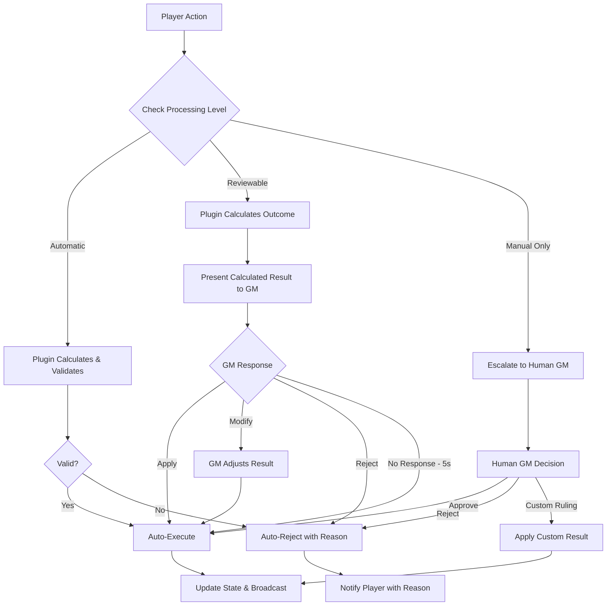

# GM-Authoritative State Management Architecture

## Executive Summary

### Problem Statement
Current state management proposals require complex server-side game logic (server plugins) to validate player actions and enforce game rules. This creates tight coupling between the server and specific game systems, increases deployment complexity, and makes the system harder to extend with new game mechanics or house rules.

### Solution: Client-Side Validation with Discretionary GM Control
This proposal introduces a **GM Client Validation** system where all game logic and rule enforcement happens on the GM's client, while the server remains a simple, game-agnostic message router and state store. The GM client automatically calculates and executes most player actions using plugin-based game rules, while providing GMs with **discretionary control** to intervene when narrative or tactical adjustments are needed.

### Key Benefits
1. **True Server Agnosticism**: Server has zero game knowledge and no plugins needed
2. **Automatic Rule Processing**: GM client calculates outcomes using game system plugins
3. **Discretionary GM Control**: GMs can intervene when story/balance requires it
4. **Transparent Automation**: GMs see calculated results and choose to apply/modify/reject
5. **Simplified Deployment**: No server-side game system dependencies
6. **Easy Extension**: New game systems only require client-side plugins

### Core Philosophy
> "The server is a table, not a referee. The GM client is the automated referee that calculates outcomes and presents options, giving the human GM discretionary control over the story."

## Core Architecture

### System Overview


### Validation Model

```typescript
interface ValidationModel {
  // Server Authority (Infrastructure Only)
  server: {
    messageRouting: true;
    stateStorage: true;
    sessionManagement: true;
    authentication: true;
    
    // VTT Infrastructure (Universal Concepts)
    inventoryManagement: true;        // Structure and storage
    documentRelationships: true;      // Actor-Item references
    assetManagement: true;           // Images, tokens, maps
    
    // NO game logic or validation
    combatRules: false;
    spellEffects: false;
    skillChecks: false;
    damageCalculation: false;
    actionValidation: false;
  };
  
  // GM Client Authority (Automated Processing + Discretionary Control)
  gmClient: {
    // Automated Processing (Most actions)
    automaticCalculation: true;     // Plugin calculates outcomes
    ruleValidation: true;           // Movement limits, resource costs, etc.
    outcomePresentation: true;      // Shows calculated results to GM
    conditionalExecution: true;     // Executes based on GM approval settings
    
    // Discretionary GM Control (When needed)
    resultModification: true;       // GM can adjust calculated outcomes
    narrativeOverride: true;        // Change results for story reasons
    difficultyAdjustment: true;     // Modify damage, saves, etc. on the fly
    customRulings: true;            // House rules and creative solutions
    
    // Ultimate Authority
    overrideAnyDecision: true;      // Human GM has final say
    configureAutomation: true;      // Set which actions need review
  };
  
  // Player Authority (Action Requests)
  player: {
    actionRequests: true;           // Can request any action
    characterControl: true;         // Normal gameplay actions
    uiPreferences: true;
    chatMessages: true;
    
    // Direct manipulation NOT allowed
    directStatChanges: false;       // Triggers manual review
    inventoryManipulation: false;   // Outside normal game rules
    ruleViolations: false;         // Automatically rejected or escalated
  };
}
```

### VTT Infrastructure vs Game Logic Distinction

The GM-Authoritative system distinguishes between **VTT Infrastructure** (universal concepts) and **Game Logic** (system-specific rules):

#### VTT Infrastructure (Server Understands)
```typescript
interface VTTInfrastructure {
  // Universal across all TTRPG systems
  inventory: {
    structure: true;         // itemId, quantity, equipped, slot
    relationships: true;     // Actor owns Items
    organization: true;      // Equip/unequip, move items
    validation: true;        // Referential integrity, data consistency
  };
  
  documents: {
    relationships: true;     // Actor-Item, Campaign-Document references
    assetLinks: true;       // Images, tokens, portraits
    storage: true;          // Efficient queries and updates
  };
  
  sessions: {
    playerManagement: true;  // Who's in the session
    messageRouting: true;   // Getting actions to GM
    stateSync: true;       // Broadcasting approved changes
  };
}
```

#### Game Logic (GM Controls)
```typescript
interface GameLogic {
  // System-specific rules that vary between RPGs
  actions: {
    whatActionsExist: true;      // Attack, cast spell, skill check
    whenActionsSucceed: true;    // Hit/miss, save/fail
    whatEffectsOccur: true;     // Damage, conditions, buffs
  };
  
  items: {
    whatItemsDo: true;          // Sword deals 1d8 damage
    whenItemsWork: true;        // Spell scroll requires arcane caster
    howItemsInteract: true;     // Magic item attunement rules
  };
  
  characters: {
    whatStatsExist: true;       // STR/DEX/CON vs Body/Mind/Soul
    howStatsWork: true;         // 3d6 vs d20+modifier
    whatAbilitiesExist: true;   // Class features, racial traits
  };
}
```

#### Validation Boundaries in Practice
```typescript
// ✅ Server can do (VTT Infrastructure)
server.inventory.equipItem(actorId, itemId, 'mainHand');
server.inventory.moveItem(fromActorId, toActorId, itemId, quantity);
server.documents.validateReferences(actor.inventory);

// ❌ Server cannot do (Game Logic)  
server.combat.calculateDamage(weapon, target);
server.spells.checkIfCanCast(spell, caster);
server.skills.rollCheck(skill, difficulty);

// 🤖 GM Client automatically validates and processes (98% of actions)
gmClient.validateAttack(attackerActor, targetActor, weapon);
gmClient.processSpellCasting(casterActor, spell, targets);
gmClient.rollDamage(weapon, attackRoll);
gmClient.applyDamage(targetActor, damageAmount);

// 🎯 Escalated to human GM (2% of actions)
// Player tries: "I want to set my HP to 999"
gmClient.escalateToHuman({
  type: 'suspicious_stat_change',
  action: 'direct HP modification outside game rules',
  requiresApproval: true
});

// GM setting: "Auto apply damage: disabled"  
gmClient.escalateToHuman({
  type: 'configurable_action',
  action: 'apply 15 damage to goblin',
  settingDisabled: 'auto_apply_damage'
});
```

This approach moves all game logic validation to the GM client while keeping the server focused on VTT infrastructure, ensuring seamless gameplay with automated rule enforcement.

## Socket Message Architecture & Type Safety

The GM-Authoritative system uses a hybrid approach for socket communication that balances type safety with architectural consistency:

### Event Classification

Events are classified into two categories based on their authority requirements:

#### Infrastructure Events (Direct Socket Events)
These events handle VTT infrastructure and don't require GM authority:
```typescript
// Current typed events remain unchanged
socket.emit('token:move', tokenMoveArgs);           // Position updates
socket.emit('actor:get', actorGetArgs);             // Data retrieval  
socket.emit('item:list', itemListArgs);             // Inventory access
socket.emit('chat', chatMessageArgs);               // Chat messages
socket.emit('map:generate', mapGenerateArgs);       // Map generation
```

#### Game Logic Events (Single Authority Event)
All game actions requiring GM approval use a single event with discriminated unions:
```typescript
socket.emit('action:request', actionRequest);
```

### Type Safety Through Discriminated Unions

The `action:request` event maintains full type safety using discriminated unions:

```typescript
// Base action request with discriminator
interface BaseActionRequest {
  type: string;
  playerId: string;
  sessionId: string;
  timestamp: number;
}

// Discriminated union of all game actions
type GameActionRequest = 
  | AttackActionRequest
  | SpellActionRequest  
  | SkillCheckActionRequest
  | ItemUseActionRequest
  | CreativeActionRequest;

// Specific action types with full type safety
interface AttackActionRequest extends BaseActionRequest {
  type: 'attack';
  data: {
    attackerId: string;
    targetId: string;
    weaponId: string;
    attackType: 'melee' | 'ranged' | 'spell';
    modifiers?: AttackModifier[];
  };
}

interface SpellActionRequest extends BaseActionRequest {
  type: 'cast_spell';
  data: {
    casterId: string;
    spellId: string;
    spellLevel: number;
    targets: string[];
    metamagic?: MetamagicOption[];
  };
}

interface SkillCheckActionRequest extends BaseActionRequest {
  type: 'skill_check';
  data: {
    actorId: string;
    skill: SkillType;
    difficulty?: number;
    advantage?: 'advantage' | 'disadvantage' | 'normal';
  };
}
```

### Type-Safe Event Handling

The system maintains type safety while keeping the server game-agnostic:

```typescript
// ✅ CORRECT: Server remains game-agnostic - just routes messages
socket.on('action:request', (request: GameActionRequest) => {
  // Server validates message structure but doesn't understand game semantics
  const session = getSession(request.sessionId);
  if (!session) {
    return socket.emit('action:error', { message: 'Invalid session' });
  }
  
  // Route to GM without understanding what the action is
  routeToGM(session.gmId, {
    type: 'action:pending',
    actionId: generateId(),
    request,
    timestamp: Date.now()
  });
  
  // Track for response routing
  pendingActions.set(actionId, { playerId: request.playerId, socketId: socket.id });
});

// ✅ CORRECT: GM client handles game logic with full type safety
const handleGMAction = (message: ActionMessage) => {
  const { request } = message;
  
  // GM client uses discriminated unions for type-safe handling
  switch (request.type) {
    case 'attack':
      // TypeScript knows this is AttackActionRequest
      return showAttackApprovalUI(request.data); // request.data is fully typed
      
    case 'cast_spell':
      // TypeScript knows this is SpellActionRequest
      return showSpellApprovalUI(request.data); // request.data is fully typed
      
    case 'skill_check':
      // TypeScript knows this is SkillCheckActionRequest
      return showSkillCheckApprovalUI(request.data); // request.data is fully typed
      
    default:
      // TypeScript ensures exhaustive checking
      const _exhaustive: never = request;
      throw new Error(`Unknown action type: ${(request as any).type}`);
  }
};
```

### Role Separation & Type Safety

The type safety architecture maintains clear role separation:

#### Server: Game-Agnostic Message Router
```typescript
class GameAgnosticServer {
  // Server only understands message structure, not content
  handleActionRequest(request: GameActionRequest) {
    // ✅ Server CAN do:
    // - Validate message schema
    validateSchema(gameActionRequestSchema, request);
    
    // - Route to appropriate GM
    const session = this.sessions.get(request.sessionId);
    this.routeToGM(session.gmId, request);
    
    // - Track pending actions for response routing
    this.pendingActions.set(request.id, request.playerId);
    
    // ❌ Server CANNOT do:
    // - Understand what 'attack' means
    // - Process spell effects  
    // - Calculate damage
    // - Apply game rules
  }
  
  handleGMDecision(decision: GMDecision) {
    // Server applies state changes blindly
    this.applyStateChanges(decision.stateChanges);
    
    // Broadcast results without understanding them
    this.broadcastToSession(decision.sessionId, {
      type: 'action:result',
      changes: decision.stateChanges
    });
  }
}
```

#### GM Client: Game Logic with Type Safety
```typescript  
class GMGameLogicHandler {
  // GM client understands game semantics with full type safety
  processActionRequest(request: GameActionRequest) {
    // TypeScript provides full type safety here
    switch (request.type) {
      case 'attack': {
        // TypeScript knows request.data is AttackData
        const { attackerId, targetId, weaponId } = request.data;
        
        // GM client can access game logic
        const attacker = this.getActor(attackerId);
        const target = this.getActor(targetId);
        const weapon = this.getItem(weaponId);
        
        // Use plugin for suggestions
        const result = this.plugin.calculateAttack(attacker, target, weapon);
        
        // Show GM approval UI with suggestions
        return this.showAttackApprovalUI({
          attacker,
          target, 
          weapon,
          suggestedResult: result,
          onApprove: (finalResult) => this.approveAction(request.id, finalResult),
          onReject: (reason) => this.rejectAction(request.id, reason)
        });
      }
      
      case 'cast_spell': {
        // TypeScript knows request.data is SpellData
        const { casterId, spellId, targets } = request.data;
        
        // Game logic with type safety
        const caster = this.getActor(casterId);
        const spell = this.getSpell(spellId);
        const targetActors = targets.map(id => this.getActor(id));
        
        return this.showSpellApprovalUI({
          caster,
          spell,
          targets: targetActors,
          // ... etc
        });
      }
    }
  }
}
```

#### Key Benefits of This Approach

1. **Server Simplicity**: No game logic, just message routing and state storage
2. **Full Type Safety**: TypeScript catches errors at compile time, Zod validates at runtime  
3. **Plugin Compatibility**: New game systems add actions without changing server code
4. **GM Authority**: All game decisions happen on GM client with full context
5. **Maintainability**: Clear separation of concerns between transport and game logic

### Client-Side Type Safety

Clients get full IntelliSense and compile-time checking:

```typescript
// Type-safe action creation
const attackAction: AttackActionRequest = {
  type: 'attack',
  playerId: currentPlayer.id,
  sessionId: currentSession.id,
  timestamp: Date.now(),
  data: {
    attackerId: character.id,
    targetId: goblin.id,
    weaponId: sword.id,
    attackType: 'melee', // TypeScript validates this enum
    modifiers: [{ type: 'flanking', value: 2 }] // Fully typed
  }
};

// Compile-time error prevention
socket.emit('action:request', attackAction); // ✅ Type safe

// This would cause TypeScript error:
const badAction = {
  type: 'attack',
  data: {
    attackerId: character.id,
    invalidField: 'oops' // ❌ TypeScript error
  }
};
```

### Schema Validation Integration

Zod schemas provide runtime validation that matches TypeScript types:

```typescript
// Zod schemas for runtime validation
const attackActionSchema = z.object({
  type: z.literal('attack'),
  playerId: z.string(),
  sessionId: z.string(),
  timestamp: z.number(),
  data: z.object({
    attackerId: z.string(),
    targetId: z.string(),
    weaponId: z.string(),
    attackType: z.enum(['melee', 'ranged', 'spell']),
    modifiers: z.array(attackModifierSchema).optional()
  })
});

const spellActionSchema = z.object({
  type: z.literal('cast_spell'),
  playerId: z.string(),
  sessionId: z.string(), 
  timestamp: z.number(),
  data: z.object({
    casterId: z.string(),
    spellId: z.string(),
    spellLevel: z.number().min(1).max(9),
    targets: z.array(z.string()),
    metamagic: z.array(metamagicOptionSchema).optional()
  })
});

// Union schema for validation
const gameActionRequestSchema = z.discriminatedUnion('type', [
  attackActionSchema,
  spellActionSchema,
  skillCheckActionSchema,
  // ... other action schemas
]);

// TypeScript types derived from schemas
type GameActionRequest = z.infer<typeof gameActionRequestSchema>;
type AttackActionRequest = z.infer<typeof attackActionSchema>;
```

### Benefits of This Approach

1. **Architectural Consistency**: Server remains game-agnostic while providing type safety
2. **Full Type Safety**: Complete IntelliSense and compile-time checking where it matters (GM client)
3. **Runtime Validation**: Zod schemas catch invalid data at transport layer
4. **True Server Agnosticism**: Server never needs to understand new game actions
5. **Plugin Compatibility**: New game systems add actions without changing server code
6. **GM Authority Preserved**: All game logic decisions happen on GM client with full context
7. **Maintainability**: Clear separation between message transport and game logic

### Socket Event Schema Updates

The existing socket schemas would be updated to include the new patterns:

```typescript
// packages/shared/src/schemas/socket/actions.mts
export const gameActionRequestSchema = z.discriminatedUnion('type', [
  attackActionSchema,
  spellActionSchema, 
  skillCheckActionSchema,
  itemUseActionSchema,
  creativeActionSchema
]);

// Updated client-to-server events
export const clientToServerEvents = z.object({
  // ... existing infrastructure events
  'action:request': z.function()
    .args(gameActionRequestSchema)
    .returns(z.void()),
  
  // ... other events remain unchanged
  'token:move': z.function().args(...tokenMoveArgsSchema.items).returns(z.void()),
  'actor:get': z.function().args(...actorGetArgsSchema.items).returns(z.void()),
});
```

This approach maintains the architectural benefits of a single authority event while preserving complete type safety and developer experience.

**Important**: The server uses these schemas only for message validation and routing. The discriminated union types ensure compile-time safety, but the server never executes the type-specific branches - that happens exclusively on the GM client where game logic belongs.

### Message Flow Example: Automatic Action (Movement)


### Message Flow Example: Reviewable Action (Combat Attack)


### Message Flow Example: Manual Only Action


## Progressive Authority Model

### Action Classification System

The system implements three tiers of action processing to balance automation with GM narrative control:

```typescript
enum ActionProcessingLevel {
  AUTOMATIC = "auto",        // Execute immediately after calculation
  REVIEWABLE = "review",     // Present options to GM
  MANUAL_ONLY = "manual"     // Always requires GM decision
}

interface PluginActionConfiguration {
  // Automatic Processing - Execute immediately (Most actions)
  [ActionProcessingLevel.AUTOMATIC]: [
    // Movement and positioning
    "movement",               // Walking, running within limits
    "token_positioning",      // Map positioning within bounds
    
    // Information and social
    "skill_checks",          // Ability and skill rolls
    "view_character_sheet", 
    "view_inventory",
    "chat_messages",
    
    // Turn management
    "end_turn",
    "delay_turn",
    "ready_action"
  ];
  
  // Reviewable - GM sees calculated result with modify/apply options
  [ActionProcessingLevel.REVIEWABLE]: [
    // Combat outcomes (for tactical/narrative control)
    "weapon_attack",         // Show hit/miss, damage calculated
    "spell_attack",          // Show spell effects calculated
    "apply_damage",          // Show damage amount, allow modification
    "saving_throws",         // Show results, allow rerolls/adjustments
    "initiative_rolls",      // Show rolled initiatives
    
    // Resource changes (for balance control)  
    "consume_spell_slot",    // Show resource usage
    "consume_item",          // Show item effects
    "death_saves",           // Show death save results
    "level_up",              // Show level progression
  ];
  
  // Manual Only - Always escalate to human GM
  [ActionProcessingLevel.MANUAL_ONLY]: [
    "direct_stat_changes",   // Player manually editing stats
    "add_remove_items",      // Outside normal acquisition
    "rule_violations",       // Actions that break game rules  
    "creative_solutions",    // "I want to try..." edge cases
    "house_rule_requests",   // Custom interpretations
  ];
}

// Plugin hook for configuring action processing
interface PluginValidationHooks {
  // Define which actions need review vs auto-execution
  getActionProcessingLevel(action: GameAction): ActionProcessingLevel;
  
  // Calculate outcomes for reviewable actions
  calculateActionOutcome(action: GameAction): CalculatedOutcome;
  
  // Validate if automatic actions are legal
  validateAutomaticAction(action: GameAction): ValidationResult;
}
```

### Plugin Action Classification System

Game system plugins define their own action processing rules through configuration:

```typescript
// Example D&D 5e plugin configuration
class DnD5ePlugin implements PluginValidationHooks {
  private actionClassification = new Map<string, ActionProcessingLevel>([
    // Automatic - No GM intervention needed
    ['movement', ActionProcessingLevel.AUTOMATIC],
    ['skill_check', ActionProcessingLevel.AUTOMATIC], 
    ['ability_check', ActionProcessingLevel.AUTOMATIC],
    ['view_sheet', ActionProcessingLevel.AUTOMATIC],
    ['chat_message', ActionProcessingLevel.AUTOMATIC],
    ['end_turn', ActionProcessingLevel.AUTOMATIC],
    
    // Reviewable - GM sees calculated results, can modify
    ['weapon_attack', ActionProcessingLevel.REVIEWABLE],
    ['spell_attack', ActionProcessingLevel.REVIEWABLE],
    ['apply_damage', ActionProcessingLevel.REVIEWABLE],
    ['saving_throw', ActionProcessingLevel.REVIEWABLE],
    ['death_save', ActionProcessingLevel.REVIEWABLE],
    ['consume_spell_slot', ActionProcessingLevel.REVIEWABLE],
    ['level_up', ActionProcessingLevel.REVIEWABLE],
    
    // Manual Only - Always requires GM decision
    ['direct_stat_change', ActionProcessingLevel.MANUAL_ONLY],
    ['add_item', ActionProcessingLevel.MANUAL_ONLY],
    ['remove_item', ActionProcessingLevel.MANUAL_ONLY],
    ['custom_action', ActionProcessingLevel.MANUAL_ONLY]
  ]);
  
  // GM can override plugin defaults via settings
  private gmOverrides = new Map<string, ActionProcessingLevel>();
  
  getActionProcessingLevel(action: GameAction): ActionProcessingLevel {
    // Check GM overrides first
    const override = this.gmOverrides.get(action.type);
    if (override) return override;
    
    // Fall back to plugin defaults
    return this.actionClassification.get(action.type) ?? ActionProcessingLevel.MANUAL_ONLY;
  }
  
  calculateActionOutcome(action: GameAction): CalculatedOutcome {
    switch (action.type) {
      case 'weapon_attack':
        return this.calculateAttackOutcome(action as WeaponAttackAction);
      case 'spell_attack':
        return this.calculateSpellOutcome(action as SpellAttackAction);
      case 'saving_throw':
        return this.calculateSaveOutcome(action as SavingThrowAction);
      default:
        throw new Error(`No calculation logic for action type: ${action.type}`);
    }
  }
  
  private calculateAttackOutcome(action: WeaponAttackAction): AttackOutcome {
    const attacker = this.getActor(action.attackerId);
    const target = this.getActor(action.targetId);
    const weapon = this.getItem(action.weaponId);
    
    // Calculate attack roll
    const attackRoll = this.rollD20() + attacker.attackBonus + weapon.attackBonus;
    const hits = attackRoll >= target.armorClass;
    
    if (!hits) {
      return {
        type: 'miss',
        description: `Attack misses (rolled ${attackRoll} vs AC ${target.armorClass})`,
        changes: [],
        consequences: ['No damage taken']
      };
    }
    
    // Calculate damage
    const damageRoll = this.rollDice(weapon.damage.dice) + weapon.damage.bonus;
    const isCritical = this.d20Roll >= 20;
    const finalDamage = isCritical ? damageRoll * 2 : damageRoll;
    
    const newHP = Math.max(0, target.hitPoints - finalDamage);
    const isDead = newHP === 0;
    
    return {
      type: 'hit',
      description: `${weapon.name} hits for ${finalDamage} damage${isCritical ? ' (critical!)' : ''}`,
      changes: [
        { actorId: target.id, field: 'hitPoints', oldValue: target.hitPoints, newValue: newHP }
      ],
      consequences: [
        `Target takes ${finalDamage} ${weapon.damage.type} damage`,
        `${target.name}: ${target.hitPoints} → ${newHP} HP`,
        ...(isDead ? [`${target.name} drops to 0 HP`] : [])
      ]
    };
  }
}

// Alternative game system with different philosophy
class NarrativeSystemPlugin implements PluginValidationHooks {
  // More actions require GM input for narrative control
  private actionClassification = new Map<string, ActionProcessingLevel>([
    // Only basic actions are automatic  
    ['movement', ActionProcessingLevel.AUTOMATIC],
    ['chat_message', ActionProcessingLevel.AUTOMATIC],
    
    // Most actions are reviewable for narrative control
    ['attempt_action', ActionProcessingLevel.REVIEWABLE],
    ['use_skill', ActionProcessingLevel.REVIEWABLE], 
    ['dramatic_moment', ActionProcessingLevel.REVIEWABLE],
    ['social_interaction', ActionProcessingLevel.REVIEWABLE],
    
    // Character changes always manual
    ['change_trait', ActionProcessingLevel.MANUAL_ONLY],
    ['narrative_declaration', ActionProcessingLevel.MANUAL_ONLY]
  ]);
  
  // Different calculation approach - more narrative focused
  calculateActionOutcome(action: GameAction): CalculatedOutcome {
    return {
      type: 'narrative_suggestion',
      description: `Suggested outcome based on character traits and situation`,
      changes: [], // Fewer mechanical changes
      consequences: ['Success creates new narrative opportunities']
    };
  }
}
```

#### Plugin Configuration Interface

```typescript
interface PluginActionConfig {
  // Define processing levels for each action type
  actionLevels: Map<string, ActionProcessingLevel>;
  
  // Allow GM to override plugin defaults
  allowGMOverrides: boolean;
  
  // Define which actions can be batched together
  batchableActions: string[];
  
  // Timeout settings for different action types
  reviewTimeouts: Map<ActionProcessingLevel, number>;
}

// GM interface for configuring plugin behavior
interface GMPluginSettings {
  [pluginId: string]: {
    // Override specific action processing levels
    actionOverrides: Map<string, ActionProcessingLevel>;
    
    // Plugin-specific settings
    customSettings: Record<string, any>;
    
    // Enable/disable plugin automation features
    automationFeatures: {
      [featureName: string]: boolean;
    };
  };
}
```

### Action Processing Flow



### Transparent Control Interface Design

The GM interface provides clear visibility into calculated results with intuitive modification options:

#### Action Review Interface

```typescript
interface ActionReviewUI {
  // Calculated outcome display
  outcome: {
    title: string;           // "Attack Result" 
    description: string;     // "Longsword hits Orc for 8 damage"
    calculatedResult: any;   // Structured result data
    consequences: string[];  // ["Orc drops to 0 HP", "Orc dies"]
  };
  
  // GM control options
  actions: {
    apply: {
      label: "Apply";
      tooltip: "Execute calculated result";
      hotkey: "Enter";
    };
    modify: {
      label: "Modify";
      tooltip: "Adjust damage, effects, or outcomes";
      hotkey: "M";
      fields: ModificationField[];
    };
    reject: {
      label: "Reject"; 
      tooltip: "Cancel this action";
      hotkey: "R";
    };
  };
  
  // Context for decision making
  context: {
    player: string;          // "Alice"
    character: string;       // "Thorin Ironbeard"
    target: string;          // "Orc Warrior"
    gameState: string;       // "Combat Round 3, Turn 2"
  };
}

interface ModificationField {
  field: string;             // "damage", "target", "effect"
  currentValue: any;         // 8, "orc-1", "death"
  suggestedValues?: any[];   // [1, 2, 3, 4, 5, 6, 7, 8]
  type: 'number' | 'select' | 'text';
  label: string;             // "Damage Amount"
  reasoning?: string;        // "Reduce to keep orc alive"
}
```

#### GM Interface Examples

**Attack Result Review:**
```
┌─ Attack Result ─────────────────────────────────┐
│ Alice's Thorin attacks Orc Warrior             │
│ Longsword hits AC 15 (rolled 18) ✓             │
│ Damage: 8 piercing (2d6+3, rolled 5,3)        │
│                                                 │
│ Consequences:                                   │
│ • Orc drops from 15 HP → 7 HP                  │
│ • Orc remains conscious                         │
│                                                 │
│ [Apply] [Modify...] [Reject]                    │
└─────────────────────────────────────────────────┘
```

**Modification Interface:**
```
┌─ Modify Attack Result ──────────────────────────┐
│ Damage: [8] → [___] (1-12 reasonable)           │
│ Effect: [Normal] ▼ [Stunned/Prone/etc.]         │
│ Target: [Orc] → [___] (redirect attack)         │
│                                                 │
│ Reason: [Keep orc alive for interrogation____] │
│                                                 │
│ [Apply Changes] [Cancel]                        │
└─────────────────────────────────────────────────┘
```

**Spell Effect Review:**
```
┌─ Spell Result ──────────────────────────────────┐
│ Bob's Wizard casts Fireball                     │
│ 3 targets in 20ft radius                       │
│                                                 │
│ Orc 1: 28 fire damage (DC 15 Dex save: 8) ✗    │
│ Orc 2: 14 fire damage (DC 15 Dex save: 16) ✓   │
│ Goblin: 28 fire damage (DC 15 Dex save: 11) ✗  │
│                                                 │
│ Consequences:                                   │
│ • Orc 1: 28 → 0 HP (dies)                      │
│ • Orc 2: 15 → 1 HP (unconscious)               │
│ • Goblin: 7 → 0 HP (dies)                      │
│                                                 │
│ [Apply] [Modify Damage...] [Reject]             │
└─────────────────────────────────────────────────┘
```

#### Design Principles

1. **Calculated First**: Always show what the rules determine happened
2. **Clear Consequences**: Explicitly state the game state changes  
3. **Easy Approval**: Default action (Apply) is prominently placed
4. **Intuitive Modification**: Common adjustments (damage, targeting) are one click away
5. **Contextual Information**: Show relevant game state for informed decisions
6. **Fast Interaction**: Keyboard shortcuts for common actions
7. **Reversible**: Actions can be undone if needed

### GM Client Configuration

```typescript
interface GMClientSettings {
  // Automation settings
  automation: {
    autoApplyDamage: boolean;        // Default: true
    autoApplyHealing: boolean;       // Default: true
    autoConsumeResources: boolean;   // Default: true (spell slots, ammo)
    autoLevelUp: boolean;           // Default: false
    autoDeathSaves: boolean;        // Default: true
    autoInitiative: boolean;        // Default: true
  };
  
  // Escalation thresholds
  escalation: {
    suspiciousActionThreshold: number;     // How many weird actions before escalation
    rapidActionThreshold: number;         // Actions per second that trigger review
    statChangeThreshold: number;          // Stat changes that trigger manual review
    inventoryChangeThreshold: number;     // Inventory changes outside rules
  };
  
  // Quick approval settings (for configurable actions)
  quickApproval: {
    enabled: boolean;                     // Show quick approve buttons
    timeout: number;                      // Seconds before auto-approve
    showPreview: boolean;                 // Show what will happen
    batchSimilar: boolean;               // Group similar actions
  };
  
  // Plugin-specific overrides
  pluginSettings: {
    [pluginId: string]: {
      validationLevel: {
        [actionType: string]: ValidationLevel;
      };
      customRules: {
        [ruleName: string]: boolean;      // House rules toggle
      };
    };
  };
  
  // Player-specific settings
  playerSettings: {
    [playerId: string]: {
      suspicionLevel: "low" | "normal" | "high";  // How much to watch this player
      allowDirectEdits: boolean;                  // Can they edit character sheets
      exemptFromEscalation: string[];            // Actions that don't escalate for this player
    };
  };
}
```

## Implementation Details

### Aggregate Architecture Integration

The GM-Authoritative system uses a two-layer aggregate pattern to maintain clear separation between runtime and persistence concerns:

```typescript
// GameSession - Runtime Aggregate (manages socket.io and active gameplay)
class GameSession {
  id: string;                    // Used as socket.io room ID
  campaignId: string;
  gmSocketId: string;
  playerSockets: Map<string, string>;
  private campaign: Campaign;    // References persistent aggregate
  
  // Runtime state (not persisted in database)
  private currentMapId?: string;
  private mapViewState?: MapViewState;
  private activeEncounter?: EncounterState;
  private pendingActions: ActionMessage[] = [];
  private playerPermissions: Map<string, SessionPermissions> = new Map();
  private sessionSettings: SessionSettings = {};
  
  broadcastToRoom(event: string, data: any) {
    io.to(this.id).emit(event, data);  // Uses session ID as room
  }
  
  async performInfrastructureAction(action: InfrastructureAction) {
    // Validate within session context
    const result = await this.campaign.performInfrastructureAction(action);
    this.broadcastToRoom('infrastructure:updated', result);
    return result;
  }
  
  // Map state management
  async setCurrentMap(mapId: string, gmId: string): Promise<void> {
    // Validate GM authority
    if (this.getPlayerRole(gmId) !== 'gm') {
      throw new Error('Only GM can change maps');
    }
    
    this.currentMapId = mapId;
    this.mapViewState = await this.initializeMapViewState(mapId);
    
    // Broadcast map change to all players
    this.broadcastToRoom('map:changed', {
      mapId,
      viewState: this.mapViewState,
      timestamp: Date.now()
    });
  }
  
  async updateMapViewState(viewState: MapViewState, playerId: string): Promise<void> {
    // Check if player can update map view (usually GM only)
    const permissions = this.playerPermissions.get(playerId);
    if (!permissions?.canMoveTokens && this.getPlayerRole(playerId) !== 'gm') {
      throw new Error('Insufficient permissions to update map view');
    }
    
    this.mapViewState = { ...this.mapViewState, ...viewState };
    
    // Broadcast view state change
    this.broadcastToRoom('map:view-updated', {
      viewState: this.mapViewState,
      updatedBy: playerId,
      timestamp: Date.now()
    });
  }
  
  async moveToken(tokenId: string, position: { x: number; y: number }, playerId: string): Promise<void> {
    // Validate token movement permissions
    const canMove = await this.canPlayerMoveToken(playerId, tokenId);
    if (!canMove) {
      throw new Error('Cannot move this token');
    }
    
    // Update token position (this would typically update the database)
    await TokenModel.findByIdAndUpdate(tokenId, { position });
    
    // Broadcast token movement to all players
    this.broadcastToRoom('token:moved', {
      tokenId,
      position,
      movedBy: playerId,
      timestamp: Date.now()
    });
  }
  
  // Encounter state management
  async startEncounter(encounterData: EncounterSetup, gmId: string): Promise<void> {
    if (this.getPlayerRole(gmId) !== 'gm') {
      throw new Error('Only GM can start encounters');
    }
    
    this.activeEncounter = {
      id: encounterData.encounterId,
      initiativeOrder: encounterData.initiativeOrder,
      currentTurn: 0,
      round: 1,
      phase: 'setup',
      participants: encounterData.participants,
      combatState: 'pending',
      turnTimeLimit: encounterData.turnTimeLimit
    };
    
    // Broadcast encounter start to all players
    this.broadcastToRoom('encounter:started', {
      encounter: await this.getEncounterStateForBroadcast(),
      timestamp: Date.now()
    });
  }
  
  async advanceTurn(gmId: string): Promise<void> {
    if (this.getPlayerRole(gmId) !== 'gm') {
      throw new Error('Only GM can advance turns');
    }
    
    if (!this.activeEncounter) {
      throw new Error('No active encounter');
    }
    
    // Advance to next turn
    this.activeEncounter.currentTurn = 
      (this.activeEncounter.currentTurn + 1) % this.activeEncounter.initiativeOrder.length;
    
    // If we've cycled through all players, advance round
    if (this.activeEncounter.currentTurn === 0) {
      this.activeEncounter.round++;
    }
    
    // Broadcast turn advancement
    this.broadcastToRoom('encounter:turn-advanced', {
      currentTurn: this.activeEncounter.currentTurn,
      round: this.activeEncounter.round,
      currentPlayer: this.activeEncounter.initiativeOrder[this.activeEncounter.currentTurn],
      timestamp: Date.now()
    });
  }
  
  async endEncounter(gmId: string): Promise<void> {
    if (this.getPlayerRole(gmId) !== 'gm') {
      throw new Error('Only GM can end encounters');
    }
    
    const encounterId = this.activeEncounter?.id;
    this.activeEncounter = undefined;
    
    // Broadcast encounter end
    this.broadcastToRoom('encounter:ended', {
      encounterId,
      timestamp: Date.now()
    });
  }
  
  // Session state management
  async updateSessionSettings(settings: Partial<SessionSettings>, gmId: string): Promise<void> {
    if (this.getPlayerRole(gmId) !== 'gm') {
      throw new Error('Only GM can update session settings');
    }
    
    this.sessionSettings = { ...this.sessionSettings, ...settings };
    
    // Broadcast settings update
    this.broadcastToRoom('session:settings-updated', {
      settings: this.sessionSettings,
      timestamp: Date.now()
    });
  }
  
  async updatePlayerPermissions(playerId: string, permissions: Partial<SessionPermissions>, gmId: string): Promise<void> {
    if (this.getPlayerRole(gmId) !== 'gm') {
      throw new Error('Only GM can update player permissions');
    }
    
    const currentPermissions = this.playerPermissions.get(playerId) || {};
    this.playerPermissions.set(playerId, { ...currentPermissions, ...permissions });
    
    // Broadcast permission update to specific player and GM
    this.broadcastToRoom('session:permissions-updated', {
      playerId,
      permissions: this.playerPermissions.get(playerId),
      timestamp: Date.now()
    });
  }
  
  // Comprehensive state reconstitution for session join
  async getCompleteSessionState(playerId: string): Promise<CompleteSessionState> {
    // Get persistent campaign data
    const campaignData = await this.campaign.getFullCampaignData();
    
    // Get player's character data with inventory
    const playerCharacters = await this.getPlayerCharacters(playerId);
    
    // Get current map state if active
    const mapState = this.currentMapId ? await this.getCurrentMapState(playerId) : null;
    
    // Get encounter state if active
    const encounterState = this.activeEncounter ? 
      await this.getEncounterStateForPlayer(playerId) : null;
    
    // Get session-specific runtime state
    const runtimeState = this.getRuntimeSessionState(playerId);
    
    return {
      // Persistent campaign data
      campaign: campaignData,
      characters: playerCharacters,
      
      // Runtime session state
      sessionId: this.id,
      currentMap: mapState,
      activeEncounter: encounterState,
      playerPermissions: this.playerPermissions.get(playerId),
      sessionSettings: this.sessionSettings,
      
      // GM action queue (filtered for player)
      pendingActions: this.getPendingActionsForPlayer(playerId),
      
      // Connected players
      connectedPlayers: Array.from(this.playerSockets.keys()),
      
      // State synchronization info
      stateVersion: this.getStateVersion(),
      lastUpdated: Date.now()
    };
  }
  
  private async getCurrentMapState(playerId: string): Promise<MapState> {
    const map = await MapModel.findById(this.currentMapId);
    const playerPermissions = this.playerPermissions.get(playerId);
    
    return {
      mapId: this.currentMapId!,
      mapData: map?.toObject(),
      viewState: this.mapViewState,
      tokens: await this.getVisibleTokens(playerId),
      revealedAreas: playerPermissions?.revealedAreas || [],
      fogOfWar: playerPermissions?.fogOfWarEnabled ?? true,
      playerPermissions: {
        canMoveTokens: playerPermissions?.canMoveTokens ?? false,
        canRevealAreas: playerPermissions?.canRevealAreas ?? false,
        viewRestrictedAreas: playerPermissions?.viewRestrictedAreas ?? false
      }
    };
  }
  
  private async getEncounterStateForPlayer(playerId: string): Promise<EncounterState | null> {
    if (!this.activeEncounter) return null;
    
    const playerCharacterIds = await this.getPlayerCharacterIds(playerId);
    
    return {
      encounterId: this.activeEncounter.id,
      initiativeOrder: this.activeEncounter.initiativeOrder,
      currentTurn: this.activeEncounter.currentTurn,
      round: this.activeEncounter.round,
      phase: this.activeEncounter.phase,
      
      // Player-specific encounter data
      playerCharacters: this.activeEncounter.participants
        .filter(p => playerCharacterIds.includes(p.characterId)),
      
      // Visible effects (based on player permissions)
      activeEffects: this.getVisibleEffects(playerId),
      
      // Combat state
      combatState: this.activeEncounter.combatState,
      
      // Turn management
      turnState: {
        isPlayerTurn: this.isPlayerTurn(playerId),
        canAct: this.canPlayerAct(playerId),
        actionsRemaining: this.getPlayerActionsRemaining(playerId),
        timeRemaining: this.activeEncounter.turnTimeLimit
      }
    };
  }
  
  private getRuntimeSessionState(playerId: string): RuntimeSessionState {
    return {
      playerRole: this.getPlayerRole(playerId),
      sessionPhase: this.getSessionPhase(),
      isPaused: this.sessionSettings.isPaused ?? false,
      allowPlayerActions: this.sessionSettings.allowPlayerActions ?? true,
      
      // Communication state
      voiceChatEnabled: this.sessionSettings.voiceChatEnabled ?? false,
      textChatEnabled: this.sessionSettings.textChatEnabled ?? true,
      
      // Game-specific runtime state
      pluginRuntimeData: this.getPluginRuntimeData(playerId)
    };
  }
  
  private getPendingActionsForPlayer(playerId: string): ActionMessage[] {
    // Return actions where player is involved or has visibility
    return this.pendingActions.filter(action => 
      action.playerId === playerId || 
      this.playerCanSeeAction(playerId, action)
    );
  }
}

// Type definitions for comprehensive session state
interface CompleteSessionState {
  // Persistent campaign data
  campaign: CampaignData;
  characters: PlayerCharacterData[];
  
  // Runtime session state
  sessionId: string;
  currentMap: MapState | null;
  activeEncounter: EncounterState | null;
  playerPermissions: SessionPermissions | undefined;
  sessionSettings: SessionSettings;
  
  // GM action queue (filtered for player)
  pendingActions: ActionMessage[];
  
  // Connected players
  connectedPlayers: string[];
  
  // State synchronization info
  stateVersion: string;
  lastUpdated: number;
}

interface MapState {
  mapId: string;
  mapData: any; // Map document data
  viewState?: MapViewState;
  tokens: TokenData[];
  revealedAreas: Area[];
  fogOfWar: boolean;
  playerPermissions: MapPermissions;
}

interface MapViewState {
  centerX: number;
  centerY: number;
  zoom: number;
  rotation: number;
}

interface EncounterState {
  encounterId: string;
  initiativeOrder: InitiativeEntry[];
  currentTurn: number;
  round: number;
  phase: 'setup' | 'combat' | 'resolution';
  
  // Player-specific encounter data
  playerCharacters: EncounterParticipant[];
  
  // Visible effects (based on player permissions)
  activeEffects: Effect[];
  
  // Combat state
  combatState: CombatState;
  
  // Turn management
  turnState: TurnState;
}

interface SessionPermissions {
  canMoveTokens: boolean;
  canRevealAreas: boolean;
  viewRestrictedAreas: boolean;
  revealedAreas: Area[];
  fogOfWarEnabled: boolean;
}

interface SessionSettings {
  isPaused?: boolean;
  allowPlayerActions?: boolean;
  voiceChatEnabled?: boolean;
  textChatEnabled?: boolean;
  turnTimeLimit?: number;
}

interface RuntimeSessionState {
  playerRole: 'gm' | 'player';
  sessionPhase: 'lobby' | 'active' | 'paused' | 'ended';
  isPaused: boolean;
  allowPlayerActions: boolean;
  
  // Communication state
  voiceChatEnabled: boolean;
  textChatEnabled: boolean;
  
  // Game-specific runtime state
  pluginRuntimeData: Record<string, unknown>;
}

### Comprehensive State Broadcasting Patterns

The GameSession aggregate provides different broadcasting patterns for different types of state changes to ensure all clients remain synchronized:

```typescript
// Broadcasting pattern definitions for different state types
class GameSessionBroadcaster {
  
  // 1. Immediate broadcast - for real-time actions
  broadcastImmediate(event: string, data: any, excludePlayer?: string) {
    const recipients = excludePlayer ? 
      this.playerSockets.keys().filter(id => id !== excludePlayer) :
      this.playerSockets.keys();
    
    recipients.forEach(playerId => {
      io.to(`user:${playerId}`).emit(event, data);
    });
  }
  
  // 2. Batched broadcast - for multiple related changes
  batchedBroadcast: Map<string, any[]> = new Map();
  
  addToBatch(batchId: string, event: string, data: any) {
    if (!this.batchedBroadcast.has(batchId)) {
      this.batchedBroadcast.set(batchId, []);
    }
    this.batchedBroadcast.get(batchId)!.push({ event, data });
  }
  
  flushBatch(batchId: string) {
    const batch = this.batchedBroadcast.get(batchId);
    if (batch) {
      this.broadcastToRoom('batch:state-changes', {
        batchId,
        changes: batch,
        timestamp: Date.now()
      });
      this.batchedBroadcast.delete(batchId);
    }
  }
  
  // 3. Player-specific broadcast - different data per player
  broadcastPlayerSpecific(baseEvent: string, dataGenerator: (playerId: string) => any) {
    for (const playerId of this.playerSockets.keys()) {
      const playerData = dataGenerator(playerId);
      io.to(`user:${playerId}`).emit(baseEvent, playerData);
    }
  }
  
  // 4. State synchronization broadcast - for out-of-sync clients
  async broadcastFullStateSync(targetPlayerId?: string) {
    const recipients = targetPlayerId ? [targetPlayerId] : Array.from(this.playerSockets.keys());
    
    for (const playerId of recipients) {
      const fullState = await this.getCompleteSessionState(playerId);
      io.to(`user:${playerId}`).emit('session:full-state-sync', {
        state: fullState,
        reason: 'sync_requested',
        timestamp: Date.now()
      });
    }
  }
  
  // 5. Permission-based broadcast - filtered by what players can see
  broadcastWithPermissions(event: string, data: any, permissionCheck: (playerId: string) => boolean) {
    for (const playerId of this.playerSockets.keys()) {
      if (permissionCheck(playerId)) {
        io.to(`user:${playerId}`).emit(event, data);
      }
    }
  }
}

// Specific broadcasting implementations for different state types
class StateChangePatterns extends GameSessionBroadcaster {
  
  // Character/Actor state changes
  async broadcastCharacterUpdate(characterId: string, changes: any, updatedBy: string) {
    // Get all players who can see this character
    const visibleToPlayers = await this.getPlayersWhoCanSeeCharacter(characterId);
    
    this.broadcastWithPermissions('character:updated', {
      characterId,
      changes,
      updatedBy,
      timestamp: Date.now()
    }, (playerId) => visibleToPlayers.includes(playerId));
  }
  
  // Inventory changes (uses universal inventory system)
  async broadcastInventoryChange(actorId: string, inventoryChange: InventoryChange, playerId: string) {
    // Inventory changes are visible to character owner and GM
    const characterOwner = await this.getCharacterOwner(actorId);
    
    this.broadcastWithPermissions('inventory:changed', {
      actorId,
      change: inventoryChange,
      changedBy: playerId,
      timestamp: Date.now()
    }, (recipientId) => 
      recipientId === characterOwner || this.getPlayerRole(recipientId) === 'gm'
    );
  }
  
  // Map state changes with fog of war considerations
  async broadcastMapUpdate(mapUpdate: MapUpdate, updatedBy: string) {
    // Different players see different parts of map updates based on fog of war
    this.broadcastPlayerSpecific('map:updated', (playerId) => {
      const playerPermissions = this.playerPermissions.get(playerId);
      return {
        ...mapUpdate,
        // Filter revealed areas based on player permissions
        revealedAreas: mapUpdate.revealedAreas?.filter(area => 
          playerPermissions?.revealedAreas.some(playerArea => 
            this.areasOverlap(area, playerArea)
          )
        ),
        // Hide tokens that aren't visible to this player
        tokens: mapUpdate.tokens?.filter(token => 
          this.canPlayerSeeToken(playerId, token)
        ),
        updatedBy,
        timestamp: Date.now()
      };
    });
  }
  
  // Encounter state changes with player-specific visibility
  async broadcastEncounterUpdate(encounterUpdate: EncounterUpdate, updatedBy: string) {
    this.broadcastPlayerSpecific('encounter:updated', (playerId) => {
      const playerCharacterIds = this.getPlayerCharacterIds(playerId);
      
      return {
        ...encounterUpdate,
        // Filter to only show participants visible to this player
        participants: encounterUpdate.participants?.filter(participant =>
          playerCharacterIds.includes(participant.characterId) ||
          this.canPlayerSeeParticipant(playerId, participant)
        ),
        // Filter effects based on visibility rules
        activeEffects: encounterUpdate.activeEffects?.filter(effect =>
          this.canPlayerSeeEffect(playerId, effect)
        ),
        updatedBy,
        timestamp: Date.now()
      };
    });
  }
  
  // GM action queue updates
  broadcastGMActionUpdate(action: ActionMessage, status: 'pending' | 'approved' | 'rejected') {
    // Broadcast to action originator and GM
    const recipients = [action.playerId];
    if (this.getPlayerRole(action.playerId) !== 'gm') {
      recipients.push(this.getGMId());
    }
    
    recipients.forEach(playerId => {
      io.to(`user:${playerId}`).emit('action:status-updated', {
        actionId: action.id,
        status,
        result: status === 'approved' ? action.result : undefined,
        timestamp: Date.now()
      });
    });
  }
  
  // Player connection state changes
  broadcastPlayerConnectionChange(playerId: string, status: 'joined' | 'left' | 'disconnected') {
    this.broadcastToRoom('player:connection-changed', {
      playerId,
      status,
      connectedPlayers: Array.from(this.playerSockets.keys()),
      timestamp: Date.now()
    });
  }
  
  // Session lifecycle events
  broadcastSessionStateChange(newPhase: 'lobby' | 'active' | 'paused' | 'ended', reason?: string) {
    this.broadcastToRoom('session:phase-changed', {
      phase: newPhase,
      reason,
      settings: this.sessionSettings,
      timestamp: Date.now()
    });
  }
  
  // Error and warning broadcasts
  broadcastError(error: string, targetPlayer?: string, severity: 'error' | 'warning' | 'info' = 'error') {
    const event = `session:${severity}`;
    const data = {
      message: error,
      timestamp: Date.now()
    };
    
    if (targetPlayer) {
      io.to(`user:${targetPlayer}`).emit(event, data);
    } else {
      this.broadcastToRoom(event, data);
    }
  }
}
```

### State Consistency Guarantees

The broadcasting system ensures state consistency through several mechanisms:

1. **Ordered Updates**: All state changes are timestamped and clients apply changes in timestamp order
2. **State Versioning**: Each broadcast includes a state version to detect out-of-sync clients  
3. **Automatic Resync**: Clients that detect version mismatch request full state synchronization
4. **Transactional Batches**: Related changes are batched together to prevent partial state updates
5. **Permission Filtering**: Each player receives only the state changes they're authorized to see

// Campaign - Persistence Aggregate (ensures data integrity)
class Campaign {
  id: string;
  gmId: string;
  name: string;
  pluginId: string;
  pluginData: Record<string, unknown>;  // Global plugin-specific state
  
  // Campaign-scoped invariants
  async performInfrastructureAction(action: InfrastructureAction) {
    await this.validateCampaignBoundaries(action);
    await this.enforceInventoryIntegrity(action);
    return await this.applyInfrastructureChange(action);
  }
  
  private async validateCampaignBoundaries(action: InfrastructureAction) {
    // Ensure all actors/items belong to this campaign
    if (action.actorId && !await this.ownsActor(action.actorId)) {
      throw new Error('Actor not in campaign');
    }
    if (action.itemId && !await this.ownsItem(action.itemId)) {
      throw new Error('Item not in campaign');
    }
  }
}
```

### Server Implementation (Minimal)

```typescript
// Server handles VTT infrastructure and routes game logic to GM
class GMAuthoritativeServer {
  private sessions = new Map<string, GameSession>();
  private campaigns = new Map<string, Campaign>();
  private messageQueues = new Map<string, ActionMessage[]>();
  private inventoryService = new UniversalInventoryService();
  
  async handlePlayerAction(
    playerId: string, 
    action: PlayerAction
  ): Promise<void> {
    const session = this.getPlayerSession(playerId);
    if (!session) throw new Error('Not in a session');
    
    // Check if this is VTT infrastructure or game logic
    if (this.isInfrastructureAction(action)) {
      // Handle infrastructure through aggregates
      await this.handleInfrastructureActionThroughAggregates(session, playerId, action);
      return;
    }
    
    // Create message for GM approval
    const message: ActionMessage = {
      id: generateId(),
      playerId,
      sessionId: session.id,
      action,
      timestamp: Date.now(),
      status: 'pending'
    };
    
    // Queue for GM
    this.queueForGM(session.gmId, message);
    
    // Notify GM client
    this.sendToClient(session.gmId, 'action:pending', message);
    
    // Track for player
    this.pendingActions.set(message.id, playerId);
  }
  
  private isInfrastructureAction(action: PlayerAction): boolean {
    // VTT infrastructure actions that server can handle directly
    const infrastructureActions = [
      // Inventory Management (Universal VTT Concepts)
      'equip_item', 'unequip_item', 'organize_inventory',
      'add_to_inventory', 'remove_from_inventory', 'update_inventory_quantity',
      'move_inventory_item', 'sort_inventory',
      
      // Information Access (No State Changes)
      'view_character_sheet', 'view_inventory', 'view_item_details',
      'view_map', 'view_compendium',
      
      // Basic Positioning (Spatial Infrastructure)
      'basic_movement', 'update_token_position', 'change_facing',
      
      // Asset Management (File System Operations)
      'upload_character_portrait', 'upload_token_image', 'update_map_asset',
      
      // UI State (Client-Side Only)
      'organize_ui', 'save_layout_preferences', 'update_display_settings'
    ];
    
    return infrastructureActions.includes(action.type);
  }
  
  private async handleInfrastructureActionThroughAggregates(
    session: GameSession,
    playerId: string, 
    action: PlayerAction
  ): Promise<void> {
    
    try {
      let result: any;
      
      switch (action.type) {
        // Inventory Management Actions (through Campaign aggregate)
        case 'equip_item':
        case 'unequip_item':
        case 'add_to_inventory':
        case 'remove_from_inventory':
        case 'update_inventory_quantity':
        case 'move_inventory_item':
        case 'organize_inventory':
          result = await session.performInfrastructureAction({
            type: action.type,
            ...action
          });
          break;
          
        // Basic Movement Actions
        case 'basic_movement':
          result = await this.movementService.moveToken(
            action.tokenId, action.newPosition
          );
          break;
          
        case 'update_token_position':
          result = await this.movementService.updatePosition(
            action.tokenId, action.x, action.y
          );
          break;
          
        // Information Access (No-op responses)
        case 'view_character_sheet':
        case 'view_inventory':
        case 'view_item_details':
          result = { success: true, message: 'View access granted' };
          break;
          
        default:
          throw new Error(`Unknown infrastructure action: ${action.type}`);
      }
      
      // Broadcasting handled by GameSession aggregate
      // session.performInfrastructureAction already broadcasted
      
      // Send success response to player
      this.sendToClient(playerId, 'action:result', {
        actionId: action.id,
        success: true,
        result,
        type: 'infrastructure'
      });
      
    } catch (error) {
      // Send error response to player
      this.sendToClient(playerId, 'action:result', {
        actionId: action.id,
        success: false,
        reason: error.message,
        type: 'infrastructure'
      });
    }
  }
  
  async handleGMDecision(
    gmId: string,
    decision: GMDecision  
  ): Promise<void> {
    const session = this.getGMSession(gmId);
    if (!session) throw new Error('Not a GM');
    
    if (decision.approved) {
      // Apply state changes
      await this.applyStateChanges(session.id, decision.stateChanges);
      
      // Broadcast to all
      this.broadcast(session.id, 'state:updated', {
        changes: decision.stateChanges,
        reason: decision.actionId,
        timestamp: Date.now()
      });
      
      // Notify original player
      const playerId = this.pendingActions.get(decision.actionId);
      if (playerId) {
        this.sendToClient(playerId, 'action:result', {
          actionId: decision.actionId,
          success: true,
          changes: decision.stateChanges,
          message: decision.feedback
        });
      }
    } else {
      // Notify player of rejection
      const playerId = this.pendingActions.get(decision.actionId);
      if (playerId) {
        this.sendToClient(playerId, 'action:result', {
          actionId: decision.actionId,
          success: false,
          reason: decision.reason
        });
      }
    }
    
    // Clean up
    this.pendingActions.delete(decision.actionId);
  }
  
  // Simple state storage - no validation
  private async applyStateChanges(
    sessionId: string,
    changes: StateChange[]
  ): Promise<void> {
    const state = await this.loadState(sessionId);
    
    for (const change of changes) {
      // Apply change without understanding it
      setPath(state, change.path, change.value);
    }
    
    await this.saveState(sessionId, state);
  }
}
```

### Campaign Aggregate Implementation

```typescript
// Campaign aggregate enforces data integrity and campaign boundaries
class Campaign {
  id: string;
  gmId: string;
  name: string;
  pluginId: string;
  pluginData: Record<string, unknown>;  // Global plugin-specific state
  
  constructor(data: CampaignData) {
    this.id = data.id;
    this.gmId = data.gmId;
    this.name = data.name;
    this.pluginId = data.pluginId;
    this.pluginData = data.pluginData || {};
  }
  
  // Examples of campaign pluginData usage:
  // {
  //   "dnd5e": {
  //     "houseRules": {
  //       "allowCriticalFumbles": true,
  //       "deathSaveThreshold": 3,
  //       "longRestRequirements": "8 hours in safe location"
  //     },
  //     "worldState": {
  //       "currentDate": "15th of Mirtul, 1492 DR",
  //       "season": "spring",
  //       "majorEvents": [
  //         "Dragon attack on Phandalin",
  //         "Lords' Alliance treaty signed"
  //       ],
  //       "politicalClimate": "tense"
  //     },
  //     "factionStandings": {
  //       "harpers": "friendly",
  //       "zhentarim": "hostile",
  //       "lords_alliance": "neutral",
  //       "emerald_enclave": "allied"
  //     },
  //     "economicState": {
  //       "goldInflation": 1.2,
  //       "tradeRouteStatus": "disrupted",
  //       "merchantGuildRelations": "strained"
  //     }
  //   }
  // }
  
  async performInfrastructureAction(action: InfrastructureAction): Promise<any> {
    // Validate campaign boundaries
    await this.validateCampaignBoundaries(action);
    
    // Enforce campaign-wide invariants
    await this.enforceInvariants(action);
    
    // Delegate to universal inventory service
    const inventoryService = new UniversalInventoryService(this.id);
    return await inventoryService.handleAction(action);
  }
  
  private async validateCampaignBoundaries(action: InfrastructureAction) {
    // Ensure all referenced documents belong to this campaign
    if (action.actorId) {
      const actor = await ActorModel.findById(action.actorId);
      if (!actor || actor.campaignId !== this.id) {
        throw new Error('Actor not in campaign');
      }
    }
    
    if (action.itemId) {
      const item = await ItemModel.findById(action.itemId);
      if (!item || item.campaignId !== this.id) {
        throw new Error('Item not in campaign');
      }
    }
  }
  
  private async enforceInvariants(action: InfrastructureAction) {
    // Example: Ensure item references are valid
    if (action.type === 'equip_item') {
      const actor = await ActorModel.findById(action.actorId);
      const hasItem = actor.inventory.some(entry => entry.itemId === action.itemId);
      if (!hasItem) {
        throw new Error('Cannot equip item not in inventory');
      }
    }
    
    // Example: Prevent duplicate equipped items in same slot
    if (action.type === 'equip_item' && action.slot) {
      const actor = await ActorModel.findById(action.actorId);
      const slotOccupied = actor.inventory.some(entry => 
        entry.equipped && entry.slot === action.slot
      );
      if (slotOccupied) {
        throw new Error(`Slot ${action.slot} already occupied`);
      }
    }
  }
  
  // Campaign-level plugin data management
  async updatePluginData(key: string, value: unknown): Promise<void> {
    this.pluginData[key] = value;
    await this.save();
  }
  
  async getPluginData(key?: string): Promise<unknown> {
    if (key) {
      return this.pluginData[key];
    }
    return this.pluginData;
  }
}

// Universal Inventory Service (Updated to work with Campaign aggregate)
class UniversalInventoryService {
  private campaignId: string;
  
  constructor(campaignId: string) {
    this.campaignId = campaignId;
  }
  
  async handleAction(action: InfrastructureAction): Promise<any> {
    switch (action.type) {
      case 'equip_item':
        return await this.equipItem(action.actorId, action.itemId, action.slot);
      case 'unequip_item':
        return await this.unequipItem(action.actorId, action.itemId);
      case 'add_to_inventory':
        return await this.addItem(action.actorId, action.itemId, action.quantity || 1);
      case 'remove_from_inventory':
        return await this.removeItem(action.actorId, action.itemId, action.quantity || 1);
      case 'update_inventory_quantity':
        return await this.updateQuantity(action.actorId, action.itemId, action.newQuantity);
      case 'move_inventory_item':
        return await this.moveItem(action.fromActorId, action.toActorId, action.itemId, action.quantity);
      case 'organize_inventory':
        return await this.reorganize(action.actorId, action.newOrder);
      default:
        throw new Error(`Unknown infrastructure action: ${action.type}`);
    }
  }
  
  async equipItem(actorId: string, itemId: string, slot?: string): Promise<any> {
    const actor = await ActorModel.findById(actorId);
    if (!actor) throw new Error('Actor not found');
    
    // Campaign boundary already validated by Campaign aggregate
    const inventoryEntry = actor.inventory.find(entry => entry.itemId === itemId);
    if (!inventoryEntry) {
      throw new Error('Item not in inventory');
    }
    
    // Infrastructure: Update equipped status and slot
    inventoryEntry.equipped = true;
    if (slot) inventoryEntry.slot = slot;
    
    await actor.save();
    
    // ✅ Server CAN do (Infrastructure):
    // - Update inventory array structure
    // - Set equipped boolean flag
    // - Assign equipment slot
    
    // ❌ Server does NOT validate (Game Logic):
    // - Whether character can use this item type
    // - Whether slot is valid for this item
    // - Whether character meets requirements (strength, level, etc.)
    // - Whether equipping triggers any game effects
    
    return { 
      success: true, 
      actor: actor.toObject(),
      message: 'Item equipped successfully'
    };
  }
  
  async unequipItem(actorId: string, itemId: string): Promise<any> {
    const actor = await ActorModel.findById(actorId);
    if (!actor) throw new Error('Actor not found');
    
    const inventoryEntry = actor.inventory.find(entry => entry.itemId === itemId);
    if (!inventoryEntry) {
      throw new Error('Item not in inventory');
    }
    
    // Infrastructure: Update equipped status
    inventoryEntry.equipped = false;
    inventoryEntry.slot = undefined;
    
    await actor.save();
    
    return { 
      success: true, 
      actor: actor.toObject(),
      message: 'Item unequipped successfully'
    };
  }
  
  async addItem(actorId: string, itemId: string, quantity: number): Promise<any> {
    const actor = await ActorModel.findById(actorId);
    if (!actor) throw new Error('Actor not found');
    
    const existingEntry = actor.inventory.find(entry => entry.itemId === itemId);
    
    if (existingEntry) {
      // Update existing entry
      existingEntry.quantity += quantity;
    } else {
      // Add new entry
      actor.inventory.push({
        itemId,
        quantity,
        equipped: false,
        condition: 100 // Default condition
      });
    }
    
    await actor.save();
    
    // ✅ Server CAN do (Infrastructure):
    // - Manage inventory array structure
    // - Update quantities
    // - Track item references
    
    // ❌ Server does NOT validate (Game Logic):
    // - Whether actor can acquire this item
    // - Whether adding item triggers effects
    // - Whether inventory has capacity limits
    // - Whether item type is appropriate for actor
    
    return { 
      success: true, 
      actor: actor.toObject(),
      message: `Added ${quantity} of item ${itemId}`
    };
  }
  
  async removeItem(actorId: string, itemId: string, quantity: number): Promise<any> {
    const actor = await ActorModel.findById(actorId);
    if (!actor) throw new Error('Actor not found');
    
    const inventoryEntry = actor.inventory.find(entry => entry.itemId === itemId);
    if (!inventoryEntry) {
      throw new Error('Item not in inventory');
    }
    
    if (inventoryEntry.quantity < quantity) {
      throw new Error('Insufficient quantity');
    }
    
    // Infrastructure: Update or remove entry
    if (inventoryEntry.quantity === quantity) {
      // Remove entry completely
      actor.inventory = actor.inventory.filter(entry => entry.itemId !== itemId);
    } else {
      // Reduce quantity
      inventoryEntry.quantity -= quantity;
    }
    
    await actor.save();
    
    return { 
      success: true, 
      actor: actor.toObject(),
      message: `Removed ${quantity} of item ${itemId}`
    };
  }
  
  async moveItem(
    fromActorId: string, 
    toActorId: string, 
    itemId: string, 
    quantity: number
  ): Promise<any> {
    // Remove from source actor
    await this.removeItem(fromActorId, itemId, quantity);
    
    // Add to target actor
    await this.addItem(toActorId, itemId, quantity);
    
    return { 
      success: true, 
      fromActorId,
      toActorId,
      itemId,
      quantity,
      message: `Moved ${quantity} of item ${itemId} between actors`
    };
  }
  
  async updateQuantity(
    actorId: string, 
    itemId: string, 
    newQuantity: number
  ): Promise<any> {
    const actor = await ActorModel.findById(actorId);
    if (!actor) throw new Error('Actor not found');
    
    const inventoryEntry = actor.inventory.find(entry => entry.itemId === itemId);
    if (!inventoryEntry) {
      throw new Error('Item not in inventory');
    }
    
    if (newQuantity <= 0) {
      // Remove item completely
      actor.inventory = actor.inventory.filter(entry => entry.itemId !== itemId);
    } else {
      // Update quantity
      inventoryEntry.quantity = newQuantity;
    }
    
    await actor.save();
    
    return { 
      success: true, 
      actor: actor.toObject(),
      message: `Updated quantity of item ${itemId} to ${newQuantity}`
    };
  }
  
  async reorganize(actorId: string, newOrder: string[]): Promise<any> {
    const actor = await ActorModel.findById(actorId);
    if (!actor) throw new Error('Actor not found');
    
    // Infrastructure: Reorder inventory array based on itemId order
    const reorderedInventory = newOrder
      .map(itemId => actor.inventory.find(entry => entry.itemId === itemId))
      .filter(entry => entry !== undefined);
    
    // Add any items not in the new order at the end
    const remainingItems = actor.inventory.filter(
      entry => !newOrder.includes(entry.itemId)
    );
    
    actor.inventory = [...reorderedInventory, ...remainingItems];
    await actor.save();
    
    return { 
      success: true, 
      actor: actor.toObject(),
      message: 'Inventory reorganized successfully'
    };
  }
}
```

### GM Client Implementation

```typescript
class GMClientValidator {
  private pendingReviews = new Map<string, PendingReview>();
  private settings: GMClientSettings;
  private plugin: GameSystemPlugin;
  private humanGMInterface: HumanGMInterface;
  
  async handleIncomingAction(message: ActionMessage): Promise<void> {
    const action = message.action;
    const processingLevel = this.plugin.getActionProcessingLevel(action);
    
    switch (processingLevel) {
      case ActionProcessingLevel.AUTOMATIC:
        await this.automaticProcessing(message);
        break;
        
      case ActionProcessingLevel.REVIEWABLE:
        await this.reviewableProcessing(message);
        break;
        
      case ActionProcessingLevel.MANUAL_ONLY:
        await this.escalateToHuman(message);
        break;
    }
  }
  
  private async automaticProcessing(message: ActionMessage): Promise<void> {
    try {
      // Validate and execute immediately
      const validation = await this.plugin.validateAutomaticAction(message.action);
      
      if (validation.valid) {
        const outcome = await this.plugin.calculateActionOutcome(message.action);
        
        // Execute without human intervention
        await this.executeAction({
          actionId: message.id,
          outcome,
          processingType: 'automatic',
          processingTime: performance.now() - message.timestamp
        });
        
        // Log for audit trail
        this.addToActionLog({
          ...message,
          outcome,
          processingType: 'automatic',
          timestamp: Date.now()
        });
      } else {
        // Validation failed - reject with reason
        await this.rejectAction({
          actionId: message.id,
          reason: validation.reason,
          suggestion: validation.suggestion
        });
      }
    } catch (error) {
      // Unexpected error - escalate to human
      await this.escalateToHuman(message, `Automatic processing failed: ${error.message}`);
    }
  }
  
  private async reviewableProcessing(message: ActionMessage): Promise<void> {
    try {
      // Calculate outcome for GM review
      const calculatedOutcome = await this.plugin.calculateActionOutcome(message.action);
      
      // Present to human GM with modification options
      const reviewId = this.generateReviewId();
      const reviewData: ActionReview = {
        actionId: message.id,
        playerId: message.playerId,
        action: message.action,
        calculatedOutcome,
        options: this.generateReviewOptions(message.action, calculatedOutcome),
        context: await this.gatherActionContext(message),
        timestamp: Date.now()
      };
      
      // Store pending review
      this.pendingReviews.set(reviewId, {
        message,
        calculatedOutcome,
        expiresAt: Date.now() + this.getReviewTimeout(message.action.type)
      });
      
      // Show GM interface
      await this.humanGMInterface.presentActionReview(reviewId, reviewData);
      
      // Set timeout for auto-application if no response
      setTimeout(() => {
        if (this.pendingReviews.has(reviewId)) {
          this.autoApplyCalculatedResult(reviewId, 'timeout');
        }
      }, this.getReviewTimeout(message.action.type));
      
    } catch (error) {
      await this.escalateToHuman(message, `Calculation failed: ${error.message}`);
    }
  }
  
  // GM response handlers
  async handleGMApproval(reviewId: string, response: GMResponse): Promise<void> {
    const pending = this.pendingReviews.get(reviewId);
    if (!pending) return;
    
    let finalOutcome: CalculatedOutcome;
    
    switch (response.action) {
      case 'apply':
        finalOutcome = pending.calculatedOutcome;
        break;
        
      case 'modify':
        finalOutcome = this.applyGMModifications(
          pending.calculatedOutcome, 
          response.modifications
        );
        break;
        
      case 'reject':
        await this.rejectAction({
          actionId: pending.message.id,
          reason: response.reason || 'GM rejected action',
          suggestion: response.suggestion
        });
        this.pendingReviews.delete(reviewId);
        return;
    }
    
    // Execute the final outcome
    await this.executeAction({
      actionId: pending.message.id,
      outcome: finalOutcome,
      processingType: 'gm_reviewed',
      gmModifications: response.modifications,
      gmReasoning: response.reasoning
    });
    
    this.pendingReviews.delete(reviewId);
  }
  
  private applyGMModifications(
    originalOutcome: CalculatedOutcome, 
    modifications: GMModification[]
  ): CalculatedOutcome {
    let modifiedOutcome = { ...originalOutcome };
    
    for (const mod of modifications) {
      switch (mod.field) {
        case 'damage':
          modifiedOutcome = this.modifyDamage(modifiedOutcome, mod.newValue);
          break;
        case 'target':
          modifiedOutcome = this.modifyTarget(modifiedOutcome, mod.newValue);
          break;
        case 'effect':
          modifiedOutcome = this.modifyEffect(modifiedOutcome, mod.newValue);
          break;
      }
    }
    
    return modifiedOutcome;
  }
  
  private generateReviewOptions(action: GameAction, outcome: CalculatedOutcome): ReviewOption[] {
    const options: ReviewOption[] = [
      {
        type: 'apply',
        label: 'Apply',
        description: 'Execute the calculated result',
        hotkey: 'Enter',
        isDefault: true
      },
      {
        type: 'reject',
        label: 'Reject',
        description: 'Cancel this action',
        hotkey: 'R'
      }
    ];
    
    // Add modification options based on action type
    if (action.type === 'weapon_attack' || action.type === 'spell_attack') {
      options.splice(1, 0, {
        type: 'modify',
        label: 'Modify Damage',
        description: 'Adjust damage amount',
        hotkey: 'M',
        fields: [
          {
            field: 'damage',
            type: 'number',
            currentValue: this.extractDamage(outcome),
            min: 0,
            max: this.extractDamage(outcome) * 2,
            suggestions: this.generateDamageSuggestions(outcome)
          }
        ]
      });
    }
    
    return options;
  }
}

// Supporting interface definitions
interface PendingReview {
  message: ActionMessage;
  calculatedOutcome: CalculatedOutcome;
  expiresAt: number;
}

interface ActionReview {
  actionId: string;
  playerId: string;
  action: GameAction;
  calculatedOutcome: CalculatedOutcome;
  options: ReviewOption[];
  context: ActionContext;
  timestamp: number;
}

interface GMResponse {
  action: 'apply' | 'modify' | 'reject';
  modifications?: GMModification[];
  reasoning?: string;
  reason?: string;
  suggestion?: string;
}

interface GMModification {
  field: string;
  newValue: any;
  reason?: string;
}

interface ReviewOption {
  type: string;
  label: string;
  description: string;
  hotkey?: string;
  isDefault?: boolean;
  fields?: ModificationField[];
}

interface CalculatedOutcome {
  type: string;
  description: string;
  changes: StateChange[];
  consequences: string[];
}

interface ActionContext {
  player: string;
  character: string;
  target?: string;
  gameState: string;
  previousActions: string[];
}
```

This implementation provides:

1. **Automatic Processing**: Actions execute immediately after validation
2. **Reviewable Processing**: GM sees calculated results with modification options
3. **Manual Only Processing**: Always requires human GM decision
4. **Flexible Modification**: GMs can adjust outcomes before application
5. **Timeout Handling**: Actions auto-apply if GM doesn't respond
6. **Audit Trail**: All actions logged for review

### Socket Event Updates

The socket events need updates to support the calculated result + options pattern:

```typescript
// New socket events for reviewable actions
interface ServerToClientEvents {
  // ... existing events ...
  
  // New review-related events
  'action:review-required': (reviewData: ActionReview) => void;
  'action:auto-applied': (result: ActionResult) => void;
  'action:gm-modified': (result: ActionResult, modifications: GMModification[]) => void;
}

interface ClientToServerEvents {
  // ... existing events ...
  
  // GM response events
  'action:review-response': (reviewId: string, response: GMResponse) => void;
  'action:request-modification-ui': (reviewId: string, fields: string[]) => void;
}
```

This completes the technical implementation updates for the discretionary GM control system. The key changes include:

1. **ActionProcessingLevel** enum replacing ValidationLevel
2. **Reviewable actions** that present calculated results to GM
3. **Modification interface** for GM adjustments
4. **Timeout handling** for responsive gameplay
5. **Audit trail** for all GM decisions

## Summary

This enhanced GM-authoritative proposal successfully addresses the original goals while providing GMs with the narrative control they need. Key improvements include:

### Technical Architecture
- **Server remains game-agnostic**: No game logic on server, only message routing
- **Plugin-driven validation**: Game systems define their own action processing rules  
- **Type-safe messaging**: Discriminated unions ensure compile-time safety
- **Scalable design**: New game systems require only client-side plugins

### GM Experience
- **Discretionary control**: GMs can intervene when story/balance requires it
- **Transparent automation**: See calculated results before applying
- **Flexible modification**: Adjust outcomes without breaking immersion
- **Configurable processing**: Tune automation levels per action type

### Player Experience  
- **Responsive gameplay**: Most actions execute immediately
- **Clear feedback**: Players know when GM review is happening
- **Consistent rules**: Automated validation ensures fair play
- **Narrative flexibility**: GMs can create dramatic moments when needed

The automated validation model ensures that routine actions happen instantly without human intervention, while providing GMs with the discretionary control needed to shape the narrative and maintain game balance. Most importantly, this architecture eliminates the need for complex server-side game plugins while maintaining strong rule enforcement, providing a clean separation between VTT infrastructure and game system logic.

## GM Disconnection Resilience

The GM-authoritative architecture has one critical dependency: the GM client must be connected to process actions. To handle GM disconnections and flaky connections gracefully, the system implements a simple **pause and queue** strategy.

### Core Strategy: Simple Pause & Queue

When the GM client becomes unreachable, the system prioritizes **state consistency** over continued gameplay by pausing all action processing until the GM reconnects.

#### GM Connection Monitoring
```typescript
interface GMConnectionMonitor {
  heartbeatInterval: 5000;     // 5 second pings between GM client and server
  disconnectTimeout: 15000;    // 15 seconds to declare disconnection
  reconnectGracePeriod: 10000; // 10 seconds to avoid rapid pause/unpause cycles
}
```

#### Disconnection Response Flow

**1. Detection (15 seconds without heartbeat)**
- Server immediately declares GM disconnected
- All game actions stop processing
- Player actions are queued with timestamps
- Players receive clear notification: "GM disconnected - game paused"

**2. During Disconnection**
- **Queue Everything**: All player actions stored in chronological order
- **Maintain State**: No state changes occur during disconnection
- **Prevent Corruption**: Game state remains consistent
- **Show Status**: Players see "Game Paused" with reconnection status

**3. Flaky Connection Handling**
- **Short Drops (< 30 seconds)**: Don't declare disconnection, just buffer actions temporarily
- **Grace Period**: 10-second window after reconnection before resuming to prevent rapid cycling
- **Connection Quality**: Optional indicator showing GM connection strength

**4. GM Reconnection Flow**
- **Automatic Resume**: GM client reconnects and normal processing resumes
- **Process Queue**: All queued actions executed in chronological order
- **Batch Processing**: Related actions can be processed together for efficiency
- **Notification**: "GM reconnected - resuming game"

### Technical Implementation

```typescript
class GMDisconnectionHandler {
  private isGMConnected = true;
  private actionQueue: ActionMessage[] = [];
  private disconnectionStartTime?: number;
  
  onGMDisconnect(): void {
    this.isGMConnected = false;
    this.disconnectionStartTime = Date.now();
    
    // Pause all action processing
    this.pauseActionProcessing();
    
    // Notify all players
    this.broadcastToSession('gm:disconnected', {
      message: 'GM disconnected - game paused',
      timestamp: Date.now()
    });
  }
  
  onGMReconnect(): void {
    this.isGMConnected = true;
    const disconnectionDuration = Date.now() - (this.disconnectionStartTime || 0);
    
    // Process queued actions in order
    this.processQueuedActions();
    
    // Resume normal processing
    this.resumeActionProcessing();
    
    // Notify players
    this.broadcastToSession('gm:reconnected', {
      message: 'GM reconnected - resuming game',
      queuedActions: this.actionQueue.length,
      disconnectionDuration,
      timestamp: Date.now()
    });
    
    // Clear queue
    this.actionQueue = [];
    this.disconnectionStartTime = undefined;
  }
  
  queueAction(action: ActionMessage): void {
    if (!this.isGMConnected) {
      this.actionQueue.push({
        ...action,
        queuedAt: Date.now()
      });
      
      // Notify player their action is queued
      this.sendToPlayer(action.playerId, 'action:queued', {
        actionId: action.id,
        queuePosition: this.actionQueue.length,
        message: 'Action queued - waiting for GM to reconnect'
      });
    }
  }
  
  private async processQueuedActions(): Promise<void> {
    // Process actions in chronological order
    for (const action of this.actionQueue) {
      await this.processAction(action);
    }
  }
}
```

### User Experience During Disconnections

#### Player Interface
- **Clear Status**: Prominent "Game Paused - GM Disconnected" message
- **Queue Indicator**: Shows number of pending actions
- **Allowed Actions**: Chat and character sheet viewing still work
- **Expected Reconnection**: Optional countdown if reconnection time is known

#### GM Interface on Reconnection
- **Disconnection Summary**: Shows what happened while away
- **Queued Actions**: List of pending actions to be processed
- **Batch Options**: Ability to process similar actions together
- **One-Click Resume**: Single button to process queue and resume

### Benefits of Simple Approach

1. **No State Corruption**: Game state never becomes inconsistent
2. **Predictable Behavior**: Players know exactly what to expect
3. **Easy to Debug**: Minimal complexity, clear failure modes
4. **Fair to All Players**: No complex delegation or special privileges
5. **Maintains Authority**: GM retains complete control when they return

### Edge Cases Handled

- **Rapid Reconnects**: Grace period prevents pause/unpause cycling
- **Long Queues**: Actions processed in batch operations for efficiency
- **Action Expiration**: Optional timeout for queued actions
- **Player Notifications**: Clear communication about queue status and estimated processing time

This approach trades potential gameplay continuity for **simplicity and reliability**. The system behaves predictably: when the person in authority is unavailable, the game waits for them to return - just like at a physical table.

## Conclusion

The GM Client Validation system provides an elegant solution that:

1. **Eliminates server-side game plugins** while maintaining rule enforcement
2. **Provides automated processing** with discretionary GM control for narrative moments  
3. **Preserves ultimate flexibility** through transparent result modification
4. **Enables rapid deployment** with no server-side game system dependencies
5. **Scales efficiently** through intelligent action classification and timeout handling

This approach acknowledges that most tabletop RPG actions follow predictable rules that can be automated, while recognizing that narrative control and balance adjustments require human judgment. By moving validation to the GM client with smart automation and transparent control interfaces, we create a system that is both simpler to deploy and more responsive during gameplay.

The discretionary control model ensures that routine actions happen instantly without human intervention, while providing GMs with the tools to intervene when story or balance considerations require it. The comprehensive plugin configuration and modification interfaces ensure that GMs have full visibility and control over the automation.

Most importantly, this architecture eliminates the need for complex server-side game plugins while maintaining strong rule enforcement, providing a clear path to support any tabletop RPG system through client-side plugins alone.
