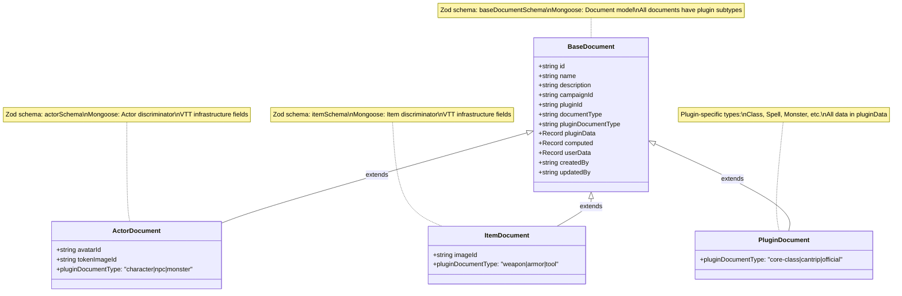

# MongoDB Migration Plan: Current Structure to Unified Document Model

## Executive Summary

This document outlines the migration from the current MongoDB structure with separate collections (Actor, Item, VTTDocument) to a unified Document model that supports plugin-agnostic architecture and aligns with the GM-authoritative state management approach.

### Migration Goals

1. **Plugin Agnosticism**: Remove all game system assumptions from core schemas
2. **Unified Document Model**: Consolidate Actor, Item, and VTTDocument into single collection
3. **GM-Authoritative Alignment**: Keep server schemas minimal for message routing
4. **No Backward Compatibility**: Clean migration without legacy support (greenfield app)

## Current State Analysis

### Existing Collections and Schemas

#### 1. Actor Collection
```typescript
// Current Actor Schema (packages/shared/src/schemas/actor.schema.mts)
export const actorSchema = baseSchema.extend({
  name: z.string().min(1).max(255),
  type: z.string().min(1).max(255),          // ❌ Game-specific
  userData: z.record(z.any()).optional(),
  avatarId: z.string().optional(),
  defaultTokenImageId: z.string().optional(),
  compendiumId: z.string().optional(),
  description: z.string().optional(),
  gameSystemId: z.string().min(1),           // ❌ Should be pluginId
  data: z.record(z.string(), z.any()).optional()
});
```

**Issues:**
- `type` field assumes game system knowledge (e.g., "fighter", "wizard")
- `gameSystemId` should be `pluginId` for consistency
- Separate from Items when both are really documents

#### 2. Item Collection
```typescript
// Current Item Schema (packages/shared/src/schemas/item.schema.mts)
export const itemSchema = baseSchema.extend({
  name: z.string().min(1).max(255),
  type: z.string().min(1).max(255),          // ❌ Game-specific
  imageId: z.string().optional(),
  compendiumId: z.string().optional(),
  description: z.string().optional(),
  gameSystemId: z.string().min(1),           // ❌ Should be pluginId
  pluginId: z.string().min(1),               // ✅ Good
  weight: z.number().optional(),             // ❌ Game-specific
  cost: z.number().optional(),               // ❌ Game-specific
  data: z.any()
});
```

**Issues:**
- Both `gameSystemId` and `pluginId` (inconsistent)
- `weight` and `cost` are D&D assumptions
- `type` assumes game system knowledge

#### 3. VTTDocument Collection
```typescript
// Current VTTDocument Schema (packages/shared/src/schemas/vtt-document.schema.mts)
export const vttDocumentSchema = baseSchema.extend({
  name: z.string().min(1).max(255),
  imageId: z.string().optional(),
  slug: z.string().regex(/^[a-z0-9-]+$/),
  pluginId: z.string().min(1),               // ✅ Good
  documentType: z.string().min(1),           // ✅ Good pattern
  compendiumId: z.string().optional(),
  description: z.string().max(5000),
  data: z.any()
});
```

**Issues:**
- Actually follows good patterns
- Should be the model for unified approach

#### 4. Campaign Collection
```typescript
// Current Campaign Schema (inferred from model)
const campaignSchemaMongoose = campaignSchema.merge(baseMongooseZodSchema).extend({
  characterIds: z.array(zId('Actor')),       // ❌ Will need to change to Document refs
  gameMasterId: zId('User')                  // ✅ Good
});
```

**Issues:**
- References Actor collection directly
- Missing `pluginData` field for campaign-level plugin state

### Data Volume Analysis

Based on the current structure, we have these collections to migrate:
- **Actors**: Character sheets, NPCs, creatures
- **Items**: Equipment, weapons, consumables, magic items
- **VTTDocuments**: Spells, classes, backgrounds, features
- **Campaigns**: Campaign data with character references
- **Supporting**: Assets, Compendiums, Users (unchanged)

## New Discriminated Document Schema Architecture

### Architecture Overview

The new system uses **discriminated unions** with Mongoose discriminators to provide type safety while maintaining plugin flexibility. This approach separates VTT infrastructure concerns from game mechanics and integrates with the **GM-Authoritative Aggregate Architecture** for state management.

#### Aggregate Integration

The document migration aligns with the two-layer aggregate pattern:

```mermaid
classDiagram
    class CampaignAggregate {
        +string id
        +string pluginData
        +validateCampaignBoundaries()
        +enforceAuthorityRules()
    }
    
    class GameSessionAggregate {
        +string sessionId
        +CampaignAggregate campaign
        +broadcastToRoom()
        +validateGMAuthority()
    }
    
    class DocumentModel {
        +string campaignId
        +string documentType
        +Record pluginData
    }
    
    CampaignAggregate ||--o{ DocumentModel : contains
    GameSessionAggregate ||--|| CampaignAggregate : manages
    
    note for CampaignAggregate "Persistent aggregate\\nEnsures data integrity\\nManages campaign pluginData"
    note for GameSessionAggregate "Runtime aggregate\\nManages socket.io rooms\\nEnforces GM authority"
    note for DocumentModel "Unified document storage\\nActors, Items, Plugin docs"
```



### Zod Schema Hierarchy


### Mongoose Model Hierarchy


### Runtime Document Structure


### Campaign Schema with Plugin Data

#### Updated Campaign Schema

```typescript
// Updated Campaign schema with pluginData for aggregate integration
export const campaignSchema = baseSchema.extend({
  name: z.string().min(1).max(255),
  description: z.string().max(5000).optional(),
  gmId: z.string(),
  pluginId: z.string().min(1),
  
  // Campaign-level plugin data (global persistent state)
  pluginData: z.record(z.string(), z.unknown()).default({}),
  
  // Example pluginData usage:
  // {
  //   "dnd5e": {
  //     "houseRules": {
  //       "allowCriticalFumbles": true,
  //       "deathSaveThreshold": 3,
  //       "longRestRequirements": "8 hours in safe location"
  //     },
  //     "worldState": {
  //       "currentDate": "15th of Mirtul, 1492 DR",
  //       "season": "spring",
  //       "majorEvents": [
  //         "Dragon attack on Phandalin",
  //         "Lords' Alliance treaty signed"
  //       ],
  //       "politicalClimate": "tense"
  //     },
  //     "factionStandings": {
  //       "harpers": "friendly",
  //       "zhentarim": "hostile",
  //       "lords_alliance": "neutral",
  //       "emerald_enclave": "allied"
  //     },
  //     "economicState": {
  //       "goldInflation": 1.2,
  //       "tradeRouteStatus": "disrupted",
  //       "merchantGuildRelations": "strained"
  //     }
  //   }
  // }
  
  // Document references (will change to unified Document collection)
  characterIds: z.array(z.string()).default([]),
  
  // Metadata
  status: campaignStatusSchema.default('active'),
  setting: z.string().optional(),
  startDate: z.string().default(new Date().toISOString())
});
```

### Core Document Schemas

```typescript
// Base document schema - all common fields (API representation)
export const baseDocumentSchema = z.object({
  id: z.string(),
  name: z.string().min(1).max(255),
  description: z.string().max(5000).optional(),
  
  // Campaign context
  campaignId: z.string().optional(),
  
  // Plugin identification  
  pluginId: z.string().min(1),
  documentType: z.string().min(1),              // Discriminator field (Actor, Item, Class, Spell, etc.)
  pluginDocumentType: z.string().min(1),        // Plugin-specific subtype (character, weapon, etc.)
  
  // Plugin-controlled data (renamed from 'data')
  pluginData: z.record(z.string(), z.unknown()),
  
  // Computed/cached fields (server can populate these from pluginData)
  computed: z.record(z.string(), z.unknown()).optional(),
  
  // User-specific overrides (for personal character sheets)
  userData: z.record(z.string(), z.unknown()).optional(),
  
  // Metadata
  createdBy: z.string().optional(),
  updatedBy: z.string().optional(),
});

// Actor schema - extends base with VTT-specific fields
export const actorSchema = baseDocumentSchema.extend({
  documentType: z.literal('Actor'),             // Discriminator value
  pluginDocumentType: z.string().min(1),       // Plugin subtypes: 'character', 'npc', 'monster'
  
  // VTT infrastructure fields (universal across game systems)
  avatarId: z.string().optional(),              // Character portrait
  tokenImageId: z.string().optional(),          // Map token
  
  // Universal inventory system
  inventory: z.array(z.object({
    itemId: z.string(),                         // Reference to Item document
    quantity: z.number().min(0),               // Must be non-negative
    equipped: z.boolean().default(false),      // Is this item equipped?
    slot: z.string().optional(),               // Equipment slot (mainHand, offHand, armor, etc.)
    condition: z.number().min(0).max(100).optional(), // Item condition (0-100)
    metadata: z.record(z.string(), z.unknown()).optional() // Plugin-specific extensions
  })).default([]),
});

// Item schema - extends base with VTT-specific fields  
export const itemSchema = baseDocumentSchema.extend({
  documentType: z.literal('Item'),              // Discriminator value
  pluginDocumentType: z.string().min(1),       // Plugin subtypes: 'weapon', 'armor', 'tool'
  
  // VTT infrastructure fields (universal across game systems)
  imageId: z.string().optional(),               // Item icon
});

// Union schema for runtime validation (avoids deprecated discriminatedUnion)
export const documentSchema = z.union([
  actorSchema,
  itemSchema, 
  baseDocumentSchema  // Catch-all for plugin-specific types (Class, Spell, etc.)
]);

// Create/update schemas
export const actorCreateSchema = actorSchema.omit({
  id: true, createdBy: true, updatedBy: true, computed: true
}).extend({
  avatar: z.instanceof(File).optional(),
  token: z.instanceof(File).optional()
});

export const itemCreateSchema = itemSchema.omit({
  id: true, createdBy: true, updatedBy: true, computed: true  
}).extend({
  image: z.instanceof(File).optional()
});

export const documentCreateSchema = baseDocumentSchema.omit({
  id: true, createdBy: true, updatedBy: true, computed: true
});

// TypeScript types
export type ICampaign = z.infer<typeof campaignSchema>;
export type IBaseDocument = z.infer<typeof baseDocumentSchema>;
export type IActor = z.infer<typeof actorSchema>;
export type IItem = z.infer<typeof itemSchema>;
export type IDocument = z.infer<typeof documentSchema>;
```

### Document Type Examples

```typescript
// Universal types present in all game systems
const UNIVERSAL_DOCUMENT_TYPES = [
  'Actor',      // Characters, NPCs, creatures
  'Item',       // Equipment, objects, tools
] as const;

// Plugin-specific types (examples from D&D 5e)
const DND5E_DOCUMENT_TYPES = [
  'Class',      // Fighter, Wizard, etc.
  'Spell',      // Fireball, Cure Wounds, etc.
  'Background', // Acolyte, Criminal, etc.
  'Feature',    // Second Wind, Spellcasting, etc.
  'Monster',    // Specific to monster stat blocks
] as const;

// Plugin-specific types (examples from other systems)
const PATHFINDER_DOCUMENT_TYPES = [
  'Ancestry',   // Instead of Race
  'Heritage',   // Ancestral variants
  'Archetype',  // Class variants
] as const;
```

### Data Field Structure

```typescript
// Example Actor document (discriminated type)
const actorDocument: IActor = {
  id: 'actor_123',
  name: 'Aragorn',
  description: 'A ranger from the north',
  campaignId: 'campaign_456',
  pluginId: 'dnd5e',
  documentType: 'Actor',               // Discriminator (universal type)
  pluginDocumentType: 'character',     // Plugin subtype (vs 'npc', 'monster')
  
  // VTT infrastructure fields (type-safe)
  avatarId: 'asset_790',               // Character portrait
  tokenImageId: 'asset_791',           // Map token
  
  // Universal inventory system
  inventory: [
    {
      itemId: 'sword_123',             // Reference to Item document
      quantity: 1,
      equipped: true,
      slot: 'mainHand',
      condition: 95,
      metadata: {
        // D&D-specific inventory data
        attuned: false,
        enchantmentLevel: 1,
        personalizedName: 'Andúril'
      }
    },
    {
      itemId: 'bow_456',
      quantity: 1,
      equipped: false,
      slot: 'ranged',
      condition: 100,
      metadata: {
        arrowsRemaining: 20,
        bowType: 'longbow'
      }
    },
    {
      itemId: 'potion_789',
      quantity: 3,
      equipped: false,
      metadata: {
        potionType: 'healing',
        bottleType: 'crystal'
      }
    }
  ],
  
  pluginData: {
    // All D&D-specific data goes here (no longer includes equipment)
    level: 5,
    race: 'Human',
    class: 'Ranger',
    subclass: 'Hunter',
    hitPoints: { current: 45, max: 45, temp: 0 },
    armorClass: 16,
    proficiencyBonus: 3,
    abilities: {
      strength: { score: 16, modifier: 3 },
      dexterity: { score: 14, modifier: 2 },
      // ...
    },
    skills: {
      survival: { proficient: true, expertise: false },
      // ...
    },
    spells: [],
    features: ['rangers_favored_enemy', 'hunters_mark']
  },
  computed: {
    // Server can cache computed values here
    totalArmorClass: 16,
    initiative: 2,
    passivePerception: 15,
    // Universal inventory computations
    totalInventoryWeight: 15.5,        // Server can compute from inventory
    equippedItemsCount: 1
  },
  userData: {
    // Player-specific customizations
    notes: 'My favorite character',
    displaySettings: { tokenSize: 'medium' },
    inventoryNotes: {
      'sword_123': 'Family heirloom, very important'
    }
  },
  createdBy: 'user_123',
  updatedBy: 'user_123'
};

// Example Item document (discriminated type)
const itemDocument: IItem = {
  id: 'item_456',
  name: 'Longsword +1',
  description: 'A magical sword with a +1 enhancement',
  campaignId: 'campaign_456',
  pluginId: 'dnd5e',
  documentType: 'Item',                // Discriminator (universal type)
  pluginDocumentType: 'weapon',        // Plugin subtype (vs 'armor', 'tool')
  
  // VTT infrastructure fields (type-safe)
  imageId: 'asset_sword',              // Item icon
  
  pluginData: {
    // All D&D-specific item data
    rarity: 'uncommon',
    requiresAttunement: false,
    weight: 3,
    cost: { gold: 1500 },
    properties: ['versatile'],
    damage: {
      oneHanded: '1d8+1',
      twoHanded: '1d10+1'
    },
    damageType: 'slashing',
    weaponType: 'martial',
    category: 'weapon'
  },
  computed: {
    // Server can cache computed values
    totalWeight: 3,
    goldValue: 1500
  },
  userData: {},
  createdBy: 'system',
  updatedBy: 'system'
};

// Example Class document (plugin-specific type, uses base Document)
const classDocument: IBaseDocument = {
  id: 'class_fighter',
  name: 'Fighter',
  description: 'A master of martial combat',
  pluginId: 'dnd5e',
  documentType: 'Class',               // Plugin-specific type (not Actor/Item)
  pluginDocumentType: 'core-class',    // Plugin subtype (vs 'variant', 'homebrew')
  
  pluginData: {
    // Plugin-specific compendium fields
    slug: 'fighter',
    compendiumId: 'dnd5e_phb',
    imageId: 'asset_fighter_icon',
    
    // All D&D class data
    hitDie: 'd10',
    primaryAbility: ['Strength', 'Dexterity'],
    savingThrowProficiencies: ['Strength', 'Constitution'],
    skillChoices: {
      count: 2,
      options: ['Acrobatics', 'Animal Handling', 'Athletics', 'History', 'Insight', 'Intimidation', 'Perception', 'Survival']
    },
    equipmentProficiencies: ['All armor', 'shields', 'simple weapons', 'martial weapons'],
    features: [
      {
        level: 1,
        name: 'Fighting Style',
        description: 'Choose a fighting style',
        // ...
      },
      {
        level: 1,
        name: 'Second Wind',
        description: 'Recover hit points as a bonus action',
        // ...
      }
      // ... more features
    ],
    subclasses: ['Champion', 'Battle Master', 'Eldritch Knight']
  },
  computed: {
    // Server can cache computed class info
    maxLevel: 20,
    featureCount: 25
  },
  userData: {},
  createdBy: 'system',
  updatedBy: 'system'
};

// Plugin Document Type Examples by Game System
const documentTypeExamples = {
  // D&D 5e Actor subtypes  
  dnd5e_actors: [
    { documentType: 'Actor', pluginDocumentType: 'character' },  // Player characters
    { documentType: 'Actor', pluginDocumentType: 'npc' },       // Non-player characters  
    { documentType: 'Actor', pluginDocumentType: 'monster' },   // Creatures/monsters
  ],
  
  // D&D 5e Item subtypes
  dnd5e_items: [
    { documentType: 'Item', pluginDocumentType: 'weapon' },     // Swords, bows, etc.
    { documentType: 'Item', pluginDocumentType: 'armor' },      // Shields, chainmail, etc.
    { documentType: 'Item', pluginDocumentType: 'tool' },       // Thieves' tools, etc.
    { documentType: 'Item', pluginDocumentType: 'consumable' }, // Potions, scrolls, etc.
  ],
  
  // Call of Cthulhu Actor subtypes (different game system)
  coc_actors: [
    { documentType: 'Actor', pluginDocumentType: 'investigator' }, // Player characters
    { documentType: 'Actor', pluginDocumentType: 'cultist' },      // Human antagonists
    { documentType: 'Actor', pluginDocumentType: 'entity' },       // Cosmic horrors
  ],
  
  // Plugin-specific document types (not Actor/Item)
  plugin_specific: [
    { documentType: 'Class', pluginDocumentType: 'core-class' },     // Fighter, Wizard
    { documentType: 'Spell', pluginDocumentType: 'cantrip' },        // Level 0 spells
    { documentType: 'Spell', pluginDocumentType: 'leveled-spell' },  // Level 1-9 spells
    { documentType: 'Background', pluginDocumentType: 'official' },  // PHB backgrounds
    { documentType: 'Monster', pluginDocumentType: 'beast' },        // Natural creatures
  ]
};
```

## Migration Strategy

### Phase 1: Schema Preparation

#### 1.1 Create New Discriminated Document Schemas

```typescript
// packages/shared/src/schemas/document.schema.mts
import { z } from 'zod';
import { baseSchema } from './base.schema.mjs';

// Base document schema - common fields for all document types
export const baseDocumentSchema = baseSchema.extend({
  name: z.string().min(1).max(255),
  description: z.string().max(5000).optional(),
  campaignId: z.string().optional(),
  pluginId: z.string().min(1),
  documentType: z.string().min(1),
  pluginData: z.record(z.string(), z.unknown()),
  computed: z.record(z.string(), z.unknown()).optional(),
  userData: z.record(z.string(), z.unknown()).optional(),
});

// Actor schema - extends base with VTT-specific fields
export const actorSchema = baseDocumentSchema.extend({
  documentType: z.literal('Actor'),
  avatarId: z.string().optional(),      // Character portrait
  tokenImageId: z.string().optional(),  // Map token
});

// Item schema - extends base with VTT-specific fields
export const itemSchema = baseDocumentSchema.extend({
  documentType: z.literal('Item'),
  imageId: z.string().optional(),       // Item icon
});

// Union schema for runtime validation (avoids deprecated discriminatedUnion)
export const documentSchema = z.union([
  actorSchema,
  itemSchema,
  baseDocumentSchema  // Catch-all for plugin-specific types
]);

// Create schemas for specific types
export const actorCreateSchema = actorSchema
  .omit({
    id: true,
    createdBy: true,
    updatedBy: true,
    computed: true
  })
  .extend({
    avatar: z.instanceof(File).optional(),
    token: z.instanceof(File).optional()
  });

export const itemCreateSchema = itemSchema
  .omit({
    id: true,
    createdBy: true,
    updatedBy: true,
    computed: true
  })
  .extend({
    image: z.instanceof(File).optional()
  });

export const documentCreateSchema = baseDocumentSchema
  .omit({
    id: true,
    createdBy: true,
    updatedBy: true,
    computed: true
  });

// Update schemas
export const actorUpdateSchema = actorSchema
  .partial()
  .omit({
    id: true,
    createdBy: true,
    documentType: true  // Can't change type
  })
  .extend({
    updatedBy: z.string()
  });

export const itemUpdateSchema = itemSchema
  .partial()
  .omit({
    id: true,
    createdBy: true,
    documentType: true  // Can't change type
  })
  .extend({
    updatedBy: z.string()
  });

export const documentUpdateSchema = baseDocumentSchema
  .partial()
  .omit({
    id: true,
    createdBy: true
  })
  .extend({
    updatedBy: z.string()
  });

// TypeScript types
export type IBaseDocument = z.infer<typeof baseDocumentSchema>;
export type IActor = z.infer<typeof actorSchema>;
export type IItem = z.infer<typeof itemSchema>;
export type IDocument = z.infer<typeof documentSchema>;
```

#### 1.2 Create Server Document Models with Discriminators

```typescript
// packages/server/src/features/documents/models/document.model.mts
import mongoose from 'mongoose';
import { 
  campaignSchema,
  baseDocumentSchema, 
  actorSchema, 
  itemSchema 
} from '@dungeon-lab/shared/schemas/document.schema.mjs';
import { baseMongooseZodSchema } from '../../../models/base.model.schema.mjs';
import { createMongoSchema } from '../../../models/zod-to-mongo.mjs';
import { zId } from '@zodyac/zod-mongoose';
import { ICampaign, IBaseDocument, IActor, IItem } from '@dungeon-lab/shared/types/index.mjs';

// Base document schema with ObjectId overrides
const serverBaseDocumentSchema = baseDocumentSchema.extend({
  campaignId: zId('Campaign').optional(),
});

const baseMongooseSchema = createMongoSchema<IBaseDocument>(
  serverBaseDocumentSchema.merge(baseMongooseZodSchema),
  {
    // Use custom discriminator key instead of __t
    discriminatorKey: 'documentType'
  }
);

// Indexes for performance
baseMongooseSchema.index({ campaignId: 1, documentType: 1 });
baseMongooseSchema.index({ pluginId: 1, documentType: 1 });
baseMongooseSchema.index({ pluginId: 1, pluginDocumentType: 1 });
baseMongooseSchema.index({ 'pluginData.compendiumId': 1 });
baseMongooseSchema.index({ 'pluginData.slug': 1, pluginId: 1, documentType: 1 }, { unique: true, sparse: true });

// Inventory-specific indexes
baseMongooseSchema.index({ 'inventory.itemId': 1 });                    // Find actors with specific items
baseMongooseSchema.index({ campaignId: 1, 'inventory.itemId': 1 });     // Campaign-scoped inventory queries
baseMongooseSchema.index({ 'inventory.equipped': 1, 'inventory.slot': 1 }); // Find equipped items by slot

// Text search index
baseMongooseSchema.index({ 
  name: 'text', 
  description: 'text',
  'pluginData.type': 'text'
});

// Validation middleware for plugin documents
baseMongooseSchema.pre('save', async function(next) {
  // Validate slug uniqueness for compendium documents
  if (this.isModified('pluginData') && this.pluginData?.slug && this.pluginData?.compendiumId) {
    const existing = await DocumentModel.findOne({
      'pluginData.slug': this.pluginData.slug,
      pluginId: this.pluginId,
      documentType: this.documentType,
      'pluginData.compendiumId': this.pluginData.compendiumId,
      _id: { $ne: this._id }
    });
    
    if (existing) {
      throw new Error(`Document with slug "${this.pluginData.slug}" already exists`);
    }
  }
  
  next();
});

// Create base Document model with custom discriminator key
export const DocumentModel = mongoose.model<IBaseDocument>('Document', baseMongooseSchema);

// Actor discriminator with additional fields
const serverActorSchema = actorSchema.extend({
  campaignId: zId('Campaign').optional(),
  avatarId: zId('Asset').optional(),
  tokenImageId: zId('Asset').optional(),
  
  // Override inventory itemIds to use ObjectIds
  inventory: z.array(z.object({
    itemId: zId('Document'),                    // ObjectId reference to Item document
    quantity: z.number().min(0),
    equipped: z.boolean().default(false),
    slot: z.string().optional(),
    condition: z.number().min(0).max(100).optional(),
    metadata: z.record(z.string(), z.unknown()).optional()
  })).default([]),
});

const actorDiscriminatorSchema = createMongoSchema<IActor>(
  serverActorSchema.merge(baseMongooseZodSchema)
    .omit({ documentType: true })  // Omit literal from discriminator schema
);

// Virtual properties for Actor assets
actorDiscriminatorSchema.virtual('avatar', {
  ref: 'Asset',
  localField: 'avatarId',
  foreignField: '_id',
  justOne: true
});

actorDiscriminatorSchema.virtual('tokenImage', {
  ref: 'Asset',
  localField: 'tokenImageId',
  foreignField: '_id',
  justOne: true
});

// Virtual property for populated inventory items
actorDiscriminatorSchema.virtual('inventoryItems', {
  ref: 'Document',
  localField: 'inventory.itemId',
  foreignField: '_id',
  justOne: false
});

// Create Actor discriminator
export const ActorModel = DocumentModel.discriminator<IActor>('Actor', actorDiscriminatorSchema);

// Item discriminator with additional fields
const serverItemSchema = itemSchema.extend({
  campaignId: zId('Campaign').optional(),
  imageId: zId('Asset').optional(),
});

const itemDiscriminatorSchema = createMongoSchema<IItem>(
  serverItemSchema.merge(baseMongooseZodSchema)
    .omit({ documentType: true })  // Omit literal from discriminator schema
);

// Virtual properties for Item assets
itemDiscriminatorSchema.virtual('image', {
  ref: 'Asset',
  localField: 'imageId',
  foreignField: '_id',
  justOne: true
});

// Create Item discriminator
export const ItemModel = DocumentModel.discriminator<IItem>('Item', itemDiscriminatorSchema);

// Export convenience getters
export function getDocumentModel(documentType: string) {
  switch (documentType) {
    case 'Actor':
      return ActorModel;
    case 'Item':
      return ItemModel;
    default:
      return DocumentModel;  // Plugin-specific types use base model
  }
}
```

### Phase 2: Data Migration Scripts

#### 2.1 Migration Script Structure

```typescript
// scripts/migrate-to-unified-documents.mts
import mongoose from 'mongoose';
import { ActorModel } from '../packages/server/src/features/actors/models/actor.model.mjs';
import { ItemModel } from '../packages/server/src/features/items/models/item.model.mjs';
import { VTTDocument } from '../packages/server/src/features/documents/models/vtt-document.model.mjs';
import { DocumentModel } from '../packages/server/src/features/documents/models/document.model.mjs';
import { CampaignModel } from '../packages/server/src/features/campaigns/models/campaign.model.mjs';

interface MigrationStats {
  actors: { migrated: number; failed: number };
  items: { migrated: number; failed: number };
  vttDocuments: { migrated: number; failed: number };
  campaigns: { updated: number; failed: number };
  errors: string[];
}

class DocumentMigrator {
  private stats: MigrationStats = {
    actors: { migrated: 0, failed: 0 },
    items: { migrated: 0, failed: 0 },
    vttDocuments: { migrated: 0, failed: 0 },
    campaigns: { updated: 0, failed: 0 },
    errors: []
  };

  async migrateAll(): Promise<MigrationStats> {
    console.log('Starting unified document migration...');
    
    try {
      // Migration order is important due to references
      await this.migrateActors();
      await this.migrateItems();
      await this.migrateVTTDocuments();
      await this.updateCampaignReferences();
      
      console.log('Migration completed successfully');
      return this.stats;
    } catch (error) {
      console.error('Migration failed:', error);
      this.stats.errors.push(`Migration failed: ${error.message}`);
      throw error;
    }
  }

  private async migrateActors(): Promise<void> {
    console.log('Migrating Actors with universal inventory...');
    
    const actors = await ActorModel.find({}).lean();
    console.log(`Found ${actors.length} actors to migrate`);

    for (const actor of actors) {
      try {
        // Extract inventory from various possible locations in current data
        const equipment = actor.data?.equipment || actor.data?.inventory || [];
        const inventoryMetadata = actor.data?.inventoryMetadata || {};
        
        // Validate that referenced items exist
        let validEquipment = equipment;
        if (equipment.length > 0) {
          const existingItems = await ItemModel.find({
            _id: { $in: equipment }
          });
          
          const existingItemIds = existingItems.map(item => item._id.toString());
          const missingItems = equipment.filter(itemId => 
            !existingItemIds.includes(itemId.toString())
          );
          
          if (missingItems.length > 0) {
            console.warn(`Actor ${actor._id} references missing items:`, missingItems);
            validEquipment = equipment.filter(itemId => 
              existingItemIds.includes(itemId.toString())
            );
          }
        }
        
        // Transform equipment array into universal inventory structure
        const inventory = validEquipment.map(itemId => {
          const itemMetadata = inventoryMetadata[itemId] || {};
          
          return {
            itemId,
            quantity: itemMetadata.quantity || 1,              // Default to 1
            equipped: itemMetadata.equipped || false,          // Default to false
            slot: itemMetadata.slot || undefined,              // Optional slot
            condition: itemMetadata.condition || undefined,    // Optional condition
            metadata: {
              // Preserve any additional metadata
              ...itemMetadata,
              // Remove fields that are now universal
              quantity: undefined,
              equipped: undefined,
              slot: undefined,
              condition: undefined
            }
          };
        }).filter(Boolean); // Remove any null entries
        
        // Create plugin data without equipment/inventory
        const pluginData = { ...(actor.data || {}) };
        delete pluginData.equipment;
        delete pluginData.inventory;
        delete pluginData.inventoryMetadata;
        
        // Add compendium reference if it exists
        if (actor.compendiumId) {
          pluginData.compendiumId = actor.compendiumId;
        }

        const documentData = {
          _id: actor._id,
          name: actor.name,
          description: actor.description,
          campaignId: actor.campaignId,
          pluginId: actor.gameSystemId,  // gameSystemId -> pluginId
          documentType: 'Actor',         // Discriminator (automatic with custom key)
          pluginDocumentType: actor.type || 'character',  // Use existing type or default
          
          // VTT infrastructure fields (now type-safe)
          avatarId: actor.avatarId,
          tokenImageId: actor.defaultTokenImageId,
          
          // Universal inventory system
          inventory,
          
          // Plugin data (no longer includes inventory)
          pluginData,
          computed: {},
          userData: actor.userData || {},
          createdBy: actor.createdBy,
          updatedBy: actor.updatedBy
        };

        // Use ActorModel to get discriminator benefits
        await ActorModel.create(documentData);
        this.stats.actors.migrated++;
        
        if (inventory.length > 0) {
          console.log(`  Actor ${actor.name}: migrated ${inventory.length} inventory items`);
        }
        
        if (this.stats.actors.migrated % 100 === 0) {
          console.log(`Migrated ${this.stats.actors.migrated} actors...`);
        }
      } catch (error) {
        console.error(`Failed to migrate actor ${actor._id}:`, error);
        this.stats.actors.failed++;
        this.stats.errors.push(`Actor ${actor._id}: ${error.message}`);
      }
    }
    
    console.log(`Actor migration complete: ${this.stats.actors.migrated} migrated, ${this.stats.actors.failed} failed`);
  }

  private async migrateItems(): Promise<void> {
    console.log('Migrating Items...');
    
    const items = await ItemModel.find({}).lean();
    console.log(`Found ${items.length} items to migrate`);

    for (const item of items) {
      try {
        const documentData = {
          _id: item._id,
          name: item.name,
          description: item.description,
          campaignId: item.campaignId,
          pluginId: item.pluginId || item.gameSystemId,  // Use pluginId, fallback to gameSystemId
          documentType: 'Item',          // Discriminator (automatic with custom key)
          pluginDocumentType: item.type || 'item',  // Use existing type or default
          
          // VTT infrastructure fields (now type-safe)
          imageId: item.imageId,
          
          pluginData: {
            // Move all game-specific fields to pluginData
            ...(item.data || {}),
            weight: item.weight,          // D&D weight goes into pluginData
            cost: item.cost,              // D&D cost goes into pluginData
            compendiumId: item.compendiumId,  // Move to pluginData for items
          },
          computed: {},
          userData: {},
          createdBy: item.createdBy,
          updatedBy: item.updatedBy
        };

        // Use ItemModel to get discriminator benefits
        await ItemModel.create(documentData);
        this.stats.items.migrated++;
        
        if (this.stats.items.migrated % 100 === 0) {
          console.log(`Migrated ${this.stats.items.migrated} items...`);
        }
      } catch (error) {
        console.error(`Failed to migrate item ${item._id}:`, error);
        this.stats.items.failed++;
        this.stats.errors.push(`Item ${item._id}: ${error.message}`);
      }
    }
    
    console.log(`Item migration complete: ${this.stats.items.migrated} migrated, ${this.stats.items.failed} failed`);
  }

  private async migrateVTTDocuments(): Promise<void> {
    console.log('Migrating VTT Documents...');
    
    const vttDocs = await VTTDocument.find({}).lean();
    console.log(`Found ${vttDocs.length} VTT documents to migrate`);

    for (const vttDoc of vttDocs) {
      try {
        const documentData = {
          _id: vttDoc._id,
          name: vttDoc.name,
          description: vttDoc.description,
          campaignId: vttDoc.campaignId,
          pluginId: vttDoc.pluginId,
          documentType: vttDoc.documentType,  // Keep original documentType (Class, Spell, etc.)
          pluginDocumentType: 'default',      // Add default plugin subtype
          
          pluginData: {
            // Move plugin-specific fields to pluginData
            ...(vttDoc.data || {}),
            imageId: vttDoc.imageId,       // Move to pluginData for plugin documents
            compendiumId: vttDoc.compendiumId,
            slug: vttDoc.slug,
          },
          computed: {},
          userData: {},
          createdBy: vttDoc.createdBy,
          updatedBy: vttDoc.updatedBy
        };

        // Use base DocumentModel for plugin-specific types
        await DocumentModel.create(documentData);
        this.stats.vttDocuments.migrated++;
        
        if (this.stats.vttDocuments.migrated % 100 === 0) {
          console.log(`Migrated ${this.stats.vttDocuments.migrated} VTT documents...`);
        }
      } catch (error) {
        console.error(`Failed to migrate VTT document ${vttDoc._id}:`, error);
        this.stats.vttDocuments.failed++;
        this.stats.errors.push(`VTTDocument ${vttDoc._id}: ${error.message}`);
      }
    }
    
    console.log(`VTT Document migration complete: ${this.stats.vttDocuments.migrated} migrated, ${this.stats.vttDocuments.failed} failed`);
  }

  private async updateCampaignReferences(): Promise<void> {
    console.log('Updating Campaign references and adding pluginData...');
    
    const campaigns = await CampaignModel.find({}).lean();
    console.log(`Found ${campaigns.length} campaigns to update`);

    for (const campaign of campaigns) {
      try {
        // characterIds in campaigns now reference the unified Document collection
        // Since we preserved the same _id values, references should still work
        // But we should verify the references exist using Actor discriminator
        
        const validCharacterIds = await ActorModel.find({
          _id: { $in: campaign.characterIds }
        }).distinct('_id');

        if (validCharacterIds.length !== campaign.characterIds.length) {
          const missingIds = campaign.characterIds.filter(id => 
            !validCharacterIds.some(validId => validId.equals(id))
          );
          console.warn(`Campaign ${campaign._id} has missing character references:`, missingIds);
        }

        // Add pluginData field for aggregate architecture integration
        const pluginData = {};
        
        // Migrate any existing campaign-level data if present
        if (campaign.userData) {
          pluginData[campaign.gameSystemId || 'default'] = {
            migratedUserData: campaign.userData
          };
        }
        
        // Set up plugin-specific initial state based on gameSystemId
        if (campaign.gameSystemId === 'dnd5e') {
          pluginData['dnd5e'] = {
            houseRules: {
              allowCriticalFumbles: false,
              deathSaveThreshold: 3
            },
            worldState: {
              currentDate: "1st of Hammer, 1492 DR",
              season: "winter"
            },
            factionStandings: {},
            economicState: {
              goldInflation: 1.0
            },
            ...pluginData['dnd5e']  // Preserve any migrated data
          };
        }

        await CampaignModel.updateOne(
          { _id: campaign._id },
          { 
            characterIds: validCharacterIds,
            pluginData,  // Add pluginData field for aggregate integration
            updatedBy: campaign.updatedBy
          }
        );
        
        this.stats.campaigns.updated++;
        console.log(`  Campaign ${campaign.name}: added pluginData field`);
      } catch (error) {
        console.error(`Failed to update campaign ${campaign._id}:`, error);
        this.stats.campaigns.failed++;
        this.stats.errors.push(`Campaign ${campaign._id}: ${error.message}`);
      }
    }
    
    console.log(`Campaign update complete: ${this.stats.campaigns.updated} updated, ${this.stats.campaigns.failed} failed`);
  }
}

// Migration execution
async function runMigration() {
  try {
    await mongoose.connect(process.env.MONGODB_URI!);
    
    const migrator = new DocumentMigrator();
    const stats = await migrator.migrateAll();
    
    console.log('\n=== Migration Summary ===');
    console.log('Actors:', stats.actors);
    console.log('Items:', stats.items);
    console.log('VTT Documents:', stats.vttDocuments);
    console.log('Campaigns:', stats.campaigns);
    console.log(`Total errors: ${stats.errors.length}`);
    
    if (stats.errors.length > 0) {
      console.log('\nErrors:');
      stats.errors.forEach(error => console.log(`  - ${error}`));
    }
    
  } catch (error) {
    console.error('Migration failed:', error);
    process.exit(1);
  } finally {
    await mongoose.disconnect();
  }
}

// Run if called directly
if (import.meta.url === `file://${process.argv[1]}`) {
  runMigration();
}

export { DocumentMigrator, runMigration };
```

#### 2.2 Validation Script

```typescript
// scripts/validate-migration.mts
import mongoose from 'mongoose';
import { DocumentModel } from '../packages/server/src/features/documents/models/document.model.mjs';
import { ActorModel } from '../packages/server/src/features/actors/models/actor.model.mjs';
import { ItemModel } from '../packages/server/src/features/items/models/item.model.mjs';
import { VTTDocument } from '../packages/server/src/features/documents/models/vtt-document.model.mjs';

interface ValidationResult {
  success: boolean;
  totalDocuments: number;
  documentTypeCounts: Record<string, number>;
  pluginCounts: Record<string, number>;
  missingData: string[];
  dataQualityIssues: string[];
}

class MigrationValidator {
  async validateMigration(): Promise<ValidationResult> {
    console.log('Validating migration...');
    
    const result: ValidationResult = {
      success: true,
      totalDocuments: 0,
      documentTypeCounts: {},
      pluginCounts: {},
      missingData: [],
      dataQualityIssues: []
    };

    // Count documents
    const documents = await DocumentModel.find({}).lean();
    result.totalDocuments = documents.length;
    
    // Analyze document types and plugins
    for (const doc of documents) {
      result.documentTypeCounts[doc.documentType] = 
        (result.documentTypeCounts[doc.documentType] || 0) + 1;
      
      result.pluginCounts[doc.pluginId] = 
        (result.pluginCounts[doc.pluginId] || 0) + 1;
      
      // Check for missing pluginData
      if (!doc.pluginData || Object.keys(doc.pluginData).length === 0) {
        result.missingData.push(`Document ${doc._id} has empty pluginData field`);
      }
      
      // Check required fields
      if (!doc.name || !doc.pluginId || !doc.documentType) {
        result.dataQualityIssues.push(
          `Document ${doc._id} missing required fields`
        );
      }
    }

    // Compare counts with original collections
    const originalActorCount = await ActorModel.countDocuments();
    const originalItemCount = await ItemModel.countDocuments();
    const originalVTTDocCount = await VTTDocument.countDocuments();
    const expectedTotal = originalActorCount + originalItemCount + originalVTTDocCount;
    
    if (result.totalDocuments !== expectedTotal) {
      result.success = false;
      result.dataQualityIssues.push(
        `Document count mismatch: expected ${expectedTotal}, got ${result.totalDocuments}`
      );
    }

    // Validate Actor documents
    const actorDocs = await DocumentModel.countDocuments({ documentType: 'Actor' });
    if (actorDocs !== originalActorCount) {
      result.success = false;
      result.dataQualityIssues.push(
        `Actor count mismatch: expected ${originalActorCount}, got ${actorDocs}`
      );
    }

    // Validate Item documents
    const itemDocs = await DocumentModel.countDocuments({ documentType: 'Item' });
    if (itemDocs !== originalItemCount) {
      result.success = false;
      result.dataQualityIssues.push(
        `Item count mismatch: expected ${originalItemCount}, got ${itemDocs}`
      );
    }

    console.log('Validation complete');
    return result;
  }
}

async function runValidation() {
  try {
    await mongoose.connect(process.env.MONGODB_URI!);
    
    const validator = new MigrationValidator();
    const result = await validator.validateMigration();
    
    console.log('\n=== Validation Results ===');
    console.log('Success:', result.success);
    console.log('Total Documents:', result.totalDocuments);
    console.log('Document Types:', result.documentTypeCounts);
    console.log('Plugins:', result.pluginCounts);
    
    if (result.missingData.length > 0) {
      console.log('\nMissing Data Issues:');
      result.missingData.forEach(issue => console.log(`  - ${issue}`));
    }
    
    if (result.dataQualityIssues.length > 0) {
      console.log('\nData Quality Issues:');
      result.dataQualityIssues.forEach(issue => console.log(`  - ${issue}`));
    }
    
    if (!result.success) {
      console.error('Validation failed!');
      process.exit(1);
    } else {
      console.log('Validation passed!');
    }
    
  } catch (error) {
    console.error('Validation failed:', error);
    process.exit(1);
  } finally {
    await mongoose.disconnect();
  }
}

if (import.meta.url === `file://${process.argv[1]}`) {
  runValidation();
}

export { MigrationValidator, runValidation };
```

### Phase 3: API Updates

#### 3.1 Document Service

```typescript
// packages/server/src/features/documents/services/document.service.mts
import { DocumentModel } from '../models/document.model.mjs';
import { IDocument } from '@dungeon-lab/shared/types/index.mjs';
import { FilterQuery, Types } from 'mongoose';

export class DocumentService {
  // Get documents by campaign and type
  async getDocumentsByCampaign(
    campaignId: string,
    documentType?: string,
    pluginId?: string
  ): Promise<IDocument[]> {
    const filter: FilterQuery<IDocument> = { campaignId };
    
    if (documentType) {
      filter.documentType = documentType;
    }
    
    if (pluginId) {
      filter.pluginId = pluginId;
    }
    
    return DocumentModel.find(filter)
      .populate('image')
      .populate('avatar')
      .populate('tokenImage')
      .lean()
      .exec();
  }

  // Get compendium documents
  async getCompendiumDocuments(
    compendiumId: string,
    documentType?: string
  ): Promise<IDocument[]> {
    const filter: FilterQuery<IDocument> = { compendiumId };
    
    if (documentType) {
      filter.documentType = documentType;
    }
    
    return DocumentModel.find(filter)
      .populate('image')
      .lean()
      .exec();
  }

  // Create document
  async createDocument(data: Partial<IDocument>): Promise<IDocument> {
    const document = new DocumentModel(data);
    await document.save();
    return document.toObject();
  }

  // Update document
  async updateDocument(
    id: string,
    updates: Partial<IDocument>
  ): Promise<IDocument | null> {
    const document = await DocumentModel.findByIdAndUpdate(
      id,
      { ...updates, updatedBy: updates.updatedBy },
      { new: true, runValidators: true }
    )
      .populate('image')
      .populate('avatar')
      .populate('tokenImage')
      .lean()
      .exec();
    
    return document;
  }

  // Delete document
  async deleteDocument(id: string): Promise<boolean> {
    const result = await DocumentModel.findByIdAndDelete(id);
    return !!result;
  }

  // Get by document type (replaces separate Actor/Item services)
  async getActors(campaignId?: string): Promise<IDocument[]> {
    const filter: FilterQuery<IDocument> = { documentType: 'Actor' };
    if (campaignId) filter.campaignId = campaignId;
    
    return DocumentModel.find(filter)
      .populate('avatar')
      .populate('tokenImage')
      .lean()
      .exec();
  }

  async getItems(campaignId?: string): Promise<IDocument[]> {
    const filter: FilterQuery<IDocument> = { documentType: 'Item' };
    if (campaignId) filter.campaignId = campaignId;
    
    return DocumentModel.find(filter)
      .populate('image')
      .lean()
      .exec();
  }

  // Search documents
  async searchDocuments(
    query: string,
    filters?: {
      campaignId?: string;
      documentType?: string;
      pluginId?: string;
    }
  ): Promise<IDocument[]> {
    const searchFilter: FilterQuery<IDocument> = {
      $text: { $search: query },
      ...filters
    };
    
    return DocumentModel.find(searchFilter)
      .score({ score: { $meta: 'textScore' } })
      .sort({ score: { $meta: 'textScore' } })
      .populate('image')
      .lean()
      .exec();
  }
}
```

#### 3.2 Updated API Routes

```typescript
// packages/server/src/features/documents/routes/document.routes.mts
import { Router } from 'express';
import { DocumentService } from '../services/document.service.mjs';
import { requireAuth } from '../../../middleware/auth.middleware.mjs';
import { validateSchema } from '../../../middleware/validation.middleware.mjs';
import { documentCreateSchema, documentUpdateSchema } from '@dungeon-lab/shared/schemas/document.schema.mjs';

const router = Router();
const documentService = new DocumentService();

// Get documents by campaign
router.get('/campaigns/:campaignId/documents', requireAuth, async (req, res) => {
  try {
    const { campaignId } = req.params;
    const { type, plugin } = req.query;
    
    const documents = await documentService.getDocumentsByCampaign(
      campaignId,
      type as string,
      plugin as string
    );
    
    res.json(documents);
  } catch (error) {
    res.status(500).json({ error: error.message });
  }
});

// Legacy routes for backward compatibility (during transition)
router.get('/campaigns/:campaignId/actors', requireAuth, async (req, res) => {
  try {
    const actors = await documentService.getActors(req.params.campaignId);
    res.json(actors);
  } catch (error) {
    res.status(500).json({ error: error.message });
  }
});

router.get('/campaigns/:campaignId/items', requireAuth, async (req, res) => {
  try {
    const items = await documentService.getItems(req.params.campaignId);
    res.json(items);
  } catch (error) {
    res.status(500).json({ error: error.message });
  }
});

// Create document
router.post('/documents', 
  requireAuth, 
  validateSchema(documentCreateSchema), 
  async (req, res) => {
    try {
      const document = await documentService.createDocument({
        ...req.body,
        createdBy: req.user!.id,
        updatedBy: req.user!.id
      });
      
      res.status(201).json(document);
    } catch (error) {
      res.status(500).json({ error: error.message });
    }
  }
);

// Update document
router.put('/documents/:id',
  requireAuth,
  validateSchema(documentUpdateSchema),
  async (req, res) => {
    try {
      const document = await documentService.updateDocument(req.params.id, {
        ...req.body,
        updatedBy: req.user!.id
      });
      
      if (!document) {
        return res.status(404).json({ error: 'Document not found' });
      }
      
      res.json(document);
    } catch (error) {
      res.status(500).json({ error: error.message });
    }
  }
);

// Delete document
router.delete('/documents/:id', requireAuth, async (req, res) => {
  try {
    const success = await documentService.deleteDocument(req.params.id);
    
    if (!success) {
      return res.status(404).json({ error: 'Document not found' });
    }
    
    res.status(204).send();
  } catch (error) {
    res.status(500).json({ error: error.message });
  }
});

export { router as documentRoutes };
```

### Phase 4: Clean Up

#### 4.1 Remove Old Collections

```typescript
// scripts/cleanup-old-collections.mts
import mongoose from 'mongoose';

async function cleanupOldCollections() {
  try {
    await mongoose.connect(process.env.MONGODB_URI!);
    
    console.log('Dropping old collections...');
    
    // Drop old collections
    await mongoose.connection.db.collection('actors').drop();
    console.log('Dropped actors collection');
    
    await mongoose.connection.db.collection('items').drop();
    console.log('Dropped items collection');
    
    await mongoose.connection.db.collection('vttdocuments').drop();
    console.log('Dropped vttdocuments collection');
    
    console.log('Cleanup complete');
    
  } catch (error) {
    if (error.code === 26) {
      console.log('Collection does not exist, skipping...');
    } else {
      console.error('Cleanup failed:', error);
      throw error;
    }
  } finally {
    await mongoose.disconnect();
  }
}

if (import.meta.url === `file://${process.argv[1]}`) {
  cleanupOldCollections();
}
```

#### 4.2 Remove Old Model Files

After migration is complete and tested:

1. Delete `packages/server/src/features/actors/models/actor.model.mts`
2. Delete `packages/server/src/features/items/models/item.model.mts`
3. Delete `packages/server/src/features/documents/models/vtt-document.model.mts`
4. Delete `packages/shared/src/schemas/actor.schema.mts`
5. Delete `packages/shared/src/schemas/item.schema.mts`
6. Delete `packages/shared/src/schemas/vtt-document.schema.mts`

## Index Optimization

### New Indexes for Document Collection

```typescript
// Indexes for the unified Document collection with universal inventory
const documentIndexes = [
  // Core document queries (most common)
  { campaignId: 1, documentType: 1 },
  { pluginId: 1, documentType: 1 },
  { pluginId: 1, pluginDocumentType: 1 },
  
  // Compendium queries  
  { 'pluginData.compendiumId': 1 },
  
  // Slug uniqueness within plugin + type + compendium
  { 
    'pluginData.slug': 1, 
    pluginId: 1, 
    documentType: 1, 
    'pluginData.compendiumId': 1 
  }, // unique: true, sparse: true
  
  // Universal inventory indexes (NEW)
  { 'inventory.itemId': 1 },                           // Find actors with specific items
  { campaignId: 1, 'inventory.itemId': 1 },            // Campaign-scoped inventory queries
  { 'inventory.equipped': 1, 'inventory.slot': 1 },    // Find equipped items by slot
  
  // Text search
  { 
    name: 'text', 
    description: 'text',
    'pluginData.type': 'text'
  },
  
  // Asset references
  { imageId: 1 },
  { avatarId: 1 },
  { tokenImageId: 1 },
  
  // User ownership and recent documents
  { createdBy: 1 },
  { updatedAt: -1 }
];

## Universal Inventory System

### Architecture Overview

The migration implements a **universal inventory system** where:

1. **Items are Independent Documents**: Each item exists as a separate Document with `documentType: 'Item'`
2. **Actors Have Universal Inventory**: Actors store inventory in a dedicated `inventory` field (not `pluginData`)
3. **Server-Understood Structure**: The server can provide universal inventory operations
4. **Plugin Extensions**: Game systems can extend inventory items through metadata

### Universal Inventory Structure

```mermaid
graph TB
    subgraph "Campaign Documents"
        A1[Actor: Aragorn<br/>campaignId: camp_1<br/><b>inventory: Universal Field</b>]
        A2[Actor: Legolas<br/>campaignId: camp_1<br/><b>inventory: Universal Field</b>]
        
        I1[Item: Longsword +1<br/>id: sword_123<br/>campaignId: camp_1]
        I2[Item: Elven Bow<br/>id: bow_456<br/>campaignId: camp_1]
        I3[Item: Health Potion<br/>id: potion_789<br/>campaignId: camp_1]
    end
    
    subgraph "Compendium Items"
        C1[Item: Generic Sword<br/>compendiumId: dnd5e_phb<br/>campaignId: null]
        C2[Item: Standard Bow<br/>compendiumId: dnd5e_phb<br/>campaignId: null]
    end
    
    subgraph "Aragorn's Inventory Array"
        INV1["itemId: sword_123<br/>quantity: 1<br/>equipped: true<br/>slot: mainHand<br/>metadata: {...}"]
        INV2["itemId: potion_789<br/>quantity: 3<br/>equipped: false<br/>metadata: {...}"]
    end
    
    A1 --> INV1
    A1 --> INV2
    INV1 -->|references| I1
    INV2 -->|references| I3
    A2 -->|inventory[0].itemId| I2
    
    I1 -.->|"based on"| C1
    I2 -.->|"based on"| C2
    
    note1[<b>Universal Inventory:</b><br/>- Server understands structure<br/>- Plugins extend via metadata<br/>- Referential integrity enforced]
```

### Universal Inventory Model

```typescript
// Universal inventory structure (server understands this)
const actorWithInventory = {
  // Universal VTT fields
  inventory: [
    {
      itemId: 'sword_123',           // Reference to Item document
      quantity: 1,                   // Universal: how many
      equipped: true,                // Universal: is equipped
      slot: 'mainHand',             // Universal: equipment slot
      condition: 95,                 // Universal: item condition (0-100)
      metadata: {
        // Plugin-specific extensions
        enchantmentLevel: 1,
        attuned: false,
        personalizedName: 'Andúril'
      }
    },
    {
      itemId: 'potion_789',
      quantity: 3,                   // Stackable item
      equipped: false,
      metadata: {
        potionType: 'healing',
        bottleType: 'crystal'
      }
    }
  ],
  
  // Plugin data (no longer contains inventory)
  pluginData: {
    level: 5,
    class: 'Ranger',
    // No equipment/inventory here anymore
  }
};

// Item ownership types (unchanged)
enum ItemOwnership {
  COMPENDIUM = 'compendium',    // Shared template (compendiumId set, campaignId null)
  CAMPAIGN = 'campaign',        // Campaign-specific (campaignId set, compendiumId optional)
  CHARACTER = 'character'       // Character-owned (campaignId set, owned by specific actor)
}

// Server can now provide universal inventory operations
interface UniversalInventoryOperations {
  addItem(actorId: string, itemId: string, quantity: number): Promise<void>;
  removeItem(actorId: string, itemId: string, quantity?: number): Promise<void>;
  equipItem(actorId: string, itemId: string, slot: string): Promise<void>;
  unequipItem(actorId: string, itemId: string): Promise<void>;
  transferItem(fromActor: string, toActor: string, itemId: string, quantity: number): Promise<void>;
  findActorsWithItem(itemId: string): Promise<Actor[]>;
}
```

### Item Lifecycle and Data Integrity

#### 1. Item Creation Patterns

```typescript
// Pattern 1: Create from compendium template
async function createItemFromCompendium(
  compendiumItemId: string, 
  campaignId: string,
  customizations?: Record<string, unknown>
): Promise<IItem> {
  const template = await DocumentModel.findById(compendiumItemId);
  
  return DocumentModel.create({
    name: template.name,
    documentType: 'Item',
    pluginDocumentType: template.pluginDocumentType,
    campaignId,                    // Make it campaign-specific
    pluginId: template.pluginId,
    pluginData: {
      ...template.pluginData,      // Copy template data
      ...customizations,           // Apply character-specific modifications
      compendiumId: template.id,   // Track original template
      isCustomized: !!customizations
    }
  });
}

// Pattern 2: Create custom item
async function createCustomItem(
  itemData: Partial<IItem>,
  campaignId: string
): Promise<IItem> {
  return DocumentModel.create({
    ...itemData,
    documentType: 'Item',
    campaignId,                    // Campaign-scoped
    pluginData: {
      ...itemData.pluginData,
      isCustom: true              // Mark as custom creation
    }
  });
}
```

#### 2. Universal Inventory Management Operations

```typescript
// Universal Inventory Service (server can provide these operations)
class UniversalInventoryService {
  
  // Add item to actor inventory
  async addItemToInventory(
    actorId: string, 
    itemId: string,
    quantity: number = 1,
    options?: {
      equipped?: boolean;
      slot?: string;
      condition?: number;
      metadata?: Record<string, unknown>;
    }
  ): Promise<void> {
    const actor = await ActorModel.findById(actorId);
    const item = await DocumentModel.findById(itemId);
    
    // Validation: same campaign
    if (actor.campaignId !== item.campaignId) {
      throw new Error('Cannot add item from different campaign');
    }
    
    // Check if item already exists in inventory
    const existingIndex = actor.inventory.findIndex(inv => inv.itemId.toString() === itemId);
    
    if (existingIndex >= 0) {
      // Update existing inventory entry
      actor.inventory[existingIndex].quantity += quantity;
      if (options?.equipped !== undefined) {
        actor.inventory[existingIndex].equipped = options.equipped;
      }
      if (options?.slot) {
        actor.inventory[existingIndex].slot = options.slot;
      }
      if (options?.metadata) {
        actor.inventory[existingIndex].metadata = {
          ...actor.inventory[existingIndex].metadata,
          ...options.metadata
        };
      }
    } else {
      // Add new inventory entry
      actor.inventory.push({
        itemId,
        quantity,
        equipped: options?.equipped || false,
        slot: options?.slot,
        condition: options?.condition,
        metadata: options?.metadata || {}
      });
    }
    
    await actor.save();
  }
  
  // Remove item from inventory
  async removeItemFromInventory(
    actorId: string, 
    itemId: string,
    quantity?: number
  ): Promise<void> {
    const actor = await ActorModel.findById(actorId);
    const inventoryIndex = actor.inventory.findIndex(inv => inv.itemId.toString() === itemId);
    
    if (inventoryIndex === -1) {
      throw new Error('Item not found in inventory');
    }
    
    const inventoryItem = actor.inventory[inventoryIndex];
    
    if (quantity === undefined || quantity >= inventoryItem.quantity) {
      // Remove entire stack
      actor.inventory.splice(inventoryIndex, 1);
    } else {
      // Reduce quantity
      inventoryItem.quantity -= quantity;
    }
    
    await actor.save();
  }
  
  // Equip/unequip item
  async equipItem(actorId: string, itemId: string, slot: string): Promise<void> {
    const actor = await ActorModel.findById(actorId);
    const inventoryItem = actor.inventory.find(inv => inv.itemId.toString() === itemId);
    
    if (!inventoryItem) {
      throw new Error('Item not found in inventory');
    }
    
    // Check if slot is already occupied
    const occupiedItem = actor.inventory.find(inv => inv.equipped && inv.slot === slot);
    if (occupiedItem) {
      occupiedItem.equipped = false;
      occupiedItem.slot = undefined;
    }
    
    inventoryItem.equipped = true;
    inventoryItem.slot = slot;
    
    await actor.save();
  }
}
```

#### 3. Referential Integrity for Universal Inventory

```typescript
// Validation middleware for Actor documents with universal inventory
baseMongooseSchema.pre('save', async function(next) {
  if (this.documentType === 'Actor' && this.isModified('inventory')) {
    const inventory = this.inventory || [];
    const itemIds = inventory.map(inv => inv.itemId);
    
    if (itemIds.length > 0) {
      // Validate all item references exist and are in same campaign
      const items = await DocumentModel.find({
        _id: { $in: itemIds },
        documentType: 'Item',
        campaignId: this.campaignId
      });
      
      if (items.length !== itemIds.length) {
        const foundIds = items.map(item => item._id.toString());
        const missingIds = itemIds.filter(id => !foundIds.includes(id.toString()));
        throw new Error(`Invalid item references in inventory: ${missingIds.join(', ')}`);
      }
      
      // Validate inventory structure
      for (const invItem of inventory) {
        if (invItem.quantity < 0) {
          throw new Error('Inventory quantity cannot be negative');
        }
        if (invItem.condition !== undefined && (invItem.condition < 0 || invItem.condition > 100)) {
          throw new Error('Item condition must be between 0 and 100');
        }
      }
    }
  }
  
  next();
});

// Cleanup orphaned items when actor is deleted
baseMongooseSchema.pre('findOneAndDelete', async function(next) {
  const actor = await this.model.findOne(this.getQuery());
  
  if (actor?.documentType === 'Actor' && actor.inventory?.length > 0) {
    // Find items that are only owned by this actor
    const itemIds = actor.inventory.map(inv => inv.itemId);
    
    for (const itemId of itemIds) {
      const otherOwners = await DocumentModel.countDocuments({
        documentType: 'Actor',
        'inventory.itemId': itemId,
        _id: { $ne: actor._id }
      });
      
      // If no other actors own this item, it can be safely deleted
      if (otherOwners === 0) {
        await DocumentModel.findByIdAndDelete(itemId);
      }
    }
  }
  
  next();
});
```

### Universal Inventory Database Queries

```typescript
// Get actor with populated inventory items
async function getActorWithInventory(actorId: string): Promise<ActorWithInventory> {
  const actor = await ActorModel.findById(actorId)
    .populate('inventoryItems')  // Use virtual populate
    .lean()
    .exec();
  
  if (!actor) {
    throw new Error('Actor not found');
  }
  
  return actor;
}

// Find all actors who own a specific item
async function findItemOwners(itemId: string): Promise<IActor[]> {
  return ActorModel.find({
    'inventory.itemId': itemId
  }).lean().exec();
}

// Get actor's equipped items
async function getEquippedItems(actorId: string): Promise<InventoryItem[]> {
  const actor = await ActorModel.findById(actorId).lean();
  
  const equippedInventory = actor.inventory.filter(inv => inv.equipped);
  const itemIds = equippedInventory.map(inv => inv.itemId);
  
  const items = await DocumentModel.find({
    _id: { $in: itemIds },
    documentType: 'Item'
  }).lean();
  
  // Combine inventory data with item data
  return equippedInventory.map(inv => ({
    ...inv,
    item: items.find(item => item._id.toString() === inv.itemId.toString())
  }));
}

// Campaign-wide inventory analysis
async function getCampaignInventorySummary(campaignId: string) {
  const pipeline = [
    { $match: { campaignId, documentType: 'Actor' } },
    { $unwind: '$inventory' },
    { $group: {
      _id: '$inventory.itemId',
      totalQuantity: { $sum: '$inventory.quantity' },
      owners: { $push: {
        actorId: '$_id',
        actorName: '$name',
        quantity: '$inventory.quantity',
        equipped: '$inventory.equipped'
      }},
      uniqueOwners: { $addToSet: '$_id' },
      equippedCount: { 
        $sum: { $cond: ['$inventory.equipped', 1, 0] } 
      }
    }},
    { $lookup: {
      from: 'documents',
      localField: '_id',
      foreignField: '_id',
      as: 'itemDetails'
    }},
    { $addFields: {
      ownerCount: { $size: '$uniqueOwners' },
      item: { $arrayElemAt: ['$itemDetails', 0] }
    }},
    { $project: {
      itemDetails: 0,
      uniqueOwners: 0
    }}
  ];
  
  return DocumentModel.aggregate(pipeline);
}

// Find items by equipment slot across campaign
async function findItemsBySlot(campaignId: string, slot: string): Promise<any[]> {
  return ActorModel.aggregate([
    { $match: { campaignId, documentType: 'Actor' } },
    { $unwind: '$inventory' },
    { $match: { 'inventory.slot': slot, 'inventory.equipped': true } },
    { $lookup: {
      from: 'documents',
      localField: 'inventory.itemId',
      foreignField: '_id',
      as: 'item'
    }},
    { $project: {
      actorName: '$name',
      inventory: '$inventory',
      item: { $arrayElemAt: ['$item', 0] }
    }}
  ]);
}

// Universal inventory search
async function searchInventoryItems(
  campaignId: string, 
  searchTerm: string
): Promise<any[]> {
  return ActorModel.aggregate([
    { $match: { campaignId, documentType: 'Actor' } },
    { $unwind: '$inventory' },
    { $lookup: {
      from: 'documents',
      localField: 'inventory.itemId',
      foreignField: '_id',
      as: 'item'
    }},
    { $match: {
      $or: [
        { 'item.name': { $regex: searchTerm, $options: 'i' } },
        { 'item.description': { $regex: searchTerm, $options: 'i' } }
      ]
    }},
    { $project: {
      actorName: '$name',
      inventory: '$inventory',
      item: { $arrayElemAt: ['$item', 0] }
    }}
  ]);
}
```

### Benefits of Universal Inventory System

The universal inventory approach provides significant advantages:

1. **Server-Level Operations**: Server can provide universal inventory APIs (add, remove, equip, transfer items)
2. **Efficient Queries**: Direct database queries for inventory relationships without parsing pluginData
3. **UI Simplification**: Basic inventory display doesn't require plugin knowledge
4. **Referential Integrity**: Database-level validation of actor-item relationships
5. **Plugin Extensions**: Game systems can still extend inventory through metadata field
6. **Performance**: Optimized indexes specifically for inventory operations
7. **Universal Concepts**: Quantity, equipped status, and slots work across all game systems

### Migration Impact Summary

Moving inventory from `pluginData` to a universal field represents a significant architectural improvement:

- **Before**: Inventory buried in opaque pluginData, server cannot provide inventory operations
- **After**: Inventory as first-class citizen, server can provide universal inventory management
- **Plugin Compatibility**: Plugins can still extend inventory through metadata, maintaining flexibility
- **No Loss of Functionality**: All current inventory features preserved and enhanced

## Alignment with GM-Authoritative State Management and Aggregate Architecture

The unified Document model integrates with the **GM-Authoritative Aggregate Architecture** to provide both data integrity and runtime state management:

### Two-Layer Aggregate Integration

#### 1. Campaign Aggregate (Persistence Layer)
```typescript
// Campaign Aggregate - manages persistent data integrity
class CampaignAggregate {
  private campaignId: string;
  private pluginData: Record<string, unknown>;
  
  // Ensure all documents belong to this campaign
  async validateCampaignBoundaries(document: IDocument): Promise<boolean> {
    if (document.campaignId !== this.campaignId) {
      throw new Error('Document does not belong to this campaign');
    }
    return true;
  }
  
  // Enforce GM authority over campaign data
  async enforceAuthorityRules(userId: string, operation: string): Promise<boolean> {
    const campaign = await CampaignModel.findById(this.campaignId);
    if (campaign.gmId !== userId && !operation.startsWith('read')) {
      throw new Error('Only GM can modify campaign data');
    }
    return true;
  }
  
  // Manage campaign-level plugin state
  async updateCampaignPluginData(pluginId: string, data: unknown): Promise<void> {
    this.pluginData[pluginId] = data;
    await CampaignModel.updateOne(
      { _id: this.campaignId },
      { $set: { [`pluginData.${pluginId}`]: data } }
    );
  }
}
```

#### 2. GameSession Aggregate (Runtime Layer)
```typescript
// GameSession Aggregate - manages active gameplay and socket.io
class GameSessionAggregate {
  private sessionId: string;        // Used as socket.io room ID
  private campaignAggregate: CampaignAggregate;
  
  // Runtime state (not persisted in unified Document collection)
  private currentMapId?: string;
  private mapViewState?: {
    centerX: number;
    centerY: number;
    zoom: number;
    rotation: number;
  };
  private activeEncounter?: {
    id: string;
    initiativeOrder: any[];
    currentTurn: number;
    round: number;
    phase: 'setup' | 'combat' | 'resolution';
    participants: any[];
    combatState: any;
  };
  private playerPermissions: Map<string, {
    canMoveTokens: boolean;
    canRevealAreas: boolean;
    viewRestrictedAreas: boolean;
    revealedAreas: any[];
    fogOfWarEnabled: boolean;
  }> = new Map();
  private sessionSettings = {
    isPaused: false,
    allowPlayerActions: true,
    voiceChatEnabled: false,
    textChatEnabled: true
  };
  
  // Broadcast changes to all players in session room
  broadcastToRoom(event: string, data: any): void {
    io.to(this.sessionId).emit(event, data);  // Uses session ID as room
  }
  
  // Comprehensive state reconstitution for session join
  async getCompleteSessionState(playerId: string): Promise<CompleteSessionState> {
    // Get persistent campaign data from unified Document collection
    const campaignData = await this.campaignAggregate.getFullCampaignData();
    
    // Get player's characters with universal inventory
    const playerCharacters = await DocumentModel.find({
      campaignId: this.campaignAggregate.id,
      documentType: 'Actor',
      createdBy: playerId
    }).populate('inventoryItems'); // Virtual populate for inventory items
    
    // Get current map state if active
    const mapState = this.currentMapId ? {
      mapId: this.currentMapId,
      mapData: await DocumentModel.findById(this.currentMapId),
      viewState: this.mapViewState,
      tokens: await this.getVisibleTokens(playerId),
      revealedAreas: this.playerPermissions.get(playerId)?.revealedAreas || [],
      fogOfWar: this.playerPermissions.get(playerId)?.fogOfWarEnabled ?? true,
      playerPermissions: this.playerPermissions.get(playerId)
    } : null;
    
    // Get encounter state if active (filtered for player visibility)
    const encounterState = this.activeEncounter ? {
      ...this.activeEncounter,
      // Filter participants to only show what player can see
      participants: this.activeEncounter.participants.filter(p => 
        this.canPlayerSeeParticipant(playerId, p)
      ),
      // Player-specific turn state
      turnState: {
        isPlayerTurn: this.isPlayerTurn(playerId),
        canAct: this.canPlayerAct(playerId),
        actionsRemaining: this.getPlayerActionsRemaining(playerId)
      }
    } : null;
    
    return {
      // Persistent data from unified Document collection
      campaign: campaignData,
      characters: playerCharacters,
      
      // Runtime session state (not in database)
      sessionId: this.sessionId,
      currentMap: mapState,
      activeEncounter: encounterState,
      playerPermissions: this.playerPermissions.get(playerId),
      sessionSettings: this.sessionSettings,
      
      // Connected players
      connectedPlayers: Array.from(this.playerSockets.keys()),
      
      // State synchronization info
      stateVersion: this.getStateVersion(),
      lastUpdated: Date.now()
    };
  }
  
  // Runtime state management (separate from persistent Document storage)
  async setCurrentMap(mapId: string, gmId: string): Promise<void> {
    await this.validateGMAuthority(gmId, 'set_map');
    
    // Verify map exists in unified Document collection
    const map = await DocumentModel.findOne({
      _id: mapId,
      campaignId: this.campaignAggregate.id,
      documentType: 'Map' // Maps could be part of unified collection
    });
    
    if (!map) {
      throw new Error('Map not found in campaign');
    }
    
    this.currentMapId = mapId;
    this.mapViewState = { centerX: 0, centerY: 0, zoom: 1, rotation: 0 };
    
    // Broadcast map change to all players
    this.broadcastToRoom('map:changed', {
      mapId,
      viewState: this.mapViewState,
      timestamp: Date.now()
    });
  }
  
  async startEncounter(encounterData: any, gmId: string): Promise<void> {
    await this.validateGMAuthority(gmId, 'start_encounter');
    
    // Validate all participants exist in unified Document collection
    const participantIds = encounterData.participants.map(p => p.characterId);
    const characters = await DocumentModel.find({
      _id: { $in: participantIds },
      campaignId: this.campaignAggregate.id,
      documentType: 'Actor'
    });
    
    if (characters.length !== participantIds.length) {
      throw new Error('Some encounter participants not found in campaign');
    }
    
    this.activeEncounter = {
      id: encounterData.encounterId,
      initiativeOrder: encounterData.initiativeOrder,
      currentTurn: 0,
      round: 1,
      phase: 'setup',
      participants: encounterData.participants,
      combatState: 'pending'
    };
    
    // Broadcast encounter start with player-specific data
    this.broadcastPlayerSpecific('encounter:started', (playerId) => ({
      encounter: this.getEncounterStateForPlayer(playerId),
      timestamp: Date.now()
    }));
  }
  
  // Validate GM authority for runtime operations
  async validateGMAuthority(userId: string, operation: string): Promise<boolean> {
    const session = await GameSessionModel.findById(this.sessionId);
    if (session.gameMasterId !== userId) {
      throw new Error(`Operation '${operation}' requires GM authority`);
    }
    return true;
  }
  
  // Coordinate between runtime state and persistent state
  async syncWithCampaign(): Promise<void> {
    await this.campaignAggregate.enforceAuthorityRules(this.gmId, 'sync');
    
    // Runtime state doesn't need to be synced to Document collection
    // Only persistent changes (character updates, inventory changes) go to database
    // Runtime state (map view, encounter state, permissions) stays in memory
  }
  
  // Player-specific broadcasting for runtime state
  broadcastPlayerSpecific(event: string, dataGenerator: (playerId: string) => any): void {
    for (const playerId of this.playerSockets.keys()) {
      const playerData = dataGenerator(playerId);
      io.to(`user:${playerId}`).emit(event, playerData);
    }
  }
}
```

### Runtime vs Persistent State Separation

The GameSession aggregate maintains a clear separation between:

**Runtime State (In-Memory Only)**:
- Current map view state (zoom, center, rotation)
- Active encounter state (initiative, turns, combat status)
- Player permissions and session settings
- Connection status and socket mappings

**Persistent State (Unified Document Collection)**:
- Campaign data with pluginData
- Actor documents with universal inventory
- Item documents referenced by inventories
- Map documents and other campaign assets

This separation ensures:
1. **Fast Runtime Operations**: Map panning, encounter turns don't hit database
2. **Persistent Data Integrity**: Character changes go through Document validation
3. **Session Cleanup**: Runtime state automatically cleared when session ends
4. **Scalability**: Runtime state can be stored in Redis for multi-server deployments

### Document Middleware for Aggregate Validation

```typescript
// Document validation middleware that enforces aggregate boundaries
baseMongooseSchema.pre('save', async function(next) {
  try {
    // Validate campaign boundaries
    if (this.campaignId) {
      const campaignAggregate = new CampaignAggregate(this.campaignId);
      await campaignAggregate.validateCampaignBoundaries(this);
    }
    
    // Enforce authority rules
    const modifyingUserId = this.updatedBy || this.createdBy;
    if (modifyingUserId && this.campaignId) {
      const campaignAggregate = new CampaignAggregate(this.campaignId);
      await campaignAggregate.enforceAuthorityRules(modifyingUserId, 'modify');
    }
    
    next();
  } catch (error) {
    next(error);
  }
});

// Inventory validation with campaign boundary enforcement
baseMongooseSchema.pre('save', async function(next) {
  if (this.documentType === 'Actor' && this.isModified('inventory')) {
    const inventory = this.inventory || [];
    const itemIds = inventory.map(inv => inv.itemId);
    
    if (itemIds.length > 0) {
      // Ensure all inventory items belong to same campaign (aggregate boundary)
      const items = await DocumentModel.find({
        _id: { $in: itemIds },
        documentType: 'Item',
        campaignId: this.campaignId  // Enforce campaign boundary
      });
      
      if (items.length !== itemIds.length) {
        const foundIds = items.map(item => item._id.toString());
        const missingIds = itemIds.filter(id => !foundIds.includes(id.toString()));
        throw new Error(`Invalid cross-campaign item references: ${missingIds.join(', ')}`);
      }
    }
  }
  
  next();
});
```

The unified Document model aligns perfectly with the GM-authoritative approach by clearly separating **VTT Infrastructure** from **Game Logic**:

### VTT Infrastructure vs Game Logic Distinction

#### VTT Infrastructure (Server Understands)
```typescript
// Universal concepts the server can work with directly
const vttInfrastructure = {
  // Document Management
  id: 'Universal document identification',
  campaignId: 'Session and ownership routing',
  pluginId: 'Plugin system routing',
  documentType: 'Document categorization (Actor/Item)',
  pluginDocumentType: 'Plugin-specific subtype',
  
  // Universal Actor Concepts
  inventory: 'Universal item storage and organization',
  avatarId: 'Character portrait references',
  tokenImageId: 'Battle map token references',
  
  // Universal Item Concepts  
  imageId: 'Item artwork references',
  
  // Universal Metadata
  name: 'Human-readable labels',
  description: 'Text descriptions',
  createdBy: 'User tracking',
  campaignId: 'Ownership and access control'
};
```

#### Game Logic (Plugin Controlled)
```typescript
// Game-specific rules that plugins control exclusively
const gameLogic = {
  pluginData: {
    // Actor game data
    stats: 'STR, DEX, CON (D&D) vs Body, Mind, Spirit (other systems)',
    classes: 'Fighter, Wizard (D&D) vs Career, Clan (other systems)', 
    abilities: 'Spell slots, rage (D&D) vs Edge, Chrome (Cyberpunk)',
    
    // Item game data
    damage: '1d8 slashing (D&D) vs 2d6+2 (GURPS)',
    requirements: 'Strength 13 (D&D) vs Weapon Skill 12 (GURPS)',
    effects: 'Magic properties, enchantments, special abilities',
    
    // System mechanics
    rules: 'How things work in this specific game system',
    formulas: 'Damage calculations, skill checks, saves',
    conditions: 'Poisoned, stunned (D&D) vs different condition systems'
  }
};
```

### 1. Server Schema (Infrastructure Only)
```typescript
// Server understands structure but not game meaning
const serverKnowledge = {
  // Routing and Organization (VTT Infrastructure)
  id: 'For document routing and references',
  campaignId: 'For session routing and permissions',
  pluginId: 'For plugin system routing',
  documentType: 'For basic categorization (Actor/Item)',
  pluginDocumentType: 'For plugin-specific subtypes',
  
  // Universal VTT Concepts (Infrastructure)
  inventory: 'Item storage structure (itemId, quantity, equipped, slot)',
  avatarId: 'Portrait asset references',
  tokenImageId: 'Token asset references',
  
  // Plugin Game Data (Opaque)
  pluginData: 'Server stores but does not interpret'  // ✅ Server doesn't understand game rules
};
```

### 2. Plugin Authority (Game Logic)
```typescript
// All game logic stays in plugins
const pluginControl = {
  validation: 'Plugin validates pluginData field content',
  computation: 'Plugin computes derived values (AC, HP, damage)',
  rules: 'Plugin interprets game rules and restrictions',
  display: 'Plugin controls UI rendering of game concepts',
  
  // Game Logic Examples
  combat: 'Plugin determines hit/miss, damage, conditions',
  magic: 'Plugin handles spells, magic items, supernatural abilities',
  skills: 'Plugin manages skill systems, checks, and advancement',
  equipment: 'Plugin determines what items do and how they interact'
};
```

### 3. Inventory as VTT Infrastructure

The universal inventory system exemplifies the infrastructure vs game logic separation:

```typescript
// Server can handle inventory infrastructure directly
interface InventoryInfrastructure {
  // ✅ Server understands these universal concepts
  structure: {
    itemId: string;      // References to Item documents
    quantity: number;    // How many of this item
    equipped: boolean;   // Whether item is equipped
    slot: string;       // Equipment slot (head, chest, mainhand)
    condition: number;   // Item condition (0-100)
    metadata: object;    // Plugin extensions
  };
  
  // ✅ Server can perform these operations
  operations: [
    'add_item',         // Add items to inventory
    'remove_item',      // Remove items from inventory  
    'equip_item',       // Change equipped status
    'unequip_item',     // Change equipped status
    'move_item',        // Transfer between actors
    'update_quantity'   // Change quantities
  ];
}

// ❌ Server does NOT handle game logic
interface InventoryGameLogic {
  // These require GM approval and plugin processing
  rules: [
    'can_equip_item',        // Strength requirements, class restrictions
    'equip_effects',         // +2 AC from armor, magic bonuses
    'item_interactions',     // Two-handed weapons, shield restrictions  
    'capacity_limits',       // Weight limits, slot restrictions
    'magical_effects'        // Cursed items, attunement rules
  ];
}
```

### 4. GM Authority Over Documents
```typescript
// GM can modify any document in their campaign
const gmAuthority = {
  createDocuments: true,    // GM can create NPCs, items, etc.
  modifyAnyDocument: true,  // GM can override player changes
  deleteDocuments: true,   // GM can remove documents
  overridePluginRules: true, // GM can ignore plugin validation
  
  // Infrastructure Authority (Server Assists)
  inventoryOperations: true, // GM can directly modify inventories
  assetManagement: true,     // GM can change avatars, tokens
  relationships: true,       // GM can assign items to actors
  
  // Game Logic Authority (Plugin Mediated)
  gameRules: true,          // GM decides what game rules apply
  effectResolution: true,   // GM resolves magical effects
  ruleInterpretation: true  // GM interprets edge cases
};
```

### 5. Action-Based State Changes
```typescript
// Documents change through GM-approved actions with infrastructure shortcuts
const actionFlow = {
  // Infrastructure Actions (Server Handles Directly)
  infrastructureAction: {
    playerRequest: 'Player wants to equip sword',
    serverCheck: 'Is sword in inventory?',
    serverUpdate: 'Set equipped=true, slot=mainhand',
    broadcast: 'Inventory change sent to all clients',
    gmNotification: 'GM informed of infrastructure change'
  },
  
  // Game Logic Actions (GM Approval Required)
  gameLogicAction: {
    playerRequest: 'Player wants to attack with sword',
    gmValidation: 'GM approves/modifies/rejects attack',
    pluginProcessing: 'Plugin calculates damage if approved',
    stateUpdate: 'Document updated if approved',
    broadcast: 'Changes sent to all clients'
  }
};
```

## Migration Timeline

### Week 1: Preparation
- [ ] Create new Document schema and model
- [ ] Write migration scripts
- [ ] Write validation scripts
- [ ] Create backup procedures

### Week 2: Migration Execution
- [ ] Backup production database
- [ ] Run migration on staging environment
- [ ] Validate migration results
- [ ] Test application functionality
- [ ] Deploy to production during maintenance window

### Week 3: Cleanup and Optimization
- [ ] Remove old model files
- [ ] Drop old collections
- [ ] Optimize indexes
- [ ] Update API documentation
- [ ] Update client code to use new endpoints

## Risk Mitigation

### Data Safety
1. **Full Database Backup**: Before any migration
2. **Staged Migration**: Test on copy of production data
3. **Validation Scripts**: Verify data integrity at each step
4. **Rollback Plan**: Ability to restore from backup

### Application Stability
1. **Feature Flags**: Gradual rollout of new document system
2. **Dual Endpoints**: Keep old endpoints during transition
3. **Monitoring**: Track errors and performance
4. **Gradual Migration**: Campaign-by-campaign rollout option

### Performance Considerations
1. **Index Creation**: Create indexes before migration for performance
2. **Batch Processing**: Migrate in batches to avoid memory issues
3. **Connection Pooling**: Use appropriate connection settings
4. **Progress Monitoring**: Track migration progress

## Conclusion

This migration transforms Dungeon Lab from a game-system-aware server to a truly plugin-agnostic platform. The discriminated Document model:

1. **Eliminates Game Assumptions**: No more hardcoded D&D fields
2. **Provides Type Safety**: Actor/Item discriminators ensure VTT infrastructure integrity
3. **Simplifies Server Logic**: Server becomes a simple message router
4. **Enables Plugin Flexibility**: Plugins control all game-specific behavior via `pluginData`
5. **Supports GM Authority**: GM has full control over all documents
6. **Maintains Performance**: Optimized indexes and discriminator queries
7. **Preserves Data**: All existing data is preserved and enhanced
8. **Future-Proof**: Avoids deprecated Zod features while maintaining extensibility

## Key Benefits of Discriminated Union Approach

- **VTT Infrastructure Fields**: `avatarId`, `tokenImageId`, `imageId` get schema-level type safety
- **Plugin Data Separation**: All game mechanics stay in the `pluginData` field
- **Mongoose Discriminators**: Automatic `__t` field management and type-specific queries
- **Zod Extends Pattern**: Maintains current architecture patterns while adding type safety
- **Selective Field Inheritance**: Only universal VTT concepts get dedicated fields

The migration is designed to be safe, verifiable, and reversible, ensuring that Dungeon Lab can evolve into a truly universal VTT platform while maintaining its current functionality during the transition.