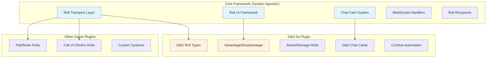
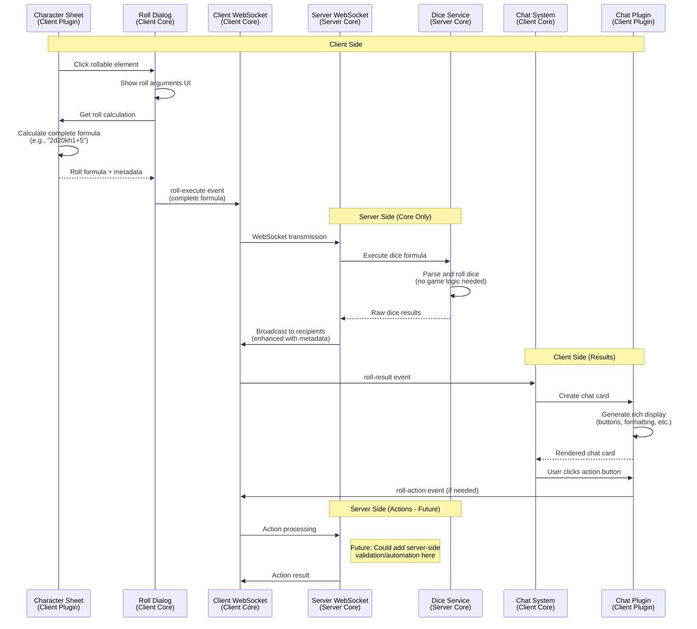
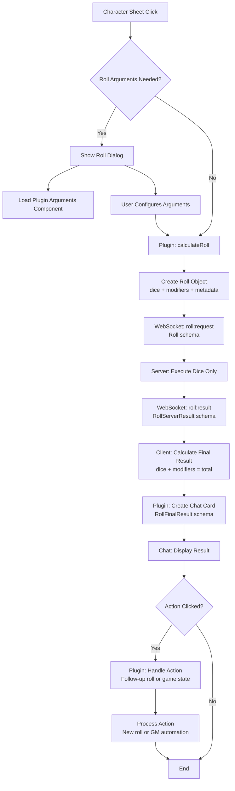

# Multi-System Rolling Architecture Proposal

**Status:** Draft  
**Author:** AI Assistant  
**Date:** 2025-01-15  
**Version:** 1.0

## Executive Summary

This proposal outlines a comprehensive rolling system architecture for Dungeon Lab that supports multiple tabletop RPG systems while maintaining clean separation between core framework functionality and game-specific implementations. The system enables rich dice rolling experiences with features like roll requests, private/public rolls, automated actions, and interactive chat cards.

### Key Goals
- **Multi-System Support**: Framework accommodates any dice-based RPG system
- **Plugin Isolation**: Game-specific logic stays in plugins, core handles transport
- **Rich Features**: Roll requests, recipients, automation, and interactive results
- **Extensible Design**: Easy to add new game systems and roll types
- **User Experience**: Intuitive workflow from character sheets to chat results

## Architecture Overview

### Core vs Plugin Separation



### Roll Flow Architecture



**Architecture Note:** This design keeps the server lightweight by having client-side plugins calculate complete dice formulas before sending to the server. The server only handles dice execution and result distribution, with no game-specific logic. This maintains clean separation between core framework and plugin responsibilities.

**Security Consideration:** For anti-cheating in competitive scenarios, server-side roll validation could be added as a future enhancement. The client would send raw roll data (ability scores, modifiers, etc.) and the server would recalculate and validate the formula before execution.

## Core Framework Components

### 1. Core Roll System

The core framework uses a three-schema approach for clean separation of concerns:

```typescript
// packages/shared/src/schemas/roll.schema.mts

// Roll (Client → Server) - What client sends to initiate a roll
export const rollSchema = z.object({
  id: z.string(),
  rollType: z.string(),
  pluginId: z.string(),
  gameSessionId: z.string(),
  
  // What server actually needs to process
  dice: z.array(z.object({
    sides: z.number(),
    quantity: z.number()
  })),
  recipients: z.enum(['public', 'private', 'gm']),
  
  // User-configurable arguments (from roll dialog)
  arguments: z.object({
    customModifier: z.number().default(0), // User-entered +/- modifier
    pluginArgs: z.record(z.unknown()).default({}) // Plugin-specific args (advantage, etc.)
  }),
  
  // Plugin-calculated modifiers (automatic from character stats)
  modifiers: z.array(z.object({
    type: z.string(),      // 'ability', 'proficiency', 'magic-item', etc.
    value: z.number(),     // +3, +2, etc.
    source: z.string()     // 'Dexterity modifier', 'Proficiency bonus'
  })),
  
  // Display metadata (for chat cards and UI)
  metadata: z.object({
    title: z.string(),
    description: z.string().optional(),
    characterName: z.string().optional(),
  }).passthrough() // Allow plugin-specific metadata
});

// RollServerResult (Server → Client) - What server sends back with dice results
export const rollServerResultSchema = rollSchema.extend({
  results: z.array(z.object({
    sides: z.number(),
    rolls: z.array(z.number()) // Raw dice roll results
  })),
  userId: z.string(),
  timestamp: z.date()
});

// RollFinalResult (Client calculated) - What client creates for display
export const rollFinalResultSchema = rollServerResultSchema.extend({
  total: z.number() // Client calculates total from dice results + modifiers + customModifier
});

export type Roll = z.infer<typeof rollSchema>;
export type RollServerResult = z.infer<typeof rollServerResultSchema>;
export type RollFinalResult = z.infer<typeof rollFinalResultSchema>;
```

### 2. WebSocket Events

Core roll events for dice execution and result distribution:

```typescript
// packages/shared/src/types/socket/roll-events.mts
export interface RollSocketEvents {
  // Core roll execution
  'roll': (roll: Roll, callback: RollCallback) => void;
  'roll:result': (result: RollServerResult) => void;
  
  // Roll actions (from chat card buttons)
  'roll-action': (action: RollAction) => void;
  'roll-action-result': (result: RollActionResult) => void;
}

export interface RollAction {
  id: string;
  rollResultId: string;
  actionType: string; // Plugin-defined action type
  actionData: Record<string, unknown>;
  pluginId: string;
  gameSessionId: string;
}

export interface RollActionResult {
  success: boolean;
  actionId: string;
  result?: Record<string, unknown>;
  error?: string;
  gameStateChanges?: GameStateChange[];
}

export interface GameStateChange {
  type: 'damage' | 'heal' | 'condition' | 'attribute' | 'resource';
  targetId: string; // Character/actor ID
  data: Record<string, unknown>;
  description: string;
}

export interface RollCallback {
  (response: { success: boolean; error?: string }): void;
}

// Note: Roll requests (GM → Player) will be added in Phase 4 as an advanced feature
```

### 3. Generic Roll UI Framework

Reusable components for roll arguments and display:

```vue
<!-- packages/shared-ui/src/components/roll/RollDialog.vue -->
<template>
  <div class="roll-dialog">
    <div class="roll-header">
      <h3>{{ rollTitle }}</h3>
      <p class="roll-description">{{ rollDescription }}</p>
    </div>
    
    <div class="roll-arguments">
      <!-- Core arguments -->
      <RollModifierInput v-model="arguments.customModifier" />
      <RollRecipientSelector v-model="recipients" />
      
      <!-- Plugin-specific arguments -->
      <component 
        v-if="customArgsComponent"
        :is="customArgsComponent"
        v-model="arguments.pluginArgs"
        :rollType="rollType"
        :rollData="rollData"
      />
    </div>
    
    <div class="roll-preview">
      <strong>Roll Preview:</strong> {{ rollPreview }}
      <div class="modifier-breakdown">
        <div v-for="mod in previewModifiers" :key="mod.source">
          {{ mod.source }}: {{ formatModifier(mod.value) }}
        </div>
        <div v-if="arguments.customModifier !== 0">
          Custom: {{ formatModifier(arguments.customModifier) }}
        </div>
      </div>
    </div>
    
    <div class="roll-actions">
      <button @click="$emit('cancel')">Cancel</button>
      <button @click="executeRoll" :disabled="!isValid">
        {{ rollButtonText || 'Roll' }}
      </button>
    </div>
  </div>
</template>

<script setup lang="ts">
import type { Roll } from '@dungeon-lab/shared/types/index.mjs';

interface Props {
  rollType: string;
  rollData: Record<string, unknown>;
  baseRoll: {
    dice: Array<{ sides: number; quantity: number }>;
    modifiers: Array<{ type: string; value: number; source: string }>;
    metadata: Record<string, unknown>;
  };
  rollTitle: string;
  rollDescription?: string;
  rollButtonText?: string;
  pluginId: string;
  gameSessionId: string;
  customArgsComponent?: Component;
}

const props = defineProps<Props>();
const emit = defineEmits<{
  execute: [roll: Roll];
  cancel: [];
}>();

const arguments = ref({
  customModifier: 0,
  pluginArgs: {}
});

const recipients = ref<'public' | 'private' | 'gm'>('public');

const customArgsComponent = ref<Component | null>(null);

// Load plugin component on mount
onMounted(async () => {
  const plugin = await pluginRegistry.getPlugin(props.pluginId);
  if (plugin && plugin.getRollArgumentsComponent) {
    customArgsComponent.value = plugin.getRollArgumentsComponent(props.rollType);
  }
});

const previewModifiers = computed(() => props.baseRoll.modifiers);
const rollPreview = computed(() => {
  const diceStr = props.baseRoll.dice.map(d => `${d.quantity}d${d.sides}`).join(' + ');
  const totalMod = previewModifiers.value.reduce((sum, mod) => sum + mod.value, 0) + arguments.value.customModifier;
  return `${diceStr}${formatModifier(totalMod)}`;
});

const formatModifier = (value: number): string => {
  return value >= 0 ? `+${value}` : `${value}`;
};

const executeRoll = async () => {
  // Recalculate roll with final arguments (user may have changed modifiers, advantage, etc.)
  const plugin = await pluginRegistry.getPlugin(props.pluginId);
  if (!plugin) {
    console.error('Plugin not found for roll execution');
    return;
  }
  
  const finalCalculation = plugin.calculateRoll(props.rollType, props.rollData, arguments.value);
  
  const roll: Roll = {
    id: generateId(),
    rollType: props.rollType,
    pluginId: props.pluginId,
    gameSessionId: props.gameSessionId,
    dice: finalCalculation.dice,
    recipients: recipients.value,
    arguments: arguments.value,
    modifiers: finalCalculation.modifiers,
    metadata: finalCalculation.metadata
  };
  
  emit('execute', roll);
};
</script>
```

```vue
<!-- packages/shared-ui/src/components/roll/RollModifierInput.vue -->
<template>
  <div class="roll-modifier-input">
    <label>Modifier</label>
    <input 
      v-model.number="localModifier" 
      type="number" 
      min="-20" 
      max="20"
      placeholder="0"
    />
    <span class="modifier-display">{{ formattedModifier }}</span>
  </div>
</template>

<script setup lang="ts">
const localModifier = defineModel<number>({ default: 0 });

const formattedModifier = computed(() => {
  const mod = localModifier.value || 0;
  return mod >= 0 ? `+${mod}` : `${mod}`;
});
</script>
```

### 4. Enhanced Chat Card System

Pluggable chat cards with action buttons:

```typescript
// packages/shared/src/types/chat-cards.mts
export interface ChatCard {
  id: string;
  type: string; // Plugin-defined card type
  title: string;
  content: string | Component;
  actions: ChatCardAction[];
  metadata: Record<string, unknown>;
  pluginId: string;
}

export interface ChatCardAction {
  id: string;
  label: string;
  type: string; // Plugin-defined action type
  data: Record<string, unknown>;
  style?: 'primary' | 'secondary' | 'danger';
  disabled?: boolean;
}

export interface RollChatCard extends ChatCard {
  rollResult: RollFinalResult;
  originalRoll: Roll;
}

// Additional schemas for completeness
export const rollTypeDefinitionSchema = z.object({
  id: z.string(),
  name: z.string(),
  description: z.string().optional(),
  category: z.string(), // 'combat', 'skill', 'save', etc.
  hasCustomArguments: z.boolean(),
  allowsModifiers: z.boolean(),
  defaultRecipients: z.enum(['public', 'private', 'gm'])
});

export const rollCalculationSchema = z.object({
  dice: z.array(z.object({
    sides: z.number(),
    quantity: z.number()
  })),
  modifiers: z.array(z.object({
    type: z.string(),
    value: z.number(),
    source: z.string()
  })),
  metadata: z.object({
    title: z.string(),
    description: z.string().optional()
  }).passthrough()
});

export type RollTypeDefinition = z.infer<typeof rollTypeDefinitionSchema>;
export type RollCalculation = z.infer<typeof rollCalculationSchema>;
```

## Plugin Integration Points

### Enhanced Plugin Interface

The plugin interface is split into focused areas for better separation of concerns:

```typescript
// packages/shared/src/types/plugin-base.mts (additions)

// Core plugin interface - implements all roll-related interfaces
export interface GameSystemPluginBase extends 
  RollCalculatorPlugin, 
  RollUIPlugin, 
  RollAutomationPlugin {
  // Existing plugin methods...
}

// Roll calculation and type definitions
export interface RollCalculatorPlugin {
  /**
   * Get all roll types supported by this plugin
   */
  getRollTypes(): RollTypeDefinition[];
  
  /**
   * Calculate dice and modifiers for a given roll
   * Returns dice array and modifiers that will be sent to server
   */
  calculateRoll(rollType: string, rollData: unknown, userArgs: RollArguments): RollCalculation;
}

// UI components and chat cards
export interface RollUIPlugin {
  /**
   * Get custom roll arguments component for this roll type
   */
  getRollArgumentsComponent?(rollType: string): Component | null;
  
  /**
   * Create chat card for roll results
   */
  createRollChatCard(result: RollFinalResult, originalRoll: Roll): RollChatCard;
}

// Game state automation and actions
export interface RollAutomationPlugin {
  /**
   * Handle roll results (for automation, state changes, etc.)
   * Runs on GM client to apply game state changes
   */
  handleRollResult?(result: RollFinalResult, originalRoll: Roll): Promise<void>;
  
  /**
   * Handle chat card actions (apply damage, save results, etc.)
   */
  handleChatCardAction?(action: RollAction): Promise<RollActionResult>;
}

export interface RollTypeDefinition {
  id: string;
  name: string;
  description?: string;
  category: string; // 'combat', 'skill', 'save', etc.
  hasCustomArguments: boolean;
  allowsModifiers: boolean;
  defaultRecipients: 'public' | 'private' | 'gm';
}

export interface RollCalculation {
  dice: Array<{ sides: number; quantity: number }>;
  modifiers: Array<{ type: string; value: number; source: string }>;
  metadata: {
    title: string;
    description?: string;
    [key: string]: unknown;
  };
}
```

### Roll Event Integration Flow



## D&D 5e Implementation Example

### Roll Type Definitions

```typescript
// packages/plugins/dnd-5e-2024/src/roll/roll-types.mts
export const dndRollTypes: RollTypeDefinition[] = [
  {
    id: 'ability-check',
    name: 'Ability Check',
    description: 'Roll a d20 + ability modifier',
    category: 'skill',
    hasCustomArguments: true, // Advantage/disadvantage
    allowsModifiers: true,
    defaultRecipients: 'public'
  },
  {
    id: 'saving-throw',
    name: 'Saving Throw',
    description: 'Roll a d20 + ability modifier + proficiency (if proficient)',
    category: 'save',
    hasCustomArguments: true,
    allowsModifiers: true,
    defaultRecipients: 'public'
  },
  {
    id: 'attack-roll',
    name: 'Attack Roll',
    description: 'Roll to hit a target',
    category: 'combat',
    hasCustomArguments: true,
    allowsModifiers: true,
    defaultRecipients: 'public'
  },
  {
    id: 'damage-roll',
    name: 'Damage Roll',
    description: 'Roll weapon or spell damage',
    category: 'combat',
    hasCustomArguments: false, // No advantage on damage
    allowsModifiers: true,
    defaultRecipients: 'public'
  },
  {
    id: 'death-save',
    name: 'Death Saving Throw',
    description: 'Roll to stabilize when unconscious',
    category: 'save',
    hasCustomArguments: false, // Pure d20, no modifiers
    allowsModifiers: false,
    defaultRecipients: 'gm' // Often private
  }
];
```

### D&D Roll Arguments Component

```vue
<!-- packages/plugins/dnd-5e-2024/src/components/internal/roll/DndRollArguments.vue -->
<template>
  <div class="dnd-roll-arguments">
    <!-- Advantage/Disadvantage (if supported) -->
    <div v-if="supportsAdvantage" class="advantage-selector">
      <label>Roll Type</label>
      <div class="radio-group">
        <label>
          <input type="radio" v-model="advantage" value="normal" />
          Normal
        </label>
        <label>
          <input type="radio" v-model="advantage" value="advantage" />
          Advantage
        </label>
        <label>
          <input type="radio" v-model="advantage" value="disadvantage" />
          Disadvantage
        </label>
      </div>
    </div>
    
    <!-- Situational Modifiers -->
    <div class="situational-modifiers">
      <label>Situational Bonuses</label>
      <div class="modifier-list">
        <div v-for="(mod, index) in situationalMods" :key="index" class="modifier-item">
          <input v-model="mod.name" placeholder="Source" />
          <input v-model.number="mod.value" type="number" min="-20" max="20" />
          <button @click="removeMod(index)">×</button>
        </div>
        <button @click="addMod" class="add-mod-btn">+ Add Bonus</button>
      </div>
    </div>
  </div>
</template>

<script setup lang="ts">
interface DndRollCustomArgs {
  advantage: 'normal' | 'advantage' | 'disadvantage';
  situationalMods: Array<{ name: string; value: number }>;
}

const props = defineProps<{
  rollType: string;
  rollData: Record<string, unknown>;
}>();

const customArgs = defineModel<DndRollCustomArgs>({
  default: () => ({
    advantage: 'normal',
    situationalMods: []
  })
});

const supportsAdvantage = computed(() => {
  return ['ability-check', 'saving-throw', 'attack-roll'].includes(props.rollType);
});

const addMod = () => {
  customArgs.value.situationalMods.push({ name: '', value: 0 });
};

const removeMod = (index: number) => {
  customArgs.value.situationalMods.splice(index, 1);
};
</script>
```

### D&D Roll Calculation

```typescript
// packages/plugins/dnd-5e-2024/src/roll/roll-calculator.mts
import { RollCalculatorPlugin } from '@dungeon-lab/shared/interfaces/rollCalculator.mjs';
import { CharacterSheet } from '../character/character-sheet.mjs';

export class DndRollCalculator implements RollCalculatorPlugin {
  calculateRoll(rollType: string, character: CharacterSheet, args: Record<string, unknown>) {
    switch (rollType) {
      case 'ability-check':
        return this.calculateAbilityCheck(character, args);
      case 'attack-roll':
        return this.calculateAttackRoll(character, args);
      case 'damage-roll':
        return this.calculateDamageRoll(character, args);
      case 'saving-throw':
        return this.calculateSavingThrow(character, args);
      default:
        throw new Error(`Unknown roll type: ${rollType}`);
    }
  }
  
  private calculateAbilityCheck(character: CharacterSheet, args: any) {
    const ability = args.ability as string;
    const skill = args.skill as string;
    const customModifier = args.customModifier || 0;
    const advantage = args.advantage || 'normal';
    
    const modifiers = [];
    
    // Ability modifier
    const abilityMod = character.getAbilityModifier(ability);
    modifiers.push({
      type: 'ability',
      value: abilityMod,
      source: `${ability} modifier`
    });
    
    // Skill proficiency
    if (skill && character.isProficientInSkill(skill)) {
      const profBonus = character.proficiencyBonus;
      modifiers.push({
        type: 'proficiency',
        value: profBonus,
        source: `${skill} proficiency`
      });
    }
    
    // Custom modifier
    if (customModifier !== 0) {
      modifiers.push({
        type: 'custom',
        value: customModifier,
        source: 'Custom modifier'
      });
    }
    
    // Handle advantage/disadvantage with dice quantity
    let diceQuantity = 1;
    if (advantage === 'advantage') diceQuantity = 2;
    if (advantage === 'disadvantage') diceQuantity = 2;
    
    return {
      dice: [{ sides: 20, quantity: diceQuantity }],
      modifiers,
      metadata: {
        title: skill ? `${skill} Check` : `${ability} Check`,
        characterName: character.name,
        advantage: advantage !== 'normal' ? advantage : undefined
      }
    };
  }
  
  private calculateAttackRoll(character: CharacterSheet, args: any) {
    const weapon = args.weapon;
    const customModifier = args.customModifier || 0;
    const advantage = args.advantage || 'normal';
    
    const modifiers = [];
    
    // Attack bonus (ability + proficiency)
    const attackBonus = character.getAttackBonus(weapon);
    modifiers.push({
      type: 'attack-bonus',
      value: attackBonus,
      source: 'Attack bonus'
    });
    
    // Magic weapon bonus
    if (weapon.enhancement) {
      modifiers.push({
        type: 'enhancement',
        value: weapon.enhancement,
        source: 'Magic weapon'
      });
    }
    
    // Custom modifier
    if (customModifier !== 0) {
      modifiers.push({
        type: 'custom',
        value: customModifier,
        source: 'Custom modifier'
      });
    }
    
    // Handle advantage/disadvantage
    let diceQuantity = 1;
    if (advantage === 'advantage') diceQuantity = 2;
    if (advantage === 'disadvantage') diceQuantity = 2;
    
    return {
      dice: [{ sides: 20, quantity: diceQuantity }],
      modifiers,
      metadata: {
        title: `${weapon.name} Attack`,
        characterName: character.name,
        advantage: advantage !== 'normal' ? advantage : undefined
      }
    };
  }
  
  private calculateDamageRoll(character: CharacterSheet, args: any) {
    const weapon = args.weapon;
    const customModifier = args.customModifier || 0;
    const critical = args.critical || false;
    
    const modifiers = [];
    
    // Damage bonus (ability modifier)
    const damageBonus = character.getDamageBonus(weapon);
    modifiers.push({
      type: 'damage-bonus',
      value: damageBonus,
      source: 'Damage bonus'
    });
    
    // Magic weapon bonus
    if (weapon.enhancement) {
      modifiers.push({
        type: 'enhancement',
        value: weapon.enhancement,
        source: 'Magic weapon'
      });
    }
    
    // Custom modifier
    if (customModifier !== 0) {
      modifiers.push({
        type: 'custom',
        value: customModifier,
        source: 'Custom modifier'
      });
    }
    
    // Parse weapon damage dice
    const baseDice = this.parseWeaponDamage(weapon.damage);
    
    // Double dice for critical hits
    const dice = critical ? baseDice.map(d => ({ ...d, quantity: d.quantity * 2 })) : baseDice;
    
    return {
      dice,
      modifiers,
      metadata: {
        title: `${weapon.name} Damage`,
        characterName: character.name,
        critical: critical || undefined
      }
    };
  }
  
  private parseWeaponDamage(damageString: string) {
    // Parse "1d8" or "2d6+1d4" style damage strings
    const dicePattern = /(\d+)d(\d+)/g;
    const dice = [];
    let match;
    
    while ((match = dicePattern.exec(damageString)) !== null) {
      dice.push({
        quantity: parseInt(match[1]),
        sides: parseInt(match[2])
      });
    }
    
    return dice;
  }
}
```

### D&D Chat Cards

```vue
<!-- packages/plugins/dnd-5e-2024/src/components/internal/roll/DndRollChatCard.vue -->
<template>
  <div class="dnd-roll-chat-card">
    <div class="roll-header">
      <div class="roll-title">{{ rollResult.metadata.title }}</div>
      <div class="roll-character">{{ rollResult.metadata.characterName }}</div>
    </div>
    
    <div class="roll-details">
      <div class="roll-formula">{{ displayFormula }}</div>
      <div class="roll-breakdown">
        <div v-for="modifier in rollResult.modifiers" :key="modifier.source" class="modifier-line">
          {{ formatModifier(modifier) }}
        </div>
      </div>
    </div>
    
    <div class="roll-result">
      <div class="dice-results">
        <span v-for="group in rollResult.results" :key="`d${group.sides}`" class="die-group">
          {{ group.quantity }}d{{ group.sides }}: [{{ group.results.join(', ') }}]
        </span>
      </div>
      <div class="total-result" :class="getResultClass()">
        Total: {{ rollResult.total }}
        <span v-if="isCritical" class="critical-indicator">{{ criticalType }}</span>
      </div>
    </div>
    
    <!-- Context-specific actions -->
    <div v-if="actions.length > 0" class="roll-actions">
      <button 
        v-for="action in actions"
        :key="action.id"
        @click="$emit('action', action)"
        :class="['action-btn', action.style || 'secondary']"
        :disabled="action.disabled"
      >
        {{ action.label }}
      </button>
    </div>
  </div>
</template>

<script setup lang="ts">
import type { RollFinalResult, ChatCardAction } from '@dungeon-lab/shared/types/index.mjs';

const props = defineProps<{
  card: RollChatCard;
}>();

const emit = defineEmits<{
  action: [action: ChatCardAction];
}>();

const rollResult = computed(() => props.card.rollResult);
const actions = computed(() => props.card.actions);

const characterName = computed(() => {
  return props.card.metadata.characterName || 'Unknown Character';
});

const isCritical = computed(() => {
  // Check for nat 20 or nat 1 in d20 rolls
  const d20Group = rollResult.value.results.find(group => group.sides === 20);
  if (!d20Group) return false;
  return d20Group.results.includes(20) || d20Group.results.includes(1);
});

const criticalType = computed(() => {
  const d20Group = rollResult.value.results.find(group => group.sides === 20);
  if (!d20Group) return '';
  if (d20Group.results.includes(20)) return '🎉 Critical Success!';
  if (d20Group.results.includes(1)) return '💀 Critical Failure!';
  return '';
});

const getResultClass = () => {
  if (isCritical.value) {
    const d20Group = rollResult.value.results.find(group => group.sides === 20);
    return d20Group?.results.includes(20) ? 'critical-success' : 'critical-failure';
  }
  return 'normal';
};
</script>
```

## Technical Specifications

### Server-Side Roll Handler

```typescript
// packages/server/src/websocket/handlers/roll.handler.mts
import { Socket } from 'socket.io';
import { socketHandlerRegistry } from '../handler-registry.mjs';
import { DiceService } from '../../services/dice.service.mjs';
import { GameSessionModel } from '../../features/campaigns/models/game-session.model.mjs';
import type { Roll, RollCallback, RollServerResult } from '@dungeon-lab/shared/types/index.mjs';

const diceService = new DiceService();

function rollHandler(socket: Socket): void {
  socket.on('roll', async (roll: Roll, callback: RollCallback) => {
    try {
      // Validate user authentication
      const userId = socket.userId;
      if (!userId) {
        throw new Error('User not authenticated');
      }

      // Verify game session access
      const gameSession = await GameSessionModel.findById(roll.gameSessionId);
      if (!gameSession) {
        throw new Error('Game session not found');
      }

      if (!gameSession.participantIds.includes(userId)) {
        throw new Error('Not authorized for this game session');
      }

      // Server only executes dice - no formula calculation
      if (!roll.dice || roll.dice.length === 0) {
        throw new Error('No dice provided');
      }

      // Execute dice rolls
      const diceResults = [];
      for (const diceGroup of roll.dice) {
        const results = [];
        for (let i = 0; i < diceGroup.quantity; i++) {
          results.push(Math.floor(Math.random() * diceGroup.sides) + 1);
        }
        diceResults.push({
          sides: diceGroup.sides,
          quantity: diceGroup.quantity,
          results
        });
      }
      
      // Create server result with dice outcomes
      const serverResult: RollServerResult = {
        ...roll, // Include all original roll data
        results: diceResults,
        userId,
        timestamp: new Date()
      };
      
      // Route to appropriate recipients
      await routeRollResult(socket, serverResult, roll);
      
      callback({ success: true });
    } catch (error) {
      callback({ 
        success: false, 
        error: error instanceof Error ? error.message : 'Roll execution failed' 
      });
    }
  });
}

async function routeRollResult(
  socket: Socket, 
  result: RollServerResult, 
  roll: Roll
) {
  const roomId = roll.gameSessionId;
  
  switch (roll.recipients) {
    case 'public':
      // Send to all players in session
      socket.to(roomId).emit('roll:result', result);
      socket.emit('roll:result', result);
      break;
      
    case 'private':
      // Send only to roller
      socket.emit('roll:result', result);
      break;
      
    case 'gm':
      // Send to GM and roller
      const session = await GameSessionModel.findById(roomId);
      if (session) {
        const gmSockets = getSocketsForUser(session.gmId);
        gmSockets.forEach(gmSocket => gmSocket.emit('roll:result', result));
      }
      socket.emit('roll:result', result);
      break;
  }
}

socketHandlerRegistry.register(rollHandler);
```

### Client-Side Roll Result Processing

```typescript
// packages/web/src/services/roll-result.service.mts
import type { RollServerResult, RollFinalResult } from '@dungeon-lab/shared/types/index.mjs';

export class RollResultService {
  /**
   * Convert server dice results to final calculated result
   */
  calculateFinalResult(serverResult: RollServerResult): RollFinalResult {
    // Calculate dice total with advantage/disadvantage handling
    const diceTotal = this.calculateDiceTotal(serverResult);
    
    // Calculate modifier total
    const modifierTotal = serverResult.modifiers.reduce((sum, mod) => sum + mod.value, 0);
    
    // Add custom modifier from arguments
    const customModifier = serverResult.arguments.customModifier || 0;
    
    // Calculate final total
    const total = diceTotal + modifierTotal + customModifier;
    
    return {
      ...serverResult,
      total
    };
  }
  
  private calculateDiceTotal(serverResult: RollServerResult): number {
    let total = 0;
    
    for (const diceGroup of serverResult.results) {
      if (diceGroup.sides === 20 && diceGroup.quantity === 2) {
        // Handle advantage/disadvantage for d20s
        const advantage = serverResult.metadata.advantage;
        if (advantage === 'advantage') {
          total += Math.max(...diceGroup.results);
        } else if (advantage === 'disadvantage') {
          total += Math.min(...diceGroup.results);
        } else {
          // Should not happen with quantity 2, but fall back to sum
          total += diceGroup.results.reduce((sum, result) => sum + result, 0);
        }
      } else {
        // Normal dice - sum all results
        total += diceGroup.results.reduce((sum, result) => sum + result, 0);
      }
    }
    
    return total;
  }
}
```

### Client-Side Roll Result Listener

```typescript
// packages/web/src/services/websocket/roll.listener.mts
import { Socket } from 'socket.io-client';
import { RollResultService } from '../roll-result.service.mjs';
import { pluginRegistry } from '../plugin-registry.mjs';
import { chatStore } from '../../stores/chat.store.mjs';
import type { RollServerResult } from '@dungeon-lab/shared/types/index.mjs';

const rollResultService = new RollResultService();

export function setupRollListener(socket: Socket) {
  socket.on('roll:result', async (serverResult: RollServerResult) => {
    try {
      // Calculate final result with totals
      const finalResult = rollResultService.calculateFinalResult(serverResult);
      
      // Get plugin to create chat card
      const plugin = await pluginRegistry.getPlugin(serverResult.pluginId);
      if (!plugin || !plugin.createRollChatCard) {
        console.error('Plugin not found or missing createRollChatCard method');
        return;
      }
      
      // Create chat card from plugin
      const chatCard = plugin.createRollChatCard(finalResult, serverResult);
      
      // Add to chat
      chatStore.addChatCard(chatCard);
      
    } catch (error) {
      console.error('Failed to process roll result:', error);
    }
  });
}

// Application initialization
// packages/web/src/main.mts (additions)
import { setupRollListener } from './services/websocket/roll.listener.mjs';

// In socket connection setup:
socketStore.socket = io(SERVER_URL);
setupRollListener(socketStore.socket);
```

### Roll Integration in Character Sheets

```typescript
// packages/plugins/dnd-5e-2024/src/components/exports/character-sheet.vue (modifications)

// Replace existing roll methods with new system
const rollAbilityCheck = (ability: string) => {
  const rollData = {
    ability,
    character: character.value,
    type: 'ability-check'
  };
  
  emit('roll', 'ability-check', rollData);
};

const rollSavingThrow = (ability: string) => {
  const rollData = {
    ability,
    character: character.value,
    type: 'saving-throw'
  };
  
  emit('roll', 'saving-throw', rollData);
};

const rollSkillCheck = (skill: string) => {
  const skillData = characterSkills.value[skill];
  const rollData = {
    skill,
    ability: skillData.ability,
    character: character.value,
    type: 'skill-check'
  };
  
  emit('roll', 'skill-check', rollData);
};
```

### Framework Roll Handler

```vue
<!-- packages/web/src/components/common/DocumentSheetContainer.vue (modifications) -->
<script setup lang="ts">
// Add roll dialog state
const showRollDialog = ref(false);
const pendingRoll = ref<{
  rollType: string;
  rollData: Record<string, unknown>;
  pluginId: string;
  baseRoll?: RollCalculation;
} | null>(null);

// Enhanced roll handler
const handleRoll = async (rollType: string, rollData: Record<string, unknown>) => {
  const pluginId = documentInfo.value.pluginId;
  if (!pluginId) {
    console.error('No plugin ID available for roll');
    return;
  }
  
  // Get plugin to check if custom arguments are needed
  const plugin = await pluginRegistry.getPlugin(pluginId);
  const rollTypeDef = plugin?.getRollTypes().find(rt => rt.id === rollType);
  
  if (!plugin || !plugin.calculateRoll) {
    console.error('Plugin missing calculateRoll method');
    return;
  }
  
  if (rollTypeDef?.hasCustomArguments) {
    // Calculate base roll for dialog preview
    const baseRoll = plugin.calculateRoll(rollType, rollData, {
      customModifier: 0,
      pluginArgs: {}
    });
    
    // Show roll dialog for custom arguments
    pendingRoll.value = { rollType, rollData, pluginId, baseRoll };
    showRollDialog.value = true;
  } else {
    // Execute roll directly with default arguments
    const rollCalculation = plugin.calculateRoll(rollType, rollData, {
      customModifier: 0,
      pluginArgs: {}
    });
    
    const roll: Roll = {
      id: generateId(),
      rollType,
      pluginId,
      gameSessionId: gameSessionStore.currentSession?.id || '',
      dice: rollCalculation.dice,
      recipients: rollTypeDef?.defaultRecipients || 'public',
      arguments: {
        customModifier: 0,
        pluginArgs: {}
      },
      modifiers: rollCalculation.modifiers,
      metadata: rollCalculation.metadata
    };
    
    executeRoll(roll);
  }
};

const executeRoll = (roll: Roll) => {
  socketStore.socket?.emit('roll', roll, (response) => {
    if (!response.success) {
      console.error('Roll failed:', response.error);
      // TODO: Show user error message
    }
  });
  
  showRollDialog.value = false;
  pendingRoll.value = null;
};
</script>

<template>
  <!-- Existing template... -->
  
  <!-- Roll Dialog -->
  <RollDialog
    v-if="showRollDialog && pendingRoll && pendingRoll.baseRoll"
    :rollType="pendingRoll.rollType"
    :rollData="pendingRoll.rollData"
    :baseRoll="pendingRoll.baseRoll"
    :rollTitle="pendingRoll.baseRoll.metadata.title"
    :rollDescription="pendingRoll.baseRoll.metadata.description"
    :pluginId="pendingRoll.pluginId"
    :gameSessionId="gameSessionStore.currentSession?.id || ''"
    @execute="executeRoll"
    @cancel="showRollDialog = false; pendingRoll = null"
  />
</template>
```

## Implementation Phases

### Phase 1: Core Infrastructure (Weeks 1-2)
**Priority: Critical**

1. **Core Schemas & Types**
   - Create new three-schema approach in `roll.schema.mts`:
     - `rollSchema` (client → server)
     - `rollServerResultSchema` (server → client)  
     - `rollFinalResultSchema` (client calculated)
   - Add plugin interfaces for roll calculation

2. **WebSocket Infrastructure**  
   - Update roll handlers to use new schemas
   - Implement dice-only server execution
   - Add recipient routing (public/private/GM)

3. **Generic UI Components**
   - Build `RollDialog` component with arguments, modifiers display
   - Create `RollModifierInput` and `RollRecipientSelector`
   - Implement generic chat card framework

### Phase 2: Framework Integration (Weeks 3-4)  
**Priority: High**

1. **Client-Side Roll Processing**
   - Implement roll result calculation on client
   - Add final result schema processing
   - Connect plugin calculators to roll flow

2. **Chat System Enhancement**
   - Implement pluggable chat cards with new schema
   - Add action button handling for follow-up rolls
   - Create roll result displays with dice breakdown

3. **Plugin Registry Extensions**
   - Add `RollCalculatorPlugin` interface registration
   - Implement roll type discovery for plugins
   - Create plugin component loading for custom roll arguments

### Phase 3: D&D 5e Implementation (Weeks 5-6)
**Priority: High**

1. **D&D Roll Calculator**
   - Implement `DndRollCalculator` with new interface
   - Add all D&D roll types (ability checks, attacks, damage, saves)
   - Handle advantage/disadvantage via dice quantity

2. **D&D UI Components**
   - Build D&D-specific roll argument components
   - Create D&D chat cards with proper modifier display
   - Implement critical hit and advantage indicators

3. **Character Sheet Integration**
   - Implement character/actor sheets with new roll system
   - Add comprehensive roll coverage for all D&D mechanics
   - Create rollable UI elements with proper click handlers

### Phase 4: Advanced Features (Weeks 7-8)
**Priority: Medium**

1. **Roll Requests**
   - GM ability to request rolls from players
   - Player response handling
   - Request timeout and management

2. **Combat Automation**
   - Auto-apply damage from successful attacks
   - Condition tracking from spell effects
   - Initiative and turn order integration

3. **Roll History & Templates**
   - Save and replay roll configurations
   - Common roll shortcuts
   - Personal roll preferences

### Phase 5: Polish & Testing (Week 9)
**Priority: Medium**

1. **Error Handling**
   - Graceful roll failure handling
   - Network error recovery
   - Invalid roll data validation

2. **Performance Optimization**
   - Roll calculation caching
   - UI component optimization
   - WebSocket event debouncing

3. **Testing & Documentation**
   - Unit tests for roll calculations
   - Integration tests for WebSocket flow
   - Plugin developer documentation

## Success Metrics

### Functional Requirements ✅
- [ ] Click any rollable element on character/actor sheets
- [ ] Roll arguments UI appears when needed
- [ ] Dice results appear in chat with proper formatting
- [ ] Roll recipients (public/private/GM) work correctly
- [ ] Chat card actions trigger appropriate responses

### Technical Requirements ✅
- [ ] Zero D&D-specific code in core framework
- [ ] Plugin isolation maintained
- [ ] All WebSocket events properly typed
- [ ] Roll system extensible to other game systems
- [ ] Performance acceptable with multiple concurrent rolls

### User Experience Requirements ✅  
- [ ] Intuitive roll workflow from sheet to chat
- [ ] Clear roll previews before execution
- [ ] Rich chat cards with contextual information
- [ ] Responsive UI on mobile devices
- [ ] Accessible keyboard navigation

## Risk Mitigation

### Technical Risks
- **Performance**: Cache roll calculations, optimize WebSocket events
- **Complexity**: Start with core features, add advanced functionality incrementally
- **Plugin Isolation**: Strict type checking and interface validation

### User Experience Risks  
- **Learning Curve**: Provide clear visual feedback and help tooltips
- **Mobile Usability**: Test roll dialogs on various screen sizes
- **Network Issues**: Implement retry logic and offline graceful degradation

### Development Risks
- **Scope Creep**: Stick to defined phases and feature sets  
- **Plugin API Stability**: Design stable interfaces from the start
- **Integration Complexity**: Test plugin interfaces thoroughly during development

## Conclusion

This architecture provides a robust foundation for multi-system dice rolling while maintaining clean separation of concerns. The plugin system allows game-specific implementations without contaminating the core framework, ensuring Dungeon Lab can support any tabletop RPG system with dice-based mechanics.

The phased implementation approach minimizes risk while delivering value incrementally. Starting with core infrastructure and D&D 5e implementation provides immediate benefits while establishing patterns for future game system plugins.

The end result will be an intuitive, feature-rich rolling system that enhances the virtual tabletop experience for all supported game systems.