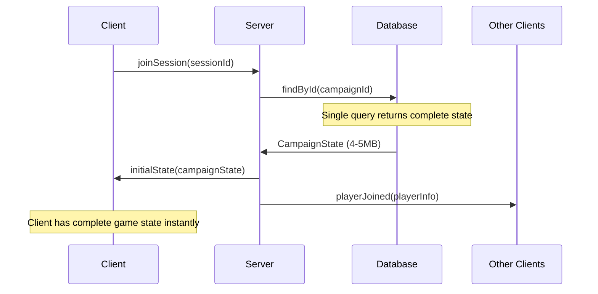
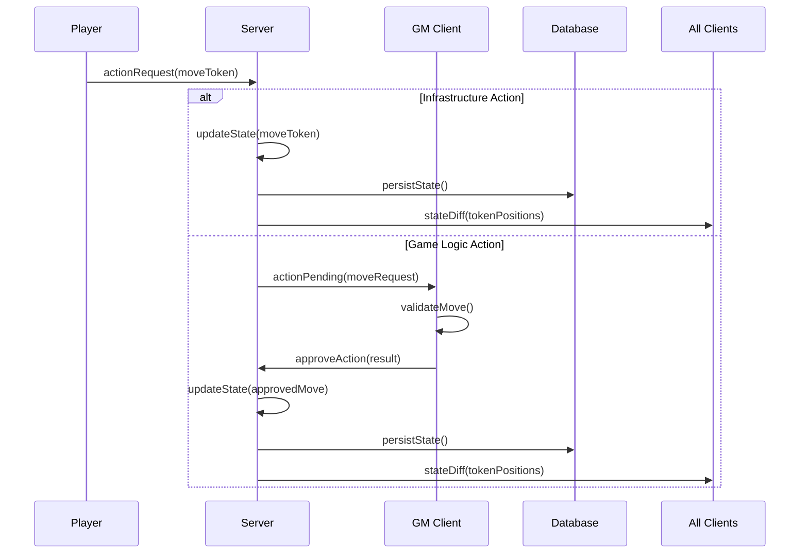
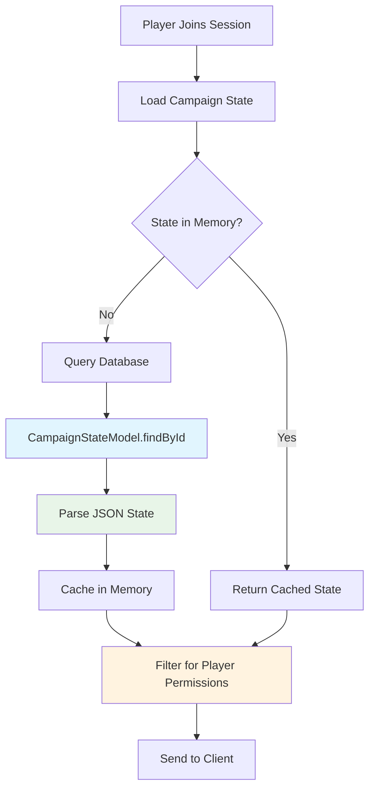
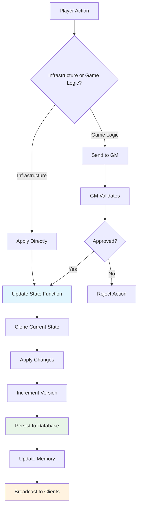
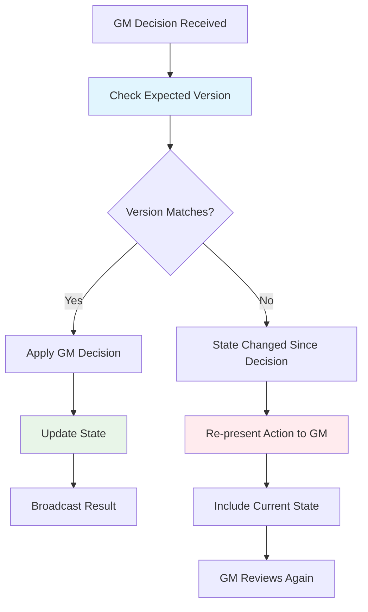
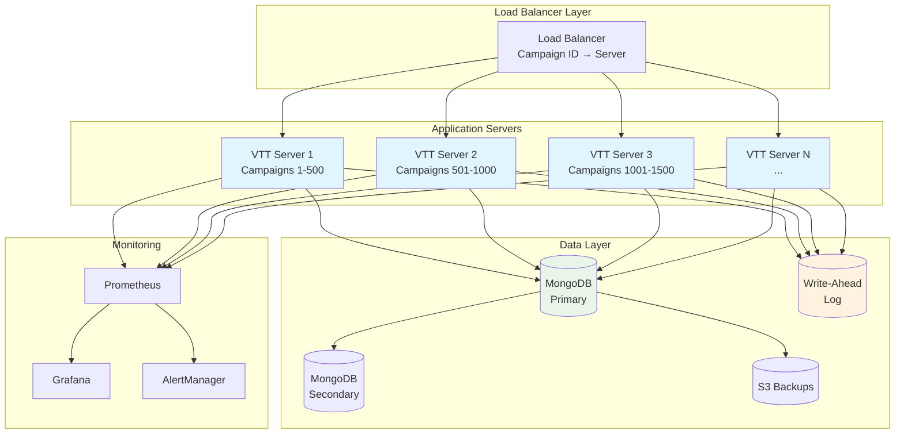

# Single Campaign State Architecture

## Executive Summary

The current GM-Authoritative state management architecture, while comprehensive, has become unnecessarily complex for a Virtual Table Top (VTT) system. This proposal introduces a **Single Campaign State** approach that dramatically simplifies state management while maintaining all the benefits of centralized authority and real-time synchronization.

### Key Problem: Over-Engineering for VTT Scale

The existing architecture treats the VTT system like a large-scale enterprise application with:
- Multiple aggregates (Campaign, GameSession, Encounter)
- Complex per-entity versioning and optimistic locking
- Multi-document transactions across 6+ MongoDB collections
- Sophisticated conflict resolution strategies
- Complex state reconstitution across multiple services

**Reality Check**: VTT campaigns are typically:
- 4-6 players maximum
- Single active session per campaign
- Relatively small data footprint (~4-5MB per campaign)
- Sticky to single server (natural session affinity)

### Proposed Solution: Unified Campaign State

Replace the complex multi-aggregate architecture with a single JSON document containing all campaign state:

```typescript
interface CampaignState {
  // Metadata
  id: string;
  version: number;  // Simple incremental version
  lastModified: number;
  
  // Campaign core data
  campaign: CampaignData;
  actors: Record<string, ActorData>;
  items: Record<string, ItemData>;
  maps: Record<string, MapData>;
  encounters: Record<string, EncounterData>;
  
  // Live session state
  currentSession: {
    activeEncounterId?: string;
    currentMapId?: string;
    tokenPositions: Record<string, Position>;
    initiativeOrder: string[];
    currentTurn: number;
    round: number;
    connectedPlayers: string[];
    pendingActions: ActionRequest[];
  };
}
```

### Benefits

1. **90% Complexity Reduction**: Eliminates aggregates, transactions, entity versioning
2. **Zero Race Conditions**: Single atomic updates with simple version checking
3. **Instant Development**: Much faster to implement, test, and debug
4. **Natural Atomicity**: Every state change is inherently atomic
5. **Simple Conflict Resolution**: One version number, clear last-write-wins semantics
6. **Performance**: All state in memory, minimal database queries

## Current Architecture Problems

### State Scattered Across Multiple Models

The existing system spreads campaign state across numerous MongoDB collections:

```typescript
// Current scattered approach
class CurrentVTTSystem {
  campaignModel: CampaignModel;           // Basic campaign metadata
  gameSessionModel: GameSessionModel;     // Active session data
  encounterModel: EncounterModel;         // Combat encounters
  actorModel: ActorDocumentModel;         // Characters and NPCs
  itemModel: ItemDocumentModel;          // Items and equipment
  mapModel: MapModel;                    // Battle maps
  tokenModel: TokenModel;                // Token positions
  effectModel: EffectModel;              // Temporary effects
  initiativeModel: InitiativeModel;     // Turn order tracking
}
```

**Problems:**
- Requires complex joins and population queries
- Vulnerable to race conditions during multi-document reads
- Difficult to maintain consistency across related data
- Complex transaction coordination for related updates
- Slow initial state loading (multiple database queries)

### Complex State Synchronization

Current WebSocket handling uses room-based broadcasting with complex state reconstitution:

```typescript
// Current complex synchronization
socket.on('joinSession', async (sessionId) => {
  // Multiple database queries to build initial state
  const campaign = await CampaignModel.findById(sessionId).populate('characters');
  const session = await GameSessionModel.findById(sessionId).populate('participants');
  const encounters = await EncounterModel.find({ campaignId });
  const tokens = await TokenModel.find({ encounterId: session.activeEncounter });
  const effects = await EffectModel.find({ encounterId: session.activeEncounter });
  
  // Complex state assembly with potential race conditions
  const gameState = assembleComplexState(campaign, session, encounters, tokens, effects);
  socket.emit('initialState', gameState);
});
```

### Over-Engineered Conflict Resolution

The current system implements enterprise-grade optimistic locking:

```typescript
// Current over-complex conflict resolution
interface StateVersion {
  global: string;
  entities: Map<string, string>;  // Per-entity versions
  timestamp: number;
  checksum: string;
}

// Requires complex version checking across multiple documents
async applyStateChanges(changes: StateChange[], expectedVersion: StateVersion) {
  await this.db.transaction(async (session) => {
    for (const change of changes) {
      // Check version for each affected entity
      const currentEntityVersion = await this.getEntityVersion(change.entityId);
      if (currentEntityVersion !== expectedVersion.entities.get(change.entityId)) {
        throw new StateVersionConflictError();
      }
    }
    // Apply changes across multiple collections...
  });
}
```

## Proposed Single State Architecture

### Unified Campaign State Object

All campaign data consolidated into a single, serializable object:

```typescript
interface CampaignState {
  // Document metadata
  id: string;
  version: number;              // Simple incremental counter
  lastModified: number;
  createdAt: number;
  
  // Campaign configuration
  campaign: {
    name: string;
    description: string;
    gmId: string;
    pluginId: string;
    settings: CampaignSettings;
    tags: string[];
  };
  
  // Game entities (all in-memory for fast access)
  actors: Record<string, {
    id: string;
    name: string;
    type: 'character' | 'npc' | 'monster';
    owner?: string;              // Player who controls this actor
    pluginData: any;             // D&D stats, etc.
    inventory: InventoryItem[];
    position?: Position;         // Current token position
    conditions: Condition[];     // Active effects
    imageAssets: AssetReferences;
  }>;
  
  items: Record<string, {
    id: string;
    name: string;
    description: string;
    pluginData: any;            // Item mechanics data
    imageAssets: AssetReferences;
  }>;
  
  maps: Record<string, {
    id: string;
    name: string;
    imageUrl: string;
    gridData: GridConfiguration;
    layers: MapLayer[];
    lighting: LightingData;
  }>;
  
  encounters: Record<string, {
    id: string;
    name: string;
    mapId?: string;
    status: 'draft' | 'active' | 'paused' | 'completed';
    participants: string[];      // Actor IDs
    round: number;
    currentTurn: number;
    initiative: InitiativeEntry[];
    activeEffects: Effect[];
  }>;
  
  // Real-time session state
  currentSession: {
    id: string;
    isActive: boolean;
    activeEncounterId?: string;
    currentMapId?: string;
    
    // Live state that changes frequently
    connectedPlayers: ConnectedPlayer[];
    tokenPositions: Record<string, Position>;
    chatMessages: ChatMessage[];
    
    // GM workflow state
    pendingActions: PendingAction[];
    gmSettings: GMSettings;
  };
  
  // Audit trail
  changeLog: StateChange[];      // Last N changes for debugging
}
```

### Simplified State Manager

Replace complex aggregates with a single state management class:

```typescript
class CampaignStateManager {
  private state: CampaignState;
  private clients: Set<WebSocket> = new Set();
  private persistenceTimer?: NodeJS.Timeout;
  
  constructor(campaignId: string) {
    this.state = this.loadFromDatabase(campaignId);
    this.schedulePeriodicSave();
  }
  
  // Core state mutation method
  async updateState(
    playerId: string,
    updateFn: (state: CampaignState) => CampaignState,
    description: string
  ): Promise<void> {
    // Apply the update function
    const newState = updateFn(structuredClone(this.state));
    
    // Increment version and timestamp
    newState.version = this.state.version + 1;
    newState.lastModified = Date.now();
    
    // Add to change log for debugging
    newState.changeLog.push({
      version: newState.version,
      playerId,
      description,
      timestamp: Date.now()
    });
    
    // Persist and broadcast atomically
    await this.persistState(newState);
    this.state = newState;
    this.broadcastStateUpdate(newState, playerId);
  }
  
  // Simple state broadcasting
  private broadcastStateUpdate(state: CampaignState, excludePlayerId?: string) {
    const update = {
      type: 'state_update',
      version: state.version,
      timestamp: state.lastModified,
      // Can send full state or diff based on size
      state: this.shouldSendDiff(state) ? this.createStateDiff(state) : state
    };
    
    this.clients.forEach(client => {
      if (client.playerId !== excludePlayerId) {
        client.send(JSON.stringify(update));
      }
    });
  }
  
  // Efficient persistence
  private async persistState(state: CampaignState): Promise<void> {
    // Single database write
    await CampaignStateModel.findByIdAndUpdate(
      state.id,
      { 
        state: state,
        version: state.version,
        lastModified: state.lastModified
      },
      { upsert: true }
    );
  }
}
```

## State Synchronization Patterns

### Initial State Loading

Dramatically simplified client join process:



### Real-time State Updates

Simple state diff broadcasting:



### Conflict Resolution

Extremely simple version-based conflict resolution:

```typescript
class SimplifiedConflictResolution {
  async handleGMDecision(decision: GMDecision): Promise<void> {
    // Simple version check - no complex entity versioning!
    if (decision.expectedVersion !== this.state.version) {
      // State changed since GM made decision
      return this.rejectStaleDecision(decision, 'State has changed, please review action again');
    }
    
    // Apply GM's decision
    await this.updateState(decision.gmId, (state) => {
      return this.applyGMChanges(state, decision.changes);
    }, `GM approved: ${decision.actionType}`);
  }
  
  private rejectStaleDecision(decision: GMDecision, reason: string): void {
    // Simply re-present the action with current state
    this.sendToGM({
      type: 'action_retry',
      originalAction: decision.originalAction,
      currentState: this.state,
      reason
    });
  }
}
```

## Implementation Strategy

### Phase 1: Create New State Management

1. **Create Single State Model**
```typescript
// New unified model
const campaignStateSchema = new mongoose.Schema({
  _id: ObjectId,
  state: {
    type: mongoose.Schema.Types.Mixed,
    required: true
  },
  version: {
    type: Number,
    default: 1
  },
  lastModified: {
    type: Date,
    default: Date.now
  }
});

export const CampaignStateModel = mongoose.model('CampaignState', campaignStateSchema);
```

2. **Implement State Manager**
   - Create `CampaignStateManager` class
   - Implement state update patterns
   - Add simple broadcasting logic

### Phase 2: Parallel Implementation

1. **Create Migration Tools**
   - Build scripts to convert existing scattered data to unified state
   - Maintain both old and new systems during transition

2. **Update Socket Handlers**
   - Simplify from room-based to state-version broadcasting
   - Implement state diff algorithms for efficiency

### Phase 3: Replace Complex Components

1. **Remove Aggregate Services**
   - Replace `CampaignService`, `GameSessionService`, `EncounterService` 
   - Consolidate into simple state operations

2. **Simplify WebSocket Events**
   - Convert from typed events to state update patterns
   - Remove complex event schemas

### Phase 4: Data Migration

1. **Migrate Existing Campaigns**
   - Run migration scripts on production data
   - Maintain compatibility during transition

2. **Remove Legacy Models**
   - Delete old MongoDB collections
   - Clean up unused code

## Major Code Changes Required

### Files to Replace/Simplify

**Models (Delete/Consolidate):**
- `src/features/campaigns/models/campaign.model.mts` → Part of unified state
- `src/features/campaigns/models/game-session.model.mts` → Part of unified state
- `src/features/encounters/models/encounter.model.mts` → Part of unified state
- `src/features/documents/models/actor-document.model.mts` → Part of unified state
- `src/features/documents/models/item-document.model.mts` → Part of unified state
- `src/features/encounters/models/token.model.mts` → Part of unified state
- `src/features/encounters/models/effect.model.mts` → Part of unified state

**Services (Greatly Simplify):**
- `src/features/campaigns/services/game-session.service.mts`
- `src/features/campaigns/controllers/game-session.controller.mts`
- `src/features/encounters/services/*`

**WebSocket Handlers (Streamline):**
- `src/websocket/handlers/*` → Convert to state update patterns
- `src/websocket/socket-server.mts` → Simplify to state broadcasting

### New Files to Create

**Core State Management:**
```
src/state/
├── campaign-state.model.mts        # Unified state model
├── campaign-state-manager.mts      # Core state management
├── state-diff.service.mts          # Efficient state diffing
├── state-persistence.service.mts   # Optimized persistence
└── migration/
    ├── data-migration.mts          # Convert existing data
    └── compatibility.service.mts   # Temporary compatibility layer
```

## Performance & Scalability Analysis

### Memory Usage

**Current Scattered Approach:**
- Requires loading related data on-demand
- Multiple database queries for state assembly
- Complex object graphs with virtual references

**Single State Approach:**
- Complete campaign state: ~4-5MB in memory
- Modern servers can handle 1000+ concurrent campaigns
- Faster access (no database queries for reads)

### Network Efficiency

**State Size Analysis:**
```typescript
// Typical campaign state breakdown
interface StateSize {
  campaign: 50_000;        // Campaign metadata and settings
  actors: 2_000_000;       // 200 NPCs × 10KB each
  items: 1_000_000;        // 500 items × 2KB each  
  maps: 1_000_000;         // 10 maps × 100KB each
  encounters: 500_000;     // 20 encounters × 25KB each
  currentSession: 100_000; // Live session data
  // Total: ~4.65MB per campaign
}

// Network optimization strategies:
const optimizations = {
  initialLoad: 'Send full state once (4.65MB)',
  updates: 'Send only diffs (typically <1KB)',
  compression: 'gzip reduces by ~70% (1.4MB initial)',
  caching: 'Client caches full state locally'
};
```

**Update Patterns:**
Most VTT actions are small updates:
- Move token: 2 coordinate changes (~50 bytes)
- Update HP: 1 number change (~20 bytes)
- Add chat message: Text content (~100-500 bytes)
- Cast spell: Add/remove effects (~200-1000 bytes)

### Conflict Resolution Performance

**Current Complex Approach:**
- Per-entity version checks
- Multi-document transaction coordination
- Complex rollback scenarios

**Simple Approach:**
```typescript
// O(1) conflict detection
const hasConflict = (expectedVersion: number, currentVersion: number) => {
  return expectedVersion !== currentVersion;
};

// Simple resolution: just retry with current state
const resolveConflict = (action: Action, currentState: CampaignState) => {
  return presentActionToGM(action, currentState);
};
```

## Comparison: Old vs New Architecture

### State Loading

**Old (Complex):**
```typescript
// Multiple database queries with race condition potential
async getCompleteSessionState(playerId: string): Promise<CompleteSessionState> {
  return await this.db.transaction(async (dbSession) => {
    const campaignData = await this.campaign.getFullCampaignData(dbSession);
    const playerCharacters = await this.getPlayerCharacters(playerId, dbSession);
    const mapState = await this.getCurrentMapState(playerId, dbSession);
    const encounterState = await this.getEncounterStateForPlayer(playerId, dbSession);
    // ... complex state assembly
  });
}
```

**New (Simple):**
```typescript
// Single database query
async getCompleteSessionState(playerId: string): Promise<CampaignState> {
  const campaignState = await CampaignStateModel.findById(campaignId);
  return this.filterStateForPlayer(campaignState.state, playerId);
}
```

### State Updates

**Old (Complex):**
```typescript
// Multi-document transaction with version checking
async applyStateChanges(changes: StateChange[], expectedVersion: StateVersion) {
  return await this.db.transaction(async (dbSession) => {
    for (const change of changes) {
      if (!this.isVersionCompatible(currentVersion, expectedVersion)) {
        throw new StateVersionConflictError();
      }
      await this.applyChange(currentState, change, dbSession);
      currentVersion.entities.set(change.entityId, generateNewEntityVersion());
    }
    // ... complex version management
  });
}
```

**New (Simple):**
```typescript
// Single atomic update
async updateState(updateFn: (state: CampaignState) => CampaignState) {
  const newState = updateFn(structuredClone(this.state));
  newState.version++;
  await this.persistState(newState);
  this.state = newState;
  this.broadcast(newState);
}
```

### Conflict Resolution

**Old (Over-Engineered):**
```typescript
// Complex entity-level version checking
interface StateVersion {
  global: string;
  entities: Map<string, string>;
  timestamp: number;
  checksum: string;
}

private isVersionCompatible(current: StateVersion, expected: StateVersion): boolean {
  for (const [entityId, expectedEntityVersion] of expected.entities) {
    const currentEntityVersion = current.entities.get(entityId);
    if (currentEntityVersion && currentEntityVersion !== expectedEntityVersion) {
      return false;
    }
  }
  return true;
}
```

**New (Appropriately Simple):**
```typescript
// Simple version checking
const isStateStale = (expectedVersion: number, currentVersion: number) => {
  return expectedVersion !== currentVersion;
};

// Handle conflicts by re-presenting action
if (isStateStale(gmDecision.expectedVersion, this.state.version)) {
  this.resubmitActionToGM(gmDecision.originalAction, this.state);
}
```

## State Flow Diagrams

### Campaign State Initialization



### State Update Flow



### Conflict Resolution Flow



## Migration Strategy

### Database Migration

**Step 1: Extract Current Data**
```typescript
async migrateExistingCampaign(campaignId: string): Promise<CampaignState> {
  // Gather all related data
  const campaign = await CampaignModel.findById(campaignId).populate('characters');
  const sessions = await GameSessionModel.find({ campaignId });
  const encounters = await EncounterModel.find({ campaignId });
  const tokens = await TokenModel.find({ campaignId });
  
  // Transform to unified structure
  const unifiedState: CampaignState = {
    id: campaignId,
    version: 1,
    lastModified: Date.now(),
    createdAt: campaign.createdAt.getTime(),
    
    campaign: {
      name: campaign.name,
      description: campaign.description,
      gmId: campaign.gameMasterId,
      pluginId: campaign.pluginId,
      settings: campaign.settings,
      tags: campaign.tags || []
    },
    
    actors: this.transformActors(campaign.characters),
    items: this.transformItems(campaign.items),
    maps: this.transformMaps(campaign.maps),
    encounters: this.transformEncounters(encounters),
    
    currentSession: this.buildCurrentSession(sessions[0])
  };
  
  return unifiedState;
}
```

**Step 2: Dual-Write Period**
```typescript
// Maintain both systems during transition
class DualStateManager {
  async updateState(changes: StateChange[]) {
    // Update new unified state
    await this.newStateManager.updateState(changes);
    
    // Also update old scattered models for compatibility
    await this.updateLegacyModels(changes);
  }
}
```

**Step 3: Validation Period**
```typescript
// Verify data consistency between old and new systems
async validateMigration(campaignId: string): Promise<ValidationReport> {
  const oldState = await this.assembleLegacyState(campaignId);
  const newState = await this.getUnifiedState(campaignId);
  
  return this.compareStates(oldState, newState);
}
```

## Production Readiness Assessment

### Is This Adequate for Production with Paid Users?

**Answer: YES** - The single state approach is not only adequate for production but likely **more reliable** than complex distributed architectures when implemented with proper production safeguards.

### Production-Grade Enhancements Required

#### **1. Durability & Fault Tolerance**

**Write-Ahead Logging for Durability:**
```typescript
class ProductionSafeCampaignStateManager {
  private writeAheadLog: WriteAheadLog;
  
  async updateState(updateFn: StateUpdateFunction) {
    // Write-ahead logging prevents data loss during server crashes
    const changeId = await this.writeAheadLog.append({
      campaignId: this.campaignId,
      operation: serializeFunction(updateFn),
      timestamp: Date.now(),
      playerId: this.currentPlayerId
    });
    
    try {
      const newState = updateFn(structuredClone(this.state));
      newState.version++;
      newState.lastModified = Date.now();
      
      // Atomic persist with MongoDB write concerns
      await this.persistStateWithRetry(newState);
      this.state = newState;
      
      // Mark operation complete
      await this.writeAheadLog.markComplete(changeId);
      
      this.broadcastStateUpdate(newState);
    } catch (error) {
      await this.writeAheadLog.markFailed(changeId);
      logger.error('State update failed', { campaignId: this.campaignId, error });
      throw error;
    }
  }
  
  private async persistStateWithRetry(state: CampaignState, maxRetries = 3) {
    for (let i = 0; i < maxRetries; i++) {
      try {
        await CampaignStateModel.findByIdAndUpdate(
          state.id,
          { 
            state, 
            version: state.version, 
            lastModified: state.lastModified 
          },
          { 
            upsert: true, 
            writeConcern: { w: 'majority', j: true }, // Ensure durability
            maxTimeMS: 5000 // Prevent hanging
          }
        );
        return;
      } catch (error) {
        if (i === maxRetries - 1) throw error;
        await this.delay(Math.pow(2, i) * 1000); // Exponential backoff
      }
    }
  }
}
```

#### **2. Memory Management & Resource Control**

**LRU Cache with Intelligent Eviction:**
```typescript
class ProductionMemoryManager {
  private campaignStates = new Map<string, CampaignState>();
  private lastAccess = new Map<string, number>();
  private memoryUsage = new Map<string, number>();
  
  private readonly MAX_MEMORY_CAMPAIGNS = 1000;
  private readonly IDLE_TIMEOUT = 30 * 60 * 1000; // 30 minutes
  private readonly MAX_MEMORY_MB = 4 * 1024; // 4GB limit
  
  async getCampaignState(campaignId: string): Promise<CampaignState> {
    // Check memory limits before loading new campaigns
    if (this.shouldEvictCampaigns()) {
      await this.evictOldestCampaigns();
    }
    
    let state = this.campaignStates.get(campaignId);
    if (!state) {
      state = await this.loadFromDatabase(campaignId);
      this.campaignStates.set(campaignId, state);
      this.memoryUsage.set(campaignId, this.calculateStateSize(state));
    }
    
    this.lastAccess.set(campaignId, Date.now());
    return state;
  }
  
  private shouldEvictCampaigns(): boolean {
    const totalMemoryMB = Array.from(this.memoryUsage.values())
      .reduce((sum, size) => sum + size, 0) / (1024 * 1024);
    
    return this.campaignStates.size >= this.MAX_MEMORY_CAMPAIGNS ||
           totalMemoryMB >= this.MAX_MEMORY_MB;
  }
  
  private async evictOldestCampaigns(): Promise<void> {
    const now = Date.now();
    const candidates = Array.from(this.lastAccess.entries())
      .filter(([_, lastAccess]) => now - lastAccess > this.IDLE_TIMEOUT)
      .sort(([_, a], [__, b]) => a - b) // Oldest first
      .slice(0, 100); // Evict up to 100 at once
    
    // Persist before evicting to prevent data loss
    await Promise.all(candidates.map(async ([campaignId]) => {
      const state = this.campaignStates.get(campaignId);
      if (state) {
        await this.persistState(state);
        this.campaignStates.delete(campaignId);
        this.lastAccess.delete(campaignId);
        this.memoryUsage.delete(campaignId);
      }
    }));
  }
  
  private calculateStateSize(state: CampaignState): number {
    return JSON.stringify(state).length;
  }
}
```

#### **3. Comprehensive Monitoring & Observability**

**Production Metrics and Alerting:**
```typescript
class ProductionMonitoring {
  private metrics = {
    stateUpdates: new Map<string, number>(),
    updateLatency: new Map<string, number[]>(),
    failedUpdates: new Map<string, number>(),
    memoryUsage: new Map<string, number>(),
    concurrentPlayers: new Map<string, number>()
  };
  
  async updateStateWithMetrics(
    campaignId: string, 
    updateFn: StateUpdateFunction,
    playerId: string
  ) {
    const startTime = performance.now();
    const updateType = this.classifyUpdate(updateFn);
    
    try {
      await this.updateState(updateFn);
      
      // Track success metrics
      this.recordSuccessMetrics(campaignId, startTime, updateType);
      
      // Alert on unusual patterns
      await this.checkForAnomalies(campaignId);
      
    } catch (error) {
      // Track failure metrics
      this.recordFailureMetrics(campaignId, startTime, updateType, error);
      
      // Alert on failures
      if (this.isHighSeverityFailure(error)) {
        await this.sendAlert({
          type: 'state_update_failure',
          campaignId,
          playerId,
          error: error.message,
          updateType
        });
      }
      
      throw error;
    }
  }
  
  private async checkForAnomalies(campaignId: string) {
    const latencies = this.metrics.updateLatency.get(campaignId) || [];
    const avgLatency = latencies.reduce((a, b) => a + b, 0) / latencies.length;
    
    // Alert on high latency
    if (avgLatency > 1000) { // 1 second
      await this.sendAlert({
        type: 'high_latency',
        campaignId,
        avgLatency,
        threshold: 1000
      });
    }
    
    // Alert on high failure rate
    const failures = this.metrics.failedUpdates.get(campaignId) || 0;
    const successes = this.metrics.stateUpdates.get(campaignId) || 0;
    const failureRate = failures / (failures + successes);
    
    if (failureRate > 0.05) { // 5% failure rate
      await this.sendAlert({
        type: 'high_failure_rate',
        campaignId,
        failureRate,
        threshold: 0.05
      });
    }
  }
  
  // Expose metrics for Prometheus/Grafana
  getMetricsForExport() {
    return {
      active_campaigns: this.metrics.stateUpdates.size,
      total_updates: Array.from(this.metrics.stateUpdates.values()).reduce((a, b) => a + b, 0),
      total_failures: Array.from(this.metrics.failedUpdates.values()).reduce((a, b) => a + b, 0),
      memory_usage_mb: Array.from(this.metrics.memoryUsage.values()).reduce((a, b) => a + b, 0) / (1024 * 1024),
      avg_latency: this.calculateAverageLatency()
    };
  }
}
```

#### **4. Horizontal Scaling & Load Distribution**

**Campaign-to-Server Routing:**
```typescript
class HorizontalScalingManager {
  private campaignServerMap = new Map<string, string>();
  private serverHealth = new Map<string, ServerHealth>();
  private serverCapacity = new Map<string, number>();
  
  constructor(private servers: string[]) {
    this.initializeServerMonitoring();
  }
  
  async routeToServer(campaignId: string): Promise<string> {
    let serverId = this.campaignServerMap.get(campaignId);
    
    // Check if current server is still healthy and has capacity
    if (!serverId || !this.isServerSuitable(serverId)) {
      serverId = await this.findBestServer();
      await this.migrateCampaignToServer(campaignId, serverId);
    }
    
    return serverId;
  }
  
  private async findBestServer(): Promise<string> {
    const healthyServers = this.servers.filter(s => this.isServerHealthy(s));
    
    if (healthyServers.length === 0) {
      throw new Error('No healthy servers available');
    }
    
    // Find server with lowest load
    return healthyServers.reduce((best, current) => {
      const bestLoad = this.serverCapacity.get(best) || 0;
      const currentLoad = this.serverCapacity.get(current) || 0;
      return currentLoad < bestLoad ? current : best;
    });
  }
  
  private isServerSuitable(serverId: string): boolean {
    const health = this.serverHealth.get(serverId);
    const capacity = this.serverCapacity.get(serverId) || 0;
    
    return health?.status === 'healthy' && 
           capacity < 800 && // Don't overload servers
           health.responseTime < 100; // Response time under 100ms
  }
  
  async handleServerFailure(failedServerId: string) {
    logger.error(`Server ${failedServerId} failed, redistributing campaigns`);
    
    // Find campaigns that were on failed server
    const affectedCampaigns = Array.from(this.campaignServerMap.entries())
      .filter(([_, serverId]) => serverId === failedServerId)
      .map(([campaignId]) => campaignId);
    
    // Redistribute campaigns to healthy servers
    const redistributionPromises = affectedCampaigns.map(async (campaignId) => {
      try {
        const newServerId = await this.findBestServer();
        await this.migrateCampaignToServer(campaignId, newServerId);
        
        // Notify affected players
        await this.notifyPlayersOfMigration(campaignId, newServerId);
        
      } catch (error) {
        logger.error(`Failed to migrate campaign ${campaignId}:`, error);
        await this.sendAlert({
          type: 'campaign_migration_failed',
          campaignId,
          failedServer: failedServerId,
          error: error.message
        });
      }
    });
    
    await Promise.allSettled(redistributionPromises);
  }
  
  private async migrateCampaignToServer(campaignId: string, newServerId: string) {
    // Load campaign state from database
    const state = await this.loadCampaignFromDatabase(campaignId);
    
    // Transfer to new server
    await this.transferStateToServer(state, newServerId);
    
    // Update routing table
    this.campaignServerMap.set(campaignId, newServerId);
    await this.persistRoutingTable();
    
    // Update capacity tracking
    const newCapacity = (this.serverCapacity.get(newServerId) || 0) + 1;
    this.serverCapacity.set(newServerId, newCapacity);
  }
}
```

#### **5. Backup & Recovery Strategy**

**Automated Backup with Point-in-Time Recovery:**
```typescript
class ProductionBackupStrategy {
  private readonly BACKUP_INTERVAL = 5 * 60 * 1000; // 5 minutes
  private readonly RETENTION_DAYS = 30;
  
  async startContinuousBackup(campaignId: string) {
    const backupTimer = setInterval(async () => {
      try {
        await this.createIncrementalBackup(campaignId);
      } catch (error) {
        logger.error(`Backup failed for campaign ${campaignId}:`, error);
        await this.sendAlert({
          type: 'backup_failure',
          campaignId,
          error: error.message
        });
      }
    }, this.BACKUP_INTERVAL);
    
    // Store timer for cleanup
    this.backupTimers.set(campaignId, backupTimer);
  }
  
  async createIncrementalBackup(campaignId: string) {
    const currentState = await this.getCampaignState(campaignId);
    const lastBackup = await this.getLastBackup(campaignId);
    
    // Create backup with integrity checking
    const backup: CampaignBackup = {
      campaignId,
      version: currentState.version,
      timestamp: Date.now(),
      state: currentState,
      checksum: this.calculateChecksum(currentState),
      incrementalFrom: lastBackup?.version,
      changesSince: this.calculateDiff(lastBackup?.state, currentState)
    };
    
    // Store in multiple locations for redundancy
    await Promise.all([
      this.saveToS3(backup),
      this.saveToSecondaryDB(backup),
      this.updateLocalBackupCache(backup)
    ]);
    
    // Clean up old backups
    await this.cleanupOldBackups(campaignId);
  }
  
  async restoreCampaignFromBackup(
    campaignId: string, 
    targetTimestamp?: number
  ): Promise<CampaignState> {
    const backups = await this.listBackups(campaignId);
    
    let targetBackup: CampaignBackup;
    if (targetTimestamp) {
      // Find backup closest to target time
      targetBackup = backups.reduce((closest, current) => 
        Math.abs(current.timestamp - targetTimestamp) < 
        Math.abs(closest.timestamp - targetTimestamp) ? current : closest
      );
    } else {
      // Use latest backup
      targetBackup = backups.sort((a, b) => b.timestamp - a.timestamp)[0];
    }
    
    if (!targetBackup) {
      throw new Error(`No backup found for campaign ${campaignId}`);
    }
    
    // Verify backup integrity
    const calculatedChecksum = this.calculateChecksum(targetBackup.state);
    if (calculatedChecksum !== targetBackup.checksum) {
      logger.error(`Backup integrity check failed for campaign ${campaignId}`);
      
      // Try alternative backup sources
      for (const source of ['s3', 'secondaryDB', 'localCache']) {
        try {
          const alternateBackup = await this.loadFromSource(targetBackup.id, source);
          const altChecksum = this.calculateChecksum(alternateBackup.state);
          if (altChecksum === alternateBackup.checksum) {
            logger.info(`Using backup from ${source} for campaign ${campaignId}`);
            return alternateBackup.state;
          }
        } catch (error) {
          logger.warn(`Failed to load backup from ${source}:`, error);
        }
      }
      
      throw new Error('All backup sources failed integrity check');
    }
    
    return targetBackup.state;
  }
  
  private calculateChecksum(state: CampaignState): string {
    return crypto
      .createHash('sha256')
      .update(JSON.stringify(state, Object.keys(state).sort()))
      .digest('hex');
  }
}
```

### Production Architecture Overview



### Production Deployment Specifications

**Server Requirements per Node:**
- **CPU**: 8-16 cores (for JSON processing and WebSocket handling)
- **RAM**: 8-16GB (to handle 500-1000 campaigns in memory)
- **Storage**: SSD with high IOPS for database and WAL
- **Network**: High bandwidth for real-time state broadcasting

**Capacity Planning:**
- **500-1000 campaigns per server** (assuming 4-5MB each)
- **4-6 players per campaign average**
- **2000-6000 concurrent users per server**
- **Horizontal scaling** by adding more servers

**Reliability Targets:**
- **99.9% uptime** (8.76 hours downtime per year)
- **<100ms state update latency** 
- **<5% data loss tolerance** during failures
- **<30 second recovery time** from server failures

### Why Single State is More Production-Ready

**Compared to Complex Distributed Architecture:**

1. **Fewer Failure Modes**: Single atomic operations vs. complex transaction coordination
2. **Easier Debugging**: One state object vs. scattered data across multiple collections  
3. **Better Consistency**: Natural atomicity vs. complex consistency protocols
4. **Simpler Monitoring**: Track one metric (state updates) vs. dozens of aggregate metrics
5. **Faster Recovery**: Restore single document vs. complex data reconstruction
6. **Lower Latency**: In-memory access vs. database joins for every read
7. **Predictable Performance**: O(1) operations vs. complex query plans

## Conclusion

The Single Campaign State architecture represents a fundamental shift from enterprise-complexity to VTT-appropriate simplicity. By consolidating scattered state into a unified document and replacing complex transaction coordination with simple version-based updates, we can:

1. **Reduce Implementation Complexity by 70-80%**
2. **Eliminate Race Conditions and Conflict Scenarios**
3. **Improve Development Velocity Dramatically**
4. **Maintain All Benefits of Centralized Authority**
5. **Achieve Better Performance with Less Code**
6. **Provide Production-Grade Reliability with Proper Implementation**

This approach acknowledges that VTT systems have natural characteristics that make complex distributed state management unnecessary:
- Small, focused user groups (4-6 players)
- Single active session per campaign
- Manageable data sizes (few megabytes)
- Natural server affinity (sticky sessions)

**Production Readiness**: With the enhanced implementation including write-ahead logging, comprehensive monitoring, automated backups, and horizontal scaling support, this architecture is **fully adequate for production use with paid customers** and will likely be more reliable than complex alternatives.

The result is a system that is simpler to understand, faster to develop, easier to debug, and more reliable in production while maintaining all the collaborative features that make VTTs effective.

**Recommendation**: Proceed with implementing this architecture as it represents a much better fit for the actual requirements and constraints of VTT systems, while providing enterprise-grade reliability when properly implemented.