# Spell Casting Implementation Proposal

## Overview

This proposal outlines the implementation of spell casting for D&D 5e 2024 in Dungeon Lab. The system builds upon the existing weapon attack architecture, leveraging the GM-authoritative action system, roll correlation mechanism, and multi-handler pattern.

## Architecture Goals

- **Consistency**: Follow existing weapon attack patterns for familiar developer experience
- **Flexibility**: Support diverse spell mechanics (attack rolls, saving throws, utility effects, **dual-mechanic spells**)
- **Scalability**: Handle single-target and multi-target spells efficiently  
- **Resource Management**: Proper spell slot validation and consumption
- **Extensibility**: Allow plugins to register custom spell effects
- **Complex Mechanics**: Support spells with both attack rolls AND saving throws (dual-mechanic spells)

## System Architecture

### Core Components


## Detailed Flow Analysis

### 1. Unified Spell Casting Workflow

```mermaid
sequenceDiagram
    participant PC as Player Client
    participant GM as GM Client
    participant T1 as Target 1
    participant T2 as Target 2
    participant GS as Game State
    participant RS as Roll System
    participant CH as Chat System

    Note over PC,CH: Generic Spell Workflow (1 to many targets)
    Note over PC,CH: Handles all spell types based on spell data fields
    
    PC->>GM: cast-spell action request
    Note right of PC: {spellId, casterTokenId, targetTokenIds, spellSlotLevel}
    
    GM->>GS: Validate spell slot availability
    GM->>GS: Validate range & line of sight
    GM->>GS: Consume spell slot
    
    alt Spell Has spellAttack Field
        par Multi-Target Attack Rolls
            GM->>PC: roll:request (spell-attack) for T1
            Note right of GM: metadata: {spellId, targetId: T1, phase: 'attack'}
            PC->>RS: attack roll for T1
            RS->>GM: attack result for T1
        and
            GM->>PC: roll:request (spell-attack) for T2  
            Note right of GM: metadata: {spellId, targetId: T2, phase: 'attack'}
            PC->>RS: attack roll for T2
            RS->>GM: attack result for T2
        end
        
        GM->>GM: Collect all attack results
        
        par Multi-Target Hit Resolution
            alt Target 1 Hit
                GM->>PC: roll:request (spell-damage) for T1
                Note right of GM: metadata: {spellId, targetId: T1, phase: 'damage'}
                PC->>RS: damage roll for T1
                RS->>GM: damage result for T1
                GM->>GS: Apply damage to T1
            else Target 1 Miss
                GM->>CH: Send miss message for T1
            end
        and
            alt Target 2 Hit
                GM->>PC: roll:request (spell-damage) for T2
                Note right of GM: metadata: {spellId, targetId: T2, phase: 'damage'}
                PC->>RS: damage roll for T2
                RS->>GM: damage result for T2
                GM->>GS: Apply damage to T2
            else Target 2 Miss
                GM->>CH: Send miss message for T2
            end
        end
    end
    
    alt Spell Has savingThrow Field
        par Multi-Target Saving Throws
            GM->>T1: roll:request (saving-throw)
            Note right of GM: metadata: {spellId, targetId: T1, phase: 'save'}
            T1->>RS: saving throw for T1
            RS->>GM: save result for T1
        and
            GM->>T2: roll:request (saving-throw)
            Note right of GM: metadata: {spellId, targetId: T2, phase: 'save'}
            T2->>RS: saving throw for T2
            RS->>GM: save result for T2
        end
        
        GM->>GM: Collect all save results
        GM->>GM: Calculate pass/fail vs spell DC for all targets
        
        opt Spell Requires Damage Roll
            GM->>PC: roll:request (spell-damage)
            Note right of GM: metadata: {phase: 'save-damage'}
            PC->>RS: damage roll
            RS->>GM: damage result
        end
        
        GM->>GS: Apply effects based on save results (damage, conditions, etc.)
    end
    
    Note over GM: Spell behavior determined by 5etools data fields:
    Note over GM: - spellAttack field → Attack roll phase executes
    Note over GM: - savingThrow field → Saving throw phase executes
    Note over GM: - Both fields → Dual-mechanic spell (both phases run)
    
    GM->>CH: Send spell result summary
```



### 2. Key Implementation Notes for Data-Driven Spell Mechanics

1. **Conditional Execution**: Spell phases only execute if corresponding data fields exist
   - Attack rolls only occur if spell has `spellAttack` field
   - Saving throws only occur if spell has `savingThrow` field
   - Both phases can run independently for dual-mechanic spells

2. **Multi-Target Support**: All spell phases support multiple targets using `par` sections
   - Attack rolls can target multiple creatures simultaneously
   - Saving throws handle multiple targets in parallel
   - Hit/miss resolution operates independently per target

3. **Phase Tracking**: Use `metadata.phase` to distinguish between different roll phases
   - `'attack'` - Initial spell attack rolls
   - `'damage'` - Damage from successful attacks
   - `'save'` - Saving throws for spell effects
   - `'save-damage'` - Damage from failed saves

4. **Data-Driven Logic**: Spell behavior determined entirely by 5etools spell data
   - `spellAttack: ["R"]` → Ranged spell attack phase
   - `savingThrow: ["dexterity"]` → Dexterity save phase
   - Spell description parsing for damage types and target patterns

5. **Unified Target Handling**: No distinction between single-target and multi-target
   - Same workflow handles 1 to many targets seamlessly
   - Target list determines parallel roll execution
   - Proper recipient targeting (caster attacks, targets save)

6. **Resource Management**: Spell slot consumed at start, regardless of hit/miss
7. **State Persistence**: Ongoing spell effects persist across multiple turns

## Existing Damage Application System

Spells leverage the **existing damage application system** that weapons already use, ensuring consistent damage handling across all game mechanics.

### How It Works

1. **Weapon Damage Handler Example** (from `dnd-weapon-handlers.mts`):
   ```typescript
   // After calculating damage total:
   await context.requestAction('dnd5e-2024:apply-damage', {
     targetTokenId: targetTokenId,
     damage: total,
     damageType,
     source: `${weapon.name} attack`
   });
   ```

2. **Apply Damage Action Handler** (from `apply-damage.handler.mts`):
   - **Validates**: Token exists, has HP, damage amount is valid
   - **Calculates**: Resistance/immunity/vulnerability effects automatically
   - **Updates**: `targetDocument.state.currentHitPoints`
   - **Manages**: Death, unconscious, and dying conditions
   - **Initializes**: Death save tracking when needed

3. **Spell Integration**: Spell damage handlers use the exact same pattern:
   ```typescript
   await context.requestAction('dnd5e-2024:apply-damage', {
     targetTokenId,
     damage: totalDamage,
     damageType: 'fire', // or 'cold', 'necrotic', etc.
     source: spell.name
   });
   ```

### Benefits
- **Consistent Logic**: All damage uses same resistance/immunity rules
- **Automatic Conditions**: Death/unconscious handled uniformly
- **GM Control**: All damage goes through GM approval workflow
- **No Duplication**: Spells don't reimplement damage mechanics

## Generic Dual-Mechanic Approach

The spell system handles dual-mechanic spells (attack + save) **generically** based on spell data, not hardcoded spell names.

### Design Principles

1. **Data-Driven**: All behavior determined by `attackRoll` and `savingThrow` fields in spell data
2. **No Spell-Specific Code**: System works for any spell with the right data structure
3. **Manual Complex Cases**: GMs handle complex mechanics (explosions, ongoing effects) manually
4. **Scalable**: Works for hundreds of spells without code changes

### Generic Flow

```typescript
// Action handler detects dual-mechanic based on data:
const hasAttack = !!spellData.attackRoll;
const hasSave = !!spellData.savingThrow;

if (hasAttack && hasSave) {
  // Start with attack - handler will trigger save phase
  await this.handleAttackSpell(request, spell, gameState);
} else if (hasAttack) {
  // Attack only
} else if (hasSave) {
  // Save only
}
```

### Manual GM Handling

For complex spells beyond basic attack→save patterns:
1. **Automated**: System handles the basic mechanics it can
2. **Manual**: GM requests additional rolls/effects as needed
3. **Consistent**: All damage still uses the same `apply-damage` action

*Example*: Dual-mechanic spells (both `attackRoll` and `savingThrow` fields)
- **Automated**: Attack roll → damage to primary target
- **Manual**: GM selects explosion area and requests saves from affected creatures
- **Automated**: System handles save results → explosion damage

## Implementation Specifications

### 1. Action Handler

```typescript
// packages/plugins/dnd-5e-2024/src/services/dnd-spell-actions.mts

export class DndSpellCastHandler implements ActionHandler {
  actionType = 'dnd5e-2024:cast-spell';
  pluginId = 'dnd-5e-2024';
  priority = 50;

  async validate(request: GameActionRequest, gameState: ServerGameStateWithVirtuals): Promise<ActionValidationResult> {
    const { spellId, casterTokenId, targetTokenIds, spellSlotLevel } = request.payload;
    
    // Validate spell exists
    const spell = this.lookupSpell(spellId, gameState);
    if (!spell) {
      return { valid: false, error: { code: 'SPELL_NOT_FOUND', message: 'Spell not found' }};
    }
    
    // Validate caster has spell slots
    const casterToken = this.lookupToken(casterTokenId, gameState);
    const character = this.getCharacterForToken(casterToken, gameState);
    
    if (!this.hasAvailableSpellSlot(character, spellSlotLevel)) {
      return { valid: false, error: { code: 'NO_SPELL_SLOTS', message: 'No available spell slots' }};
    }
    
    // Validate range and targets
    if (!this.validateSpellRange(spell, casterToken, targetTokenIds, gameState)) {
      return { valid: false, error: { code: 'OUT_OF_RANGE', message: 'Target out of range' }};
    }
    
    return { valid: true };
  }

  async execute(request: GameActionRequest, gameState: ServerGameStateWithVirtuals): Promise<void> {
    const { spellId, casterTokenId, targetTokenIds, spellSlotLevel } = request.payload;
    
    // Consume spell slot
    await this.consumeSpellSlot(casterTokenId, spellSlotLevel, gameState);
    
    // Handle concentration conflicts
    await this.handleConcentration(spellId, casterTokenId, gameState);
    
    // Get spell data for roll mechanics
    const spell = this.lookupSpell(spellId, gameState);
    const spellData = spell.pluginData as DndSpellData;
    
    // Branch based on spell mechanics (handle dual-mechanic spells)
    const hasAttack = !!spellData.attackRoll;
    const hasSave = !!spellData.savingThrow;
    
    if (hasAttack && hasSave) {
      // Dual-mechanic spells (spells with both attackRoll and savingThrow)
      await this.handleDualMechanicSpell(request, spell, gameState);
    } else if (hasAttack) {
      // Attack roll only (e.g., Fire Bolt, Eldritch Blast)
      await this.handleAttackSpell(request, spell, gameState);
    } else if (hasSave) {
      // Saving throw only (e.g., Fireball, Hold Person)
      await this.handleSavingThrowSpell(request, spell, gameState);
    } else {
      // Utility spells (e.g., Cure Wounds, Identify)
      await this.handleUtilitySpell(request, spell, gameState);
    }
  }

  private async handleAttackSpell(request: GameActionRequest, spell: DndSpellDocument, gameState: ServerGameStateWithVirtuals): Promise<void> {
    const { casterTokenId, targetTokenIds } = request.payload;
    const spellData = spell.pluginData;
    
    // For each target, request attack roll
    for (const targetId of targetTokenIds) {
      const rollRequest: RollRequest = {
        requestId: generateId(),
        message: `Roll spell attack for ${spell.name}`,
        rollType: 'spell-attack',
        dice: [{ sides: 20, quantity: 1 }],
        playerId: this.getPlayerIdForToken(casterTokenId, gameState),
        metadata: {
          spellId: spell.id,
          casterTokenId,
          targetTokenId: targetId,
          attackType: spellData.attackRoll?.type,
          spellSlotLevel: request.payload.spellSlotLevel,
          phase: 'attack' // For roll correlation
        }
      };
      
      await this.pluginContext.requestRoll(rollRequest);
    }
  }
  
  private async handleDualMechanicSpell(request: GameActionRequest, spell: DndSpellDocument, gameState: ServerGameStateWithVirtuals): Promise<void> {
    const spellData = spell.pluginData;
    
    // Generic approach: Start with attack phase if present
    // The attack roll handler will detect if the spell also has saves and trigger the save phase
    if (spellData.attackRoll) {
      await this.handleAttackSpell(request, spell, gameState);
    } else if (spellData.savingThrow) {
      // Pure save spell (shouldn't reach here since we check hasAttack && hasSave)
      await this.handleSavingThrowSpell(request, spell, gameState);
    }
    
    // Note: Complex spell mechanics beyond basic attack->damage->save patterns
    // (like spell explosions or ongoing area effects) must be 
    // handled manually by the GM using manual roll requests and state updates
  }

  private async handleSavingThrowSpell(request: GameActionRequest, spell: DndSpellDocument, gameState: ServerGameStateWithVirtuals): Promise<void> {
    const { targetTokenIds, casterTokenId } = request.payload;
    const spellData = spell.pluginData;
    const saveType = spellData.savingThrow?.ability;
    
    // Request saving throws from all targets
    for (const targetId of targetTokenIds) {
      const rollRequest: RollRequest = {
        requestId: generateId(),
        message: `Roll ${saveType} saving throw against ${spell.name}`,
        rollType: 'saving-throw',
        dice: [{ sides: 20, quantity: 1 }],
        playerId: this.getPlayerIdForToken(targetId, gameState),
        metadata: {
          spellId: spell.id,
          casterTokenId,
          targetTokenId: targetId,
          saveType,
          spellDC: this.calculateSpellDC(casterTokenId, gameState),
          phase: 'save' // For roll correlation
        }
      };
      
      await this.pluginContext.requestRoll(rollRequest);
    }
  }
  
  // Note: No spell-specific pattern detection needed - all spells are handled
  // generically based on their attackRoll and savingThrow data fields
}
```

### 2. Roll Handlers

```typescript
// packages/plugins/dnd-5e-2024/src/services/dnd-spell-roll-handlers.mts

export class DndSpellAttackHandler implements RollTypeHandler {
  async handleRoll(result: RollServerResult, context: RollHandlerContext): Promise<void> {
    if (!context.isGM || !context.gameState) return;
    
    const { spellId, casterTokenId, targetTokenId, attackType, phase } = result.metadata;
    const spell = this.lookupSpell(spellId, context.gameState);
    const target = this.lookupToken(targetTokenId, context.gameState);
    const spellData = spell.pluginData;
    
    // Calculate attack bonus
    const attackBonus = this.calculateSpellAttackBonus(casterTokenId, context.gameState);
    const totalRoll = this.calculateTotalRoll(result) + attackBonus;
    
    // Compare against target AC
    const targetAC = this.getArmorClass(target, context.gameState);
    const isHit = totalRoll >= targetAC;
    
    if (isHit) {
      // Request damage roll with phase information
      const damageRollRequest: RollRequest = {
        requestId: generateId(),
        message: `Roll damage for ${spell.name}`,
        rollType: 'spell-damage',
        dice: this.parseDamage(spellData.damage?.dice || '1d6'),
        playerId: this.getPlayerIdForToken(casterTokenId, context.gameState),
        metadata: {
          spellId,
          casterTokenId,
          targetTokenId,
          isHit: true,
          attackRoll: totalRoll,
          phase: phase || 'damage' // Carry forward phase info
        }
      };
      
      await context.requestRoll?.(this.getPlayerIdForToken(casterTokenId, context.gameState), damageRollRequest);
      
      // Send hit message to chat
      context.sendChatMessage?.(`🎯 **${spell.name}** hits ${target.name} (${totalRoll} vs AC ${targetAC})!`);
    } else {
      // Send miss message
      context.sendChatMessage?.(`❌ **${spell.name}** misses ${target.name} (${totalRoll} vs AC ${targetAC})`);
    }
    
    // Handle dual-mechanic spells - check if we need to continue to save phase
    const spellData = spell.pluginData;
    if (spellData.attackRoll && spellData.savingThrow) {
      // This is a dual-mechanic spell - after attack/damage, trigger save phase
      // Note: Complex spells with special mechanics (like area explosions) 
      // require manual GM handling beyond basic attack->save flow
      await this.requestSavingThrow(result, context);
    }
  }
  
  private async requestSavingThrow(result: RollServerResult, context: RollHandlerContext): Promise<void> {
    const { spellId, casterTokenId, targetTokenId } = result.metadata;
    const spell = this.lookupSpell(spellId, context.gameState!);
    const spellData = spell.pluginData;
    
    if (!spellData.savingThrow) return;
    
    const saveRollRequest: RollRequest = {
      requestId: generateId(),
      message: `Roll ${spellData.savingThrow.ability} saving throw against ${spell.name}`,
      rollType: 'saving-throw',
      dice: [{ sides: 20, quantity: 1 }],
      playerId: this.getPlayerIdForToken(targetTokenId, context.gameState!),
      metadata: {
        spellId,
        casterTokenId,
        targetTokenId,
        saveType: spellData.savingThrow.ability,
        spellDC: this.calculateSpellDC(casterTokenId, context.gameState!),
        phase: 'save'
      }
    };
    
    await context.requestRoll?.(this.getPlayerIdForToken(targetTokenId, context.gameState!), saveRollRequest);
  }
}

export class DndSpellDamageHandler implements RollTypeHandler {
  async handleRoll(result: RollServerResult, context: RollHandlerContext): Promise<void> {
    if (!context.isGM || !context.gameState) return;
    
    const { spellId, targetTokenId, isHit, phase } = result.metadata;
    
    if (!isHit) return; // Only apply damage on hits
    
    const spell = this.lookupSpell(spellId, context.gameState);
    const target = this.lookupToken(targetTokenId, context.gameState);
    const totalDamage = this.calculateTotalRoll(result);
    const spellData = spell.pluginData;
    
    // Determine damage type based on phase
    let damageType = spellData.damage?.type || 'fire';
    let damageDescription = `${spell.name}`;
    
    if (phase === 'explosion-damage') {
      damageType = 'cold'; // Example: explosion damage
      damageDescription = `${spell.name} explosion`;
    } else if (phase === 'primary-damage') {
      damageType = 'piercing'; // Example: initial attack damage
    }
    
    // Apply damage using existing damage system (same as weapons)
    if (context.requestAction) {
      await context.requestAction('dnd5e-2024:apply-damage', {
        targetTokenId: targetTokenId,
        damage: totalDamage,
        damageType: damageType,
        source: damageDescription
      }, {
        description: `Apply ${totalDamage} ${damageType} damage from ${damageDescription}`
      });
      
      // Send damage message
      context.sendChatMessage?.(
        `💥 **${damageDescription}** deals ${totalDamage} ${damageType} damage to ${target.name}!`
      );
    }
  }
}

export class DndSpellSaveHandler implements RollTypeHandler {
  async handleRoll(result: RollServerResult, context: RollHandlerContext): Promise<void> {
    if (!context.isGM || !context.gameState) return;
    
    const { spellId, targetTokenId, saveType, spellDC } = result.metadata;
    const spell = this.lookupSpell(spellId, context.gameState);
    const target = this.lookupToken(targetTokenId, context.gameState);
    
    // Calculate save total
    const saveBonus = this.getSavingThrowBonus(targetTokenId, saveType, context.gameState);
    const totalSave = this.calculateTotalRoll(result) + saveBonus;
    const isSuccess = totalSave >= spellDC;
    
    // Send save result message
    if (isSuccess) {
      context.sendChatMessage?.(
        `✅ **${target.name}** succeeds on ${saveType} save against ${spell.name} (${totalSave} vs DC ${spellDC})`
      );
    } else {
      context.sendChatMessage?.(
        `❌ **${target.name}** fails ${saveType} save against ${spell.name} (${totalSave} vs DC ${spellDC})`
      );
    }
    
    // Apply effects based on save result (generic handling)
    await this.handleSaveResult(result, context, isSuccess);
  }
  
  // Note: Complex spell coordination (like batch saves or area explosions)
  // is removed from the generic system. GMs handle these manually by:
  // 1. Using the basic spell attack/damage flow for the primary effect
  // 2. Manually requesting additional saves/damage for secondary effects
  // 3. Using the existing apply-damage action for all damage application
  
  private async handleSaveResult(result: RollServerResult, context: RollHandlerContext, success: boolean): Promise<void> {
    const { spellId, targetTokenId, casterTokenId } = result.metadata;
    const spell = this.lookupSpell(spellId, context.gameState!);
    
    // Apply effects based on save result  
    if (success && spell.pluginData.savingThrow?.effectOnSave === 'half-damage') {
      await this.requestDamageRoll(spellId, targetTokenId, true, context, casterTokenId); // half damage
    } else if (!success) {
      await this.requestDamageRoll(spellId, targetTokenId, false, context, casterTokenId); // full damage/effects
    }
  }
  
  private async requestDamageRoll(spellId: string, targetTokenId: string, halfDamage: boolean, context: RollHandlerContext, casterTokenId: string): Promise<void> {
    const spell = this.lookupSpell(spellId, context.gameState!);
    
    const damageRollRequest: RollRequest = {
      requestId: generateId(),
      message: `Roll damage for ${spell.name}`,
      rollType: 'spell-damage',
      dice: this.parseDamage(spell.pluginData.damage?.dice || '1d6'),
      playerId: this.getPlayerIdForToken(casterTokenId, context.gameState!),
      metadata: {
        spellId,
        casterTokenId,
        targetTokenId,
        isHit: true,
        halfDamage,
        phase: 'save-damage'
      }
    };
    
    await context.requestRoll?.(this.getPlayerIdForToken(casterTokenId, context.gameState!), damageRollRequest);
  }
}
```

### 3. Spell Data Integration

```typescript
// Integration with existing spell schema - Enhanced for dual-mechanic spells
interface SpellCastMetadata {
  spellId: string;
  casterTokenId: string;
  targetTokenId: string;
  spellSlotLevel: number;
  
  // Phase tracking for dual-mechanic spells (generic phases only)
  phase?: 'attack' | 'damage' | 'save' | 'save-damage';
  
  // Attack roll specific
  attackType?: 'melee' | 'ranged';
  attackRoll?: number;
  isHit?: boolean;
  
  // Saving throw specific  
  saveType?: 'strength' | 'dexterity' | 'constitution' | 'intelligence' | 'wisdom' | 'charisma';
  spellDC?: number;
  saveSuccess?: boolean;
  saveResults?: Array<{targetId: string, success: boolean}>; // For batch save coordination
  
  // Damage specific
  damageType?: string;
  halfDamage?: boolean;
}

// Roll type registrations
rollHandlerService.registerHandler('spell-attack', new DndSpellAttackHandler(), pluginContext);
rollHandlerService.registerHandler('spell-damage', new DndSpellDamageHandler(), pluginContext);
rollHandlerService.registerHandler('saving-throw', new DndSpellSaveHandler(), pluginContext);
```

## Implementation Phases

### Phase 1: Basic Single-Target Attack Spells
- **Scope**: Spells like Fire Bolt, Ray of Frost with attack rolls + damage
- **Features**: 
  - Attack roll mechanics
  - Hit/miss determination  
  - Damage application
  - Spell slot consumption
- **Timeline**: 1-2 weeks

### Phase 2: Saving Throw Spells  
- **Scope**: Single-target spells requiring saves (e.g., Sacred Flame)
- **Features**:
  - Saving throw requests
  - Success/failure effects
  - Conditional damage application
- **Timeline**: 1 week

### Phase 3: Multi-Target and AoE Spells
- **Scope**: Spells affecting multiple targets (e.g., Fireball, Cure Wounds)
- **Features**:
  - Parallel roll coordination
  - Batch effect application
  - AoE target selection UI
- **Timeline**: 2-3 weeks

### Phase 3.5: Dual-Mechanic Spells
- **Scope**: Spells with both attack rolls AND saving throws (data-driven from 5etools)
- **Features**:
  - Sequential roll coordination (attack → damage → save)
  - Phase-based metadata tracking
  - Complex target coordination (primary + area effects)
  - Pattern-specific handlers for different dual-mechanic types
- **Dependencies**: Phases 1, 2, and 3 must be complete
- **Timeline**: 2-3 weeks

### Phase 4: Advanced Features
- **Scope**: Concentration, conditions, utility spells
- **Features**:
  - Concentration management
  - Status effect application
  - Non-damage spell effects
- **Timeline**: 2-4 weeks

## Technical Considerations

### Multi-Target Coordination

For spells affecting multiple targets, we need to coordinate multiple roll requests:

```typescript
// Batch roll request tracking
interface BatchRollContext {
  batchId: string;
  expectedRolls: number;
  completedRolls: RollResult[];
  onComplete: (results: RollResult[]) => void;
}

// In spell handler
private async handleMultiTargetSpell(targets: string[], spell: DndSpellDocument): Promise<void> {
  const batchId = generateId();
  const batchContext: BatchRollContext = {
    batchId,
    expectedRolls: targets.length,
    completedRolls: [],
    onComplete: (results) => this.processBatchResults(results, spell)
  };
  
  // Store batch context for correlation
  this.pendingBatches.set(batchId, batchContext);
  
  // Send roll requests to all targets
  for (const targetId of targets) {
    const rollRequest: RollRequest = {
      // ... standard roll request
      metadata: {
        batchId, // Include batch ID for correlation
        spellId: spell.id,
        targetTokenId: targetId
      }
    };
    
    await this.pluginContext.requestRoll(rollRequest);
  }
}
```

### Spell Slot Management

```typescript
interface SpellSlotState {
  level: number;
  total: number;
  used: number;
}

// In character data
interface DndCharacterData {
  // ... existing fields
  spellSlots: {
    1: SpellSlotState;
    2: SpellSlotState;
    // ... levels 1-9
  };
  
  // For tracking concentration
  concentrationSpell?: {
    spellId: string;
    startedAt: number;
  };
}

// Spell slot validation
private hasAvailableSpellSlot(character: DndCharacterDocument, slotLevel: number): boolean {
  const slots = character.pluginData.spellSlots[slotLevel];
  return slots && slots.used < slots.total;
}

// Spell slot consumption  
private async consumeSpellSlot(characterId: string, slotLevel: number, gameState: ServerGameStateWithVirtuals): Promise<void> {
  const character = this.lookupCharacter(characterId, gameState);
  const slots = character.pluginData.spellSlots[slotLevel];
  
  if (slots.used >= slots.total) {
    throw new Error('No available spell slots');
  }
  
  // Update game state
  await this.updateCharacterData(characterId, {
    [`spellSlots.${slotLevel}.used`]: slots.used + 1
  }, gameState);
}
```

### Concentration Handling

```typescript
private async handleConcentration(spellId: string, casterTokenId: string, gameState: ServerGameStateWithVirtuals): Promise<void> {
  const spell = this.lookupSpell(spellId, gameState);
  const character = this.getCharacterForToken(casterTokenId, gameState);
  
  // If new spell requires concentration
  if (spell.pluginData.concentration) {
    // End existing concentration spell if any
    if (character.pluginData.concentrationSpell) {
      await this.endConcentration(character.pluginData.concentrationSpell.spellId, casterTokenId, gameState);
    }
    
    // Start new concentration
    await this.updateCharacterData(character.id, {
      concentrationSpell: {
        spellId,
        startedAt: Date.now()
      }
    }, gameState);
  }
}
```

## UI/UX Requirements

### 1. Spell Slot Display
- Visual indicators for available/used spell slots by level
- Color coding for different spell slot levels
- Integration with character sheet spell list

### 2. Target Selection
- Enhanced map targeting for AoE spells
- Multiple target selection mode
- Range/area visualization
- Line of sight validation feedback

### 3. Roll Dialogs
- Spell-specific roll dialogs with spell info
- Attack roll vs saving throw differentiation  
- Advantage/disadvantage options
- Spell save DC display

### 4. Chat Integration
- Rich spell result messages
- Damage summaries for multi-target spells
- Spell slot consumption notifications
- Concentration status updates

## Comparison with Weapon Attacks

### Similarities ✅
- GM-authoritative validation and execution
- Roll correlation via metadata system
- Multi-handler pattern for different roll types
- Chat integration for results
- Resource consumption (ammunition vs spell slots)

### Key Differences 🔄

| Aspect | Weapon Attacks | Spell Casting |
|--------|---------------|---------------|
| **Targets** | Single target | Single or multiple targets |
| **Mechanics** | Attack roll + damage | Attack roll OR saving throw OR utility |
| **Resources** | Ammunition (optional) | Spell slots (required) |
| **Range** | Fixed weapon range | Variable by spell |
| **Effects** | Damage + conditions | Damage, healing, conditions, utility |
| **Coordination** | Sequential single-target | Batch multi-target possible |

### New Challenges 🚨
- **Multi-target coordination**: Batching and synchronizing multiple roll results
- **Resource management**: Complex spell slot system vs simple ammunition
- **Effect diversity**: Many more possible spell effects beyond damage
- **Concentration**: State management for ongoing spell effects

## Testing Strategy

### Unit Tests
- Spell slot validation logic
- Attack roll vs saving throw branching
- Damage calculation with resistances
- Multi-target result aggregation

### Integration Tests  
- Complete spell casting flows
- Roll correlation and metadata passing
- Game state updates after spell effects
- Resource consumption and validation

### E2E Tests
- Player casts spell → GM processes → effects applied
- Multi-target spell coordination
- Spell slot depletion scenarios
- Concentration management flows

## Future Enhancements

### 1. Advanced Spell Mechanics
- Spell components (verbal, somatic, material)
- Ritual casting
- Spell scroll usage
- Counterspell interactions

### 2. Automation Extensions
- Template-based spell effect application
- Condition automation (paralyzed, charmed, etc.)
- Spell duration tracking
- Automatic concentration saves on damage

### 3. UI Improvements
- Spell preparation interface
- Known spells vs prepared spells
- Spell school filtering
- Quick-cast buttons for common spells

---

## Conclusion

This spell casting implementation leverages Dungeon Lab's existing action and roll systems while extending them to handle the unique requirements of D&D 5e spellcasting. The phased approach allows for incremental delivery while building toward a comprehensive spell system.

The architecture maintains consistency with weapon attacks while introducing necessary innovations for multi-target coordination and spell-specific resource management. By reusing the proven roll correlation and GM-authoritative patterns, we ensure reliability and maintainability while delivering powerful new gameplay functionality.