# Unified Action Handler Spell Casting Implementation

## Executive Summary

This proposal outlines a revolutionary approach to implementing spell casting in Dungeon Lab using **unified action handlers** that manage complete workflows within a single async function. This architectural pattern eliminates the current fragmented system of coordinating between separate action handlers, roll handlers, and damage handlers.

### Key Innovation: From Fragmented to Unified

**Current Fragmented Approach**: 
- Spell casting requires coordination between 4+ separate handlers
- Context passed through metadata juggling
- Complex state management across handler boundaries
- Difficult to debug and test complete workflows

**Proposed Unified Approach**:
- Single async action handler manages entire spell workflow
- Local variables persist throughout complete flow
- Linear, readable code with proper error handling
- Easy testing and debugging of complete interactions

## Core Benefits

### 🚀 **Developer Experience**
- **Single Source of Truth**: One function = one complete spell action
- **Local State Persistence**: Variables like `spell`, `caster`, `targets` persist throughout workflow
- **Linear Control Flow**: Read code top-to-bottom like a story
- **Better Error Handling**: Catch and handle failures at any step in one place
- **Easier Testing**: Unit test complete workflows in isolation

### 📊 **System Architecture**
- **Reduced Coordination**: No metadata passing between handlers
- **Atomic Operations**: Complete spell either succeeds or fails as unit
- **Better Performance**: Eliminate handler lookup and coordination overhead
- **Cleaner APIs**: Intuitive async/await patterns instead of event juggling

## Technical Foundation

### Current System Analysis

The existing Dungeon Lab architecture is **exceptionally well-suited** for this pattern:

1. **✅ Async Action Handlers Already Supported**
   ```typescript
   // From gm-action-handler.service.mts:225
   await handler.execute(request, draft as ServerGameStateWithVirtuals);
   ```

2. **✅ WebSocket Infrastructure Ready**
   - GM can send `roll:request` events to any player
   - Players respond with normal `roll` events  
   - Request/response correlation exists for actions

3. **✅ State Management Handles Async**
   - Immer `createDraft`/`finishDraft` supports async operations
   - Atomic state updates with proper error recovery
   - Draft state held during entire async operation

4. **✅ Multi-Target Coordination Possible**
   - Can send parallel roll requests using existing WebSocket layer
   - `Promise.all()` handles multiple response coordination

### What Needs to Be Added

1. **Roll Request/Response Correlation**: Track pending roll requests
2. **Enhanced Action Context**: Utilities for sending roll requests from action handlers  
3. **Roll Response Promise Resolution**: Async utilities to await roll results
4. **Timeout/Error Handling**: For non-responsive players

## Architecture Design

### Core Infrastructure Changes

#### 1. Enhanced Action Handler Interface

```typescript
// Extend existing action handler to include context parameter
interface AsyncActionHandler {
  validate(request: GameActionRequest, gameState: ServerGameStateWithVirtuals): ActionValidationResult
  execute(request: GameActionRequest, draft: ServerGameStateWithVirtuals, context: AsyncActionContext): Promise<void>
  priority?: number
  pluginId?: string
  approvalMessage?: (request: GameActionRequest) => string
}

// New action context with roll request utilities
interface AsyncActionContext {
  // Core roll management
  sendRollRequest(playerId: string, rollType: string, rollData: RollData): Promise<RollServerResult>
  sendMultipleRollRequests(requests: RollRequestSpec[]): Promise<RollServerResult[]>
  
  // Communication utilities
  sendChatMessage(message: string, options?: ChatOptions): void
  requestGMConfirmation(message: string): Promise<boolean>
  
  // State access
  gameState: ServerGameStateWithVirtuals
}

// Roll request specification for multi-target scenarios
interface RollRequestSpec {
  playerId: string
  rollType: string
  rollData: RollData
}
```

#### 2. Roll Request Service

```typescript
/**
 * Service to manage asynchronous roll request/response cycles
 * Handles correlation, timeouts, and error recovery
 */
class RollRequestService {
  private pendingRollRequests = new Map<string, {
    resolve: (result: RollServerResult) => void
    reject: (error: Error) => void  
    timeout: NodeJS.Timeout
    playerId: string
    rollType: string
  }>()

  /**
   * Send a roll request and return Promise that resolves with the result
   */
  async sendRollRequest(
    playerId: string, 
    rollType: string, 
    rollData: RollData,
    timeoutMs = 60000
  ): Promise<RollServerResult> {
    const requestId = `roll_${Date.now()}_${Math.random().toString(36).substr(2, 9)}`
    
    // Send roll:request via existing WebSocket infrastructure
    const socketStore = useSocketStore()
    socketStore.emit('roll:request', {
      playerId,
      requestId,
      rollType,
      message: rollData.message || `Roll ${rollType}`,
      diceExpression: rollData.diceExpression,
      metadata: {
        ...rollData.metadata,
        responseToRequestId: requestId // Critical: ensures correlation
      }
    })
    
    // Return promise that resolves when roll:result comes back
    return new Promise((resolve, reject) => {
      const timeout = setTimeout(() => {
        const error = new Error(`Roll request timeout for player ${playerId} (${rollType})`)
        reject(error)
        this.pendingRollRequests.delete(requestId)
      }, timeoutMs)
      
      this.pendingRollRequests.set(requestId, { 
        resolve, 
        reject, 
        timeout, 
        playerId, 
        rollType 
      })
    })
  }

  /**
   * Send multiple roll requests in parallel and await all results
   */
  async sendMultipleRollRequests(requests: RollRequestSpec[]): Promise<RollServerResult[]> {
    const rollPromises = requests.map(req => 
      this.sendRollRequest(req.playerId, req.rollType, req.rollData)
    )
    
    return Promise.all(rollPromises)
  }

  /**
   * Handle incoming roll:result events (called by roll handler)
   */
  handleRollResult(result: RollServerResult): void {
    const requestId = result.metadata?.responseToRequestId
    if (!requestId) return

    const pendingRequest = this.pendingRollRequests.get(requestId)
    if (pendingRequest) {
      clearTimeout(pendingRequest.timeout)
      pendingRequest.resolve(result)
      this.pendingRollRequests.delete(requestId)
    }
  }

  /**
   * Clean up expired requests (called periodically)
   */
  cleanupExpiredRequests(): void {
    const now = Date.now()
    for (const [requestId, request] of this.pendingRollRequests.entries()) {
      // Clean up requests older than 2 minutes
      if (now - parseInt(requestId.split('_')[1]) > 120000) {
        clearTimeout(request.timeout)
        request.reject(new Error('Request expired'))
        this.pendingRollRequests.delete(requestId)
      }
    }
  }
}
```

#### 3. Action Context Implementation

```typescript
/**
 * Implementation of AsyncActionContext with roll request capabilities
 */
class ActionContextImpl implements AsyncActionContext {
  private rollRequestService: RollRequestService

  constructor(
    public gameState: ServerGameStateWithVirtuals,
    rollRequestService: RollRequestService
  ) {
    this.rollRequestService = rollRequestService
  }

  async sendRollRequest(
    playerId: string, 
    rollType: string, 
    rollData: RollData
  ): Promise<RollServerResult> {
    return this.rollRequestService.sendRollRequest(playerId, rollType, rollData)
  }

  async sendMultipleRollRequests(requests: RollRequestSpec[]): Promise<RollServerResult[]> {
    return this.rollRequestService.sendMultipleRollRequests(requests)
  }

  sendChatMessage(message: string, options?: ChatOptions): void {
    const chatStore = useChatStore()
    chatStore.addMessage({
      type: 'system',
      content: message,
      timestamp: new Date(),
      ...options
    })
  }

  async requestGMConfirmation(message: string): Promise<boolean> {
    // Implementation would show GM confirmation dialog
    // For now, return true (auto-approve)
    return true
  }
}
```

### Integration with Existing System

#### Modified GM Action Handler Service

```typescript
// In gm-action-handler.service.mts
class GMActionHandlerService {
  private rollRequestService = new RollRequestService()

  async processActionRequest(request: GameActionRequest): Promise<void> {
    // ... existing validation logic ...

    // Create enhanced action context
    const actionContext = new ActionContextImpl(
      rawGameState,
      this.rollRequestService
    )

    // Execute handlers with enhanced context
    for (const handler of handlers) {
      if (handler.execute) {
        // Pass context as third parameter
        await handler.execute(request, draft, actionContext)
      }
    }

    // ... existing state update logic ...
  }
}
```

## Unified Spell Casting Flow

### Complete Sequence Diagram

```mermaid
sequenceDiagram
    participant PC as Player Client
    participant GM as GM Client
    participant T1 as Target 1  
    participant T2 as Target 2
    participant RS as Roll System
    participant GS as Game State
    participant CH as Chat System

    Note over PC,CH: Unified Spell Casting Workflow
    Note over PC,CH: Single action handler manages complete spell flow

    PC->>GM: cast-spell action request
    Note right of PC: {spellId, casterTokenId, targetTokenIds, spellSlotLevel}
    
    GM->>GM: Validate spell requirements
    GM->>GS: Consume spell slot
    
    rect rgb(40, 60, 80)
        Note over GM,GS: Phase 1: Spell Attack (if spell has spellAttack field)
        alt Spell Has Attack Roll
            par Multi-Target Spell Attacks
                GM->>+PC: sendRollRequest(spell-attack)  
                Note right of GM: Unified handler requests roll via context
                PC->>+RS: spell attack roll for T1
                RS-->>-GM: attack result for T1
            and
                GM->>+PC: sendRollRequest(spell-attack)
                PC->>+RS: spell attack roll for T2  
                RS-->>-GM: attack result for T2
            end
            
            GM->>GM: Collect attack results in local variables
            GM->>GM: Determine hit/miss for each target
        end
    end
    
    rect rgb(40, 80, 40)  
        Note over GM,GS: Phase 2: Saving Throws (if spell has savingThrow field)
        alt Spell Has Saving Throws
            par Multi-Target Saving Throws
                GM->>+T1: sendRollRequest(saving-throw)
                Note right of GM: Context handles request correlation
                T1->>+RS: saving throw
                RS-->>-GM: save result for T1
            and
                GM->>+T2: sendRollRequest(saving-throw)
                T2->>+RS: saving throw  
                RS-->>-GM: save result for T2
            end
            
            GM->>GM: Collect save results via Promise.all()
            GM->>GM: Calculate pass/fail vs spell DC
        end
    end
    
    rect rgb(80, 60, 40)
        Note over GM,GS: Phase 3: Damage & Effects (if applicable)
        alt Spell Deals Damage
            GM->>+PC: sendRollRequest(spell-damage)
            Note right of GM: Single damage roll for all targets
            PC->>+RS: spell damage roll
            RS-->>-GM: damage result
            
            GM->>GM: Apply damage to each target based on attack/save results
            Note right of GM: Direct state modification - no separate action
            GM->>GS: Update hit points for all targets atomically
        end
        
        opt Spell Has Additional Effects
            GM->>GM: Apply conditions, ongoing effects, etc.
            GM->>GS: Update conditions and spell effects
        end
    end
    
    GM->>CH: Send spell completion message
    GM->>PC: Success response
    
    Note over PC,CH: All spell logic contained in single unified handler
    Note over PC,CH: Local variables persist throughout entire flow
```



### Key Advantages of Unified Flow

1. **Single Function Manages Everything**: No coordination between separate handlers
2. **Local Variable Persistence**: `spell`, `caster`, `targets` available throughout
3. **Linear Error Handling**: Can catch failures at any step and handle appropriately  
4. **Atomic Operations**: Either complete spell succeeds or entire operation fails
5. **Easy Debugging**: Single stack trace for entire spell workflow

## The Unified Implementation

### Complete executeSpellCast Function

```typescript
/**
 * Unified spell casting action handler
 * Handles all spell types through data-driven conditional logic
 */
async function executeSpellCast(
  request: GameActionRequest,
  draft: ServerGameStateWithVirtuals, 
  context: AsyncActionContext
): Promise<void> {
  console.log('[SpellCast] Starting unified spell casting workflow')
  
  // Extract parameters - same for all spell types
  const { spellId, casterTokenId, targetTokenIds, spellSlotLevel } = request.parameters as SpellCastParameters
  
  // Look up spell data and participants (local variables persist throughout!)
  const spell = lookupSpell(spellId, draft)
  const caster = getCharacterForToken(casterTokenId, draft)
  const targets = targetTokenIds.map(id => lookupTarget(id, draft))
  
  console.log(`[SpellCast] Casting ${spell.name} from ${caster.name} at ${targets.length} targets`)
  
  // Universal validation and spell slot consumption
  if (!hasAvailableSpellSlot(caster, spellSlotLevel)) {
    throw new Error(`No available level ${spellSlotLevel} spell slots`)
  }
  consumeSpellSlot(caster, spellSlotLevel, draft)
  
  // ==========================================
  // PHASE 1: SPELL ATTACK (Data-Driven)
  // ==========================================
  // Examples: Fire Bolt (attack only), Ice Knife (attack + save)
  let attackResults: RollServerResult[] = []
  let attackHits: boolean[] = []
  
  if (spell.spellAttack) {
    console.log('[SpellCast] Spell has spellAttack field - requesting attack rolls')
    
    // Request attack rolls for all targets
    const attackRequests = targets.map(target => ({
      playerId: request.playerId,
      rollType: 'spell-attack',
      rollData: {
        message: `${spell.name} attack vs ${target.name}`,
        diceExpression: '1d20',
        metadata: {
          spellId,
          targetId: target.id,
          attackBonus: getSpellAttackBonus(caster)
        }
      }
    }))
    
    attackResults = await context.sendMultipleRollRequests(attackRequests)
    
    // Determine hits/misses for each target
    attackHits = attackResults.map((result, i) => 
      result.total + getSpellAttackBonus(caster) >= targets[i].ac
    )
    
    const hitCount = attackHits.filter(hit => hit).length
    console.log(`[SpellCast] ${hitCount}/${targets.length} attacks hit`)
    
    // Early exit for attack-only spells that completely miss
    if (hitCount === 0 && !spell.savingThrow) {
      await context.sendChatMessage(`${spell.name} - All attacks missed!`)
      return
    }
  }
  
  // ==========================================
  // PHASE 2: SAVING THROWS (Data-Driven)  
  // ==========================================
  // Examples: Fireball (save only), Ice Knife (attack + save for explosion)
  let saveResults: RollServerResult[] = []
  let saveSuccesses: boolean[] = []
  
  if (spell.savingThrow) {
    console.log(`[SpellCast] Spell has savingThrow field - requesting ${spell.saveAbility} saves`)
    
    // Determine which targets need to make saves
    let saveTargets = targets
    if (spell.spellAttack && spell.areaEffect) {
      // Dual-mechanic spells like Ice Knife - explosion affects area regardless of attack hit/miss
      saveTargets = getTargetsWithinRadius(targets[0].position, spell.areaEffect.radius, draft)
    }
    
    // Send parallel saving throw requests
    const saveRequests = saveTargets.map(target => ({
      playerId: getPlayerForTarget(target.id),  
      rollType: 'saving-throw',
      rollData: {
        message: `${spell.name} ${spell.saveAbility} save`,
        diceExpression: '1d20',
        metadata: {
          ability: spell.saveAbility,
          spellDC: getSpellDC(caster),
          spellName: spell.name
        }
      }
    }))
    
    saveResults = await context.sendMultipleRollRequests(saveRequests)
    
    // Determine save successes
    const spellDC = getSpellDC(caster)
    saveSuccesses = saveResults.map(result => result.total >= spellDC)
    
    const successCount = saveSuccesses.filter(success => success).length
    console.log(`[SpellCast] ${successCount}/${saveTargets.length} targets saved successfully`)
  }
  
  // ==========================================
  // PHASE 3: DAMAGE APPLICATION (Data-Driven)
  // ==========================================
  if (spell.damage) {
    console.log('[SpellCast] Spell deals damage - processing damage application')
    
    // Handle different damage types for dual-mechanic spells
    const damageTypes = spell.damage.types || [spell.damage] // Support multiple damage types
    
    for (const damageInfo of damageTypes) {
      const damageResult = await context.sendRollRequest(request.playerId, 'spell-damage', {
        message: `${spell.name} ${damageInfo.type} damage`,
        diceExpression: damageInfo.dice,
        metadata: {
          spellId,
          spellLevel: spellSlotLevel,
          damageType: damageInfo.type
        }
      })
      
      // Apply damage based on spell mechanics
      if (damageInfo.condition === 'attack') {
        // Attack-based damage (Fire Bolt, Ice Knife primary)
        targets.forEach((target, i) => {
          if (attackHits[i]) {
            applyDamageToTarget(draft, target, damageResult.total, damageInfo.type)
            console.log(`[SpellCast] Applied ${damageResult.total} ${damageInfo.type} damage to ${target.name} (attack hit)`)
          }
        })
        
      } else if (damageInfo.condition === 'save') {
        // Save-based damage (Fireball, Ice Knife explosion)  
        const saveTargets = spell.areaEffect ? 
          getTargetsWithinRadius(targets[0].position, spell.areaEffect.radius, draft) : 
          targets
          
        saveTargets.forEach((target, i) => {
          let actualDamage = damageResult.total
          
          if (saveSuccesses[i] && spell.saveHalvesDamage) {
            actualDamage = Math.floor(actualDamage / 2)
            console.log(`[SpellCast] ${target.name} saved - damage halved`)
          }
          
          applyDamageToTarget(draft, target, actualDamage, damageInfo.type)
          console.log(`[SpellCast] Applied ${actualDamage} ${damageInfo.type} damage to ${target.name}`)
        })
        
      } else {
        // Default: apply to all targets (simple spells)
        targets.forEach((target, i) => {
          let shouldTakeDamage = true
          
          // Check attack hit requirement
          if (spell.spellAttack) {
            shouldTakeDamage = attackHits[i]
          }
          
          if (shouldTakeDamage) {
            let actualDamage = damageResult.total
            
            // Apply save modifier if applicable
            if (spell.savingThrow && saveSuccesses[i] && spell.saveHalvesDamage) {
              actualDamage = Math.floor(actualDamage / 2)
            }
            
            applyDamageToTarget(draft, target, actualDamage, damageInfo.type)
            console.log(`[SpellCast] Applied ${actualDamage} ${damageInfo.type} damage to ${target.name}`)
          }
        })
      }
    }
  }
  
  // ==========================================
  // PHASE 4: ADDITIONAL EFFECTS (Data-Driven)
  // ==========================================
  if (spell.effects) {
    console.log('[SpellCast] Applying additional spell effects')
    
    spell.effects.forEach(effect => {
      targets.forEach((target, i) => {
        let shouldApplyEffect = true
        
        // Check conditions for effect application
        if (effect.requiresAttackHit && !attackHits[i]) {
          shouldApplyEffect = false
        }
        if (effect.requiresSaveFail && saveSuccesses[i]) {
          shouldApplyEffect = false  
        }
        
        if (shouldApplyEffect) {
          applyEffectToTarget(draft, target, effect)
          console.log(`[SpellCast] Applied ${effect.type} effect to ${target.name}`)
        }
      })
    })
  }
  
  // Success message
  await context.sendChatMessage(`${spell.name} cast successfully!`)
  console.log('[SpellCast] Unified spell casting workflow completed')
}
```

### How Different Spell Types Flow Through This Logic

**Fire Bolt (Attack Spell):**
- ✅ Phase 1: Executes attack rolls (`spell.spellAttack` exists)  
- ❌ Phase 2: Skipped (no `spell.savingThrow`)
- ✅ Phase 3: Applies damage only to hit targets
- ❌ Phase 4: Skipped (no `spell.effects`)

**Fireball (Save Spell):**
- ❌ Phase 1: Skipped (no `spell.spellAttack`)
- ✅ Phase 2: Executes saving throws (`spell.savingThrow` exists)
- ✅ Phase 3: Applies full/half damage based on save results  
- ❌ Phase 4: Skipped (no `spell.effects`)

**Ice Knife (Dual-Mechanic):**
- ✅ Phase 1: Attack roll against primary target
- ✅ Phase 2: Area explosion saves for secondary targets
- ✅ Phase 3: Piercing damage to hit target + cold damage based on saves
- ❌ Phase 4: Skipped (no additional effects)

**Hold Person (Effect Spell):**
- ❌ Phase 1: Skipped (no attack)
- ✅ Phase 2: Wisdom saving throw
- ❌ Phase 3: Skipped (no damage)
- ✅ Phase 4: Apply paralyzed condition on save failure

## Error Handling & Edge Cases

### Timeout and Disconnection Handling

```typescript
async function executeSpellCast(
  request: GameActionRequest,
  draft: ServerGameStateWithVirtuals,
  context: AsyncActionContext
): Promise<void> {
  try {
    // ... spell casting logic ...
    
    // Handle potential player timeout/disconnection
    const saveRequests = targets.map(target => ({
      playerId: getPlayerForTarget(target.id),
      rollType: 'saving-throw',
      rollData: saveData
    }))
    
    const saveResults = await context.sendMultipleRollRequests(saveRequests)
    
    // ... continue processing ...
    
  } catch (error) {
    console.error('[SpellCast] Error during spell execution:', error)
    
    if (error.message.includes('timeout')) {
      // Player didn't respond - offer GM alternatives
      const gmChoice = await context.requestGMConfirmation(
        `Player didn't respond to roll request. Roll for them automatically?`
      )
      
      if (gmChoice) {
        // Retry with GM rolling for disconnected player
        // Could implement automatic rolling or fallback behavior
      } else {
        // Cancel spell but don't refund slot (spell was attempted)
        await context.sendChatMessage(`${spell.name} casting interrupted - spell slot consumed`)
        return
      }
    } else if (error.message.includes('not connected')) {
      // Player disconnected during spell
      await context.sendChatMessage(`Target player disconnected - spell fizzles`)
      
      // Could refund spell slot since spell never really started
      refundSpellSlot(caster, spellSlotLevel, draft)
    } else {
      // Unexpected error - re-throw
      throw error
    }
  }
}
```

### Graceful Degradation

```typescript
/**
 * Utility wrapper for handling roll request failures gracefully
 */
async function safeRollRequest(
  context: AsyncActionContext,
  playerId: string,
  rollType: string,
  rollData: RollData,
  fallbackOptions?: {
    autoRoll?: boolean
    skipOnFailure?: boolean
    defaultValue?: number
  }
): Promise<RollServerResult | null> {
  try {
    return await context.sendRollRequest(playerId, rollType, rollData)
  } catch (error) {
    console.warn(`[SafeRollRequest] Roll request failed:`, error.message)
    
    if (fallbackOptions?.autoRoll) {
      // Generate automatic roll result
      return generateAutomaticRollResult(rollType, rollData)
    } else if (fallbackOptions?.skipOnFailure) {
      return null
    } else if (fallbackOptions?.defaultValue !== undefined) {
      return createRollResultFromValue(fallbackOptions.defaultValue)
    } else {
      throw error // Re-throw if no fallback specified
    }
  }
}
```

## Testing Strategy

### Unit Testing Unified Handlers

```typescript
describe('Unified Spell Casting', () => {
  let mockContext: AsyncActionContext
  let mockGameState: ServerGameStateWithVirtuals
  
  beforeEach(() => {
    mockContext = {
      sendRollRequest: jest.fn(),
      sendMultipleRollRequests: jest.fn(),
      sendChatMessage: jest.fn(),
      gameState: mockGameState
    }
  })
  
  test('Fire Bolt spell - attack hits and deals damage', async () => {
    // Mock attack roll result (hits AC 15)
    mockContext.sendRollRequest
      .mockResolvedValueOnce({ total: 18 }) // Attack roll
      .mockResolvedValueOnce({ total: 8 })  // Damage roll
    
    const request = createSpellRequest('fire-bolt', ['target1'])
    const draft = createDraftGameState()
    
    await executeSpellCast(request, draft, mockContext)
    
    // Verify complete workflow
    expect(mockContext.sendRollRequest).toHaveBeenCalledTimes(2)
    expect(mockContext.sendChatMessage).toHaveBeenCalledWith('Fire Bolt cast successfully!')
    expect(draft.documents.target1.state.currentHitPoints).toBe(32) // 40 - 8 damage
  })
  
  test('Fireball spell - multiple targets with mixed save results', async () => {
    // Mock saving throw results
    mockContext.sendMultipleRollRequests
      .mockResolvedValueOnce([
        { total: 15 }, // Target 1 saves (DC 15)
        { total: 12 }, // Target 2 fails
        { total: 18 }  // Target 3 saves
      ])
    
    // Mock damage roll
    mockContext.sendRollRequest
      .mockResolvedValueOnce({ total: 24 }) // 8d6 damage
    
    const request = createSpellRequest('fireball', ['target1', 'target2', 'target3'])
    const draft = createDraftGameState()
    
    await executeSpellCast(request, draft, mockContext)
    
    // Verify damage applied correctly
    expect(draft.documents.target1.state.currentHitPoints).toBe(28) // Half damage (saved)
    expect(draft.documents.target2.state.currentHitPoints).toBe(16) // Full damage (failed)
    expect(draft.documents.target3.state.currentHitPoints).toBe(28) // Half damage (saved)
  })
  
  test('Spell casting with player timeout - graceful handling', async () => {
    mockContext.sendRollRequest
      .mockRejectedValueOnce(new Error('Roll request timeout for player player1 (saving-throw)'))
    
    mockContext.requestGMConfirmation
      .mockResolvedValueOnce(false) // GM chooses not to auto-roll
    
    const request = createSpellRequest('hold-person', ['target1'])
    const draft = createDraftGameState()
    
    await executeSpellCast(request, draft, mockContext)
    
    // Verify spell was cancelled gracefully
    expect(mockContext.sendChatMessage).toHaveBeenCalledWith(
      expect.stringContaining('casting interrupted')
    )
    expect(draft.documents.caster1.state.spellSlotsUsed[2]).toBe(1) // Slot still consumed
  })
})
```

### Integration Testing

```typescript
describe('Spell Casting Integration', () => {
  test('Complete spell flow with real WebSocket communication', async () => {
    // Test actual roll:request -> roll:result cycle
    // Verify state changes are applied atomically  
    // Test multi-player coordination
  })
  
  test('Error recovery with real network failures', async () => {
    // Test actual player disconnection scenarios
    // Verify timeout handling works correctly
    // Test GM override capabilities
  })
})
```

## Performance Considerations

### Memory Management

```typescript
/**
 * Ensure unified action handlers don't leak memory during long operations
 */
class ActionContextImpl implements AsyncActionContext {
  private activeRequests = new Set<string>()
  
  async sendRollRequest(playerId: string, rollType: string, rollData: RollData): Promise<RollServerResult> {
    const requestId = generateRequestId()
    this.activeRequests.add(requestId)
    
    try {
      const result = await this.rollRequestService.sendRollRequest(playerId, rollType, rollData)
      return result
    } finally {
      this.activeRequests.delete(requestId) // Ensure cleanup
    }
  }
  
  cleanup(): void {
    // Clean up any remaining requests when action handler completes
    for (const requestId of this.activeRequests) {
      this.rollRequestService.cancelRequest(requestId)
    }
    this.activeRequests.clear()
  }
}
```

### Optimization Strategies

1. **Request Batching**: Group multiple roll requests into single WebSocket message
2. **Result Caching**: Cache spell data lookups within action handler execution
3. **Early Termination**: Exit spell workflow early when possible (e.g., all attacks miss)
4. **Lazy Loading**: Only load target data when actually needed

## Migration Strategy

### Phase 1: Infrastructure (2-3 weeks)

1. **Implement RollRequestService**
   - Add request/response correlation
   - Integrate with existing WebSocket handlers
   - Add timeout and error handling

2. **Create AsyncActionContext**
   - Implement roll request utilities
   - Add chat and confirmation methods
   - Test with simple mock action handlers

3. **Update GM Action Handler**
   - Pass context to existing action handlers (backward compatible)
   - Ensure existing handlers continue working unchanged

### Phase 2: Proof of Concept (1-2 weeks)  

1. **Implement Basic Spell Casting Action**
   - Start with simple attack spells (Fire Bolt)
   - Test complete workflow end-to-end
   - Verify state consistency and error handling

2. **Add Saving Throw Spells**
   - Implement multi-target saving throws (Fireball)
   - Test parallel roll request coordination
   - Validate damage application logic

### Phase 3: Advanced Features (2-3 weeks)

1. **Dual-Mechanic Spells**
   - Implement complex spells with multiple phases
   - Test attack roll + saving throw combinations
   - Verify local state persistence benefits

2. **Error Handling & Edge Cases**
   - Player timeout/disconnection handling
   - GM override and fallback mechanisms
   - Performance optimization and testing

### Phase 4: Polish & Documentation (1 week)

1. **Testing & Bug Fixes**
   - Comprehensive unit and integration tests
   - Performance testing with multiple players
   - Documentation and examples

2. **Migration Planning for Existing Systems**
   - Evaluate migrating weapon attacks to unified pattern
   - Plan migration strategy for other complex actions
   - Create developer guidelines for unified handlers

## Comparison: Current vs Unified

### Current Fragmented System

```typescript
// 1. Action handler (attack.handler.mts)
export function executeDnDAttack(request: GameActionRequest, draft: ServerGameState): void {
  consumeAction('action', character, 'Attack')
}

// 2. Weapon attack roll handler (dnd-weapon-handlers.mts) 
class DndWeaponAttackHandler implements RollTypeHandler {
  async handleRoll(result: RollServerResult, context: RollHandlerContext): Promise<void> {
    // Calculate hit/miss, send damage roll request via chat message
  }
}

// 3. Weapon damage roll handler (dnd-weapon-handlers.mts)
class DndWeaponDamageHandler implements RollTypeHandler {
  async handleRoll(result: RollServerResult, context: RollHandlerContext): Promise<void> {
    // Apply damage via requestAction('dnd5e-2024:apply-damage')
  }
}

// 4. Apply damage action handler (apply-damage.handler.mts)
export function executeDamageApplication(request: GameActionRequest, draft: ServerGameState): void {
  // Actually modify hit points and apply conditions
}
```

**Problems with Current System:**
- ❌ Logic scattered across 4+ files
- ❌ Context lost between handlers (metadata juggling)
- ❌ Complex coordination required
- ❌ Hard to test complete workflows
- ❌ Difficult to debug multi-step failures

### Unified System

```typescript
// Single unified handler
async function executeWeaponAttack(
  request: GameActionRequest,
  draft: ServerGameState, 
  context: AsyncActionContext
): Promise<void> {
  // All local variables persist throughout workflow
  const weapon = lookupWeapon(request.weaponId)
  const character = lookupCharacter(request.playerId)
  const target = lookupTarget(request.targetId)
  
  // Consume action economy
  consumeAction('action', character, 'Attack')
  
  // Attack roll
  const attackResult = await context.sendRollRequest(request.playerId, 'weapon-attack', {
    weapon: weapon,
    attackBonus: calculateAttackBonus(character, weapon)
  })
  
  if (!isHit(attackResult, target.ac)) {
    await context.sendChatMessage(`${weapon.name} attack missed!`)
    return // Early exit
  }
  
  // Damage roll  
  const damageResult = await context.sendRollRequest(request.playerId, 'weapon-damage', {
    weapon: weapon,
    isCritical: isCriticalHit(attackResult)
  })
  
  // Apply damage directly - no separate action needed
  applyDamageToTarget(draft, target, damageResult.total, weapon.damageType)
  await context.sendChatMessage(`${damageResult.total} ${weapon.damageType} damage!`)
}
```

**Benefits of Unified System:**
- ✅ Complete workflow in single function
- ✅ Local variables persist throughout  
- ✅ Linear error handling
- ✅ Easy to test and debug
- ✅ Atomic success/failure
- ✅ Intuitive async/await flow

### Side-by-Side Metrics

| Metric | Current System | Unified System |
|--------|---------------|----------------|
| **Files Modified** | 4+ handlers | 1 handler |
| **Context Passing** | Metadata through roll events | Local variables |
| **Error Handling** | Fragmented across handlers | Centralized try/catch |
| **Testing** | Mock coordination between handlers | Test complete workflow |
| **Debugging** | Trace across multiple files | Single stack trace |
| **Code Readability** | Jump between files | Read top-to-bottom |
| **Maintainability** | Update multiple places | Update single function |

## Conclusion

The unified action handler approach represents a fundamental improvement to Dungeon Lab's architecture for complex game mechanics. By leveraging the existing async action handler support and WebSocket infrastructure, we can eliminate the current fragmented system's complexity while dramatically improving developer experience.

### Key Takeaways

1. **Architecturally Sound**: Builds on existing async action handler support
2. **Developer Friendly**: Intuitive async/await patterns with local state persistence  
3. **Highly Testable**: Complete workflows can be unit tested in isolation
4. **Performance Optimized**: Eliminates handler coordination overhead
5. **Incrementally Adoptable**: Can be introduced alongside existing systems

### Recommendation

**Proceed with implementation starting with spell casting as proof of concept.** The benefits for complex D&D mechanics are substantial, and the existing infrastructure is well-prepared to support this pattern.

Success with spell casting would validate this approach for potential adoption in other complex game actions, potentially becoming the new standard for sophisticated TTRPG mechanic implementation in Dungeon Lab.

---

*This proposal demonstrates how unified action handlers can transform the implementation of complex game mechanics from fragmented coordination challenges into elegant, maintainable workflows.*