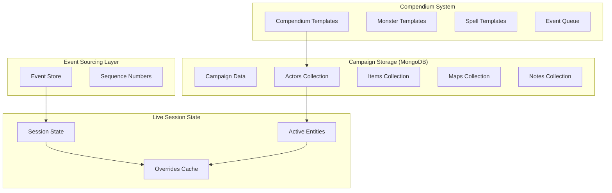
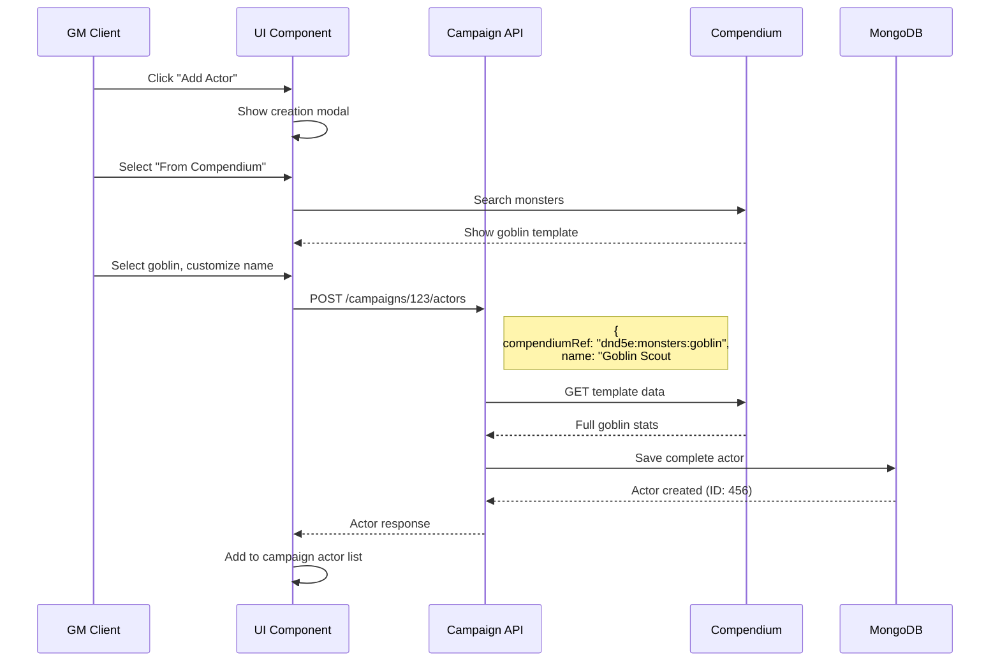
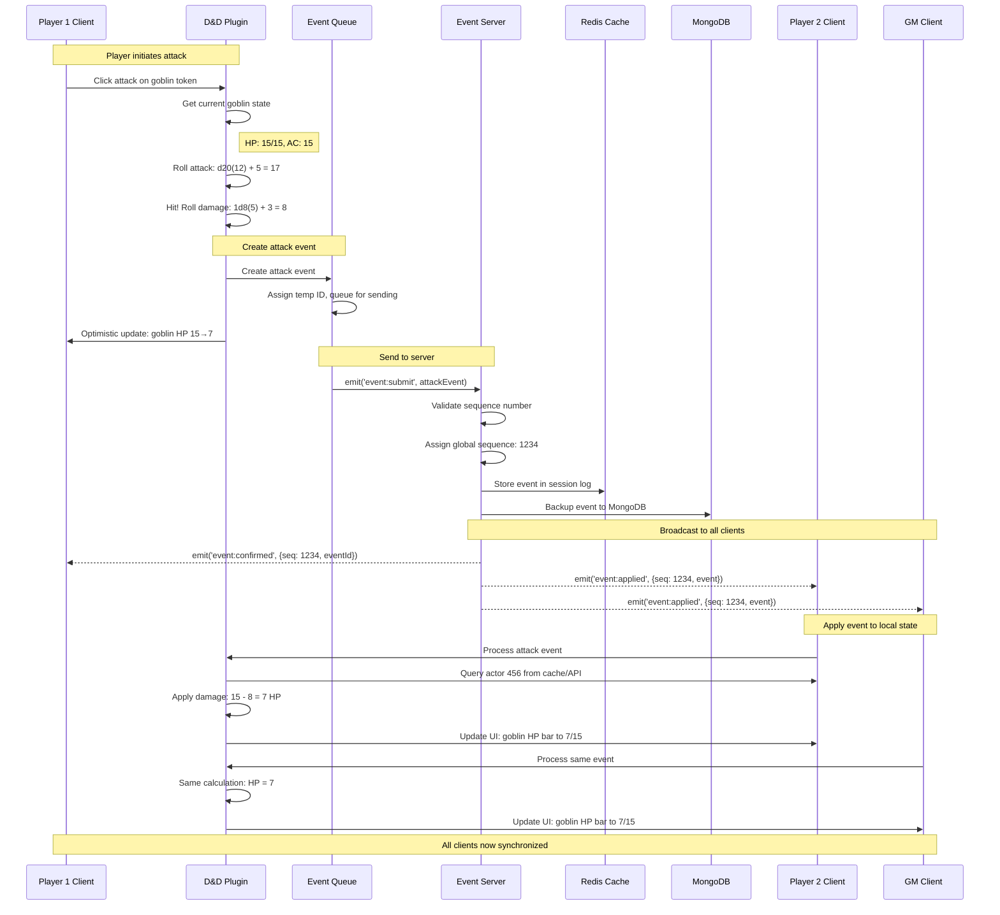
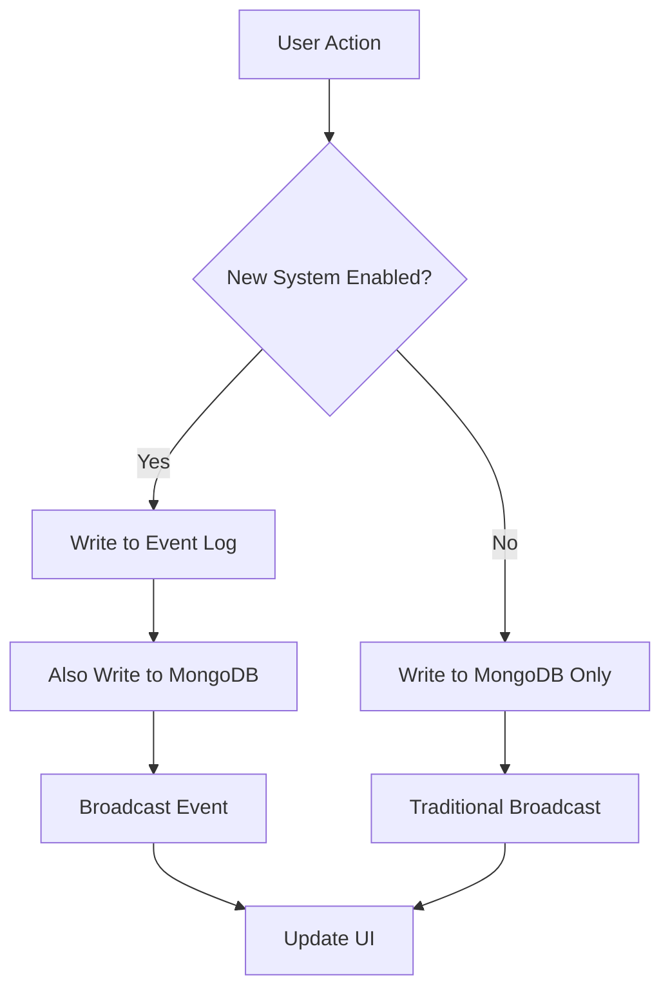

# Compendium-Centric Event Sourcing Implementation Plan

## Executive Summary

This document details the implementation of a server-agnostic state management system for Dungeon Lab using **Compendium-Centric Event Sourcing**. The system treats the server as a pure event log that stores and orders game events without understanding their semantic meaning, while maintaining all persistent campaign data in MongoDB and using the compendium system as a template library for quick actor creation.

## Core Architecture

### Unified Data Model

All game entities follow a single, unified model regardless of their origin:

```typescript
// Single Actor model - no distinction between custom and compendium-based
interface Actor {
  _id: ObjectId;
  campaignId: ObjectId;
  name: string;
  type: "character" | "npc" | "monster";
  
  // Optional: tracks template origin for reference only
  compendiumRef?: string;           // "dnd5e:monsters:goblin" if created from template
  
  // Complete stat block (whether custom or from compendium)
  attributes: {
    hp: { value: number; max: number };
    ac: number;
    speed: number;
    saves: Record<string, number>;
    skills: Record<string, number>;
    // ... complete D&D stat block
  };
  
  spells?: Spell[];
  equipment?: Equipment[];
  features?: Feature[];
  
  // Metadata
  createdBy: ObjectId;
  createdAt: Date;
  updatedAt: Date;
}
```

### System Architecture Overview



## Actor Creation and Management

### Creation Workflows

#### Option 1: Create from Compendium Template
```typescript
class ActorService {
  async createFromTemplate(campaignId: string, request: {
    compendiumRef: string;
    name?: string;
    customizations?: Partial<Actor>;
  }): Promise<Actor> {
    
    // Fetch template from compendium
    const template = await this.compendium.get(request.compendiumRef);
    if (!template) {
      throw new Error(`Compendium entry not found: ${request.compendiumRef}`);
    }
    
    // Create full actor with customizations
    const actor: Actor = {
      _id: new ObjectId(),
      campaignId: new ObjectId(campaignId),
      name: request.name || template.name,
      type: template.type || 'monster',
      compendiumRef: request.compendiumRef,
      
      // Copy all template data
      attributes: { ...template.attributes },
      spells: template.spells ? [...template.spells] : undefined,
      equipment: template.equipment ? [...template.equipment] : undefined,
      features: template.features ? [...template.features] : undefined,
      
      // Apply any customizations
      ...request.customizations,
      
      createdBy: this.currentUser.id,
      createdAt: new Date(),
      updatedAt: new Date()
    };
    
    // Save to campaign
    return await this.actorRepository.create(actor);
  }
}
```

#### Option 2: Create Custom Actor
```typescript
class ActorService {
  async createCustom(campaignId: string, actorData: Partial<Actor>): Promise<Actor> {
    const actor: Actor = {
      _id: new ObjectId(),
      campaignId: new ObjectId(campaignId),
      name: actorData.name || "Unnamed Actor",
      type: actorData.type || 'npc',
      // No compendiumRef for custom actors
      
      // Use provided data or defaults
      attributes: actorData.attributes || this.getDefaultAttributes(),
      spells: actorData.spells || [],
      equipment: actorData.equipment || [],
      features: actorData.features || [],
      
      createdBy: this.currentUser.id,
      createdAt: new Date(),
      updatedAt: new Date()
    };
    
    return await this.actorRepository.create(actor);
  }
}
```

### UI Creation Flow



## Event Sourcing System

### Event Structure

```typescript
interface GameEvent {
  // Server-managed metadata (server understands these)
  id: string;                    // UUID for deduplication
  sequence: number;              // Global sequence number per session
  timestamp: number;             // Server timestamp (milliseconds)
  userId: string;                // Event originator
  sessionId: string;             // Game session context
  
  // Plugin-specific data (opaque to server)
  type: string;                  // "plugin:dnd5e:attack" | "core:token:move"
  payload: unknown;              // Plugin defines structure
  
  // Optional integrity checking
  checksum?: string;             // SHA-256 of payload
}

// Example: D&D Attack Event
interface DnD5eAttackEvent extends GameEvent {
  type: "plugin:dnd5e:attack";
  payload: {
    // Combat action details
    action: {
      type: "weapon_attack" | "spell_attack" | "saving_throw";
      weaponId?: string;
      spellId?: string;
      attackRoll?: {
        d20: number;
        modifiers: { source: string; value: number }[];
        total: number;
      };
      damageRolls?: {
        dice: string;              // "1d8"
        result: number;
        type: "slashing" | "fire" | "cold" | etc;
      }[];
    };
    
    // Target information
    target: {
      actorId: string;             // MongoDB ObjectId
      instanceId: string;          // "encounter1_goblin1"
      expectedHP?: number;         // For conflict detection
    };
    
    // Computed result (by plugin)
    result: {
      hit: boolean;
      totalDamage: number;
      effects: string[];           // ["unconscious", "prone"]
    };
    
    // State changes to apply
    stateChanges: {
      [path: string]: {
        from: any;
        to: any;
      };
    };
  };
}
```

### Live Session State

```typescript
// Session state stored in Redis + MongoDB backup
interface GameSessionState {
  sessionId: string;
  campaignId: ObjectId;
  createdAt: Date;
  lastEventSequence: number;
  
  // Active actors in this session
  activeActors: {
    [instanceId: string]: {
      actorId: ObjectId;             // Reference to campaign actors collection
      addedAt: number;               // When added to session
      addedBy: string;               // User who added
      
      // Live state overrides (only differences from MongoDB actor)
      overrides: {
        [path: string]: {
          value: any;
          timestamp: number;
          eventId: string;           // Trace back to originating event
          userId: string;
        };
      };
    };
  };
  
  // Session-specific state
  encounter: {
    active: boolean;
    round: number;
    currentTurn: number;
    initiative: {
      actorId: ObjectId;
      instanceId: string;
      roll: number;
      order: number;
    }[];
  };
  
  // Environment state
  environment: {
    lighting: "bright" | "dim" | "dark";
    weather?: string;
    effects: string[];
  };
}
```

## Attack Flow Implementation

### Complete Attack Sequence



### Client-Side Plugin Implementation

```typescript
class DnD5ePlugin {
  async handleAttackAction(attackData: {
    attackerId: string;
    targetInstanceId: string;
    weaponId: string;
  }): Promise<void> {
    
    // Get current game state
    const attacker = await this.getActor(attackData.attackerId);
    const target = await this.getSessionActor(attackData.targetInstanceId);
    const weapon = attacker.equipment.find(e => e.id === attackData.weaponId);
    
    // Perform dice rolls
    const attackRoll = this.rollAttack(attacker, weapon);
    const hit = attackRoll.total >= target.attributes.ac;
    
    let damage = 0;
    let damageRolls = [];
    if (hit) {
      damageRolls = this.rollDamage(attacker, weapon);
      damage = damageRolls.reduce((sum, roll) => sum + roll.result, 0);
    }
    
    // Create event
    const event: DnD5eAttackEvent = {
      id: uuid(),
      sequence: 0,  // Server will assign
      timestamp: Date.now(),
      userId: this.currentUser.id,
      sessionId: this.currentSession.id,
      type: "plugin:dnd5e:attack",
      payload: {
        action: {
          type: "weapon_attack",
          weaponId: weapon.id,
          attackRoll,
          damageRolls
        },
        target: {
          actorId: target.actorId,
          instanceId: attackData.targetInstanceId,
          expectedHP: target.attributes.hp.value
        },
        result: {
          hit,
          totalDamage: damage,
          effects: damage >= target.attributes.hp.value ? ["unconscious"] : []
        },
        stateChanges: {
          "attributes.hp.value": {
            from: target.attributes.hp.value,
            to: Math.max(0, target.attributes.hp.value - damage)
          }
        }
      }
    };
    
    // Apply optimistically
    this.applyEventOptimistically(event);
    
    // Send to server
    await this.eventQueue.submit(event);
  }
  
  applyEvent(event: DnD5eAttackEvent): void {
    if (event.type !== "plugin:dnd5e:attack") return;
    
    const { target, stateChanges } = event.payload;
    
    // Apply each state change
    for (const [path, change] of Object.entries(stateChanges)) {
      this.sessionState.setOverride(target.instanceId, path, {
        value: change.to,
        timestamp: event.timestamp,
        eventId: event.id,
        userId: event.userId
      });
    }
    
    // Update UI
    this.updateActorDisplay(target.instanceId);
    
    // Handle special effects
    if (event.payload.result.effects.includes("unconscious")) {
      this.addCondition(target.instanceId, "unconscious");
    }
  }
}
```

### Server-Side Event Handling

```typescript
class EventServer {
  async handleEventSubmission(socket: Socket, event: GameEvent): Promise<void> {
    try {
      // Validate event structure (not content)
      this.validateEventStructure(event);
      
      // Assign sequence number
      const sequence = await this.getNextSequence(event.sessionId);
      event.sequence = sequence;
      event.timestamp = Date.now(); // Server timestamp overrides client
      
      // Store in event log
      await this.storeEvent(event);
      
      // Broadcast to session participants
      const sessionRoom = `session:${event.sessionId}`;
      
      // Confirm to sender
      socket.emit('event:confirmed', {
        tempId: event.id,
        sequence: event.sequence,
        timestamp: event.timestamp
      });
      
      // Broadcast to others
      socket.to(sessionRoom).emit('event:applied', event);
      
      console.log(`Event ${event.type} applied with sequence ${sequence}`);
      
    } catch (error) {
      socket.emit('event:error', {
        tempId: event.id,
        error: error.message
      });
    }
  }
  
  private validateEventStructure(event: GameEvent): void {
    if (!event.id || !event.type || !event.userId || !event.sessionId) {
      throw new Error('Invalid event structure');
    }
    
    // Server doesn't validate payload content - that's plugin responsibility
  }
  
  private async storeEvent(event: GameEvent): Promise<void> {
    // Store in Redis for fast access
    await this.redis.zadd(
      `session:${event.sessionId}:events`,
      event.sequence,
      JSON.stringify(event)
    );
    
    // Also backup to MongoDB
    await this.eventRepository.create({
      ...event,
      createdAt: new Date()
    });
  }
}
```

## State Synchronization and Recovery

### Client State Manager

```typescript
class ClientStateManager {
  private actors = new Map<string, RuntimeActor>();
  private sessionState: GameSessionState;
  private eventSequence = 0;
  
  async synchronizeSession(sessionId: string): Promise<void> {
    // Get current session state
    const sessionData = await this.api.getSession(sessionId);
    this.sessionState = sessionData;
    
    // Load all active actors from campaign
    const actorIds = Object.values(sessionData.activeActors).map(a => a.actorId);
    const actors = await this.api.getActors(actorIds);
    
    // Build runtime state by applying overrides
    for (const [instanceId, activeActor] of Object.entries(sessionData.activeActors)) {
      const baseActor = actors.find(a => a._id === activeActor.actorId);
      const runtimeActor = this.applyOverrides(baseActor, activeActor.overrides);
      this.actors.set(instanceId, runtimeActor);
    }
    
    this.eventSequence = sessionData.lastEventSequence;
    
    // Start listening for new events
    this.socket.emit('session:subscribe', sessionId, this.eventSequence);
  }
  
  private applyOverrides(baseActor: Actor, overrides: OverrideMap): RuntimeActor {
    const runtime = deepClone(baseActor);
    
    for (const [path, override] of Object.entries(overrides)) {
      setPath(runtime, path, override.value);
    }
    
    return {
      ...runtime,
      instanceId: /* derived from context */,
      lastModified: Math.max(...Object.values(overrides).map(o => o.timestamp))
    };
  }
  
  async handleEventReceived(event: GameEvent): Promise<void> {
    // Check sequence
    if (event.sequence <= this.eventSequence) {
      console.warn('Received old event, ignoring');
      return;
    }
    
    if (event.sequence > this.eventSequence + 1) {
      // Gap detected - request resync
      await this.requestResync(event.sessionId);
      return;
    }
    
    // Apply event
    const plugin = this.pluginManager.getPlugin(event.type);
    if (plugin) {
      plugin.applyEvent(event);
    }
    
    this.eventSequence = event.sequence;
  }
}
```

### Event Recovery and Replay

```typescript
class EventRecoveryService {
  async recoverFromSequence(sessionId: string, fromSequence: number): Promise<GameEvent[]> {
    // Get events from Redis first (fastest)
    const redisEvents = await this.redis.zrangebyscore(
      `session:${sessionId}:events`,
      fromSequence + 1,
      '+inf'
    );
    
    if (redisEvents.length > 0) {
      return redisEvents.map(e => JSON.parse(e));
    }
    
    // Fallback to MongoDB
    return await this.eventRepository.find({
      sessionId,
      sequence: { $gt: fromSequence }
    }).sort({ sequence: 1 });
  }
  
  async replayEventsForClient(sessionId: string, clientSequence: number): Promise<void> {
    const events = await this.recoverFromSequence(sessionId, clientSequence);
    
    // Send events in batches to avoid overwhelming client
    const batchSize = 50;
    for (let i = 0; i < events.length; i += batchSize) {
      const batch = events.slice(i, i + batchSize);
      
      this.socket.emit('events:batch', {
        sessionId,
        events: batch,
        isLast: i + batchSize >= events.length
      });
      
      // Small delay to prevent flooding
      await new Promise(resolve => setTimeout(resolve, 10));
    }
  }
}
```

## Conflict Resolution

### Timestamp-Based Resolution

```typescript
class ConflictResolver {
  resolveSimultaneousEvents(events: GameEvent[]): GameEvent[] {
    // Sort by timestamp, then by user ID for determinism
    return events.sort((a, b) => {
      if (a.timestamp !== b.timestamp) {
        return a.timestamp - b.timestamp;
      }
      
      // Secondary sort by user ID hash for determinism
      return a.userId.localeCompare(b.userId);
    });
  }
  
  detectConflicts(events: GameEvent[]): ConflictReport[] {
    const conflicts: ConflictReport[] = [];
    const pathChanges = new Map<string, GameEvent[]>();
    
    // Group events by the paths they modify
    for (const event of events) {
      if (event.payload?.stateChanges) {
        for (const path of Object.keys(event.payload.stateChanges)) {
          if (!pathChanges.has(path)) {
            pathChanges.set(path, []);
          }
          pathChanges.get(path)!.push(event);
        }
      }
    }
    
    // Find paths with multiple simultaneous changes
    for (const [path, pathEvents] of pathChanges) {
      if (pathEvents.length > 1) {
        // Check if events happened within conflict window (1 second)
        const timestamps = pathEvents.map(e => e.timestamp);
        const maxDiff = Math.max(...timestamps) - Math.min(...timestamps);
        
        if (maxDiff < 1000) { // 1 second conflict window
          conflicts.push({
            path,
            events: pathEvents,
            resolution: 'timestamp_order'
          });
        }
      }
    }
    
    return conflicts;
  }
}
```

### GM Authority Override

```typescript
class GMAuthorityResolver {
  async resolveWithGMInput(conflict: ConflictReport): Promise<GameEvent[]> {
    // Present conflict to GM
    const resolution = await this.presentConflictToGM(conflict);
    
    if (resolution.type === 'manual_override') {
      // GM manually specifies the final state
      const overrideEvent: GameEvent = {
        id: uuid(),
        sequence: 0, // Will be assigned
        timestamp: Date.now(),
        userId: resolution.gmUserId,
        sessionId: conflict.sessionId,
        type: 'core:gm_override',
        payload: {
          reason: 'conflict_resolution',
          originalEvents: conflict.events.map(e => e.id),
          finalState: resolution.finalState
        }
      };
      
      return [overrideEvent];
    }
    
    // GM chooses one of the conflicting events
    return [conflict.events[resolution.chosenEventIndex]];
  }
  
  private async presentConflictToGM(conflict: ConflictReport): Promise<GMResolution> {
    // Send conflict notification to GM
    this.socket.to(`user:${this.gmUserId}`).emit('conflict:resolution_needed', {
      conflictId: conflict.id,
      description: this.describeConflict(conflict),
      options: conflict.events.map(e => this.describeEvent(e))
    });
    
    // Wait for GM response
    return new Promise((resolve) => {
      this.socket.once(`conflict:${conflict.id}:resolved`, resolve);
    });
  }
}
```

## Performance Optimization

### Event Compaction

```typescript
class EventCompactionService {
  async compactSession(sessionId: string): Promise<CompactionResult> {
    const events = await this.getSessionEvents(sessionId);
    const compacted = this.compactEvents(events);
    
    // Create snapshot with final state
    const snapshot = await this.createSnapshot(sessionId, compacted);
    
    // Archive old events
    await this.archiveEvents(sessionId, events);
    
    return {
      originalEventCount: events.length,
      compactedEventCount: compacted.length,
      snapshotCreated: true,
      spaceSaved: this.calculateSpaceSaving(events, compacted)
    };
  }
  
  private compactEvents(events: GameEvent[]): GameEvent[] {
    const stateChanges = new Map<string, any>();
    const finalEvents: GameEvent[] = [];
    
    // Process events in order
    for (const event of events) {
      if (this.isCompactable(event)) {
        // Merge state changes
        const changes = event.payload?.stateChanges || {};
        for (const [path, change] of Object.entries(changes)) {
          stateChanges.set(path, change.to);
        }
      } else {
        // Keep non-compactable events (chat, dice rolls, etc.)
        finalEvents.push(event);
      }
    }
    
    // Create single compacted event for all state changes
    if (stateChanges.size > 0) {
      const compactedEvent: GameEvent = {
        id: uuid(),
        sequence: events[events.length - 1].sequence,
        timestamp: events[events.length - 1].timestamp,
        userId: 'system',
        sessionId: events[0].sessionId,
        type: 'core:compacted_state',
        payload: {
          compactedFrom: events.length,
          finalState: Object.fromEntries(stateChanges)
        }
      };
      
      finalEvents.push(compactedEvent);
    }
    
    return finalEvents;
  }
}
```

### Caching Strategy

```typescript
class StateCache {
  private actorCache = new Map<string, { actor: RuntimeActor; expires: number }>();
  private sessionCache = new Map<string, { state: GameSessionState; expires: number }>();
  
  async getActor(instanceId: string): Promise<RuntimeActor | null> {
    const cached = this.actorCache.get(instanceId);
    
    if (cached && cached.expires > Date.now()) {
      return cached.actor;
    }
    
    // Cache miss - rebuild from source + overrides
    const actor = await this.buildRuntimeActor(instanceId);
    
    if (actor) {
      this.actorCache.set(instanceId, {
        actor,
        expires: Date.now() + 300_000 // 5 minute TTL
      });
    }
    
    return actor;
  }
  
  invalidateActor(instanceId: string): void {
    this.actorCache.delete(instanceId);
  }
  
  // Invalidate cache when events modify actors
  onEventApplied(event: GameEvent): void {
    const affectedActors = this.extractAffectedActors(event);
    
    for (const instanceId of affectedActors) {
      this.invalidateActor(instanceId);
    }
  }
}
```

## Migration Strategy

### Phase 1: Dual-Write Implementation



```typescript
class HybridStateManager {
  private useEventSourcing: boolean;
  
  async updateActorHP(instanceId: string, newHP: number): Promise<void> {
    if (this.useEventSourcing) {
      // New system - create event
      const event = this.createHPChangeEvent(instanceId, newHP);
      await this.eventSystem.submit(event);
      
      // Also update MongoDB for consistency during migration
      await this.mongoSystem.updateActor(instanceId, { 'attributes.hp.value': newHP });
      
    } else {
      // Old system - direct MongoDB update
      await this.mongoSystem.updateActor(instanceId, { 'attributes.hp.value': newHP });
      this.socketSystem.broadcast('actor:updated', { instanceId, hp: newHP });
    }
  }
}
```

### Migration Phases

```typescript
interface MigrationPhase {
  name: string;
  duration: string;
  description: string;
  rollbackPlan: string;
}

const migrationPlan: MigrationPhase[] = [
  {
    name: "Phase 1: Infrastructure Setup",
    duration: "2 weeks",
    description: "Set up Redis, event store schema, basic event handling",
    rollbackPlan: "Remove Redis, disable event handlers"
  },
  {
    name: "Phase 2: Dual Write",
    duration: "2 weeks", 
    description: "Write to both systems, validate consistency",
    rollbackPlan: "Disable event system, continue with MongoDB only"
  },
  {
    name: "Phase 3: Read Migration",
    duration: "1 week",
    description: "Start reading from event system with MongoDB fallback",
    rollbackPlan: "Switch read source back to MongoDB"
  },
  {
    name: "Phase 4: Full Migration",
    duration: "1 week",
    description: "Event system becomes primary, MongoDB becomes backup",
    rollbackPlan: "Full data recovery from MongoDB backups"
  },
  {
    name: "Phase 5: Cleanup",
    duration: "1 week",
    description: "Remove old code paths, optimize event system",
    rollbackPlan: "Re-enable dual write system"
  }
];
```

## Testing Strategy

### Unit Tests

```typescript
describe('EventSourcingSystem', () => {
  describe('Event Application', () => {
    it('should apply HP damage correctly', () => {
      const baseActor = createTestActor({ hp: 15 });
      const damageEvent = createDamageEvent(8);
      
      const result = applyEvent(baseActor, damageEvent);
      
      expect(result.attributes.hp.value).toBe(7);
    });
    
    it('should handle simultaneous attacks deterministically', () => {
      const events = [
        createAttackEvent({ damage: 8, timestamp: 1000, userId: 'player2' }),
        createAttackEvent({ damage: 5, timestamp: 1000, userId: 'player1' })
      ];
      
      const resolved = resolveConflicts(events);
      
      // player1 goes first (lexicographic order)
      expect(resolved[0].userId).toBe('player1');
      expect(resolved[1].userId).toBe('player2');
    });
  });
});
```

### Integration Tests

```typescript
describe('Multi-Client Synchronization', () => {
  it('should synchronize attack across multiple clients', async () => {
    // Setup multiple test clients
    const client1 = await createTestClient('player1');
    const client2 = await createTestClient('player2');
    const gmClient = await createTestClient('gm');
    
    // Join same session
    await Promise.all([
      client1.joinSession('test-session'),
      client2.joinSession('test-session'),
      gmClient.joinSession('test-session')
    ]);
    
    // Player 1 attacks
    await client1.performAttack('goblin1', 8);
    
    // Wait for synchronization
    await waitFor(100);
    
    // All clients should have same state
    const state1 = client1.getActorState('goblin1');
    const state2 = client2.getActorState('goblin1');
    const stateGM = gmClient.getActorState('goblin1');
    
    expect(state1.attributes.hp.value).toBe(7);
    expect(state2.attributes.hp.value).toBe(7);
    expect(stateGM.attributes.hp.value).toBe(7);
  });
});
```

### Load Testing

```typescript
describe('Performance Tests', () => {
  it('should handle 100 concurrent attacks', async () => {
    const clients = await createTestClients(100);
    
    const startTime = Date.now();
    
    // Simulate 100 simultaneous attacks
    const attacks = clients.map((client, i) => 
      client.performAttack(`goblin${i}`, 5)
    );
    
    await Promise.all(attacks);
    
    const endTime = Date.now();
    const duration = endTime - startTime;
    
    expect(duration).toBeLessThan(5000); // Should complete within 5 seconds
    
    // Verify all attacks were processed
    for (let i = 0; i < 100; i++) {
      const state = clients[0].getActorState(`goblin${i}`);
      expect(state.attributes.hp.value).toBe(10); // 15 - 5 = 10
    }
  });
});
```

## Implementation Checklist

### Core Infrastructure
- [ ] Event store schema design
- [ ] Redis integration for session state
- [ ] MongoDB event backup system
- [ ] Sequence number management
- [ ] Event broadcasting system

### Actor Management
- [ ] Unified actor creation API
- [ ] Compendium template integration
- [ ] Actor override system
- [ ] Runtime state computation

### Plugin System
- [ ] Event type registration
- [ ] Plugin event handlers
- [ ] State change validation
- [ ] Conflict resolution hooks

### Client Implementation
- [ ] Event queue management
- [ ] Optimistic updates
- [ ] State synchronization
- [ ] Conflict detection UI

### Performance & Reliability
- [ ] Event compaction
- [ ] State snapshots
- [ ] Cache management
- [ ] Error recovery

### Migration & Testing
- [ ] Dual-write system
- [ ] Data migration tools
- [ ] Integration tests
- [ ] Load testing
- [ ] Rollback procedures

## Success Metrics

- **Consistency**: 99.9% of clients maintain identical state
- **Performance**: < 100ms average event processing time
- **Reliability**: < 0.1% event loss rate
- **Storage**: 90% reduction in session state storage
- **Migration**: Zero data loss during transition

This implementation plan provides a complete roadmap for transforming Dungeon Lab into a server-agnostic, event-sourced VTT while maintaining the unified actor model and leveraging the existing compendium system as a template library.