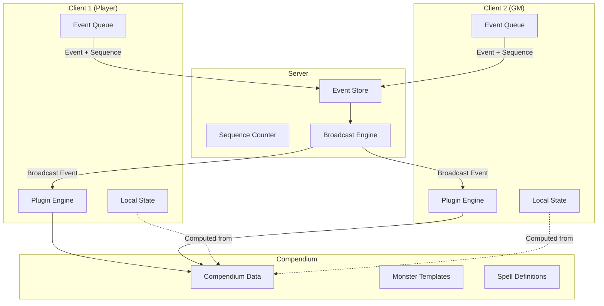
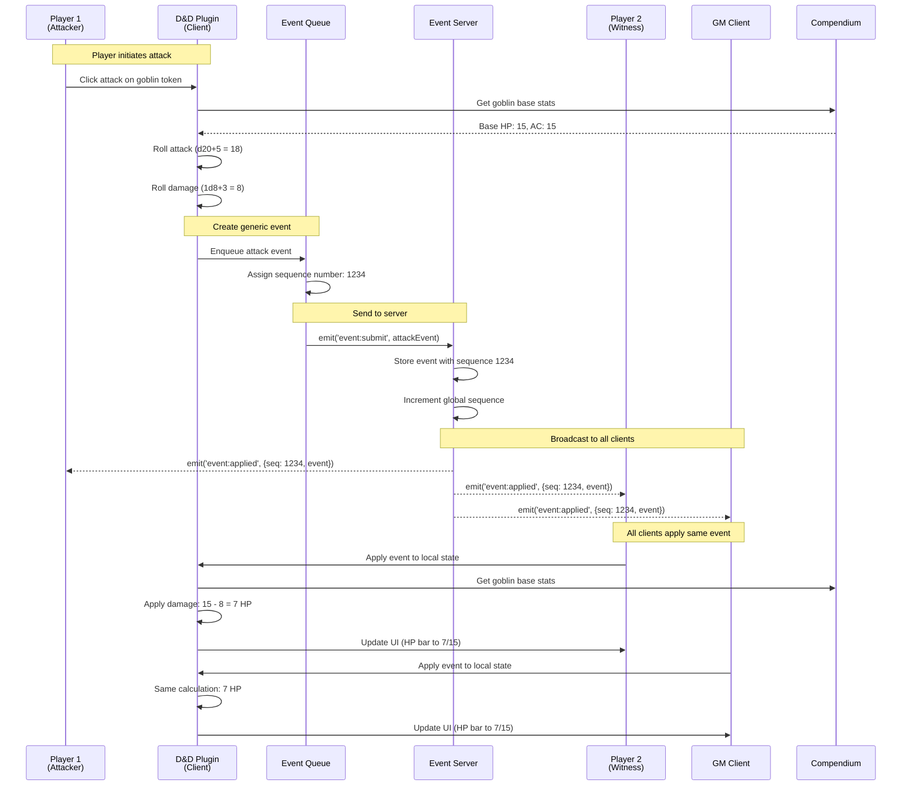
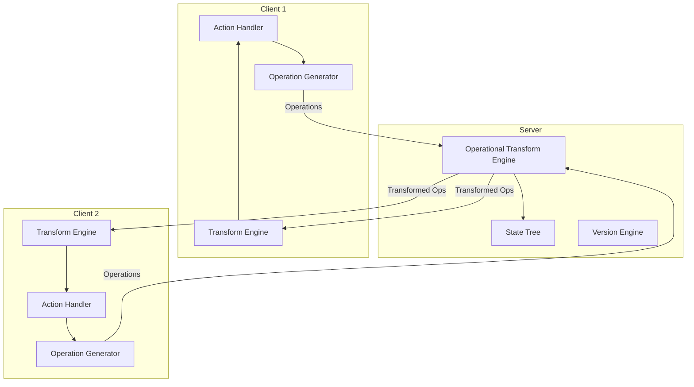
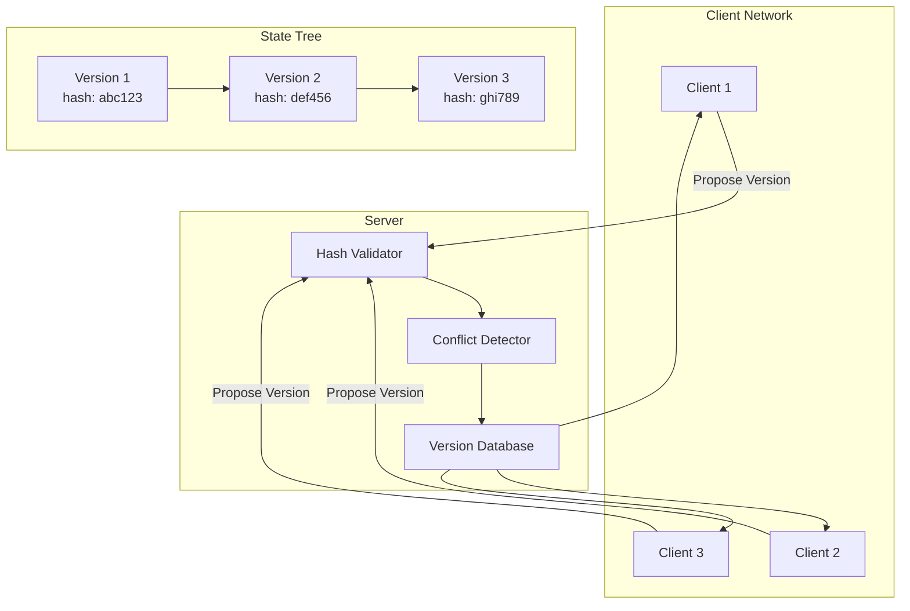
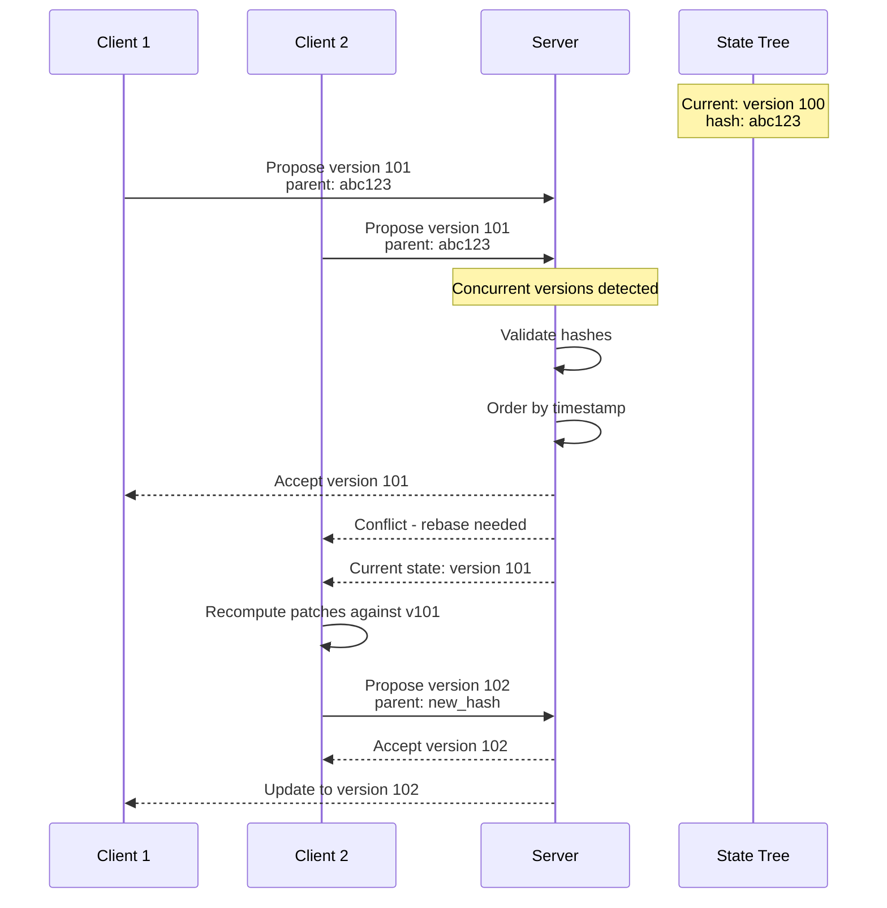
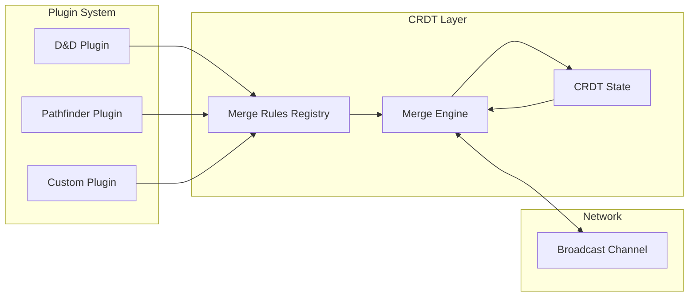
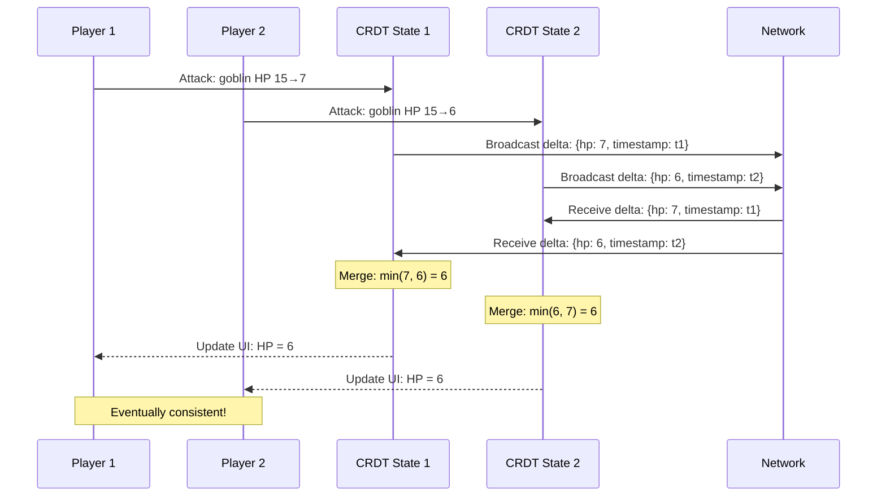
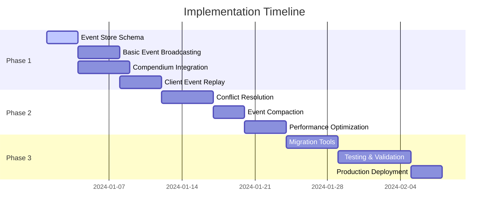
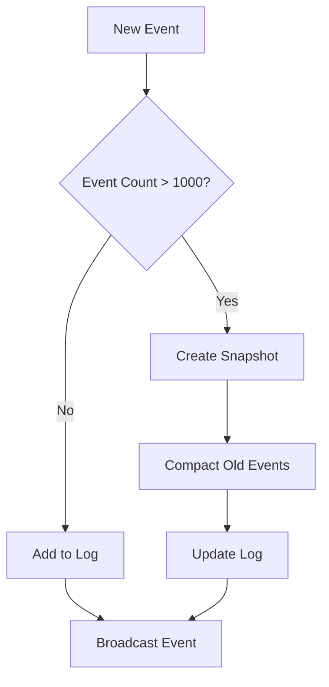
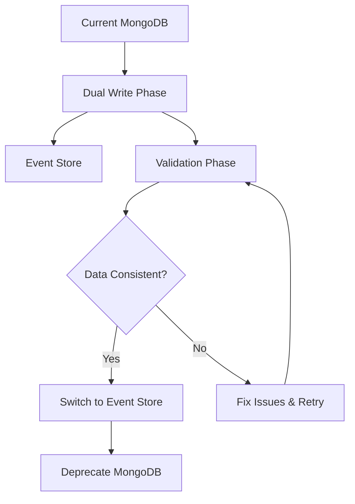

# Server-Agnostic State Management Architecture

## Executive Summary

### Problem Statement
The current Dungeon Lab state management system requires the server to understand game-specific concepts (HP, damage, D&D rules), violating the plugin architecture principle of server agnosticism. This creates maintenance overhead, limits extensibility to other game systems, and couples the core platform to specific game mechanics.

### Key Insights
1. **VTT State is Different**: Unlike typical web applications, VTT state consists primarily of temporary modifications to well-defined base entities from the compendium system
2. **Compendium Leverage**: The existing compendium system can serve as the foundation for a differential state model
3. **Plugin Isolation**: Game logic should remain entirely in plugins, with the server handling only generic state synchronization
4. **Event-Driven Nature**: VTT interactions are naturally event-driven (attacks, movements, spell casts) rather than CRUD operations

### Recommended Approach
**Compendium-Centric Event Sourcing** - A hybrid approach that treats game state as a stream of events applied to compendium entities, with the server acting as a pure event log without understanding game semantics.

## Architecture Options

### Option 1: Compendium-Centric Event Sourcing ⭐ **RECOMMENDED**

#### Core Concept
The server becomes a pure event log that stores and orders events without interpreting them. All game logic happens on clients through plugins. State is represented as differences from compendium defaults.

#### Architecture Overview



#### State Model

```typescript
// Traditional approach - full object in MongoDB
interface TraditionalActor {
  _id: string;
  name: string;
  hp: number;
  maxHp: number;
  ac: number;
  stats: Stats;
  // ... hundreds of fields
}

// New approach - compendium reference + overrides
interface GameEntity {
  compendiumRef: string;        // "dnd5e:monsters:goblin"
  instanceId: string;           // "encounter1_goblin_1"
  overrides: Record<string, {
    value: any;
    timestamp: number;
    userId: string;
  }>;
}

// Example instance
const goblinInstance = {
  compendiumRef: "dnd5e:monsters:goblin",
  instanceId: "battle1_goblin1",
  overrides: {
    "attributes.hp.value": { 
      value: 7,                 // Was 15 in compendium
      timestamp: 1704067200000,
      userId: "player1"
    },
    "position": { 
      value: { x: 100, y: 150 }, // Runtime-only data
      timestamp: 1704067210000,
      userId: "gm"
    }
  }
}
```

#### Attack Flow Sequence



#### Event Structure

```typescript
interface GameEvent {
  // Server-managed metadata
  id: string;                    // UUID for deduplication
  sequence: number;              // Global sequence number
  timestamp: number;             // Server timestamp
  userId: string;                // Event originator
  sessionId: string;             // Game session context
  
  // Plugin-specific data (opaque to server)
  type: string;                  // "plugin:dnd5e:attack"
  payload: {
    // Plugin defines this structure
    action: {
      type: "weapon_attack",
      weaponId: "longsword",
      rolls: {
        attack: { d20: 12, modifiers: 6, total: 18 },
        damage: { dice: "1d8+3", result: 8 }
      }
    },
    target: {
      compendiumRef: "dnd5e:monsters:goblin",
      instanceId: "battle1_goblin1"
    },
    result: {
      hit: true,
      effects: ["damage:8:slashing"]
    },
    // State changes computed by plugin
    stateChanges: {
      "attributes.hp.value": { from: 15, to: 7 }
    }
  };
  
  // Optional checksum for integrity
  checksum?: string;
}
```

#### Conflict Resolution

Since the server doesn't understand game semantics, conflicts are resolved through deterministic rules:

```typescript
class ConflictResolver {
  resolve(events: GameEvent[]): GameEvent[] {
    // Sort by timestamp, then by user ID hash for determinism
    return events.sort((a, b) => {
      if (a.timestamp !== b.timestamp) {
        return a.timestamp - b.timestamp;
      }
      return a.userId.localeCompare(b.userId);
    });
  }
}

// Example: Two simultaneous attacks on same goblin
const event1 = { 
  timestamp: 1704067200000, 
  userId: "player1", 
  payload: { stateChanges: { "attributes.hp.value": { from: 15, to: 7 } } }
};

const event2 = { 
  timestamp: 1704067200000, 
  userId: "player2", 
  payload: { stateChanges: { "attributes.hp.value": { from: 15, to: 10 } } }
};

// After resolution: player1 goes first (lexicographically)
// Final HP: 15 → 7 → 2 (not 10)
```

#### Client State Computation

```typescript
class GameStateManager {
  private compendium: CompendiumService;
  private events: GameEvent[] = [];
  
  // Compute current state by replaying events
  computeEntityState(compendiumRef: string, instanceId: string): any {
    // Start with compendium base
    const baseEntity = this.compendium.get(compendiumRef);
    let currentState = deepClone(baseEntity);
    
    // Apply all events for this instance in order
    const relevantEvents = this.events.filter(e => 
      e.payload.target?.instanceId === instanceId ||
      e.payload.source?.instanceId === instanceId
    );
    
    for (const event of relevantEvents) {
      currentState = this.applyEvent(currentState, event);
    }
    
    return currentState;
  }
  
  private applyEvent(state: any, event: GameEvent): any {
    // Plugin interprets the event
    const plugin = this.getPlugin(event.type);
    return plugin.applyEvent(state, event);
  }
}
```

#### **Pros:**
- ✅ Server completely agnostic to game rules
- ✅ Leverages existing compendium investment
- ✅ Minimal storage (only differences)
- ✅ Time travel debugging (replay any point)
- ✅ Natural event-driven architecture
- ✅ Deterministic conflict resolution
- ✅ Plugin isolation maintained

#### **Cons:**
- ❌ New clients must replay events to catch up
- ❌ Complex conflict resolution for some scenarios
- ❌ Event log can grow large over time
- ❌ Requires event compaction/snapshotting

---

### Option 2: Operational Transform with Generic Operations

#### Core Concept
Define atomic operations (SET, ADD, REMOVE, MOVE) that work on JSON paths. The server can order and transform these operations without understanding their semantic meaning.

#### Architecture Overview



#### Operation Structure

```typescript
interface Operation {
  id: string;
  type: 'set' | 'add' | 'remove' | 'move';
  path: string;           // JSON path: "/instances/goblin1/hp"
  value?: any;
  oldValue?: any;         // For validation
  version: number;        // Document version
  timestamp: number;
  userId: string;
}

// Attack creates multiple operations
const attackOperations: Operation[] = [
  {
    id: uuid(),
    type: 'set',
    path: '/instances/goblin1/attributes/hp/value',
    value: 7,
    oldValue: 15,
    version: 42,
    timestamp: Date.now(),
    userId: 'player1'
  },
  {
    id: uuid(),
    type: 'add', 
    path: '/combat/log',
    value: {
      type: 'attack',
      attacker: 'player1',
      target: 'goblin1', 
      damage: 8
    },
    version: 42,
    timestamp: Date.now(),
    userId: 'player1'
  }
];
```

#### Transform Algorithm

```typescript
class OperationalTransform {
  // Transform operation A against operation B
  transform(opA: Operation, opB: Operation): [Operation, Operation] {
    // Same path - conflict resolution needed
    if (opA.path === opB.path) {
      if (opA.type === 'set' && opB.type === 'set') {
        // Last writer wins based on timestamp
        if (opA.timestamp > opB.timestamp) {
          return [opA, { ...opB, type: 'noop' }];
        } else {
          return [{ ...opA, type: 'noop' }, opB];
        }
      }
    }
    
    // Different paths - both operations can proceed
    return [opA, opB];
  }
  
  // Apply operation to state tree
  apply(state: any, op: Operation): any {
    const newState = { ...state };
    
    switch (op.type) {
      case 'set':
        setPath(newState, op.path, op.value);
        break;
      case 'add':
        addToPath(newState, op.path, op.value);
        break;
      case 'remove':
        removePath(newState, op.path);
        break;
    }
    
    return newState;
  }
}
```

#### **Pros:**
- ✅ Well-proven technology (Google Docs, Figma)
- ✅ Server handles conflicts generically  
- ✅ Real-time collaboration naturally supported
- ✅ Fine-grained operations enable efficient updates

#### **Cons:**
- ❌ Complex transform rules for all operation combinations
- ❌ May not handle all game mechanics elegantly
- ❌ Still requires understanding of data structure
- ❌ Performance overhead for complex transforms

---

### Option 3: Immutable State Trees with Cryptographic Hashing

#### Core Concept
State is represented as immutable trees where each change creates a new version with a cryptographic hash. The server validates hash integrity without understanding content.

#### Architecture Overview



#### Version Structure

```typescript
interface StateVersion {
  hash: string;                    // SHA-256 of content
  parentHash: string;              // Previous version
  sequence: number;                // Version number
  timestamp: number;               // Creation time
  userId: string;                  // Author
  
  // State changes as JSON patches
  patches: JsonPatchOperation[];   // RFC 6902 JSON Patch
  
  // Optional: compressed full state for snapshots
  snapshot?: {
    compressed: boolean;
    data: string;                  // Gzipped JSON
  };
  
  // Cryptographic integrity
  signature?: string;              // Digital signature
}

// Example attack creating new version
const attackVersion: StateVersion = {
  hash: "sha256:a1b2c3d4e5f6...",
  parentHash: "sha256:f6e5d4c3b2a1...", 
  sequence: 1235,
  timestamp: 1704067200000,
  userId: "player1",
  
  patches: [
    {
      op: "replace",
      path: "/instances/goblin1/attributes/hp/value",
      value: 7
    },
    {
      op: "add", 
      path: "/combat/events/-",
      value: {
        type: "attack",
        timestamp: 1704067200000,
        attacker: "player1",
        target: "goblin1",
        damage: 8
      }
    }
  ]
};
```

#### Hash-Based Conflict Detection



#### **Pros:**
- ✅ Cryptographically verifiable consistency
- ✅ Natural versioning and rollback
- ✅ Efficient delta transmission
- ✅ Works well with compendium approach

#### **Cons:**
- ❌ Hash computation overhead
- ❌ Complex conflict resolution for concurrent patches
- ❌ Storage overhead for version history
- ❌ Requires careful patch ordering

---

### Option 4: Delta-State CRDTs with Plugin-Defined Merge Rules

#### Core Concept
Use Conflict-free Replicated Data Types where concurrent updates merge automatically using plugin-defined rules. No conflicts by design.

#### Architecture Overview



#### Merge Rules Definition

```typescript
interface CRDTMergeRules {
  [path: string]: (local: any, remote: any, context: MergeContext) => any;
}

class DnD5ePlugin {
  getCRDTMergeRules(): CRDTMergeRules {
    return {
      // HP can only decrease (damage is cumulative)
      'actors.*.attributes.hp.value': (local, remote) => 
        Math.min(local, remote),
        
      // Initiative order merges by timestamp
      'encounter.initiative.order': (local, remote, ctx) =>
        mergeArraysByTimestamp(local, remote, ctx.timestamp),
        
      // Conditions are a set union
      'actors.*.conditions': (local, remote) =>
        Array.from(new Set([...local, ...remote])),
        
      // Position uses latest timestamp
      'tokens.*.position': (local, remote, ctx) =>
        ctx.localTimestamp > ctx.remoteTimestamp ? local : remote,
        
      // Spell slots are minimum (can only be consumed)
      'actors.*.spells.slots.*.remaining': (local, remote) =>
        Math.min(local, remote)
    };
  }
}
```

#### Update Flow



#### **Pros:**
- ✅ No conflicts by mathematical design
- ✅ Eventually consistent
- ✅ Works offline naturally
- ✅ Plugin-defined semantics

#### **Cons:**
- ❌ Limited to commutative operations
- ❌ Complex for non-CRDT-friendly mechanics
- ❌ Debugging merged state is difficult
- ❌ May not preserve game rule integrity

---

## Comparative Analysis

| Criteria | Event Sourcing | Operational Transform | Immutable Trees | CRDTs |
|----------|---------------|----------------------|-----------------|-------|
| **Server Agnosticism** | ⭐⭐⭐⭐⭐ | ⭐⭐⭐ | ⭐⭐⭐⭐ | ⭐⭐⭐⭐⭐ |
| **Conflict Resolution** | ⭐⭐⭐ | ⭐⭐⭐⭐⭐ | ⭐⭐⭐ | ⭐⭐⭐⭐⭐ |
| **Game Rule Preservation** | ⭐⭐⭐⭐⭐ | ⭐⭐⭐ | ⭐⭐⭐⭐ | ⭐⭐ |
| **Performance** | ⭐⭐⭐ | ⭐⭐⭐⭐ | ⭐⭐⭐⭐ | ⭐⭐⭐⭐⭐ |
| **Implementation Complexity** | ⭐⭐⭐ | ⭐⭐ | ⭐⭐ | ⭐⭐ |
| **Debugging/Observability** | ⭐⭐⭐⭐⭐ | ⭐⭐⭐ | ⭐⭐⭐⭐ | ⭐⭐ |
| **Compendium Integration** | ⭐⭐⭐⭐⭐ | ⭐⭐⭐ | ⭐⭐⭐⭐ | ⭐⭐⭐ |
| **Time Travel/Replay** | ⭐⭐⭐⭐⭐ | ⭐⭐ | ⭐⭐⭐⭐⭐ | ⭐ |

## Implementation Roadmap

### Phase 1: Foundation (Weeks 1-2)


1. **Event Store Infrastructure**
   - Design event schema and storage
   - Implement basic event broadcasting
   - Create sequence number management

2. **Compendium Integration** 
   - Define entity reference system
   - Implement state override mechanism
   - Create compendium + state merger

### Phase 2: Core Features (Weeks 3-4)
1. **Conflict Resolution**
   - Implement timestamp-based ordering
   - Add GM authority rules
   - Create manual resolution UI

2. **Performance Optimization**
   - Event compaction algorithms
   - State snapshots for fast recovery
   - Lazy loading and caching

### Phase 3: Migration & Deployment (Weeks 5-6)
1. **Migration Strategy**
   - Convert existing MongoDB data
   - Dual-write during transition
   - Rollback capabilities

2. **Testing & Validation**
   - Multi-client synchronization tests
   - Performance benchmarks
   - Game rule integrity validation

## State Model Redesign

### Current MongoDB Schema
```typescript
// Current - full documents in MongoDB
interface Actor {
  _id: ObjectId;
  name: string;
  type: 'character' | 'monster';
  attributes: {
    hp: { value: number; max: number };
    ac: number;
    // ... hundreds of fields
  };
  // ... more complex nested data
}
```

### New Compendium-Centric Schema

```typescript
// Compendium entry (read-only templates)
interface CompendiumEntry {
  id: string;                    // "dnd5e:monsters:goblin"
  version: string;               // "2024.1.0"
  data: {
    name: string;
    type: string;
    attributes: {
      hp: { value: number; max: number };
      ac: number;
      // Complete stat block
    };
  };
}

// Game state (only differences)
interface GameEntity {
  compendiumRef: string;         // Reference to compendium entry
  instanceId: string;            // Unique in game session
  created: number;               // When added to game
  overrides: {
    [path: string]: {
      value: any;
      timestamp: number;
      userId: string;
      eventId: string;           // Trace back to event
    };
  };
}

// Runtime computed entity (never stored)
interface RuntimeEntity {
  // Merged data from compendium + overrides
  ...CompendiumEntry.data,
  
  // Runtime metadata
  instanceId: string;
  lastModified: number;
  version: number;
}
```

### Storage Optimization

```typescript
// Instead of storing full actor state:
{
  _id: "actor123",
  name: "Goblin Warrior",
  hp: 7,
  maxHp: 15,
  ac: 15,
  str: 8,
  dex: 14,
  // ... 200+ fields = ~2KB per actor
}

// Store only differences:
{
  compendiumRef: "dnd5e:monsters:goblin",
  instanceId: "encounter1_goblin1", 
  overrides: {
    "attributes.hp.value": { value: 7, timestamp: 1704067200, userId: "player1" },
    "position": { value: {x: 100, y: 150}, timestamp: 1704067210, userId: "gm" }
  }
  // ~200 bytes per actor with typical changes
}
```

**Storage savings**: 90%+ reduction in state storage size

## Performance Considerations

### Event Log Management


### Optimization Strategies

1. **Event Compaction**
   ```typescript
   // Before compaction: 100 HP change events
   const events = [
     { type: "hp_change", hp: 14 },
     { type: "hp_change", hp: 13 },
     { type: "hp_change", hp: 12 },
     // ... 97 more events
     { type: "hp_change", hp: 7 }
   ];
   
   // After compaction: single net effect
   const compacted = [
     { type: "hp_change", hp: 7, originalEvents: 100 }
   ];
   ```

2. **State Snapshots**
   ```typescript
   interface StateSnapshot {
     sequence: number;           // Event sequence at snapshot
     timestamp: number;
     entities: Map<string, RuntimeEntity>;
     checksum: string;
   }
   
   // Client recovery: snapshot + events since snapshot
   const currentState = applyEvents(snapshot, eventsSince(snapshot.sequence));
   ```

3. **Lazy Loading**
   - Load only active encounter entities
   - Stream events as needed
   - Cache computed states with TTL

## Risk Assessment

### Technical Risks

| Risk | Probability | Impact | Mitigation |
|------|-------------|--------|------------|
| **Event Log Growth** | High | Medium | Compaction + snapshots |
| **Client Sync Complexity** | Medium | High | Extensive testing, fallback mechanisms |
| **Performance Degradation** | Medium | Medium | Benchmarking, optimization phase |
| **Data Loss During Migration** | Low | High | Dual-write, extensive backups |

### Business Risks

| Risk | Probability | Impact | Mitigation |
|------|-------------|--------|------------|
| **Extended Development Time** | Medium | Medium | Phased rollout, MVP approach |
| **User Disruption** | Low | High | Backward compatibility, gradual migration |
| **Plugin Compatibility** | Medium | Medium | Plugin developer tools, migration guide |

### Migration Safety



## Next Steps

1. **Architecture Decision**
   - Review options with team
   - Choose primary approach (recommend Option 1)
   - Define success criteria

2. **Proof of Concept**
   - Build minimal event store
   - Implement basic attack flow
   - Test with 2-3 clients

3. **Technical Design**
   - Detailed API specifications
   - Database schema design  
   - Plugin integration guidelines

4. **Development Planning**
   - Resource allocation
   - Timeline refinement
   - Risk mitigation plans

---

*This document serves as the foundation for transforming Dungeon Lab into a truly plugin-agnostic, scalable VTT platform while maintaining the game rule integrity that players expect.*