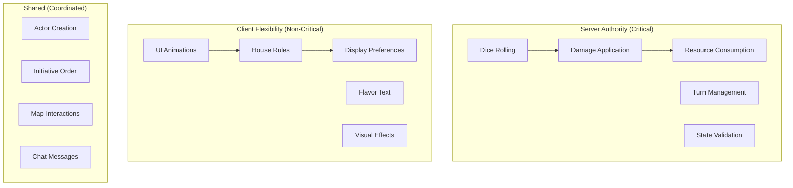
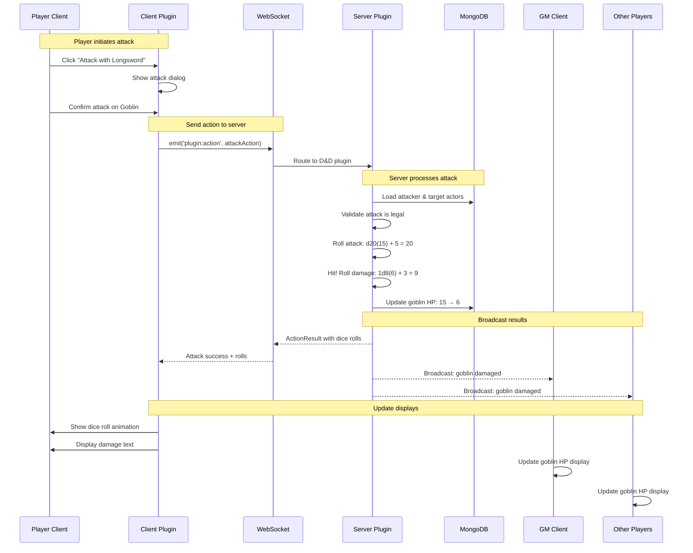

# Server Plugin State Management Architecture

## Executive Summary

### Problem Statement
Dungeon Lab's current state management system faces a critical decision point between server agnosticism and rule enforcement. Pure client-side state management enables plugin flexibility but allows potential cheating in a SaaS environment. Pure server-side logic creates coupling but ensures authoritative rule enforcement.

### Solution: Selective Server Authority
This document outlines a **server-side plugin architecture** that provides the best of both worlds:
- **Server Authority** for critical, cheat-prone mechanics (dice rolls, damage, resources)
- **Client Flexibility** for UI, house rules, and non-critical features
- **Plugin Isolation** maintaining clean separation between game systems
- **Development Simplicity** with clear contracts and tooling

### Key Benefits
1. **Cheat Prevention**: Server-authoritative dice rolling and resource management
2. **Rule Consistency**: Centralized rule interpretation prevents client drift
3. **Simplified State Sync**: Direct database updates with immediate broadcasting
4. **Performance**: No complex event sourcing or conflict resolution needed
5. **Trust Model**: Appropriate for SaaS where server must be authoritative

## Architecture Philosophy

### Authority Boundaries



**Server Enforced**:
- Dice rolls (prevent manipulation)
- HP/damage changes (prevent cheating)
- Spell slot/resource consumption (prevent duplication)
- Death/unconsciousness states (critical game state)
- Turn order and timing (fairness)

**Client Flexible**:
- Animation timing and effects
- UI layout and preferences  
- House rule modifications
- Descriptive text and flavor
- Non-mechanical interactions

## Plugin Architecture

### Plugin Structure

```
packages/plugins/dnd5e/
├── client/
│   ├── components/              # Vue components
│   │   ├── CharacterSheet.vue
│   │   ├── SpellSlots.vue
│   │   └── AttackRoller.vue
│   ├── stores/                  # Pinia stores (UI state only)
│   │   ├── character-sheet.store.mts
│   │   └── spell-tracker.store.mts
│   ├── services/                # Client-side utilities
│   │   ├── animation.service.mts
│   │   └── ui-helper.service.mts
│   └── index.mts                # Client plugin entry
├── server/
│   ├── handlers/                # Action handlers
│   │   ├── attack.handler.mts
│   │   ├── spell.handler.mts
│   │   └── rest.handler.mts
│   ├── services/                # Game logic services
│   │   ├── dice.service.mts
│   │   ├── damage.service.mts
│   │   └── spell.service.mts
│   ├── validators/              # Rule validation
│   │   ├── actor.validator.mts
│   │   └── action.validator.mts
│   └── index.mts                # Server plugin entry
├── shared/
│   ├── types/                   # Shared TypeScript types
│   │   ├── actions.types.mts
│   │   ├── state.types.mts
│   │   └── results.types.mts
│   ├── constants/               # Game constants
│   │   ├── abilities.mts
│   │   └── damage-types.mts
│   └── utils/                   # Shared utilities
│       └── calculations.mts
├── plugin.json                 # Plugin manifest
└── package.json
```

### Plugin Manifest

```json
{
  "id": "dnd5e",
  "name": "D&D 5th Edition (2024)",
  "version": "1.0.0",
  "description": "Official D&D 5e 2024 ruleset implementation",
  "author": "Dungeon Lab Team",
  
  "server": {
    "entry": "./dist/server/index.js",
    "handlers": {
      "attack": "handleAttack",
      "cast_spell": "handleSpellCast",
      "use_item": "handleItemUse",
      "short_rest": "handleShortRest",
      "long_rest": "handleLongRest",
      "level_up": "handleLevelUp"
    },
    "validators": {
      "actor_update": "validateActorUpdate",
      "spell_preparation": "validateSpellPreparation",
      "equipment_change": "validateEquipmentChange"
    },
    "hooks": {
      "actor_damaged": "onActorDamaged",
      "spell_cast": "onSpellCast",
      "turn_end": "onTurnEnd"
    }
  },
  
  "client": {
    "entry": "./dist/client/index.js",
    "styles": "./dist/client/styles.css",
    "hooks": {
      "actor:render": "onActorRender",
      "dice:roll": "onDiceRoll",
      "chat:message": "onChatMessage",
      "token:hover": "onTokenHover"
    },
    "components": {
      "character-sheet": "CharacterSheetComponent",
      "spell-list": "SpellListComponent",
      "attack-roller": "AttackRollerComponent"
    }
  },
  
  "dependencies": {
    "core": "^1.0.0"
  },
  
  "permissions": {
    "server": ["database:read", "database:write", "socket:broadcast"],
    "client": ["ui:modify", "storage:local"]
  }
}
```

## Server Plugin System

### Core Interfaces

```typescript
// Core server plugin interface
interface ServerPlugin {
  readonly id: string;
  readonly version: string;
  
  // Lifecycle management
  initialize(context: PluginServerContext): Promise<void>;
  shutdown?(): Promise<void>;
  
  // Action handling (server-enforced game mechanics)
  handleAction(action: PluginAction): Promise<ActionResult>;
  
  // State validation (prevent invalid states)
  validateActorUpdate?(actor: Actor, changes: Partial<Actor>): ValidationResult;
  validateSpellCast?(caster: Actor, spell: Spell, targets: Actor[]): ValidationResult;
  validateItemUse?(actor: Actor, item: Item): ValidationResult;
  
  // Event hooks (optional server-side reactions)
  onActorDamaged?(actor: Actor, damage: DamageInfo): Promise<void>;
  onSpellCast?(caster: Actor, spell: Spell, result: SpellResult): Promise<void>;
  onTurnStart?(actor: Actor, encounter: Encounter): Promise<void>;
  onTurnEnd?(actor: Actor, encounter: Encounter): Promise<void>;
}

// Action sent from client to server
interface PluginAction {
  type: string;                    // 'attack', 'cast_spell', etc.
  userId: string;                  // Who initiated the action
  sessionId: string;               // Game session context
  actorId?: string;                // Acting character (if applicable)
  
  data: Record<string, unknown>;   // Action-specific payload
  
  // Client context for validation
  expectedState?: {
    actorVersion: number;          // Optimistic locking
    resources: Record<string, number>; // Expected spell slots, etc.
  };
}

// Result returned by server plugin
interface ActionResult {
  success: boolean;
  error?: string;
  
  // Database changes to apply
  updates: StateUpdate[];
  
  // Messages to broadcast to clients
  broadcasts: Broadcast[];
  
  // Dice rolls for transparency
  rolls?: DiceRoll[];
  
  // Follow-up actions (e.g., unconscious -> death saves)
  followUpActions?: PluginAction[];
}

// State change to apply to database
interface StateUpdate {
  type: 'actor' | 'item' | 'encounter' | 'session';
  id: string;                      // Entity ID
  changes: Record<string, unknown>; // Partial update object
  version?: number;                // Optimistic locking version
}

// Broadcast message to clients
interface Broadcast {
  type: string;                    // 'actor_damaged', 'spell_cast', etc.
  scope: 'session' | 'user' | 'actor'; // Who should receive
  targetId?: string;               // Specific target (for user/actor scope)
  
  data: Record<string, unknown>;   // Broadcast payload
  animation?: {                    // Optional animation hints
    type: string;
    duration: number;
    targets: string[];
  };
}

// Dice roll result for transparency
interface DiceRoll {
  id: string;                      // Unique roll ID
  type: 'attack' | 'damage' | 'save' | 'check' | 'initiative';
  formula: string;                 // "1d20+5", "2d6+3", etc.
  result: number;                  // Final result
  
  // Detailed breakdown
  dice: {
    sides: number;
    count: number;
    results: number[];
  }[];
  modifiers: {
    name: string;                  // "Strength", "Proficiency", etc.
    value: number;
  }[];
  
  // Context
  actorId?: string;
  description?: string;            // "Attack roll with longsword"
}
```

### Plugin Server Context

```typescript
interface PluginServerContext {
  readonly pluginId: string;
  readonly sessionId: string;
  
  // Database access
  getActor(id: string): Promise<Actor>;
  updateActor(id: string, changes: Partial<Actor>): Promise<Actor>;
  getItem(id: string): Promise<Item>;
  getEncounter(id: string): Promise<Encounter>;
  
  // Session management
  getSession(): Promise<GameSession>;
  getSessionParticipants(): Promise<User[]>;
  
  // Broadcasting
  broadcast(broadcast: Broadcast): Promise<void>;
  broadcastToUser(userId: string, broadcast: Broadcast): Promise<void>;
  
  // Plugin communication
  callPlugin(pluginId: string, action: PluginAction): Promise<ActionResult>;
  
  // Utility services
  dice: DiceService;
  logger: Logger;
  cache: CacheService;
}

interface DiceService {
  roll(formula: string, description?: string): DiceRoll;
  rollMultiple(formulas: string[], description?: string): DiceRoll[];
  
  // Advantage/disadvantage
  rollAdvantage(formula: string, description?: string): DiceRoll;
  rollDisadvantage(formula: string, description?: string): DiceRoll;
}
```

## State Message Flow

### Complete Attack Flow



### Message Types

#### 1. Action Messages (Client → Server)

```typescript
// Attack action
interface AttackAction extends PluginAction {
  type: 'attack';
  data: {
    attackerId: string;            // Acting character
    targetId: string;              // Target character  
    weaponId: string;              // Weapon being used
    attackType: 'normal' | 'advantage' | 'disadvantage';
    
    // Optional modifiers
    bonuses?: {
      attack: number;              // Situational attack bonus
      damage: number;              // Situational damage bonus
    };
  };
  expectedState: {
    actorVersion: number;          // Prevent race conditions
    targetHP: number;              // Expected target HP
  };
}

// Spell casting action
interface SpellCastAction extends PluginAction {
  type: 'cast_spell';
  data: {
    casterId: string;
    spellId: string;
    level: number;                 // Spell slot level used
    targets: string[];             // Target actor IDs
    concentration?: boolean;       // If concentration spell
    
    // Spell-specific parameters
    parameters?: {
      metamagic?: string[];        // Sorcerer metamagic
      ritualCasting?: boolean;     // Ritual casting
    };
  };
  expectedState: {
    actorVersion: number;
    spellSlots: Record<number, number>; // Expected remaining slots
  };
}
```

#### 2. Result Messages (Server → Client)

```typescript
// Attack result
interface AttackResult extends ActionResult {
  success: true;
  updates: [{
    type: 'actor';
    id: string;                    // Target actor ID
    changes: { 
      'attributes.hp.value': number;
      'conditions'?: string[];     // If unconscious, etc.
    };
  }];
  broadcasts: [{
    type: 'attack_completed';
    scope: 'session';
    data: {
      attackerId: string;
      targetId: string;
      weaponName: string;
      hit: boolean;
      damage: number;
      newHP: number;
      unconscious?: boolean;
    };
    animation: {
      type: 'melee_attack';
      duration: 2000;
      targets: [string];           // Target token IDs
    };
  }];
  rolls: [{
    id: 'attack_roll_123';
    type: 'attack';
    formula: '1d20+5';
    result: 20;
    dice: [{ sides: 20, count: 1, results: [15] }];
    modifiers: [
      { name: 'Proficiency', value: 3 },
      { name: 'Strength', value: 2 }
    ];
    description: 'Attack roll with Longsword';
  }, {
    id: 'damage_roll_124';
    type: 'damage';
    formula: '1d8+3';
    result: 9;
    dice: [{ sides: 8, count: 1, results: [6] }];
    modifiers: [{ name: 'Strength', value: 3 }];
    description: 'Slashing damage';
  }];
}
```

#### 3. Broadcast Messages (Server → All Clients)

```typescript
// Actor state change broadcast
interface ActorUpdatedBroadcast extends Broadcast {
  type: 'actor_updated';
  scope: 'session';
  data: {
    actorId: string;
    changes: Record<string, unknown>;
    version: number;
    
    // Context for UI updates
    reason: 'damage' | 'healing' | 'spell_effect' | 'condition_change';
    sourceActorId?: string;        // Who caused the change
    description?: string;          // "takes 9 slashing damage"
  };
}

// Combat event broadcast  
interface CombatEventBroadcast extends Broadcast {
  type: 'combat_event';
  scope: 'session';
  data: {
    eventType: 'attack' | 'spell' | 'save' | 'death';
    actorId: string;
    targetIds?: string[];
    description: string;           // "Gandalf casts Fireball"
    
    // Dice results for display
    rolls: DiceRoll[];
    
    // Mechanical results
    results: {
      hit?: boolean;
      damage?: number;
      saveResults?: { actorId: string; success: boolean }[];
    };
  };
  animation: {
    type: string;
    duration: number;
    effects: string[];
  };
}
```

## Implementation Examples

### D&D 5e Attack Handler

```typescript
class DnD5eAttackHandler {
  constructor(
    private context: PluginServerContext,
    private diceService: DiceService,
    private damageService: DamageService
  ) {}
  
  async handleAttack(action: PluginAction): Promise<ActionResult> {
    const data = action.data as AttackActionData;
    
    // Load and validate actors
    const attacker = await this.context.getActor(data.attackerId);
    const target = await this.context.getActor(data.targetId);
    
    if (!attacker || !target) {
      return { success: false, error: 'Actor not found', updates: [], broadcasts: [] };
    }
    
    // Validate action is legal
    const validation = await this.validateAttack(attacker, target, data);
    if (!validation.valid) {
      return { success: false, error: validation.error, updates: [], broadcasts: [] };
    }
    
    // Get weapon and calculate attack bonus
    const weapon = this.getWeapon(attacker, data.weaponId);
    const attackBonus = this.calculateAttackBonus(attacker, weapon);
    
    // Roll attack (server-authoritative)
    const attackRoll = this.rollAttack(attackBonus, data.attackType);
    const hit = attackRoll.result >= target.attributes.ac;
    
    const rolls: DiceRoll[] = [attackRoll];
    const updates: StateUpdate[] = [];
    const broadcasts: Broadcast[] = [];
    
    let damage = 0;
    let unconscious = false;
    
    if (hit) {
      // Roll damage
      const damageRoll = this.rollDamage(attacker, weapon, data.bonuses?.damage);
      damage = damageRoll.result;
      rolls.push(damageRoll);
      
      // Apply damage
      const newHP = Math.max(0, target.attributes.hp.value - damage);
      unconscious = newHP === 0 && target.attributes.hp.value > 0;
      
      // Database update
      const changes: Partial<Actor> = {
        'attributes.hp.value': newHP
      };
      
      if (unconscious) {
        changes.conditions = [...(target.conditions || []), 'unconscious'];
        
        // Trigger death save system if applicable
        if (this.requiresDeathSaves(target)) {
          changes['attributes.deathSaves'] = {
            successes: 0,
            failures: 0,
            stable: false
          };
        }
      }
      
      updates.push({
        type: 'actor',
        id: target.id,
        changes,
        version: target.version
      });
      
      // Broadcast to all clients
      broadcasts.push({
        type: 'combat_event',
        scope: 'session',
        data: {
          eventType: 'attack',
          actorId: attacker.id,
          targetIds: [target.id],
          description: `${attacker.name} attacks ${target.name} with ${weapon.name}`,
          rolls,
          results: {
            hit: true,
            damage
          }
        },
        animation: {
          type: weapon.type === 'melee' ? 'melee_attack' : 'ranged_attack',
          duration: 2000,
          effects: unconscious ? ['damage', 'unconscious'] : ['damage']
        }
      });
    } else {
      // Miss - still broadcast for transparency
      broadcasts.push({
        type: 'combat_event',
        scope: 'session',
        data: {
          eventType: 'attack',
          actorId: attacker.id,
          targetIds: [target.id],
          description: `${attacker.name} attacks ${target.name} with ${weapon.name}`,
          rolls,
          results: { hit: false }
        },
        animation: {
          type: 'attack_miss',
          duration: 1500,
          effects: ['miss']
        }
      });
    }
    
    return {
      success: true,
      updates,
      broadcasts,
      rolls
    };
  }
  
  private rollAttack(bonus: number, type: 'normal' | 'advantage' | 'disadvantage'): DiceRoll {
    const rollId = `attack_${Date.now()}_${Math.random().toString(36)}`;
    
    let diceResults: number[];
    let formula: string;
    
    switch (type) {
      case 'advantage':
        diceResults = [this.rollD20(), this.rollD20()];
        formula = `2d20kh1+${bonus}`;
        break;
      case 'disadvantage':
        diceResults = [this.rollD20(), this.rollD20()];
        formula = `2d20kl1+${bonus}`;
        break;
      default:
        diceResults = [this.rollD20()];
        formula = `1d20+${bonus}`;
    }
    
    const bestRoll = type === 'advantage' 
      ? Math.max(...diceResults)
      : type === 'disadvantage'
        ? Math.min(...diceResults)
        : diceResults[0];
    
    return {
      id: rollId,
      type: 'attack',
      formula,
      result: bestRoll + bonus,
      dice: [{
        sides: 20,
        count: diceResults.length,
        results: diceResults
      }],
      modifiers: this.getAttackModifierBreakdown(bonus),
      description: `Attack roll`
    };
  }
  
  private rollD20(): number {
    return Math.floor(Math.random() * 20) + 1;
  }
  
  private async validateAttack(
    attacker: Actor, 
    target: Actor, 
    data: AttackActionData
  ): Promise<ValidationResult> {
    
    // Check if attacker can act
    if (attacker.conditions?.includes('unconscious')) {
      return { valid: false, error: 'Attacker is unconscious' };
    }
    
    if (attacker.conditions?.includes('stunned')) {
      return { valid: false, error: 'Attacker is stunned' };
    }
    
    // Check weapon exists and is equipped
    const weapon = this.getWeapon(attacker, data.weaponId);
    if (!weapon) {
      return { valid: false, error: 'Weapon not found' };
    }
    
    if (!weapon.equipped) {
      return { valid: false, error: 'Weapon not equipped' };
    }
    
    // Check range (if applicable)
    if (weapon.range && !this.isInRange(attacker, target, weapon.range)) {
      return { valid: false, error: 'Target out of range' };
    }
    
    // Check line of sight (if applicable)
    if (!await this.hasLineOfSight(attacker, target)) {
      return { valid: false, error: 'No line of sight to target' };
    }
    
    return { valid: true };
  }
}
```

### Spell Casting Handler

```typescript
class DnD5eSpellHandler {
  async handleSpellCast(action: PluginAction): Promise<ActionResult> {
    const data = action.data as SpellCastActionData;
    
    const caster = await this.context.getActor(data.casterId);
    const spell = await this.getSpell(data.spellId);
    const targets = await this.loadTargets(data.targets);
    
    // Validate spell cast
    const validation = await this.validateSpellCast(caster, spell, data.level, targets);
    if (!validation.valid) {
      return { success: false, error: validation.error, updates: [], broadcasts: [] };
    }
    
    // Consume spell slot (server-authoritative)
    const updates: StateUpdate[] = [{
      type: 'actor',
      id: caster.id,
      changes: {
        [`attributes.spellSlots.level${data.level}`]: 
          caster.attributes.spellSlots[`level${data.level}`] - 1
      }
    }];
    
    const rolls: DiceRoll[] = [];
    const broadcasts: Broadcast[] = [];
    
    // Handle different spell types
    switch (spell.type) {
      case 'attack':
        return await this.handleSpellAttack(caster, spell, targets, data.level, updates, rolls, broadcasts);
      
      case 'save':
        return await this.handleSpellSave(caster, spell, targets, data.level, updates, rolls, broadcasts);
      
      case 'utility':
        return await this.handleUtilitySpell(caster, spell, targets, data.level, updates, broadcasts);
      
      default:
        return { success: false, error: 'Unknown spell type', updates: [], broadcasts: [] };
    }
  }
  
  private async handleSpellSave(
    caster: Actor,
    spell: Spell,
    targets: Actor[],
    level: number,
    updates: StateUpdate[],
    rolls: DiceRoll[],
    broadcasts: Broadcast[]
  ): Promise<ActionResult> {
    
    const dc = this.calculateSpellDC(caster);
    const saveResults: { actorId: string; success: boolean; roll: DiceRoll }[] = [];
    
    // Each target makes a saving throw
    for (const target of targets) {
      const saveRoll = this.rollSavingThrow(target, spell.save.ability);
      const success = saveRoll.result >= dc;
      
      rolls.push(saveRoll);
      saveResults.push({ actorId: target.id, success, roll: saveRoll });
      
      // Apply spell effects based on save result
      const damage = this.calculateSpellDamage(spell, level, success);
      
      if (damage > 0) {
        const newHP = Math.max(0, target.attributes.hp.value - damage);
        
        updates.push({
          type: 'actor',
          id: target.id,
          changes: { 'attributes.hp.value': newHP }
        });
      }
    }
    
    // Broadcast spell cast event
    broadcasts.push({
      type: 'spell_cast',
      scope: 'session',
      data: {
        casterId: caster.id,
        spellName: spell.name,
        level,
        targets: targets.map(t => t.id),
        saveResults: saveResults.map(r => ({ actorId: r.actorId, success: r.success })),
        description: `${caster.name} casts ${spell.name} (Level ${level})`
      },
      animation: {
        type: spell.school.toLowerCase(),
        duration: 3000,
        effects: spell.effects || []
      }
    });
    
    return {
      success: true,
      updates,
      broadcasts,
      rolls
    };
  }
}
```

## Client-Server Integration

### Client Plugin Architecture

```typescript
class DnD5eClientPlugin {
  constructor(
    private socketService: SocketService,
    private uiService: UIService,
    private animationService: AnimationService
  ) {}
  
  async initialize(): Promise<void> {
    // Register action handlers
    this.socketService.on('action:result', this.handleActionResult.bind(this));
    this.socketService.on('broadcast', this.handleBroadcast.bind(this));
    
    // Register UI components
    this.uiService.registerComponent('dnd5e-character-sheet', CharacterSheetComponent);
    this.uiService.registerComponent('dnd5e-spell-list', SpellListComponent);
  }
  
  // Send action to server
  async performAttack(attackData: {
    attackerId: string;
    targetId: string;
    weaponId: string;
    attackType?: 'normal' | 'advantage' | 'disadvantage';
  }): Promise<void> {
    
    const action: PluginAction = {
      type: 'attack',
      userId: this.currentUser.id,
      sessionId: this.currentSession.id,
      actorId: attackData.attackerId,
      data: attackData,
      expectedState: {
        actorVersion: this.getActorVersion(attackData.attackerId),
        targetHP: this.getActorHP(attackData.targetId)
      }
    };
    
    try {
      // Show loading state
      this.uiService.showActionLoading('attack');
      
      // Send to server
      const result = await this.socketService.sendAction('dnd5e', action);
      
      if (result.success) {
        // Show dice rolls
        this.showDiceRolls(result.rolls);
        
        // Server will broadcast state changes
        // Client just waits for broadcasts
      } else {
        this.uiService.showError(result.error);
      }
      
    } catch (error) {
      this.uiService.showError('Attack failed: ' + error.message);
    } finally {
      this.uiService.hideActionLoading();
    }
  }
  
  // Handle broadcasts from server
  private handleBroadcast(broadcast: Broadcast): void {
    switch (broadcast.type) {
      case 'combat_event':
        this.handleCombatEvent(broadcast);
        break;
      
      case 'actor_updated':
        this.handleActorUpdated(broadcast);
        break;
      
      case 'spell_cast':
        this.handleSpellCast(broadcast);
        break;
    }
  }
  
  private handleCombatEvent(broadcast: Broadcast): void {
    const data = broadcast.data as CombatEventData;
    
    // Update local actor cache
    if (data.results.damage) {
      this.updateLocalActor(data.targetIds[0], {
        'attributes.hp.value': data.results.newHP
      });
    }
    
    // Show animation
    if (broadcast.animation) {
      this.animationService.play(broadcast.animation.type, {
        duration: broadcast.animation.duration,
        targets: data.targetIds,
        effects: broadcast.animation.effects
      });
    }
    
    // Add to combat log
    this.addToCombatLog({
      timestamp: Date.now(),
      actorId: data.actorId,
      description: data.description,
      rolls: data.rolls,
      damage: data.results.damage
    });
  }
  
  private showDiceRolls(rolls: DiceRoll[]): void {
    for (const roll of rolls) {
      this.uiService.showDiceRoll({
        id: roll.id,
        type: roll.type,
        formula: roll.formula,
        result: roll.result,
        breakdown: roll.modifiers,
        description: roll.description
      });
    }
  }
}
```

### Socket Service Integration

```typescript
class SocketService {
  async sendAction(gameSystem: string, action: PluginAction): Promise<ActionResult> {
    return new Promise((resolve, reject) => {
      const timeout = setTimeout(() => {
        reject(new Error('Action timeout'));
      }, 10000); // 10 second timeout
      
      this.socket.emit('plugin:action', {
        gameSystem,
        action
      }, (result: ActionResult) => {
        clearTimeout(timeout);
        
        if (result.success) {
          resolve(result);
        } else {
          reject(new Error(result.error));
        }
      });
    });
  }
  
  on(event: string, handler: (data: any) => void): void {
    this.socket.on(event, handler);
  }
}
```

## Performance & Security

### Cheat Prevention

```typescript
class CheatPreventionService {
  // Validate all dice rolls happen server-side
  validateDiceRoll(roll: DiceRoll, action: PluginAction): boolean {
    // Check that roll was generated server-side
    if (!roll.id.startsWith('server_')) {
      this.logger.warn('Client attempted to provide dice roll', { 
        userId: action.userId, 
        rollId: roll.id 
      });
      return false;
    }
    
    return true;
  }
  
  // Prevent resource duplication
  async validateResourceConsumption(
    actor: Actor, 
    expectedResources: Record<string, number>
  ): Promise<boolean> {
    
    const currentResources = actor.attributes.spellSlots;
    
    for (const [level, expected] of Object.entries(expectedResources)) {
      if (currentResources[level] !== expected) {
        this.logger.warn('Resource mismatch detected', {
          actorId: actor.id,
          level,
          expected,
          actual: currentResources[level]
        });
        return false;
      }
    }
    
    return true;
  }
  
  // Rate limiting for actions
  private actionCounts = new Map<string, { count: number; resetTime: number }>();
  
  checkRateLimit(userId: string, actionType: string): boolean {
    const key = `${userId}:${actionType}`;
    const now = Date.now();
    const window = 60000; // 1 minute
    const maxActions = actionType === 'attack' ? 30 : 10; // 30 attacks or 10 other actions per minute
    
    let record = this.actionCounts.get(key);
    
    if (!record || now > record.resetTime) {
      record = { count: 0, resetTime: now + window };
      this.actionCounts.set(key, record);
    }
    
    if (record.count >= maxActions) {
      this.logger.warn('Rate limit exceeded', { userId, actionType, count: record.count });
      return false;
    }
    
    record.count++;
    return true;
  }
}
```

### Performance Optimization

```typescript
class PerformanceOptimizer {
  private actorCache = new Map<string, { actor: Actor; expires: number }>();
  
  async getActor(id: string): Promise<Actor> {
    const cached = this.actorCache.get(id);
    
    if (cached && cached.expires > Date.now()) {
      return cached.actor;
    }
    
    const actor = await this.database.getActor(id);
    
    this.actorCache.set(id, {
      actor,
      expires: Date.now() + 300000 // 5 minute cache
    });
    
    return actor;
  }
  
  invalidateActor(id: string): void {
    this.actorCache.delete(id);
  }
  
  // Batch database updates
  private pendingUpdates = new Map<string, StateUpdate[]>();
  private updateTimer: NodeJS.Timeout | null = null;
  
  queueUpdate(update: StateUpdate): void {
    const key = `${update.type}:${update.id}`;
    
    if (!this.pendingUpdates.has(key)) {
      this.pendingUpdates.set(key, []);
    }
    
    this.pendingUpdates.get(key)!.push(update);
    
    // Flush updates after 100ms or when queue is full
    if (!this.updateTimer) {
      this.updateTimer = setTimeout(() => this.flushUpdates(), 100);
    }
    
    if (this.pendingUpdates.size >= 50) {
      this.flushUpdates();
    }
  }
  
  private async flushUpdates(): Promise<void> {
    if (this.updateTimer) {
      clearTimeout(this.updateTimer);
      this.updateTimer = null;
    }
    
    const updates = Array.from(this.pendingUpdates.values()).flat();
    this.pendingUpdates.clear();
    
    if (updates.length === 0) return;
    
    // Group by type for efficient batch updates
    const grouped = new Map<string, StateUpdate[]>();
    
    for (const update of updates) {
      if (!grouped.has(update.type)) {
        grouped.set(update.type, []);
      }
      grouped.get(update.type)!.push(update);
    }
    
    // Execute batch updates
    await Promise.all([
      this.batchUpdateActors(grouped.get('actor') || []),
      this.batchUpdateItems(grouped.get('item') || []),
      this.batchUpdateEncounters(grouped.get('encounter') || [])
    ]);
  }
}
```

## Migration Strategy

### Phase 1: Infrastructure Setup (Week 1-2)
```typescript
// Add server plugin system alongside existing system
class HybridGameActionHandler {
  async handleAction(socket: AuthenticatedSocket, data: any): Promise<void> {
    const session = await this.getSession(socket.userId);
    
    if (this.hasServerPlugin(session.gameSystem) && this.isPluginAction(data.type)) {
      // New: Route to server plugin
      await this.handlePluginAction(socket, data);
    } else {
      // Legacy: Use existing handlers
      await this.handleLegacyAction(socket, data);
    }
  }
  
  private async handlePluginAction(socket: AuthenticatedSocket, data: any): Promise<void> {
    const plugin = this.pluginManager.getPlugin(data.gameSystem);
    const result = await plugin.handleAction(data.action);
    
    socket.emit('action:result', result);
    
    for (const broadcast of result.broadcasts) {
      this.broadcastToSession(data.sessionId, broadcast);
    }
  }
}
```

### Phase 2: D&D Plugin Migration (Week 3-4)
```typescript
// Migrate critical D&D actions one by one
const MIGRATED_ACTIONS = ['attack', 'cast_spell', 'use_item'];

class DnDMigrationHandler {
  async handleDnDAction(action: string, data: any): Promise<ActionResult> {
    if (MIGRATED_ACTIONS.includes(action)) {
      // Use new server plugin
      return await this.dndServerPlugin.handleAction({
        type: action,
        data,
        userId: this.currentUser.id,
        sessionId: this.currentSession.id
      });
    } else {
      // Fall back to legacy system
      return await this.legacyDnDHandler.handle(action, data);
    }
  }
}
```

### Phase 3: Full Migration (Week 5-6)
```typescript
// Remove legacy handlers, optimize server plugins
class ProductionPluginManager {
  async handleAction(gameSystem: string, action: PluginAction): Promise<ActionResult> {
    const plugin = this.plugins.get(gameSystem);
    
    if (!plugin) {
      throw new Error(`Game system not supported: ${gameSystem}`);
    }
    
    // All actions now go through server plugins
    return await plugin.handleAction(action);
  }
}
```

## Testing Strategy

### Unit Tests
```typescript
describe('DnD5eAttackHandler', () => {
  it('should calculate attack bonuses correctly', () => {
    const attacker = createTestActor({
      level: 5,
      proficiencyBonus: 3,
      strength: 16
    });
    
    const weapon = createTestWeapon({
      type: 'melee',
      proficient: true
    });
    
    const bonus = handler.calculateAttackBonus(attacker, weapon);
    expect(bonus).toBe(6); // +3 prof + +3 str
  });
  
  it('should handle advantage rolls correctly', () => {
    const roll = handler.rollAttack(5, 'advantage');
    
    expect(roll.dice[0].results).toHaveLength(2);
    expect(roll.formula).toBe('2d20kh1+5');
    expect(roll.result).toBe(Math.max(...roll.dice[0].results) + 5);
  });
});
```

### Integration Tests
```typescript
describe('Attack Integration', () => {
  it('should complete full attack flow', async () => {
    const attacker = await createTestActor({ name: 'Fighter', hp: 20 });
    const target = await createTestActor({ name: 'Goblin', hp: 15 });
    
    const action: PluginAction = {
      type: 'attack',
      userId: 'test-user',
      sessionId: 'test-session',
      data: {
        attackerId: attacker.id,
        targetId: target.id,
        weaponId: 'longsword'
      }
    };
    
    const result = await pluginManager.handleAction('dnd5e', action);
    
    expect(result.success).toBe(true);
    expect(result.rolls).toHaveLength(2); // attack + damage
    expect(result.updates).toHaveLength(1);
    expect(result.broadcasts).toHaveLength(1);
    
    // Verify target was damaged
    const updatedTarget = await getActor(target.id);
    expect(updatedTarget.attributes.hp.value).toBeLessThan(15);
  });
});
```

### Load Tests
```typescript
describe('Performance', () => {
  it('should handle 100 concurrent attacks', async () => {
    const attacks = Array.from({ length: 100 }, (_, i) => 
      createAttackAction(`attacker${i}`, `target${i}`)
    );
    
    const startTime = Date.now();
    const results = await Promise.all(
      attacks.map(attack => pluginManager.handleAction('dnd5e', attack))
    );
    const endTime = Date.now();
    
    expect(endTime - startTime).toBeLessThan(5000); // Under 5 seconds
    expect(results.every(r => r.success)).toBe(true);
  });
});
```

## Implementation Checklist

### Core Infrastructure
- [ ] Server plugin manager
- [ ] Plugin loading and lifecycle
- [ ] Action routing system
- [ ] Broadcast mechanism
- [ ] Database integration

### D&D 5e Plugin
- [ ] Attack handling with dice rolls
- [ ] Spell casting system
- [ ] Resource management (spell slots, items)
- [ ] Condition tracking
- [ ] Death saves system

### Client Integration
- [ ] Action sending system
- [ ] Broadcast handling
- [ ] UI integration
- [ ] Animation triggers
- [ ] Error handling

### Security & Performance
- [ ] Server-side dice rolling
- [ ] Resource validation
- [ ] Rate limiting
- [ ] Caching system
- [ ] Batch updates

### Testing & Migration
- [ ] Comprehensive test suite
- [ ] Migration tools
- [ ] Performance benchmarks
- [ ] Rollback procedures

## Success Metrics

- **Authority**: 100% of critical actions (damage, resources) handled server-side
- **Performance**: < 200ms average action processing time
- **Reliability**: < 0.01% action failure rate
- **Security**: Zero successful client-side manipulation attempts
- **Developer Experience**: Plugin creation time reduced by 50%

This architecture provides the authoritative rule enforcement needed for a SaaS VTT while maintaining the plugin flexibility that makes Dungeon Lab extensible to multiple game systems. The server-side plugins handle critical game mechanics while allowing client-side creativity for UI and non-mechanical features.