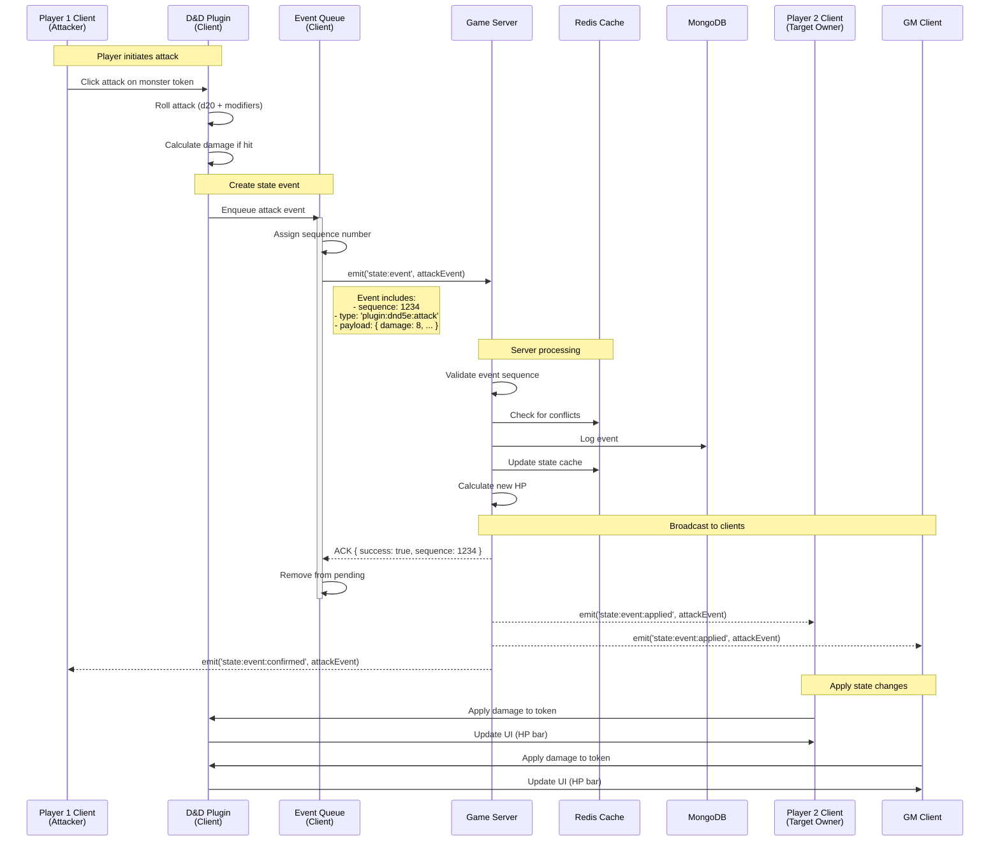
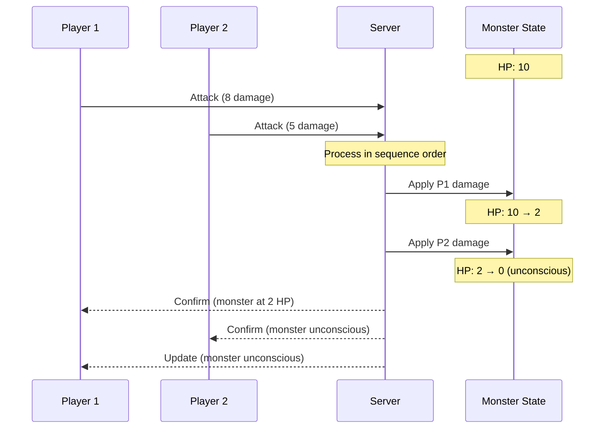

# State Management Design Document

## Overview

This document outlines the comprehensive redesign of Dungeon Lab's state management system to address critical issues with reliability, consistency, and performance in our real-time collaborative VTT environment.

## Current Issues

1. **Message Loss**: WebSocket messages sent during disconnection are permanently lost
2. **Race Conditions**: No ordering guarantees for rapid state updates
3. **State Drift**: No mechanism to detect or correct divergence between clients
4. **Inconsistent Recovery**: Page reloads result in partial state loss
5. **Performance**: Full object updates instead of deltas cause unnecessary bandwidth usage

## Design Goals

- **Reliability**: Guarantee message delivery and ordering
- **Consistency**: Ensure all clients maintain synchronized state
- **Performance**: Minimize bandwidth and latency
- **Resilience**: Graceful handling of disconnections and conflicts
- **Scalability**: Support hundreds of concurrent users per session

## Architecture Components

### 1. Event Sourcing Layer

#### Message Structure
```typescript
interface StateEvent {
  id: string;           // UUID for deduplication
  sequence: number;     // Monotonic sequence number
  timestamp: number;    // Server timestamp
  type: string;         // Event type (e.g., 'token:move')
  payload: unknown;     // Event-specific data
  userId: string;       // Originating user
  sessionId: string;    // Game session context
  checksum?: string;    // Optional payload checksum
}
```

#### Client Event Queue
```typescript
interface EventQueue {
  pending: StateEvent[];      // Events awaiting acknowledgment
  sequence: number;           // Next sequence number
  maxRetries: number;         // Max retry attempts
  retryDelay: number;         // Base retry delay (ms)
}
```

### 2. State Synchronization Protocol

#### Sync States
```
CONNECTED → SYNCING → SYNCED → OUT_OF_SYNC → RESYNCING
```

#### Sync Messages
1. **STATE_REQUEST**: Client requests full state snapshot
2. **STATE_SNAPSHOT**: Server sends complete state with version
3. **STATE_DELTA**: Incremental updates with version bumps
4. **STATE_ACK**: Client confirms receipt and application
5. **STATE_CONFLICT**: Server detects conflicting updates

### 3. Persistence Hierarchy

| Storage Type | Use Case | TTL | Example Data |
|-------------|----------|-----|--------------|
| Memory | Active UI state | Session | Selected tokens, hover states |
| SessionStorage | Session-scoped data | Tab close | Game session, chat messages |
| LocalStorage | User preferences | Permanent | UI layout, shortcuts |
| IndexedDB | Large datasets | 30 days | Maps, actor data, assets |
| Server | Authoritative state | Permanent | All game data |

### 4. Server Architecture

#### Redis Data Structures
```
session:{id}:state        - Current session state (hash)
session:{id}:events       - Event log (sorted set)
session:{id}:participants - Active users (set)
session:{id}:locks        - Distributed locks (hash)
```

#### MongoDB Schema Updates
```typescript
// Add to existing schemas
interface IEncounterVersion {
  version: number;
  lastModified: Date;
  checksum: string;
}

interface IEventLog {
  sessionId: string;
  sequence: number;
  event: StateEvent;
  processed: boolean;
  createdAt: Date;
}
```

## Implementation Details

### Phase 1: Message Reliability

#### 1.1 Sequence Numbers
- Server maintains per-session sequence counter
- Clients track last received sequence
- Gap detection triggers resync

#### 1.2 Acknowledgment System
```typescript
// Client
socket.emit('state:event', event, (ack: AckResponse) => {
  if (ack.success) {
    eventQueue.confirm(event.id);
  } else {
    eventQueue.retry(event.id);
  }
});

// Server
socket.on('state:event', async (event, callback) => {
  const result = await processEvent(event);
  callback({ success: result.success, sequence: result.sequence });
});
```

#### 1.3 Retry Mechanism
- Exponential backoff: 100ms, 200ms, 400ms, 800ms, 1600ms
- Max 5 retries before user notification
- Automatic retry on reconnection

### Phase 2: State Recovery

#### 2.1 Event Log
- Server stores last 1000 events per session
- Events expire after 1 hour
- Compressed storage using MessagePack

#### 2.2 Snapshot System
```typescript
interface StateSnapshot {
  version: number;
  timestamp: number;
  checksum: string;
  encounters: IEncounter[];
  tokens: IToken[];
  participants: IParticipant[];
  compressed: boolean;
}
```

#### 2.3 Reconciliation Flow
1. Client connects and sends last known version
2. Server compares versions
3. If gap < 100 events: replay events
4. If gap > 100 events: send snapshot
5. Client applies updates and confirms

### Phase 3: Conflict Resolution

#### 3.1 Operational Transforms
```typescript
// Token movement example
interface MoveOperation {
  tokenId: string;
  from: Position;
  to: Position;
  timestamp: number;
}

function transformMove(op1: MoveOperation, op2: MoveOperation): MoveOperation {
  // If same token, later operation wins
  if (op1.tokenId === op2.tokenId) {
    return op1.timestamp > op2.timestamp ? op1 : op2;
  }
  // Different tokens, both operations valid
  return op1;
}
```

#### 3.2 Conflict Strategies
- **Last Write Wins**: Default for most operations
- **Merge**: For additive operations (chat, dice rolls)
- **Manual**: For critical operations (character death)

### Phase 4: Performance Optimization

#### 4.1 Delta Compression
```typescript
// Use JSON Patch (RFC 6902) for deltas
interface StateDelta {
  version: number;
  patches: JsonPatchOperation[];
}
```

#### 4.2 Batching
- Aggregate updates within 50ms window
- Maximum batch size: 10 operations
- Priority queue for critical updates

#### 4.3 Caching Strategy
- LRU cache for 100 most recent states
- Precomputed snapshots every 100 versions
- Gzip compression for large payloads

## Migration Plan

### Step 1: Non-Breaking Additions
1. Add sequence numbers to existing events
2. Implement acknowledgments alongside current system
3. Deploy event log without changing client behavior

### Step 2: Client Rollout
1. Feature flag for new sync protocol
2. A/B test with 10% of users
3. Monitor metrics and iterate
4. Gradual rollout to 100%

### Step 3: Cleanup
1. Remove old event handlers
2. Migrate persisted data format
3. Update documentation

## Monitoring & Metrics

### Key Metrics
- Message delivery rate
- Average sync latency
- Conflict rate per session
- State drift incidents
- Reconnection recovery time

### Alerts
- Delivery rate < 99.9%
- Sync latency > 500ms
- Conflict rate > 5%
- Event log growth > 1GB/hour

## Security Considerations

### Input Validation
- Validate all event payloads
- Enforce sequence number monotonicity
- Rate limit events per user

### Access Control
- Verify session membership for all events
- Separate GM and player permissions
- Audit log for critical operations

## Testing Strategy

### Unit Tests
- Event queue operations
- Conflict resolution algorithms
- Delta compression

### Integration Tests
- Multi-client synchronization
- Network partition handling
- State recovery flows

### Load Tests
- 100 concurrent users per session
- 1000 events per minute
- 10MB state snapshots

## Future Enhancements

1. **Predictive Sync**: Preload likely state changes
2. **Peer-to-Peer**: Direct client communication for low latency
3. **State Sharding**: Split large sessions across servers
4. **AI Conflict Resolution**: Smart merge strategies
5. **Offline Mode**: Full functionality without connection

## Example: Combat Attack Flow

### Overview
This example demonstrates how a D&D 5e attack flows through the system, showing the interaction between the plugin system, state management, and synchronization across clients.

### Attack Flow Sequence



### Detailed Event Structure

```typescript
// Attack Event Example
const attackEvent: StateEvent = {
  id: "550e8400-e29b-41d4-a716-446655440000",
  sequence: 1234,
  timestamp: 1704067200000,
  type: "plugin:dnd5e:attack",
  userId: "player123",
  sessionId: "session456",
  payload: {
    // Core attack data
    action: {
      type: "weapon_attack",
      weaponId: "longsword",
      attackRoll: {
        total: 18,
        d20Result: 12,
        modifiers: [
          { source: "proficiency", value: 3 },
          { source: "strength", value: 3 }
        ]
      }
    },
    
    // Target information
    target: {
      tokenId: "token789",
      actorId: "goblin001",
      ac: 15
    },
    
    // Result
    result: {
      hit: true,
      damage: {
        total: 8,
        rolls: [
          { dice: "1d8", result: 5, type: "slashing" },
          { modifier: 3, source: "strength", type: "slashing" }
        ]
      },
      effects: []
    },
    
    // State changes (computed by plugin)
    stateChanges: {
      "actors.goblin001.data.attributes.hp.value": {
        old: 15,
        new: 7
      }
    }
  },
  checksum: "sha256:abcd1234..."
}
```

### State Synchronization During Combat

#### 1. Optimistic Updates
```typescript
// Player 1's client applies changes immediately
class DnD5ePlugin {
  async performAttack(targetToken: IToken) {
    // Roll attack locally
    const attackResult = this.rollAttack();
    
    // Optimistic update - apply immediately
    if (attackResult.hit) {
      this.applyDamageLocally(targetToken, attackResult.damage);
    }
    
    // Send to server
    const event = this.createAttackEvent(attackResult);
    await this.stateManager.sendEvent(event);
    
    // If server rejects, rollback will happen automatically
  }
}
```

#### 2. Conflict Resolution
```typescript
// Server-side conflict handling
async function handleCombatEvent(event: StateEvent): Promise<EventResult> {
  const session = await getSession(event.sessionId);
  
  // Check for concurrent modifications
  const targetActor = await getActorWithLock(event.payload.target.actorId);
  
  // Verify the attack is valid
  if (targetActor.version !== event.payload.expectedVersion) {
    // Conflict detected - another change happened first
    return {
      success: false,
      conflict: true,
      currentState: targetActor,
      resolution: 'retry_with_current_state'
    };
  }
  
  // Apply the damage
  const newHp = targetActor.data.attributes.hp.value - event.payload.result.damage.total;
  targetActor.data.attributes.hp.value = Math.max(0, newHp);
  targetActor.version++;
  
  await saveActor(targetActor);
  
  return {
    success: true,
    newVersion: targetActor.version,
    broadcast: true
  };
}
```

#### 3. Network Failure Handling
```typescript
class EventQueue {
  private async processQueue() {
    while (this.pending.length > 0) {
      const event = this.pending[0];
      
      try {
        const ack = await this.sendWithTimeout(event, 5000);
        
        if (ack.success) {
          this.pending.shift(); // Remove successful event
          this.applyConfirmedState(ack.newState);
        } else if (ack.conflict) {
          // Recompute event with new state
          const newEvent = await this.recomputeEvent(event, ack.currentState);
          this.pending[0] = newEvent;
        }
      } catch (error) {
        // Network error - will retry
        await this.waitForReconnection();
        // Events remain in queue
      }
    }
  }
}
```

### Special Combat Scenarios

#### 1. Simultaneous Attacks
When two players attack the same monster simultaneously:



#### 2. Death Saves and State Persistence
```typescript
interface DeathSaveState {
  tokenId: string;
  successes: number;
  failures: number;
  stable: boolean;
  timestamp: number;
}

// Stored in Redis for quick access
const deathSaveKey = `session:${sessionId}:deathsaves:${tokenId}`;

// Periodically synced to MongoDB
const deathSaveDoc = {
  sessionId,
  tokenId,
  state: deathSaveState,
  history: [
    { roll: 15, success: true, timestamp: 1704067200000 },
    { roll: 8, success: false, timestamp: 1704067260000 }
  ]
};
```

#### 3. Area of Effect Coordination
```typescript
// Fireball affecting multiple tokens
const aoeEvent: StateEvent = {
  type: "plugin:dnd5e:aoe_spell",
  payload: {
    spell: "fireball",
    origin: { x: 100, y: 150 },
    radius: 20,
    save: { type: "dexterity", dc: 15 },
    damage: { dice: "8d6", type: "fire" },
    
    // Server computes affected tokens
    affectedTokens: [
      { tokenId: "goblin1", saveRoll: 12, failed: true, damage: 28 },
      { tokenId: "goblin2", saveRoll: 16, failed: false, damage: 14 },
      { tokenId: "player3", saveRoll: 18, failed: false, damage: 14 }
    ],
    
    // Batch state changes
    stateChanges: {
      "actors.goblin1.data.attributes.hp.value": { old: 15, new: 0 },
      "actors.goblin2.data.attributes.hp.value": { old: 15, new: 1 },
      "actors.player3.data.attributes.hp.value": { old: 45, new: 31 }
    }
  }
};
```

### Performance Considerations

#### 1. Combat Event Batching
During intense combat, events are batched to reduce network overhead:

```typescript
// Client-side batching
class CombatEventBatcher {
  private batch: StateEvent[] = [];
  private batchTimer: number | null = null;
  
  addEvent(event: StateEvent) {
    this.batch.push(event);
    
    if (!this.batchTimer) {
      this.batchTimer = setTimeout(() => this.flush(), 50);
    }
    
    // Force flush if batch is large
    if (this.batch.length >= 10) {
      this.flush();
    }
  }
  
  private flush() {
    if (this.batch.length > 0) {
      this.socket.emit('state:event:batch', this.batch);
      this.batch = [];
    }
    this.batchTimer = null;
  }
}
```

#### 2. Delta Compression for HP Changes
```typescript
// Instead of sending full actor state
const hpDelta = {
  op: "replace",
  path: "/actors/goblin001/data/attributes/hp/value",
  value: 7,
  previousValue: 15
};

// Multiple HP changes in one event
const multiDelta = [
  { op: "replace", path: "/actors/goblin001/data/attributes/hp/value", value: 0 },
  { op: "add", path: "/actors/goblin001/conditions", value: "unconscious" },
  { op: "replace", path: "/encounter/turn", value: 3 }
];
```

### Plugin Integration Points

The plugin system integrates with state management at several key points:

1. **Event Creation**: Plugins create domain-specific events
2. **State Validation**: Plugins validate state changes match game rules
3. **Conflict Resolution**: Plugins provide merge strategies for their data
4. **UI Updates**: Plugins handle rendering state changes

```typescript
// Plugin interface for state management
interface IGameSystemPlugin {
  // Create state events from user actions
  createStateEvent(action: UserAction): StateEvent;
  
  // Validate state changes follow game rules
  validateStateChange(change: StateChange): ValidationResult;
  
  // Resolve conflicts between state changes
  resolveConflict(local: StateChange, remote: StateChange): StateChange;
  
  // Apply state changes to UI
  applyStateChange(change: StateChange): void;
  
  // Compute derived state (e.g., modifiers from conditions)
  computeDerivedState(baseState: ActorState): DerivedState;
}
```

## Appendix: API Changes

### New Socket Events

#### Client → Server
- `state:sync:request` - Request state synchronization
- `state:event:batch` - Send multiple events
- `state:checkpoint` - Request state checkpoint

#### Server → Client
- `state:sync:snapshot` - Full state snapshot
- `state:sync:delta` - Incremental update
- `state:sync:conflict` - Conflict notification
- `state:event:ack` - Event acknowledgment

### REST Endpoints
- `GET /api/sessions/:id/state` - Get current state
- `GET /api/sessions/:id/events?from=:sequence` - Get event log
- `POST /api/sessions/:id/checkpoint` - Create state checkpoint