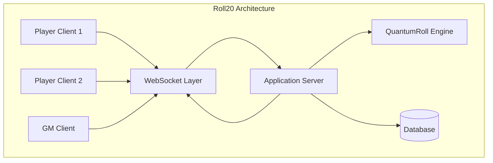
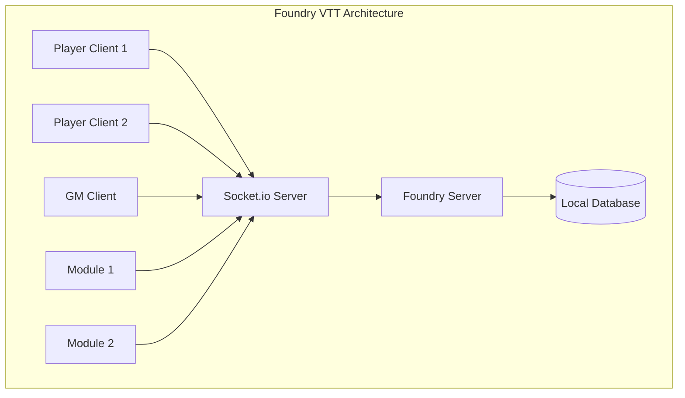
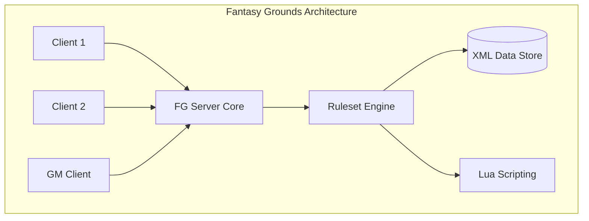
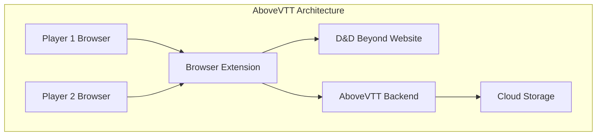
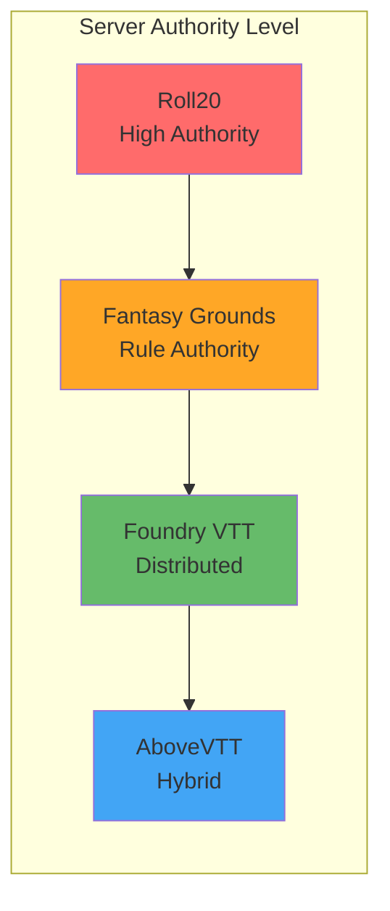

# VTT Industry State Management Analysis

## Executive Summary

This document analyzes how major Virtual Tabletop (VTT) platforms handle state management, dice rolling, and client-server architecture. The research reveals significant differences in approaches, from highly server-authoritative systems like Roll20 to more distributed models like Foundry VTT. These insights inform architectural decisions for Dungeon Lab's state management system.

## VTT Platform Analysis

### Roll20 - Cloud-Authoritative Model

#### Architecture Overview
Roll20 operates as a fully cloud-based, browser-only platform with a strong server-authoritative approach.

**Sources:**
- [Roll20 QuantumRoll Documentation](https://help.roll20.net/hc/en-us/articles/360037256594-Quantum-Roll)
- [Roll20 API Reference](https://app.roll20.net/forum/post/2965292/are-we-able-to-roll-inside-the-api)

#### State Management


**Key Characteristics:**
- **Server Authority**: Extremely high - all critical operations server-side
- **State Storage**: Centralized cloud database
- **Real-time Sync**: WebSocket-based broadcasting
- **Trust Model**: "Never trust the client"

#### Dice Rolling System - QuantumRoll
Roll20's most distinctive feature is their **QuantumRoll** system:

```typescript
interface QuantumRollResult {
  value: number;
  cryptographicSignature: string;  // Server private key signature
  quantumEntropy: boolean;         // True random from quantum fluctuations
  timestamp: number;
  verified: boolean;               // Client verified signature
}
```

**Technical Implementation:**
1. **Quantum Entropy Source**: Uses quantum fluctuations in light beam power
2. **Server-Side Only**: "All rolling is done via our server"
3. **Cryptographic Security**: Results signed with server's private key
4. **Client Verification**: Clients verify signature to ensure no tampering
5. **Fallback System**: Local PRNG if QuantumRoll unavailable

**Code Example:**
```typescript
// Roll20 API - Server-side dice rolling
function rollQuantumDice(formula: string): QuantumRollResult {
  // Client cannot call this directly - only via sendChat()
  const result = quantumRollEngine.roll(formula);
  const signature = cryptoSign(result, serverPrivateKey);
  
  return {
    value: result,
    cryptographicSignature: signature,
    quantumEntropy: true,
    timestamp: Date.now(),
    verified: false  // Client will verify
  };
}

// Client-side verification
function verifyRoll(roll: QuantumRollResult): boolean {
  return cryptoVerify(roll.value, roll.cryptographicSignature, serverPublicKey);
}
```

**Security Benefits:**
- Impossible for players to manipulate dice results
- Mathematically provable randomness
- Transparent verification system
- Prevents all forms of client-side cheating

**Trade-offs:**
- Higher latency for dice rolls
- Requires internet connectivity for all rolls
- More complex client implementation

---

### Foundry VTT - Distributed Authority Model

#### Architecture Overview
Foundry VTT uses a self-hosted, document-based architecture with distributed authority.

**Sources:**
- [Foundry VTT Sockets Documentation](https://foundryvtt.wiki/en/development/api/sockets)
- [Foundry VTT System Development Guide](https://foundryvtt.com/article/system-development/)

#### State Management


**Key Characteristics:**
- **Server Authority**: Medium - server manages documents, clients handle logic
- **State Storage**: Local database (can be self-hosted anywhere)
- **Real-time Sync**: Socket.io WebSocket connections
- **Trust Model**: "Trust but coordinate"

#### Document-Based State System
```typescript
// Foundry's document-centric state model
abstract class Document {
  _id: string;
  version: number;
  data: object;
  
  // Client-side updates trigger server synchronization
  async update(changes: object): Promise<Document> {
    // Permission check
    if (!this.canUserModify(game.user)) {
      throw new Error('Insufficient permissions');
    }
    
    // Send to server
    const response = await SocketInterface.dispatch('modifyDocument', {
      action: 'update',
      type: this.documentName,
      id: this._id,
      data: changes
    });
    
    // Server broadcasts to all clients
    return response;
  }
}

// Example: Actor HP update
class Actor extends Document {
  async takeDamage(damage: number): Promise<void> {
    const currentHP = this.data.data.attributes.hp.value;
    const newHP = Math.max(0, currentHP - damage);
    
    // Client calculates, server validates and broadcasts
    await this.update({
      'data.attributes.hp.value': newHP
    });
  }
}
```

#### Dice Rolling System
```typescript
// Foundry's dice system - client-side with server coordination
class Roll {
  constructor(formula: string) {
    this.formula = formula;
    this.terms = this.parseFormula(formula);
  }
  
  // Client-side rolling
  async roll(): Promise<Roll> {
    for (const term of this.terms) {
      if (term instanceof Die) {
        term.roll(); // Client generates random numbers
      }
    }
    
    this.result = this.calculateResult();
    
    // Optional: Send to chat (server broadcast)
    if (this.shouldBroadcast) {
      await ChatMessage.create({
        type: CONST.CHAT_MESSAGE_TYPES.ROLL,
        roll: this.toJSON(),
        speaker: ChatMessage.getSpeaker()
      });
    }
    
    return this;
  }
}
```

**Plugin System Integration:**
```typescript
// Foundry's flexible socket system for custom state management
Hooks.once('ready', () => {
  // Register custom socket events
  game.socket.on('module.my-module', (data) => {
    switch (data.type) {
      case 'custom-damage':
        handleCustomDamage(data.payload);
        break;
      case 'spell-effect':
        handleSpellEffect(data.payload);
        break;
    }
  });
});

// Custom state updates bypass document system
function sendCustomUpdate(type: string, payload: any): void {
  game.socket.emit('module.my-module', {
    type,
    payload,
    userId: game.user.id
  });
}
```

**Benefits:**
- High flexibility for module developers
- Low latency for most operations
- Works offline for single-player prep
- Full control over hosting environment

**Trade-offs:**
- More complex cheat prevention
- Requires technical setup for hosting
- Client-side dice rolling less trustworthy

---

### Fantasy Grounds - Deep Integration Model

#### Architecture Overview
Fantasy Grounds uses a native client-server application with deep game system integration.

**Sources:**
- [Fantasy Grounds Developer Guide](https://fantasygroundsunity.atlassian.net/wiki/spaces/FGCP/pages/996644298/Developer%20Guide%20-%20Overview)
- Community discussions on architecture and implementation

#### State Management


**Key Characteristics:**
- **Server Authority**: High for game rules, medium for general state
- **State Storage**: XML-based local files
- **Real-time Sync**: Custom TCP/IP protocol
- **Trust Model**: "Ruleset-enforced authority"

#### Ruleset-Based State Management
```xml
<!-- Fantasy Grounds XML-based state definition -->
<character>
  <abilities>
    <strength>
      <score type="number">16</score>
      <bonus type="number">3</bonus>
    </strength>
  </abilities>
  
  <hp>
    <total type="number">45</total>
    <current type="number">32</current>
    <temporary type="number">0</temporary>
  </hp>
</character>
```

```lua
-- Lua scripting for state management
function onHealthChanged()
  local nHP = DB.getValue(nodeChar, "hp.current", 0);
  local nMaxHP = DB.getValue(nodeChar, "hp.total", 0);
  
  -- Ruleset handles state validation
  if nHP <= 0 then
    DB.setValue(nodeChar, "conditions.unconscious", "number", 1);
    
    -- Automatic death save system
    if hasFeature(nodeChar, "death_saves") then
      initializeDeathSaves(nodeChar);
    end
  end
  
  -- Broadcast to all clients
  Comm.deliverChatMessage({
    text = getCharName() .. " takes damage! HP: " .. nHP .. "/" .. nMaxHP,
    mode = "story"
  });
end
```

#### Advanced State Automation
```lua
-- Fantasy Grounds' sophisticated rule automation
function rollAttack(nodeWeapon, nodeTarget)
  -- The ruleset "knows" how attacks work
  local nAttackBonus = getAttackBonus(nodeWeapon);
  local nTargetAC = DB.getValue(nodeTarget, "ac", 10);
  
  -- Server-coordinated dice roll (seed-based)
  local rRoll = performRoll("1d20+" .. nAttackBonus);
  
  if rRoll.nTotal >= nTargetAC then
    -- Automatic damage calculation
    local sDamage = DB.getValue(nodeWeapon, "damage", "1d6");
    local rDamage = performRoll(sDamage);
    
    -- Apply damage with full rule awareness
    applyDamage(nodeTarget, rDamage.nTotal, getDamageType(nodeWeapon));
  end
  
  -- All clients see the same result
  broadcastCombatResult(rRoll, rDamage, nodeTarget);
end
```

**Benefits:**
- Extremely sophisticated rule automation
- Consistent rule interpretation
- Deep game system integration
- Mature platform (since 2004)

**Trade-offs:**
- Less flexible for house rules
- Steeper learning curve
- Connection complexity (firewall/NAT issues)
- Platform-specific client required

---

### AboveVTT - Browser Extension Model

#### Architecture Overview
AboveVTT is a browser extension that overlays VTT functionality on D&D Beyond.

**Sources:**
- [AboveVTT GitHub Repository](https://github.com/cyruzzo/AboveVTT)
- User community feedback and reviews

#### State Management


**Key Characteristics:**
- **Server Authority**: Mixed - leverages D&D Beyond + custom backend
- **State Storage**: Cloud-backed scene management
- **Real-time Sync**: WebSocket through custom backend
- **Trust Model**: "Pragmatic integration"

#### Integration-Based State Model
```javascript
// AboveVTT browser extension approach
class AboveVTTExtension {
  constructor() {
    this.ddbIntegration = new DnDBeyondIntegration();
    this.backendClient = new AboveVTTBackend();
  }
  
  // Leverage D&D Beyond's existing character data
  async getCharacterStats(characterId) {
    // Extract from D&D Beyond DOM
    const stats = this.ddbIntegration.extractCharacterData();
    
    // Merge with VTT-specific state
    const vttState = await this.backendClient.getCharacterState(characterId);
    
    return { ...stats, ...vttState };
  }
  
  // Custom state for VTT-specific features
  async updateTokenPosition(tokenId, position) {
    // Store in custom backend (D&D Beyond doesn't handle this)
    await this.backendClient.updateTokenState(tokenId, {
      position,
      timestamp: Date.now()
    });
    
    // Broadcast to other players
    this.broadcastToSession('token:moved', { tokenId, position });
  }
}
```

**Hybrid State Management:**
```javascript
// AboveVTT's pragmatic approach to state
class StateManager {
  getActorHP(actorId) {
    // Try D&D Beyond first
    const ddbHP = this.ddbIntegration.getCharacterHP(actorId);
    if (ddbHP !== null) return ddbHP;
    
    // Fall back to VTT state
    return this.vttState.actors[actorId]?.hp || 0;
  }
  
  async takeDamage(actorId, damage) {
    // Update both systems
    await Promise.all([
      this.ddbIntegration.updateHP(actorId, damage),
      this.backendClient.updateActor(actorId, { damage })
    ]);
    
    // Broadcast to session
    this.broadcast('actor:damaged', { actorId, damage });
  }
}
```

**Benefits:**
- Leverages existing D&D Beyond investment
- No separate account/setup required
- Automatic character sheet integration
- Rapid feature development

**Trade-offs:**
- Limited by browser extension constraints
- Dependent on D&D Beyond's stability
- Less control over core game data
- Mobile support limitations

---

## Comparative Analysis

### Authority Model Spectrum



### State Management Comparison Matrix

| Platform | Dice Rolling | State Authority | Cheat Prevention | Hosting Model | Development Complexity |
|----------|--------------|-----------------|------------------|---------------|----------------------|
| **Roll20** | Server-Only<br/>QuantumRoll | Server Authoritative | Cryptographic<br/>Signatures | Cloud SaaS | Medium |
| **Foundry VTT** | Client-Side<br/>with Broadcast | Document-Based<br/>Distributed | Permission-Based | Self-Hosted | High |
| **Fantasy Grounds** | Seed-Based<br/>Network Sync | Ruleset-Enforced | Rule Validation | Client-Server | Very High |
| **AboveVTT** | Integrated<br/>with D&D Beyond | Hybrid Authority | Limited | Extension + Backend | Medium |

### Architecture Patterns

#### 1. **Cloud-Authoritative** (Roll20)
```typescript
interface CloudAuthoritative {
  diceRolling: "server-only";
  stateStorage: "centralized-cloud";
  cheatPrevention: "cryptographic";
  latency: "higher";
  trustModel: "zero-trust-client";
}
```

**Pros:**
- Maximum cheat prevention
- Consistent experience across devices
- No setup required for users
- Professionally maintained infrastructure

**Cons:**
- Higher latency for operations
- Dependent on internet connectivity
- Less customization for advanced users
- Vendor lock-in

#### 2. **Self-Hosted Distributed** (Foundry VTT)
```typescript
interface SelfHostedDistributed {
  diceRolling: "client-side";
  stateStorage: "local-database";
  cheatPrevention: "permission-based";
  latency: "lower";
  trustModel: "trusted-clients";
}
```

**Pros:**
- Full control over hosting
- Low latency operations
- Extensive customization via modules
- Works offline for preparation

**Cons:**
- Technical setup required
- Hosting costs and maintenance
- Less cheat prevention
- Backup and security responsibility

#### 3. **Ruleset-Integrated** (Fantasy Grounds) 
```typescript
interface RulesetIntegrated {
  diceRolling: "rule-aware";
  stateStorage: "xml-based";
  cheatPrevention: "ruleset-validation";
  latency: "medium";
  trustModel: "rule-enforced";
}
```

**Pros:**
- Deep game system knowledge
- Sophisticated automation
- Consistent rule interpretation
- Mature, stable platform

**Cons:**
- Less flexible for house rules
- Steeper learning curve
- Platform-specific requirements
- Complex networking setup

#### 4. **Integration-Hybrid** (AboveVTT)
```typescript
interface IntegrationHybrid {
  diceRolling: "integrated-external";
  stateStorage: "mixed-sources";
  cheatPrevention: "limited";
  latency: "variable";
  trustModel: "pragmatic";
}
```

**Pros:**
- Leverages existing investments
- Rapid development iteration
- No additional accounts needed
- Easy adoption for D&D Beyond users

**Cons:**
- Limited by host platform constraints
- Dependent on external services
- Less comprehensive feature set
- Potential stability issues

---

## Industry Best Practices

### 1. Dice Rolling Security

**Recommendation**: Server-side dice rolling for competitive integrity

```typescript
// Industry standard: Server-authoritative dice
class SecureDiceRoller {
  // Server-side implementation
  async rollDice(formula: string, userId: string): Promise<DiceResult> {
    const result = this.generateSecureRandom(formula);
    const signature = this.signResult(result, this.privateKey);
    
    await this.logRoll(userId, formula, result);
    
    return {
      value: result,
      formula,
      timestamp: Date.now(),
      signature,
      userId
    };
  }
  
  // Client verification
  verifyRoll(roll: DiceResult): boolean {
    return this.verifySignature(roll.value, roll.signature, this.publicKey);
  }
}
```

### 2. State Synchronization Patterns

**Recommendation**: WebSocket + Document versioning

```typescript
// Industry standard: Versioned document updates
interface DocumentUpdate {
  documentId: string;
  version: number;           // Optimistic locking
  changes: Partial<Document>;
  userId: string;
  timestamp: number;
}

class StateManager {
  async updateDocument(update: DocumentUpdate): Promise<void> {
    // Validate version (prevent lost updates)
    const current = await this.getDocument(update.documentId);
    if (current.version !== update.version) {
      throw new ConflictError('Document version mismatch');
    }
    
    // Apply update
    const newDoc = { ...current, ...update.changes, version: current.version + 1 };
    await this.saveDocument(newDoc);
    
    // Broadcast to all clients
    this.broadcast('document:updated', {
      documentId: update.documentId,
      changes: update.changes,
      newVersion: newDoc.version
    });
  }
}
```

### 3. Permission and Authority Models

**Recommendation**: Role-based permissions with server validation

```typescript
// Industry standard: Multi-layered permission system
interface Permission {
  resource: string;          // "actor", "scene", "chat"
  action: string;            // "read", "write", "delete"
  scope: string;             // "own", "party", "all"
}

class PermissionManager {
  canUserPerformAction(userId: string, action: string, resourceId: string): boolean {
    const user = this.getUser(userId);
    const resource = this.getResource(resourceId);
    
    // Check explicit permissions
    if (this.hasExplicitPermission(user, action, resource)) {
      return true;
    }
    
    // Check role-based permissions
    if (this.hasRolePermission(user.role, action, resource.type)) {
      return true;
    }
    
    // Check ownership
    if (resource.ownerId === userId && this.ownerCanPerform(action)) {
      return true;
    }
    
    return false;
  }
}
```

### 4. Error Handling and Recovery

**Recommendation**: Graceful degradation with client-side recovery

```typescript
// Industry standard: Resilient state management
class ResilientStateManager {
  async performAction(action: GameAction): Promise<ActionResult> {
    try {
      // Primary: Server-authoritative action
      return await this.serverAction(action);
      
    } catch (error) {
      if (error instanceof NetworkError) {
        // Fallback: Queue for retry
        await this.queueForRetry(action);
        
        // Optimistic update for user feedback
        return this.optimisticUpdate(action);
      }
      
      throw error;
    }
  }
  
  // Automatic recovery on reconnection
  async onReconnected(): Promise<void> {
    // Sync any missed updates
    const lastSync = this.getLastSyncTimestamp();
    const updates = await this.getUpdatesAfter(lastSync);
    
    for (const update of updates) {
      await this.applyUpdate(update);
    }
    
    // Retry queued actions
    await this.retryQueuedActions();
  }
}
```

---

## Lessons for Dungeon Lab

### 1. **Authority Model Decision**

Based on the industry analysis, Dungeon Lab should adopt a **Selective Authority Model**:

```typescript
// Recommended approach for Dungeon Lab
interface DungeonLabAuthority {
  // Server-authoritative (cheat prevention)
  diceRolling: "server-side";
  resourceConsumption: "server-validated";  // Spell slots, items
  healthChanges: "server-applied";
  
  // Client-authoritative (performance)
  uiState: "client-side";
  animations: "client-side";
  preferences: "client-side";
  
  // Collaborative (flexibility)
  characterCreation: "permission-based";
  mapEditing: "permission-based";
  houseRules: "configurable";
}
```

### 2. **State Architecture Recommendation**

Combine the best aspects of multiple approaches:

```typescript
// Hybrid approach inspired by industry analysis
class DungeonLabStateManager {
  // Document-based like Foundry (flexibility)
  documents: DocumentManager;
  
  // Server authority like Roll20 (security)
  diceEngine: ServerDiceEngine;
  
  // Rule integration like Fantasy Grounds (automation)
  rulesetEngine: PluginRulesetEngine;
  
  // WebSocket sync like all platforms (real-time)
  socketSync: RealtimeSynchronizer;
}
```

### 3. **Plugin System Authority**

Learn from Foundry's flexibility while adding Roll20's security:

```typescript
// Plugin authority boundaries
interface PluginAuthority {
  // Server plugin handles critical operations
  serverPlugin: {
    diceRolling: true;
    damageApplication: true;
    resourceConsumption: true;
    ruleValidation: true;
  };
  
  // Client plugin handles presentation
  clientPlugin: {
    uiRendering: true;
    animations: true;
    userInteraction: true;
    houseRuleModifications: true;
  };
}
```

### 4. **Migration Strategy**

Adopt Fantasy Grounds' approach to backward compatibility:

```typescript
// Gradual migration with compatibility layers
class MigrationManager {
  // Support both old and new systems during transition
  async handleGameAction(action: GameAction): Promise<ActionResult> {
    if (this.isNewSystemEnabled(action.gameSystem)) {
      return await this.serverPluginManager.handle(action);
    } else {
      return await this.legacySystemManager.handle(action);
    }
  }
}
```

---

## Recommendations Summary

### Immediate Actions

1. **Implement Server-Side Dice Rolling**
   - Follow Roll20's model with cryptographic verification
   - Prevent client-side manipulation
   - Maintain transparency through detailed roll breakdowns

2. **Adopt Document-Based State Management**
   - Use Foundry's document model for flexibility
   - Add server validation for critical operations
   - Implement optimistic locking for conflict prevention

3. **Create Plugin Authority Boundaries**
   - Server plugins handle game rules and critical operations
   - Client plugins handle UI and non-critical features
   - Clear interfaces between server and client components

### Long-Term Strategy

1. **Build Comprehensive Permission System**
   - Learn from all platforms' permission models
   - Support both GM authority and player agency
   - Enable granular control over game features

2. **Implement Resilient Networking**
   - WebSocket-based real-time synchronization
   - Automatic recovery from network failures
   - Graceful degradation for offline scenarios

3. **Focus on Developer Experience**
   - Clear documentation and examples
   - Consistent APIs across server and client
   - Migration tools for existing content

### Success Metrics

- **Security**: Zero successful client-side manipulation attempts
- **Performance**: <200ms average action processing time
- **Reliability**: 99.9% uptime for critical game operations
- **Developer Adoption**: 50% reduction in plugin development time
- **User Experience**: Seamless real-time collaboration for all users

This analysis provides a comprehensive foundation for making informed decisions about Dungeon Lab's state management architecture, drawing from the successes and lessons learned across the VTT industry.